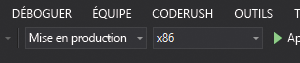

# Démarrage rapide : Créer une application HoloLens Unity qui utilise Azure Spatial Anchors

Ce guide de démarrage rapide explique comment créer une application HoloLens Unity qui utilise [Azure Spatial Anchors](../overview.md). Spatial Anchors est un service de développement multiplateforme qui vous permet de créer des expériences de réalité mixte avec des objets qui conservent leur emplacement sur les appareils. Quand vous aurez terminé, vous aurez une application HoloLens générée avec Unity capable d’enregistrer et de rappeler une ancre spatiale.

Vous découvrirez comment effectuer les actions suivantes :

- Créer un compte Spatial Anchors.
- Préparer les paramètres de build Unity.
- Configurer l’identificateur et la clé du compte Spatial Anchors.
- Exporter le projet HoloLens Visual Studio.
- Déployer l’application et l’exécuter sur un appareil HoloLens.

[!INCLUDE [quickstarts-free-trial-note](../../../includes/quickstarts-free-trial-note.md)]

## Prérequis

Pour suivre ce guide de démarrage rapide :

- Vous avez besoin d’un ordinateur Windows sur lequel <a href="https://unity3d.com/get-unity/download" target="_blank">Unity 2019.4 (LTS)</a> et <a href="https://www.visualstudio.com/downloads/" target="_blank">Visual Studio 2019</a> ou ultérieur sont installés. Votre installation de Visual Studio doit comprendre la charge de travail **Développement pour la plateforme Windows universelle** et le **Kit de développement logiciel (SDK) Windows 10 SDK (10.0.18362.0 ou plus récent)** . Vous devez aussi installer <a href="https://git-scm.com/download/win" target="_blank">Git pour Windows</a> et <a href="https://git-lfs.github.com/">Git LFS</a>.
- Vous avez besoin d’un appareil HoloLens avec le [mode développeur](https://docs.microsoft.com/windows/mixed-reality/using-visual-studio) activé. La [mise à jour Windows 10 de mai 2020](https://docs.microsoft.com/windows/mixed-reality/whats-new/release-notes-may-2020) doit être installée sur l’appareil. Pour mettre à jour votre appareil HoloLens avec la dernière version, ouvrez l’application **Paramètres**, accédez à **Mise à jour et sécurité**, puis sélectionnez **Rechercher les mises à jour**.
- Dans votre application, vous devez activer la fonctionnalité **SpatialPerception**. Ce paramètre se trouve dans **Build Settings (Paramètres de build)**  > **Player Settings (Paramètres du lecteur)**  > **Publishing Settings (Paramètres de publication)**  > **Capabilities (Fonctionnalités)** .
- Dans votre application, vous devez activer **Virtual Reality Supported** (Réalité virtuelle prise en charge) avec le **SDK Windows Mixed Reality**. Ce paramètre se trouve dans **Build Settings (Paramètres de build)**  > **Player Settings (Paramètres du lecteur)**  > **XR Settings (Paramètres XR)** .

[!INCLUDE [Create Spatial Anchors resource](../../../includes/spatial-anchors-get-started-create-resource.md)]

## Télécharger et ouvrir l’exemple de projet Unity

[!INCLUDE [Clone Sample Repo](../../../includes/spatial-anchors-clone-sample-repository.md)]

[!INCLUDE [Open Unity Project](../../../includes/spatial-anchors-open-unity-project.md)]

Ouvrez **Build Settings** (Paramètres de build) en sélectionnant **File** (Fichier) > **Build Settings** (Paramètres de build).

Dans la section **Platform** (Plateforme), sélectionnez **Universal Windows Platform** (Plateforme Windows universelle). Remplacez **Target Device** (Appareil cible) par **HoloLens**.

Sélectionnez **Switch Platform** (Changer de plateforme) pour passer à la plateforme **Universal Windows Platform** (Plateforme Windows universelle). Unity peut vous demander d’installer des composants de prise en charge UWP s’ils sont manquants.

Fermez la fenêtre **Build Settings**.

[!INCLUDE [Configure Unity Scene](../../../includes/spatial-anchors-unity-configure-scene.md)]

## Exporter le projet HoloLens Visual Studio

[!INCLUDE [Export Unity Project](../../../includes/spatial-anchors-unity-export-project-snip.md)]

Sélectionnez **Build**. Dans la boîte de dialogue, sélectionnez un dossier où exporter le projet HoloLens Visual Studio.

À l’issue de l’exportation, un dossier avec le projet HoloLens exporté s’affiche.

## Déployer l’application HoloLens

Dans le dossier, double-cliquez sur **HelloAR U3D.sln** pour ouvrir le projet dans Visual Studio.

Remplacez **Configuration de la solution** par **Mise en production**, **Plateforme de solution** par **x86**, puis sélectionnez **Appareil** dans les options de cible de déploiement.

Si vous utilisez HoloLens 2, utilisez **ARM64** comme **plateforme de solution** au lieu de **x86**.

   

Allumez l’appareil HoloLens, connectez-vous, puis connectez l’appareil au PC au moyen d’un câble USB.

Sélectionnez **Déboguer** > **Démarrer le débogage** pour déployer votre application et commencer le débogage.

Dans l’application, sélectionnez **BasicDemo** à l’aide des flèches, puis appuyez sur le bouton **Go!** pour exécuter la démo. Suivez les instructions dans l’application pour placer et rappeler une ancre.

Dans Visual Studio, arrêtez l’application en sélectionnant **Arrêter le débogage** ou en appuyant sur Maj+F5.

[!INCLUDE [Clean-up section](../../../includes/clean-up-section-portal.md)]

[!INCLUDE [Next steps](../../../includes/spatial-anchors-quickstarts-nextsteps.md)]

> [!div class="nextstepaction"]
> [Tutoriel : Partager des ancres spatiales sur des appareils](../tutorials/tutorial-share-anchors-across-devices.md)

> [!div class="nextstepaction"]
> [Guide pratique pour configurer Azure Spatial Anchors dans un projet Unity](../how-tos/setup-unity-project.md)
