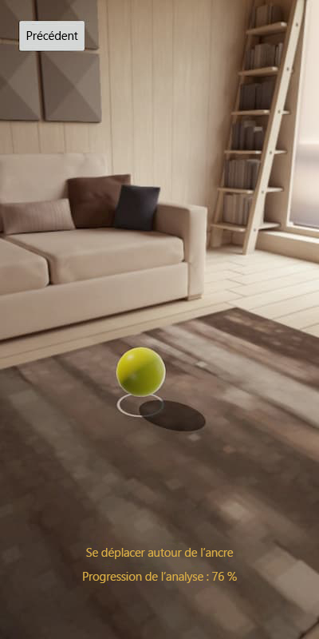

# Démarrage rapide : Créer une application Android Xamarin avec Azure Spatial Anchors

Ce démarrage rapide explique comment créer une application Android avec Xamarin en utilisant [Azure Spatial Anchors](../overview.md). Azure Spatial Anchors est un service de développement multiplateforme qui vous permet de créer des expériences de réalité mixte en utilisant des objets qui conservent leur emplacement sur les appareils. Quand vous aurez terminé, vous aurez une application Android capable d’enregistrer et de rappeler une ancre spatiale.

Vous découvrirez comment effectuer les actions suivantes :

> [!div class="checklist"]
> * Créer un compte Spatial Anchors
> * Configurer l’identificateur et la clé du compte Spatial Anchors
> * Déployer et exécuter sur un appareil Android

[!INCLUDE [quickstarts-free-trial-note](../../../includes/quickstarts-free-trial-note.md)]

## Prérequis

Pour suivre ce guide de démarrage rapide, veillez à avoir :
- Un ordinateur Windows ou macOS :
  - Si vous utilisez Windows :
    - Une version à jour de <a href="https://www.visualstudio.com/downloads/" target="_blank">Visual Studio 2019 16.2+</a>.
    - <a href="https://git-scm.com/download/win" target="_blank">Git pour Windows</a>.
    - <a href="https://git-lfs.github.com/">Git LFS</a>.
  - Si vous utilisez macOS :
    - Une version à jour de <a href="/visualstudio/mac/installation?view=vsmac-2019" target="_blank">Visual Studio pour Mac 8.1+</a>.
    - <a href="https://git-scm.com/download/mac" target="_blank">Git pour macOS</a>.
    - <a href="https://git-lfs.github.com/">Git LFS</a>.
- La dernière version de Xamarin.Android installée et en cours d’exécution sur la plateforme de votre choix. Pour obtenir un guide d’installation de Xamarin.Android, reportez-vous aux guides d’[Installation de Xamarin.Android](/xamarin/android/get-started/installation/index).
- Un appareil Android <a href="https://developer.android.com/studio/debug/dev-options" target="_blank">prêt pour le développement</a> et <a href="https://developers.google.com/ar/discover/supported-devices" target="_blank">compatible ARCore</a>.
  - Des pilotes d’appareils supplémentaires peuvent être nécessaires pour que votre ordinateur puisse communiquer avec votre appareil Android. Vous pourrez trouver plus d’informations [ici](https://developer.android.com/studio/run/device.html).
- Votre application doit cibler ARCore **1.8**.

[!INCLUDE [Create Spatial Anchors resource](../../../includes/spatial-anchors-get-started-create-resource.md)]

## Ouvrir l’exemple de projet

[!INCLUDE [Clone Sample Repo](../../../includes/spatial-anchors-clone-sample-repository.md)]

Ouvrez `Xamarin/SampleXamarin.sln` dans Visual Studio.

## Configurer l’identificateur et la clé du compte

L’étape suivante configure l’application pour qu’elle utilise votre identificateur et votre clé de compte. Vous les avez copiés dans un éditeur de texte pendant la [configuration de la ressource Spatial Anchors](#create-a-spatial-anchors-resource).

Ouvrez `Xamarin/SampleXamarin.Common/AccountDetails.cs`.

Localisez le champ `SpatialAnchorsAccountKey` et remplacez `Set me` par la clé du compte.

Localisez le champ `SpatialAnchorsAccountId` et remplacez `Set me` par l’identificateur du compte.

Recherchez le champ `SpatialAnchorsAccountDomain` et remplacez `Set me` par le domaine du compte.

## Déployer l’application sur votre appareil Android

Allumez l’appareil Android, connectez-vous, puis connectez l’appareil à l’ordinateur au moyen d’un câble USB.

Définissez le projet de démarrage sur **SampleXamarin.Android**, remplacez la **Configuration de la solution** par **Mise en production**, puis sélectionnez l’appareil sur lequel vous souhaitez effectuer le déploiement dans la liste déroulante de sélection d’appareils.

# [Windows](#tab/deploy-windows)

Sélectionnez **Déboguer** > **Démarrer le débogage** pour déployer et démarrer votre application.

# [macOS](#tab/deploy-macos)

Sélectionnez **Exécuter** > **Démarrer sans débogage** pour déployer et démarrer votre application.

---

Dans l’application, sélectionnez **De base** pour exécuter la démonstration et suivez les instructions pour placer et rappeler une ancre.

> 
> 
> 

[!INCLUDE [Clean-up section](../../../includes/clean-up-section-portal.md)]

[!INCLUDE [Next steps](../../../includes/spatial-anchors-quickstarts-nextsteps.md)]

> [!div class="nextstepaction"]
> [Tutoriel : Partager Spatial Anchors sur des appareils](../tutorials/tutorial-share-anchors-across-devices.md)