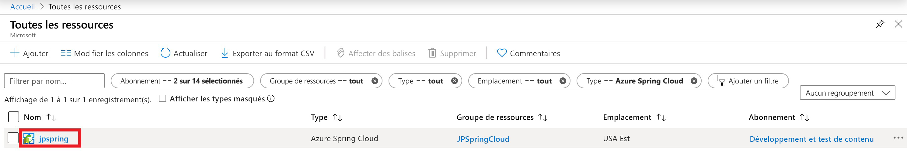
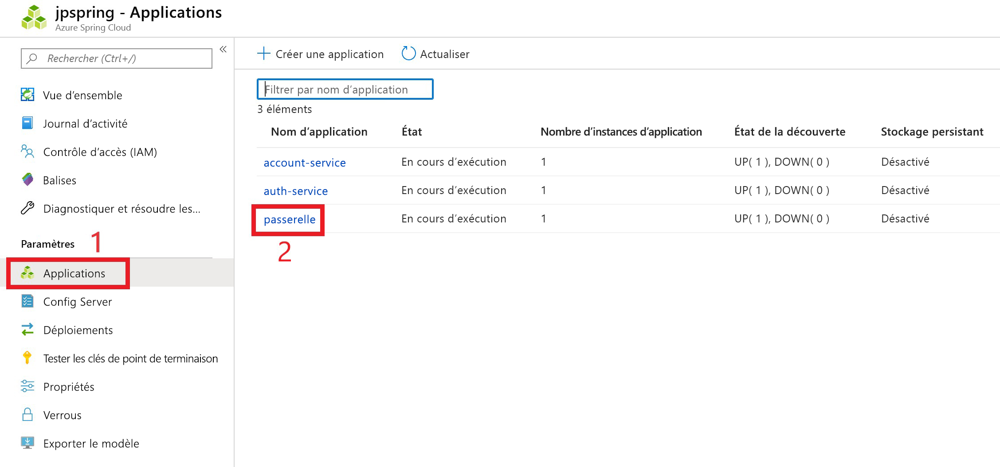
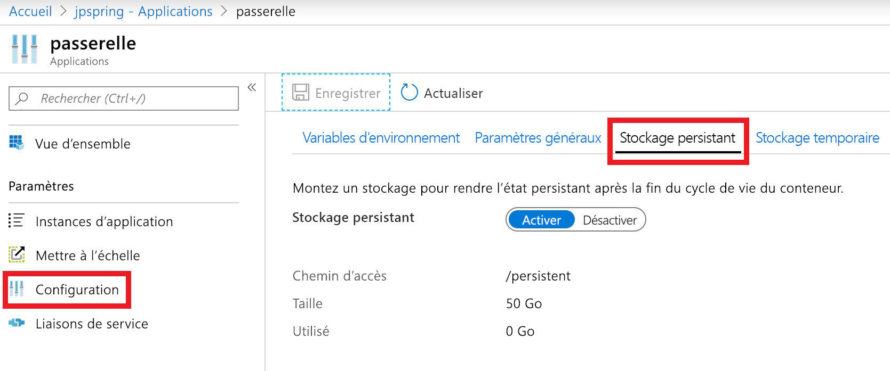

# <a name="use-persistent-storage-in-azure-spring-cloud"></a>Utiliser le stockage persistant dans Azure Spring Cloud

**Cet article s’applique :** à ✔️ Java ✔️ C#

Azure Spring Cloud fournit deux types de stockage pour votre application : persistant et temporaire.

Par défaut, Azure Spring Cloud fournit un stockage temporaire pour chaque instance d’application. Le stockage temporaire est limité à 5 Go par instance avec le chemin de montage par défaut /tmp.

> [!WARNING]
> Si vous redémarrez une instance d’application, le stockage temporaire associé est définitivement supprimé.

Le stockage persistant est un conteneur de partage de fichiers géré par Azure et alloué par application. Les données stockées dans le stockage persistant sont partagées par toutes les instances d’une application. Une instance Azure Spring Cloud peut avoir un maximum de 10 applications avec un stockage persistant activé. 50 Go de stockage persistant sont alloués à chaque application. Le chemin de montage par défaut pour le stockage persistant est /persistent.

> [!WARNING]
> Si vous désactivez le stockage persistant d’une application, l’ensemble de ce stockage est libéré et toutes les données stockées sont perdues.

## <a name="use-the-azure-portal-to-enable-persistent-storage"></a>Utiliser le portail Azure pour activer le stockage persistant

1. Dans la page **d’accueil** de votre portail Azure, sélectionnez **Toutes les ressources**.

    >

1. Sélectionnez la ressource Azure Spring Cloud qui nécessite un stockage persistant. Dans notre exemple, l’application sélectionnée est appelée **upspring**.

    > 

1. Sous l’en-tête **Paramètres**, sélectionnez **Applications**.

1. Vos services Azure Spring Cloud apparaissent dans un tableau.  Sélectionnez le service auquel vous souhaitez ajouter un stockage persistant. Dans cet exemple, le service **passerelle** est sélectionné.

    > 

1. Dans la page de configuration du service, sélectionnez **Configuration**

1. Sélectionnez l’onglet **Stockage persistant** et sélectionnez **Activer**.

    > 

Une fois le stockage persistant activé, sa taille et son chemin d’accès sont affichés sur la page de configuration.

## <a name="use-the-azure-cli-to-modify-persistent-storage"></a>Utiliser l’interface de ligne de commande Azure pour modifier le stockage persistant

Si nécessaire, installez l’extension Spring Cloud pour l’interface de ligne de commande Azure :

```azurecli
az extension add --name spring-cloud
```
Autres opérations :

* Créez une application avec un stockage persistant activé :

    ```azurecli
    az spring-cloud app create -n <app> -g <resource-group> -s <service-name> --enable-persistent-storage true
    ```

* Pour activer le stockage persistant pour une application existante :

    ```azurecli
    az spring-cloud app update -n <app> -g <resource-group> -s <service-name> --enable-persistent-storage true
    ```

* Pour désactiver le stockage persistant dans une application existante :

    ```azurecli
    az spring-cloud app update -n <app> -g <resource-group> -s <service-name> --enable-persistent-storage false
    ```

    > [!WARNING]
    > Si vous désactivez le stockage persistant d’une application, l’ensemble de ce stockage est libéré et toutes les données stockées sont perdues de façon permanente.

## <a name="next-steps"></a>Étapes suivantes

* Découvrez les [quotas d’applications et de services](spring-cloud-quotas.md).
* Découvrez comment [mettre à l’échelle manuellement votre application](spring-cloud-howto-scale-manual.md).
