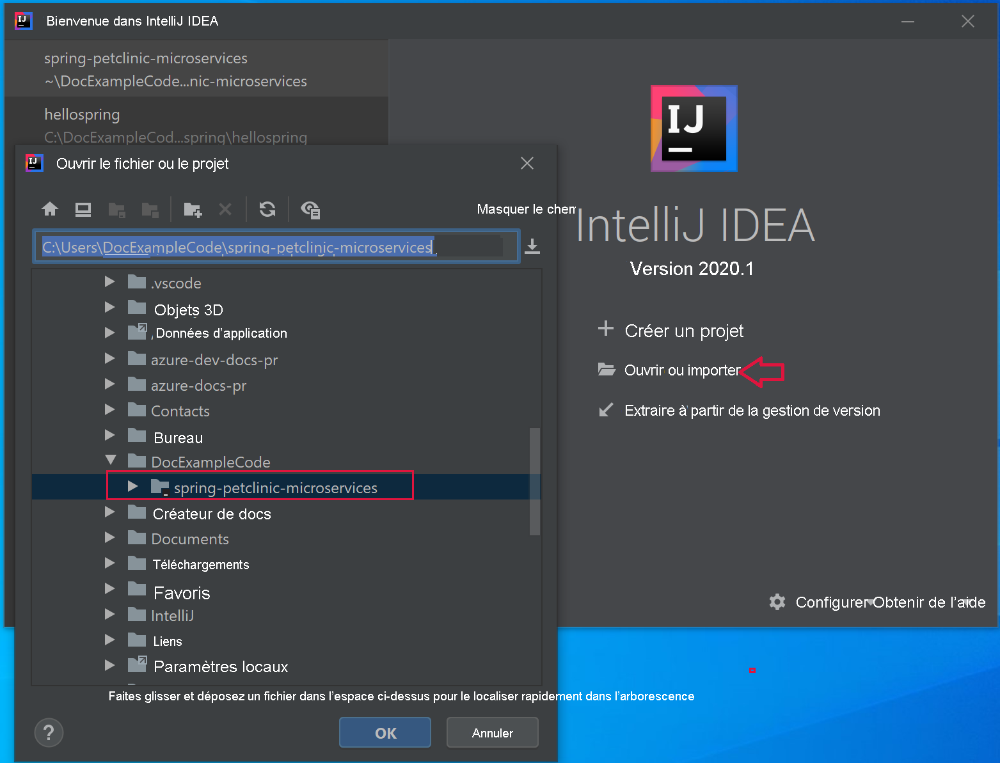
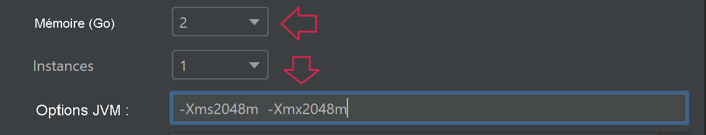

# <a name="quickstart-build-and-deploy-apps-to-azure-spring-cloud"></a>Démarrage rapide : Créer et déployer des applications sur Azure Spring Cloud

::: zone pivot="programming-language-csharp"
Dans ce guide de démarrage rapide, vous allez créer et déployer des applications de microservices sur Azure Spring Cloud à l’aide d’Azure CLI.

## <a name="prerequisites"></a>Prérequis

* Suivez les guides de démarrage rapide précédents de cette série :

  * [Provisionner le service Azure Spring Cloud](./quickstart-provision-service-instance.md).
  * [Configurer un serveur de configuration Azure Spring Cloud](./quickstart-setup-config-server.md).

## <a name="download-the-sample-app"></a>Télécharger l’exemple d’application

Si vous avez utilisé Azure Cloud Shell jusqu’à présent, passez à une invite de commandes locale pour effectuer les étapes ci-dessous.

1. Créez un dossier et clonez le dépôt de l’exemple d’application.

   ```console
   mkdir source-code
   ```

   ```console
   cd source-code
   ```

   ```console
   git clone https://github.com/Azure-Samples/Azure-Spring-Cloud-Samples
   ```

1. Accédez au répertoire du dépôt.

   ```console
   cd Azure-Spring-Cloud-Samples
   ```

## <a name="deploy-planetweatherprovider"></a>Déployer PlanetWeatherProvider

1. Créez une application pour le projet PlanetWeatherProvider dans votre instance Azure Spring Cloud.

   ```azurecli
   az spring-cloud app create --name planet-weather-provider --runtime-version NetCore_31
   ```

   Pour permettre l’inscription automatique du service, vous avez donné à l’application le nom `spring.application.name` dans le fichier *appsettings.json* du projet :

   ```json
   "spring": {
     "application": {
       "name": "planet-weather-provider"
     }
   }
   ```

   L’exécution de cette commande peut durer plusieurs minutes.

1. Accédez au répertoire du dossier du projet `PlanetWeatherProvider`.

   ```console
   cd steeltoe-sample/src/planet-weather-provider
   ```

1. Créez les fichiers binaires et le fichier *.zip* à déployer.

   ```console
   dotnet publish -c release -o ./publish
   ```

   > [!TIP]
   > Le fichier projet contient le code XML suivant permettant d’empaqueter les fichiers binaires dans un fichier *.zip* après les avoir écrits dans le dossier *./publish* :
   >
   > ```xml
   > <Target Name="Publish-Zip" AfterTargets="Publish">
   >   <ZipDirectory SourceDirectory="$(PublishDir)" DestinationFile="$(MSBuildProjectDirectory)/publish-deploy-planet.zip" Overwrite="true" />
   > </Target>
   > ```

1. Effectuez le déploiement dans Azure.

   Vérifiez que l’invite de commandes se trouve bien dans le dossier du projet avant d’exécuter la commande suivante.

   ```console
   az spring-cloud app deploy -n planet-weather-provider --runtime-version NetCore_31 --main-entry Microsoft.Azure.SpringCloud.Sample.PlanetWeatherProvider.dll --artifact-path ./publish-deploy-planet.zip
   ```

   L’option `--main-entry` spécifie le chemin relatif qui va du dossier racine où se trouve le fichier *.zip* au fichier *.dll* qui contient le point d’entrée de l’application. Une fois que le service a chargé le fichier *.zip*, il extrait tous les fichiers et dossiers, puis tente d’exécuter le point d’entrée dans le fichier *.dll* spécifié.

   L’exécution de cette commande peut durer plusieurs minutes.

## <a name="deploy-solarsystemweather"></a>Déployer SolarSystemWeather

1. Créez une autre application dans votre instance Azure Spring Cloud, cette fois pour le projet SolarSystemWeather :

   ```azurecli
   az spring-cloud app create --name solar-system-weather --runtime-version NetCore_31
   ```

   `solar-system-weather` est le nom spécifié dans le fichier *appsettings.json* du projet `SolarSystemWeather`.

   L’exécution de cette commande peut durer plusieurs minutes.

1. Accédez au répertoire du projet `SolarSystemWeather`.

   ```console
   cd ../solar-system-weather
   ```

1. Créez les fichiers binaires et le fichier *.zip* à déployer.

   ```console
   dotnet publish -c release -o ./publish
   ```

1. Effectuez le déploiement dans Azure.

   ```console
   az spring-cloud app deploy -n solar-system-weather --runtime-version NetCore_31 --main-entry Microsoft.Azure.SpringCloud.Sample.SolarSystemWeather.dll --artifact-path ./publish-deploy-solar.zip
   ```
   
   L’exécution de cette commande peut durer plusieurs minutes.

## <a name="assign-public-endpoint"></a>Affecter le point de terminaison public

Pour tester l’application, envoyez une requête HTTP GET à l’application `solar-system-weather` à partir d’un navigateur.  Pour cela, vous avez besoin d’un point de terminaison public pour la requête.

1. Pour affecter le point de terminaison, exécutez la commande suivante.

   ```azurecli
   az spring-cloud app update -n solar-system-weather --assign-endpoint true
   ```

1. Pour obtenir l’URL du point de terminaison, exécutez la commande suivante.

   Windows :

   ```azurecli
   az spring-cloud app show -n solar-system-weather -o table
   ```

   Linux :

   ```azurecli
   az spring-cloud app show --name solar-system-weather | grep url
   ```

## <a name="test-the-application"></a>Test de l’application

Envoyez une requête GET à l’application `solar-system-weather`. Dans un navigateur, accédez à l’URL publique en ajoutant `/weatherforecast` à la fin de celle-ci. Par exemple :

```
https://servicename-solar-system-weather.azuremicroservices.io/weatherforecast
```

La sortie est du code JSON :

```json
[{"Key":"Mercury","Value":"very warm"},{"Key":"Venus","Value":"quite unpleasant"},{"Key":"Mars","Value":"very cool"},{"Key":"Saturn","Value":"a little bit sandy"}]
```

Cette réponse indique que les deux applications de microservices fonctionnent. L’application `SolarSystemWeather` retourne les données qu’elle a récupérées à partir de l’application `PlanetWeatherProvider`.
::: zone-end
---
::: zone pivot="programming-language-java"
Ce document explique comment créer et déployer des applications de microservices sur Azure Spring Cloud en utilisant :
* Azure CLI
* Plug-in Maven
* Intellij

Avant de procéder au déploiement avec Azure CLI ou Maven, effectuez les exemples qui [provisionnent une instance Azure Spring Cloud](./quickstart-provision-service-instance.md) et qui [configurent le serveur de configuration](./quickstart-setup-config-server.md).

## <a name="prerequisites"></a>Prérequis

* [Installez JDK 8](/java/azure/jdk/)
* [Souscrire à un abonnement Azure](https://azure.microsoft.com/free/)
* (Facultatif) [Installez Azure CLI version 2.0.67 ou ultérieure](/cli/azure/install-azure-cli) et installez l’extension Azure Spring Cloud avec la commande : `az extension add --name spring-cloud`
* (Facultatif) [Installez Azure Toolkit for IntelliJ](https://plugins.jetbrains.com/plugin/8053-azure-toolkit-for-intellij/) et [connectez-vous](/azure/developer/java/toolkit-for-intellij/create-hello-world-web-app#installation-and-sign-in).

## <a name="deployment-procedures"></a>Procédures de déploiement

#### <a name="cli"></a>[INTERFACE DE LIGNE DE COMMANDE](#tab/Azure-CLI)

## <a name="build-the-microservices-applications-locally"></a>Générer localement les applications de microservices

1. Clonez le dépôt des exemples d’application sur votre compte cloud Azure.  Changez le répertoire, puis générez le projet. 

    ```azurecli
    git clone https://github.com/azure-samples/spring-petclinic-microservices
    cd spring-petclinic-microservices
    mvn clean package -DskipTests -Denv=cloud
    ```
La compilation du projet prend de 5 à 10 minutes. Une fois l’opération terminée, vous devez avoir des fichiers JAR individuels pour chaque service dans leurs dossiers respectifs.

## <a name="create-and-deploy-apps-on-azure-spring-cloud"></a>Créer et déployer des applications sur Azure Spring Cloud

1. Créez les 2 microservices principaux pour PetClinic : la passerelle API (api-gateway) et le service Clients (customers-service).

    ```azurecli
    az spring-cloud app create --name api-gateway --instance-count 1 --memory 2 --assign-endpoint
    az spring-cloud app create --name customers-service --instance-count 1 --memory 2
    ```

1. Déployez les fichiers JAR générés à l’étape précédente.

    ```azurecli
    az spring-cloud app deploy --name api-gateway --jar-path spring-petclinic-api-gateway/target/spring-petclinic-api-gateway-2.3.6.jar --jvm-options="-Xms2048m -Xmx2048m"
    az spring-cloud app deploy --name customers-service --jar-path spring-petclinic-customers-service/target/spring-petclinic-customers-service-2.3.6.jar --jvm-options="-Xms2048m -Xmx2048m"
    ```

1. Interrogez l’état de l’application après les déploiements à l’aide de la commande suivante.

    ```azurecli
    az spring-cloud app list -o table
    ```

    ```txt
        Name               Location    ResourceGroup    Production Deployment    Public Url                                           Provisioning Status    CPU    Memory    Running Instance    Registered Instance    Persistent Storage
    -----------------  ----------  ---------------  -----------------------  ---------------------------------------------------  ---------------------  -----  --------  ------------------  ---------------------  --------------------
    api-gateway        eastus      xxxxxx-sp         default                  https://<service name>-api-gateway.azuremicroservices.io   Succeeded              1      2         1/1                 1/1                    -     
    customers-service  eastus      <service name>         default                                                                       Succeeded              1      2         1/1                 1/1                    -     
    ```

## <a name="verify-the-services"></a>Vérifier les services

Accédez à la passerelle API et au service Clients à partir du navigateur avec l’**URL publique** indiquée ci-dessus, au format « https://<service name>-api-gateway.azuremicroservices.io ».


> [!TIP]
> Pour résoudre les problèmes liés aux déploiements, vous pouvez utiliser la commande suivante pour obtenir un streaming des journaux en temps réel chaque fois que l’application est en cours d’exécution : `az spring-cloud app logs --name <app name> -f`.

## <a name="deploy-extra-apps"></a>Déployer des applications supplémentaires

Pour que l’application PetClinic fonctionne avec toutes les fonctionnalités comme le Serveur d’administration, les Visites et les Vétérinaires, vous pouvez déployer les autres applications avec les commandes suivantes :

```azurecli
az spring-cloud app create --name admin-server --instance-count 1 --memory 2 --assign-endpoint
az spring-cloud app create --name vets-service --instance-count 1 --memory 2
az spring-cloud app create --name visits-service --instance-count 1 --memory 2
az spring-cloud app deploy --name admin-server --jar-path spring-petclinic-admin-server/target/spring-petclinic-admin-server-2.3.6.jar --jvm-options="-Xms2048m -Xmx2048m"
az spring-cloud app deploy --name vets-service --jar-path spring-petclinic-vets-service/target/spring-petclinic-vets-service-2.3.6.jar --jvm-options="-Xms2048m -Xmx2048m"
az spring-cloud app deploy --name visits-service --jar-path spring-petclinic-visits-service/target/spring-petclinic-visits-service-2.3.6.jar --jvm-options="-Xms2048m -Xmx2048m"
```
#### <a name="maven"></a>[Maven](#tab/Maven)

## <a name="build-the-microservices-applications-locally"></a>Générer localement les applications de microservices

1. Clonez le dépôt des exemples d’application sur votre compte cloud Azure.  Changez le répertoire, puis générez le projet. 

    ```azurecli
    git clone https://github.com/azure-samples/spring-petclinic-microservices
    cd spring-petclinic-microservices
    mvn clean package -DskipTests -Denv=cloud
    ```
La compilation du projet prend de 5 à 10 minutes. Une fois l’opération terminée, vous devez avoir des fichiers JAR individuels pour chaque service dans leurs dossiers respectifs.

## <a name="generate-configurations-and-deploy-to-the-azure-spring-cloud"></a>Générer des configurations et déployer vers Azure Spring Cloud

1. Générez des configurations en exécutant la commande suivante dans le dossier racine de PetClinic contenant le fichier POM parent. Si vous vous êtes déjà connecté avec Azure CLI, la commande sélectionne automatiquement les informations d’identification. Sinon, elle vous connecte avec des instructions d’invite. Pour plus d’informations, consultez notre [page wiki](https://github.com/microsoft/azure-maven-plugins/wiki/Authentication).

    ```azurecli
    mvn com.microsoft.azure:azure-spring-cloud-maven-plugin:1.3.0:config
    ```
    
    Il vous sera demandé de sélectionner les éléments suivants :
    * **Modules :** Sélectionnez `api-gateway` et `customers-service`.
    * **Abonnement :** Il s’agit de votre abonnement utilisé pour créer une instance Azure Spring Cloud.
    * **Instance de service :** Il s’agit du nom de votre instance Azure Spring Cloud.
    * **Point de terminaison public :** Dans la liste des projets fournis, entrez le numéro qui correspond à `api-gateway`.  Ceci lui donne un accès public.

1. Vérifiez que les éléments `appName` figurant dans les fichiers POM sont corrects :
    ```
    <build>
        <plugins>
            <plugin>
                <groupId>com.microsoft.azure</groupId>
                <artifactId>azure-spring-cloud-maven-plugin</artifactId>
                <version>1.3.0</version>
                <configuration>
                    <subscriptionId>xxxxxxxxx-xxxx-xxxx-xxxxxxxxxxxx</subscriptionId>
                    <clusterName>v-spr-cld</clusterName>
                    <appName>customers-service</appName>
    
    ```
    Vous devrez peut-être corriger les libellés `appName` des éléments suivants :
    * api-gateway
    * customers-service

1. Le fichier POM contient désormais les dépendances et les configurations du plug-in. Déployez les applications en utilisant la commande suivante. 

    ```azurecli
    mvn azure-spring-cloud:deploy
    ```
## <a name="verify-the-services"></a>Vérifier les services

Une commande de déploiement réussie retourne l’URL au format « https://<service name>-spring-petclinic-api-gateway.azuremicroservices.io ».  Utilisez-la pour accéder au service en cours d’exécution.


Vous pouvez également accéder au Portail Azure pour trouver l’URL. 
1. Accéder au service
2. Sélectionner **Applications**
3. Sélectionner **api-gateway** 
4. Rechercher l’URL dans la page **api-gateway | Vue d’ensemble**

## <a name="deploy-extra-apps"></a>Déployer des applications supplémentaires

Pour que l’application PetClinic marche avec toutes les fonctionnalités comme le Serveur d’administration, les Visites et les Vétérinaires, vous pouvez déployer les autres microservices.   Réexécutez la commande de configuration, puis sélectionnez les microservices suivants.
* admin-server
* vets-service
* visits-service

Réexécutez la commande `deploy`.

#### <a name="intellij"></a>[IntelliJ](#tab/IntelliJ)

## <a name="import-sample-project-in-intellij"></a>Importer l’exemple de projet dans IntelliJ

1. Téléchargez et décompressez le dépôt source pour ce tutoriel, ou clonez-le avec Git : `git clone https://github.com/azure-samples/spring-petclinic-microservices` 

1. Ouvrez la boîte de dialogue **Welcome** d’IntelliJ et sélectionnez **Import Project** pour ouvrir l’Assistant Importation.

1. Sélectionnez le dossier `spring-petclinic-microservices`.

    

### <a name="deploy-api-gateway-app-to-azure-spring-cloud"></a>Déployer une application api-gateway sur Azure Spring Cloud
Pour effectuer un déploiement dans Azure, vous devez vous connecter avec votre compte Azure auprès d’Azure Toolkit for IntelliJ et choisir votre abonnement. Pour plus d’informations sur la connexion, consultez [Installation et connexion](https://docs.microsoft.com/azure/developer/java/toolkit-for-intellij/create-hello-world-web-app#installation-and-sign-in).

1. Cliquez avec le bouton droit sur votre projet dans l’explorateur de projets IntelliJ, puis sélectionnez **Azure** -> **Deploy to Azure Spring Cloud**.

    

1. Dans le champ **Name** (Nom), ajoutez *:api-gateway* au **Nom** existant.
1. Dans la zone de texte **Artifact** (Artefact), sélectionnez *spring-petclinic-api-gateway-2.3.6*.
1. Dans la zone de texte **Subscription** (Abonnement), vérifiez votre abonnement.
1. Dans la zone de texte **Spring Cloud**, sélectionnez l’instance Azure Spring Cloud que vous avez créée dans [Provisionner une instance Azure Spring Cloud](./quickstart-provision-service-instance.md).
1. Définissez **Public Endpoint** (Point de terminaison public) sur *Enable* (Activer).
1. Dans la zone de texte **App:** , sélectionnez **Create app...** .
1. Entrez *api-gateway*, puis cliquez sur **OK**.
1. Spécifiez les options de mémoire et JVM.

     

1. Dans la section **Before launch** (Avant le lancement) de la boîte de dialogue, double-cliquez sur *Run Maven Goal* (Exécuter Maven Goal).
1. Dans la zone de texte **Working directory** (Répertoire de travail), accédez au dossier *spring-petclinic-microservices/gateway*.
1. Dans zone de texte **Command line** (Ligne de commande), entrez *package -DskipTests*. Cliquez sur **OK**.

    

1. Démarrez le déploiement en cliquant sur le bouton **Run** (Exécuter) en bas de la boîte de dialogue **Deploy Azure Spring Cloud app** (Déployer l’application Azure Spring Cloud). Le plug-in va exécuter la commande `mvn package` sur l’application `api-gateway`, puis va déployer le fichier jar généré par la commande `package`.

### <a name="deploy-customers-service-and-other-apps-to-azure-spring-cloud"></a>Déployer customers-service et d’autres applications sur Azure Spring Cloud
Répétez les étapes ci-dessus pour déployer `customers-service` et d’autres applications PetClinic sur Azure Spring Cloud :

1. Modifiez **Name** et **Artifact** de façon à identifier l’application `customers-service`.
1. Dans la zone de texte **App:** (Application :) sélectionnez **Create app...** (Créer une application...) pour créer l’application `customers-service`.
1. Vérifiez que l’option **Public Endpoint** est définie sur *Disabled* (Désactivé).
1. Dans la section **Before launch** (Avant le lancement) de la boîte de dialogue, définissez le dossier *petclinic/customers-service* pour **Working directory** (Répertoire de travail).
1. Démarrez le déploiement en cliquant sur le bouton **Run** (Exécuter) en bas de la boîte de dialogue **Deploy Azure Spring Cloud app** (Déployer l’application Azure Spring Cloud). 

## <a name="verify-the-services"></a>Vérifier les services

Accédez à l’URL au format `https://<service name>-spring-petclinic-api-gateway.azuremicroservices.io`


Vous pouvez également accéder au Portail Azure pour trouver l’URL. 
1. Accéder au service
2. Sélectionner **Applications**
3. Sélectionner **api-gateway** 
4. Rechercher l’URL dans la page **api-gateway | Vue d’ensemble**

## <a name="deploy-extra-apps"></a>Déployer des applications supplémentaires
D’autres microservices inclus dans cet exemple peuvent être déployés de la même façon. 
* admin-server
* vets-service
* visits-service

::: zone-end

## <a name="next-steps"></a>Étapes suivantes

Dans ce guide de démarrage rapide, vous avez créé des ressources Azure qui continueront de générer des frais tant qu’elles resteront dans votre abonnement. Si vous n’avez pas prévu de passer au guide de démarrage rapide suivant, consultez [Nettoyer les ressources](./quickstart-logs-metrics-tracing.md#clean-up-resources). Dans le cas contraire, passez au guide de démarrage rapide suivant :

> [!div class="nextstepaction"]
> [Journaux, métriques et suivi](./quickstart-logs-metrics-tracing.md)