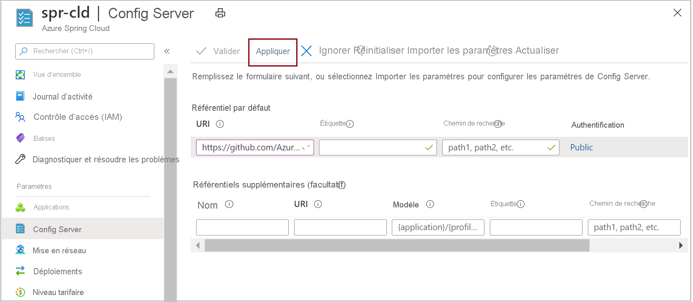

# <a name="quickstart-set-up-azure-spring-cloud-configuration-server"></a>Démarrage rapide : Configurer un serveur de configuration Azure Spring Cloud

Le serveur de configuration Azure Spring Cloud est un service de configuration centralisé pour les systèmes distribués. Il utilise une couche de dépôt enfichable qui prend actuellement en charge le stockage local, Git et Subversion. Dans ce guide de démarrage rapide, vous allez configurer le serveur de configuration pour obtenir des données à partir d’un dépôt Git.

::: zone pivot="programming-language-csharp"

## <a name="prerequisites"></a>Prérequis

* Suivez ce guide de démarrage rapide précédent de la série : [Provisionner le service Azure Spring Cloud](./quickstart-provision-service-instance.md).

## <a name="azure-spring-cloud-config-server-procedures"></a>Procédures pour le serveur de configuration Azure Spring Cloud

Configurez votre serveur de configuration avec l’emplacement du dépôt Git du projet en exécutant la commande suivante. Remplacez `<service instance name>` par le nom du service que vous avez créé. La valeur par défaut du nom de l’instance de service que vous avez définie dans le guide de démarrage rapide précédent ne fonctionne pas avec cette commande.

```azurecli
az spring-cloud config-server git set -n <service instance name> --uri https://github.com/Azure-Samples/Azure-Spring-Cloud-Samples --search-paths steeltoe-sample/config
```

Cette commande demande au serveur de configuration de trouver les données de configuration dans le dossier [steeltoe-sample/config](https://github.com/Azure-Samples/Azure-Spring-Cloud-Samples/tree/master/steeltoe-sample/config) du dépôt de l’exemple d’application. Étant donné que le nom de l’application qui obtiendra les données de configuration est `planet-weather-provider`, le fichier qui sera utilisé est [planet-weather-provider.yml](https://github.com/Azure-Samples/Azure-Spring-Cloud-Samples/blob/master/steeltoe-sample/config/planet-weather-provider.yml).

::: zone-end

::: zone pivot="programming-language-java"
Le serveur de configuration Azure Spring Cloud est un service de configuration centralisé pour les systèmes distribués. Il utilise une couche de dépôt enfichable qui prend actuellement en charge le stockage local, Git et Subversion.  Configurez le serveur de configuration pour déployer des applications de microservice sur Azure Spring Cloud.

## <a name="prerequisites"></a>Prérequis

* [Installez JDK 8](/java/azure/jdk/)
* [Souscrire à un abonnement Azure](https://azure.microsoft.com/free/)
* (Facultatif) [Installez Azure CLI version 2.0.67 ou ultérieure](/cli/azure/install-azure-cli) et installez l’extension Azure Spring Cloud avec la commande : `az extension add --name spring-cloud`
* (Facultatif) [Installez Azure Toolkit for IntelliJ](https://plugins.jetbrains.com/plugin/8053-azure-toolkit-for-intellij/) et [connectez-vous](/azure/developer/java/toolkit-for-intellij/create-hello-world-web-app#installation-and-sign-in).

## <a name="azure-spring-cloud-config-server-procedures"></a>Procédures pour le serveur de configuration Azure Spring Cloud

#### <a name="portal"></a>[Portail](#tab/Azure-portal)

La procédure suivante configure le serveur de configuration en utilisant le portail Azure pour déployer l’[exemple PetClinic](https://github.com/azure-samples/spring-petclinic-microservices).

1. Accédez à la page **Vue d’ensemble** du service, puis sélectionnez **Serveur de configuration**.

2. Dans la section **Dépôt par défaut**, définissez **URI** sur « https://github.com/azure-samples/spring-petclinic-microservices-config  ».

3. Cliquez sur **Valider**.

    

4. Une fois la validation terminée, cliquez sur **Appliquer** pour enregistrer vos modifications.

    

5. La mise à jour de la configuration peut prendre quelques minutes.
 
     

6. Une fois la configuration terminée, vous devriez recevoir une notification.

#### <a name="cli"></a>[INTERFACE DE LIGNE DE COMMANDE](#tab/Azure-CLI)


La procédure suivante utilise l’interface Azure CLI pour configurer le serveur de configuration afin de déployer l’[exemple PetClinic](https://github.com/azure-samples/spring-petclinic-microservices).

Exécutez la commande suivante pour définir le dépôt par défaut.

```azurecli

az spring-cloud config-server git set -n <service instance name> --uri https://github.com/azure-samples/spring-petclinic-microservices-config
::: zone-end

> [!TIP]
> If you are using a private repository for config server, please refer to our [tutorial on setting up authentication](./how-to-config-server.md).

## Troubleshooting of Azure Spring Cloud config server

The following procedure explains how to troubleshoot config server settings.

1. In the Azure portal, go to the service **Overview** page and select **Logs**. 
1. Select **Queries** and **Show the application logs that contain the "error" or "exception" terms"**. 
1. Click **Run**. 
1. If you find the error **java.lang.illegalStateException** in logs, this indicates that spring cloud service cannot locate properties from config server.

    [  ](media/spring-cloud-quickstart-setup-config-server/setup-config-server-query.png)

1. Go to the service **Overview** page.
1. Select **Diagnose and solve problems**. 
1. Select **Config Server** detector.

    [  ](media/spring-cloud-quickstart-setup-config-server/setup-config-server-diagnose.png)

3. Click **Config Server Health Check**.

    [  ](media/spring-cloud-quickstart-setup-config-server/setup-config-server-genie.png)

4. Click **Config Server Status** to see more details from the detector.

    [  ](media/spring-cloud-quickstart-setup-config-server/setup-config-server-health-status.png)

## Next steps

In this quickstart, you created Azure resources that will continue to accrue charges if they remain in your subscription. If you don't intend to continue on to the next quickstart, see [Clean up resources](./quickstart-logs-metrics-tracing.md#clean-up-resources). Otherwise, advance to the next quickstart:

> [!div class="nextstepaction"]
> [Build and deploy apps](./quickstart-deploy-apps.md)
