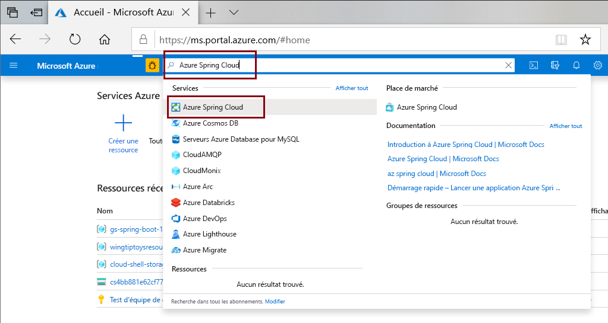
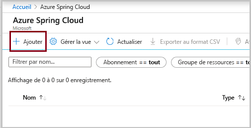
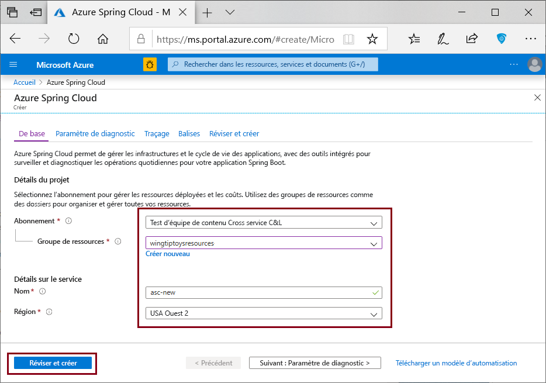

# <a name="quickstart-deploy-your-first-azure-spring-cloud-application"></a>Démarrage rapide : Déployer votre première application Azure Spring Cloud

::: zone pivot="programming-language-csharp"
Ce guide de démarrage rapide explique comment déployer une application de microservices Azure Spring Cloud à exécuter sur Azure.

>[!NOTE]
> La prise en charge Steeltoe pour Azure Spring Cloud est actuellement disponible en préversion publique. Les offres en préversion publique permettent aux clients de tester les nouvelles fonctionnalités avant leur publication officielle.  Les fonctionnalités et services en préversion publique ne sont pas destinés à une utilisation en contexte de production.  Pour en savoir plus sur le support offert avec les préversions, consultez notre [FAQ](https://azure.microsoft.com/support/faq/) ou envoyez une [demande de support](../azure-portal/supportability/how-to-create-azure-support-request.md).

Dans ce guide de démarrage rapide, vous découvrez comment :

> [!div class="checklist"]
> * Générer un projet .NET Core Steeltoe de base
> * Provisionner une instance du service Azure Spring Cloud
> * Générer et déployer l’application avec un point de terminaison public
> * Effectuer le streaming des journaux en temps réel

Le code d’application utilisé dans ce guide de démarrage rapide est celui d’une application simple générée à l’aide d’un modèle de projet d’API web .NET Core. Une fois que vous aurez terminé cet exemple, l’application sera accessible en ligne et pourra être gérée via le portail Azure et Azure CLI.

## <a name="prerequisites"></a>Prérequis

* Compte Azure avec un abonnement actif. [Créez un compte gratuitement](https://azure.microsoft.com/free/?WT.mc_id=A261C142F).
* [Kit SDK .NET Core 3.1](https://dotnet.microsoft.com/download/dotnet-core/3.1). Le service Azure Spring Cloud prend en charge .NET Core 3.1 et versions ultérieures.
* [Azure CLI version 2.0.67 ou ultérieure](/cli/azure/install-azure-cli).
* [Git](https://git-scm.com/).

## <a name="install-azure-cli-extension"></a>Installer l’extension Azure CLI

Vérifiez également que votre version d’Azure CLI est égale ou supérieure à la version 2.0.67 :

```azurecli
az --version
```

Installez l’extension Azure Spring Cloud pour Azure CLI avec la commande suivante :

```azurecli
az extension add --name spring-cloud
```

## <a name="log-in-to-azure"></a>Connexion à Azure

1. Se connecter à Azure CLI

    ```azurecli
    az login
    ```

1. Si vous avez plusieurs abonnements, choisissez celui que vous souhaitez utiliser pour ce guide de démarrage rapide.

   ```azurecli
   az account list -o table
   ```

   ```azurecli
   az account set --subscription <Name or ID of a subscription from the last step>
   ```

## <a name="generate-a-steeltoe-net-core-project"></a>Générer un projet .NET Core Steeltoe

Dans Visual Studio, créez une application web ASP.NET Core nommée « hello-world » avec le modèle de projet d’API. Notez qu’un WeatherForecastController sera généré automatiquement et qu’il constituera notre point de terminaison de test un peu plus tard.

1. Créez un dossier pour le code source du projet, puis générez le projet.
 
   ```console
   mkdir source-code
   ```

   ```console
   cd source-code
   ```

   ```dotnetcli
   dotnet new webapi -n hello-world --framework netcoreapp3.1
   ```

1. Accédez au répertoire du projet.

   ```console
   cd hello-world
   ```

1. Modifiez le fichier *appSettings.json* en ajoutant les paramètres suivants :

   ```json
   "spring": {
     "application": {
       "name": "hello-world"
     }
   },
   "eureka": {
     "client": {
       "shouldFetchRegistry": true,
       "shouldRegisterWithEureka": true
     }
   }
   ```

1. En outre, dans *appsettings.json*, remplacez le niveau de journalisation `Warning` de la catégorie `Microsoft` par le niveau `Information`. Cette modification garantit que les journaux seront générés lorsque vous afficherez les journaux de streaming dans une prochaine étape.

   Le fichier *appsettings.json* se présente maintenant comme dans l’exemple suivant :

   ```json
   {
     "Logging": {
       "LogLevel": {
         "Default": "Information",
         "Microsoft": "Information",
         "Microsoft.Hosting.Lifetime": "Information"
       }
     },
     "AllowedHosts": "*",
     "spring": {
       "application": {
         "name": "hello-world"
       }
     },
     "eureka": {
       "client": {
         "shouldFetchRegistry": true,
         "shouldRegisterWithEureka": true
       }
     }
   }
   ```
   
1. Ajoutez des dépendances et une tâche `Zip` au fichier *.csproj* :

   ```xml
   <ItemGroup>
     <PackageReference Include="Steeltoe.Discovery.ClientCore" Version="3.0.0" />
     <PackageReference Include="Microsoft.Azure.SpringCloud.Client" Version="2.0.0-preview.1" />
   </ItemGroup>
   <Target Name="Publish-Zip" AfterTargets="Publish">
       <ZipDirectory SourceDirectory="$(PublishDir)" DestinationFile="$(MSBuildProjectDirectory)/deploy.zip" Overwrite="true" />
   </Target>
   ```

   Les packages concernent Steeltoe Service Discovery et la bibliothèque de client Azure Spring Cloud. La tâche `Zip` concerne le déploiement vers Azure. Lorsque vous exécutez la commande `dotnet publish`, les fichiers binaires sont générés dans le dossier *publish* et cette tâche compresse le dossier *publish* dans un fichier *.zip* que vous chargez dans Azure.

3. Dans le fichier *Program.cs*, ajoutez une directive `using` et le code qui utilise la bibliothèque de client Azure Spring Cloud :

   ```csharp
   using Microsoft.Azure.SpringCloud.Client;
   ```

   ```csharp
   public static IHostBuilder CreateHostBuilder(string[] args) =>
               Host.CreateDefaultBuilder(args)
                   .UseAzureSpringCloudService()
                   .ConfigureWebHostDefaults(webBuilder =>
                   {
                       webBuilder.UseStartup<Startup>();
                   });
   ```

4. Dans le fichier *Startup.cs*, ajoutez une directive `using` et le code qui utilise Steeltoe Service Discovery à la fin des méthodes `ConfigureServices` et `Configure` :

   ```csharp
   using Steeltoe.Discovery.Client;
   ```

   ```csharp
   public void ConfigureServices(IServiceCollection services)
   {
       // Template code not shown.

       services.AddDiscoveryClient(Configuration);
   }
   ```

   ```csharp
   public void Configure(IApplicationBuilder app, IWebHostEnvironment env)
   {
       // Template code not shown.

       app.UseDiscoveryClient();
   }
   ```

1. Générez le projet pour vérifier qu’il ne contient aucune erreur de compilation.

   ```dotnetcli
   dotnet build
   ```
 
## <a name="provision-a-service-instance"></a>Provisionner une instance de service

La procédure suivante crée une instance d’Azure Spring Cloud en utilisant le portail Azure.

1. Ouvrez le [portail Azure](https://ms.portal.azure.com/). 

1. Dans la zone de recherche supérieure, recherchez *Azure Spring Cloud*.

1. Sélectionnez *Azure Spring Cloud* dans les résultats.

   

1. Dans la page Azure Spring Cloud, sélectionnez **+ Ajouter**.

   

1. Remplissez le formulaire sur la page **Créer** Azure Spring Cloud.  Tenez compte des recommandations suivantes :

   * **Abonnement**: Sélectionnez l’abonnement à facturer pour cette ressource.
   * **Groupe de ressources** : Créez un groupe de ressources. Le nom que vous entrez ici sera utilisé lors de prochaines étapes sous la forme suivante : **\<resource group name\>** .
   * **Détails/Nom du service** : Spécifiez **\<service instance name\>** .  Le nom doit comporter entre 4 et 32 caractères, et contenir uniquement des lettres minuscules, des chiffres et des traits d’union.  Le premier caractère du nom du service doit être une lettre, et le dernier doit être une lettre ou un chiffre.
   * **Région** : Sélectionnez la région pour votre instance de service.

   

6. Sélectionnez **Examiner et créer**.

## <a name="build-and-deploy-the-app"></a>Génération et déploiement de l’application

La procédure suivante génère et déploie le projet que vous avez créé précédemment.

1. Vérifiez que l’invite de commandes se trouve toujours dans le dossier du projet.

1. Exécutez la commande suivante pour générer le projet, ainsi que pour publier et stocker les fichiers binaires dans un fichier *.zip* à l’intérieur du dossier du projet.

   ```dotnetcorecli
   dotnet publish -c release -o ./publish
   ```

1. Créez une application dans votre instance Azure Spring Cloud avec un point de terminaison public attribué. Utilisez le nom d’application « hello-world » que vous avez spécifié dans *appsettings.json*.

   ```console
   az spring-cloud app create -n hello-world -s <service instance name> -g <resource group name> --assign-endpoint --runtime-version NetCore_31
   ```

1. Déployez le fichier *.zip* dans l’application.

   ```azurecli
   az spring-cloud app deploy -n hello-world -s <service instance name> -g <resource group name> --runtime-version NetCore_31 --main-entry hello-world.dll --artifact-path ./deploy.zip
   ```

   L’option `--main-entry` identifie le fichier *.dll* qui contient le point d’entrée de l’application. Une fois que le service a chargé le fichier *.zip*, il extrait tous les fichiers et dossiers, puis tente d’exécuter le point d’entrée dans le fichier *.dll* spécifié par `--main-entry`.

   Le déploiement de l’application prend quelques minutes. Pour vérifier qu’elle a été déployée, accédez au panneau **Applications** dans le portail Azure.

## <a name="test-the-app"></a>Tester l’application

Une fois le déploiement terminé, accédez à l’application à partir de l’URL suivante :

```http
https://<service instance name>-hello-world.azuremicroservices.io/weatherforecast
```

L’application retourne des données JSON semblables à celles de l’exemple suivant :

```json
[{"date":"2020-09-08T21:01:50.0198835+00:00","temperatureC":14,"temperatureF":57,"summary":"Bracing"},{"date":"2020-09-09T21:01:50.0200697+00:00","temperatureC":-14,"temperatureF":7,"summary":"Bracing"},{"date":"2020-09-10T21:01:50.0200715+00:00","temperatureC":27,"temperatureF":80,"summary":"Freezing"},{"date":"2020-09-11T21:01:50.0200717+00:00","temperatureC":18,"temperatureF":64,"summary":"Chilly"},{"date":"2020-09-12T21:01:50.0200719+00:00","temperatureC":16,"temperatureF":60,"summary":"Chilly"}]
```

## <a name="stream-logs-in-real-time"></a>Effectuer le streaming des journaux en temps réel

Utilisez la commande suivante pour récupérer des journaux en temps réel de l’application.

```azurecli
az spring-cloud app logs -n hello-world -s <service instance name> -g <resource group name> --lines 100 -f
```

Des journaux s’affichent dans la sortie :

```output
[Azure Spring Cloud] The following environment variables are loaded:
2020-09-08 20:58:42,432 INFO supervisord started with pid 1
2020-09-08 20:58:43,435 INFO spawned: 'event-gather_00' with pid 9
2020-09-08 20:58:43,436 INFO spawned: 'dotnet-app_00' with pid 10
2020-09-08 20:58:43 [Warning] No managed processes are running. Wait for 30 seconds...
2020-09-08 20:58:44,843 INFO success: event-gather_00 entered RUNNING state, process has stayed up for > than 1 seconds (startsecs)
2020-09-08 20:58:44,843 INFO success: dotnet-app_00 entered RUNNING state, process has stayed up for > than 1 seconds (startsecs)
←[40m←[32minfo←[39m←[22m←[49m: Steeltoe.Discovery.Eureka.DiscoveryClient[0]
      Starting HeartBeat
info: Microsoft.Hosting.Lifetime[0]
      Now listening on: http://[::]:1025
info: Microsoft.Hosting.Lifetime[0]
      Application started. Press Ctrl+C to shut down.
info: Microsoft.Hosting.Lifetime[0]
      Hosting environment: Production
info: Microsoft.Hosting.Lifetime[0]
      Content root path: /netcorepublish/6e4db42a-b160-4b83-a771-c91adec18c60
2020-09-08 21:00:13 [Information] [10] Start listening...
info: Microsoft.AspNetCore.Hosting.Diagnostics[1]
      Request starting HTTP/1.1 GET http://asc-svc-hello-world.azuremicroservices.io/weatherforecast
info: Microsoft.AspNetCore.Routing.EndpointMiddleware[0]
      Executing endpoint 'hello_world.Controllers.WeatherForecastController.Get (hello-world)'
info: Microsoft.AspNetCore.Mvc.Infrastructure.ControllerActionInvoker[3]
      Route matched with {action = "Get", controller = "WeatherForecast"}. Executing controller action with signature System.Collections.Generic.IEnumerable`1[hello_world.WeatherForecast] Get() on controller hello_world.Controllers.WeatherForecastController (hello-world).
info: Microsoft.AspNetCore.Mvc.Infrastructure.ObjectResultExecutor[1]
      Executing ObjectResult, writing value of type 'hello_world.WeatherForecast[]'.
info: Microsoft.AspNetCore.Mvc.Infrastructure.ControllerActionInvoker[2]
      Executed action hello_world.Controllers.WeatherForecastController.Get (hello-world) in 1.8902ms
info: Microsoft.AspNetCore.Routing.EndpointMiddleware[1]
      Executed endpoint 'hello_world.Controllers.WeatherForecastController.Get (hello-world)'
info: Microsoft.AspNetCore.Hosting.Diagnostics[2]
      Request finished in 4.2591ms 200 application/json; charset=utf-8
```

> [!TIP]
> Utilisez `az spring-cloud app logs -h` pour explorer davantage de paramètres et de fonctionnalités du streaming de journaux.

Pour en savoir plus sur les fonctionnalités avancées d’analytique des journaux, accédez à l’onglet **Journaux** du menu sur le [portail Azure](https://portal.azure.com/). Les journaux ont ici une latence de quelques minutes.
[  ](media/spring-cloud-quickstart-java/logs-analytics.png#lightbox)
::: zone-end

::: zone pivot="programming-language-java"
Ce guide de démarrage rapide explique comment déployer une application de microservices Azure Spring Cloud à exécuter sur Azure. 

Le code d’application utilisé dans ce tutoriel est une application simple générée avec Spring Initializr. Une fois que vous avez terminé cet exemple, l’application est accessible en ligne et peut être gérée via le portail Azure.

Ce guide de démarrage rapide explique comment :

> [!div class="checklist"]
> * Générer un projet Spring Cloud de base
> * Provisionner une instance de service
> * Générer et déployer l’application avec un point de terminaison public
> * Effectuer le streaming des journaux en temps réel

## <a name="prerequisites"></a>Prérequis

Pour suivre ce guide de démarrage rapide :

* [Installez JDK 8](/java/azure/jdk/)
* [Souscrire à un abonnement Azure](https://azure.microsoft.com/free/)
* (Facultatif) [Installez Azure CLI version 2.0.67 ou ultérieure](/cli/azure/install-azure-cli) et l’extension Azure Spring Cloud avec la commande : `az extension add --name spring-cloud`
* (Facultatif) [Installez Azure Toolkit for IntelliJ](https://plugins.jetbrains.com/plugin/8053-azure-toolkit-for-intellij/) et [connectez-vous](/azure/developer/java/toolkit-for-intellij/create-hello-world-web-app#installation-and-sign-in).

## <a name="generate-a-spring-cloud-project"></a>Générer un projet Spring Cloud

Commencez avec [Spring Initializr](https://start.spring.io/#!type=maven-project&language=java&platformVersion=2.3.10.RELEASE&packaging=jar&jvmVersion=1.8&groupId=com.example&artifactId=hellospring&name=hellospring&description=Demo%20project%20for%20Spring%20Boot&packageName=com.example.hellospring&dependencies=web,cloud-eureka,actuator,cloud-starter-sleuth,cloud-starter-zipkin,cloud-config-client) pour générer un exemple de projet avec des dépendances recommandées pour Azure Spring Cloud. L’image suivante montre la configuration d’Initializr pour cet exemple de projet.
```url
https://start.spring.io/#!type=maven-project&language=java&platformVersion=2.3.10.RELEASE&packaging=jar&jvmVersion=1.8&groupId=com.example&artifactId=hellospring&name=hellospring&description=Demo%20project%20for%20Spring%20Boot&packageName=com.example.hellospring&dependencies=web,cloud-eureka,actuator,cloud-starter-sleuth,cloud-starter-zipkin,cloud-config-client
```
Notez que cet exemple utilise Java version 8.  Si vous souhaitez utiliser Java version 11, modifiez l’option sous les **métadonnées du projet**.

  

1. Cliquez sur **Generate** quand toutes les dépendances sont définies. Téléchargez et décompressez le package, puis créez un contrôleur web pour une application web simple en ajoutant `src/main/java/com/example/hellospring/HelloController.java` comme suit :

    ```java
    package com.example.hellospring;
    
    import org.springframework.web.bind.annotation.RestController;
    import org.springframework.web.bind.annotation.RequestMapping;
    
    @RestController
    public class HelloController {
    
        @RequestMapping("/")
        public String index() {
            return "Greetings from Azure Spring Cloud!";
        }
    
    }
    ```
## <a name="provision-an-instance-of-azure-spring-cloud"></a>Provisionner une instance Azure Spring Cloud

La procédure suivante crée une instance Azure Spring Cloud en utilisant le portail Azure.

1. Sous un nouvel onglet, ouvrez le [portail Azure](https://ms.portal.azure.com/). 

2. Dans la zone de recherche supérieure, recherchez *Azure Spring Cloud*.

3. Sélectionnez *Azure Spring Cloud* dans les résultats.

    

4. Dans la page Azure Spring Cloud, cliquez sur **+ Ajouter**.

    

5. Remplissez le formulaire sur la page **Créer** Azure Spring Cloud.  Tenez compte des recommandations suivantes :
    - **Abonnement**: Sélectionnez l’abonnement à facturer pour cette ressource.
    - **Groupe de ressources** : Une bonne pratique consiste à créer des groupes de ressources pour les nouvelles ressources. Ceci sera utilisé dans des étapes ultérieures en tant que **\<resource group name\>** .
    - **Détails/Nom du service** : Spécifiez **\<service instance name\>** .  Le nom doit comporter entre 4 et 32 caractères, et contenir uniquement des lettres minuscules, des chiffres et des traits d’union.  Le premier caractère du nom du service doit être une lettre, et le dernier doit être une lettre ou un chiffre.
    - **Emplacement** : Sélectionnez la région pour votre instance de service.

    

6. Cliquez sur **Vérifier et créer**.

## <a name="build-and-deploy-the-app"></a>Génération et déploiement de l’application
    
#### <a name="cli"></a>[INTERFACE DE LIGNE DE COMMANDE](#tab/Azure-CLI)
La procédure suivante génère et déploie l’application en utilisant Azure CLI. Exécutez la commande suivante à la racine du projet.

1. Générez le projet avec Maven :

    ```console
    mvn clean package -DskipTests
    ```

1. (Si vous ne l’avez pas encore fait) Installez l’extension Azure Spring Cloud pour Azure CLI :

    ```azurecli
    az extension add --name spring-cloud
    ```
    
1. Créez l’application avec un point de terminaison public affecté. Si vous utilisez Java 11, incluez le commutateur `--runtime-version=Java_11`.

    ```azurecli
    az spring-cloud app create -n hellospring -s <service instance name> -g <resource group name> --assign-endpoint true
    ```

1. Déployez le fichier Jar pour l’application (`target\hellospring-0.0.1-SNAPSHOT.jar` sur Windows) :

    ```azurecli
    az spring-cloud app deploy -n hellospring -s <service instance name> -g <resource group name> --jar-path <jar file path>
    ```
    
1. Le déploiement de l’application prend quelques minutes. Pour vérifier qu’elle a été déployée, accédez au panneau **Applications** dans le portail Azure. Vous voyez normalement l’état de l’application.

#### <a name="intellij"></a>[IntelliJ](#tab/IntelliJ)

La procédure suivante utilise le plug-in IntelliJ pour Azure Spring Cloud afin de déployer l’exemple d’application dans IntelliJ IDEA.  

### <a name="import-project"></a>Importer le projet

1. Ouvrez la boîte de dialogue **Welcome** (Bienvenue) d’IntelliJ et sélectionnez **Import Project** (Importer un projet) pour ouvrir l’Assistant Importation.
1. Sélectionnez le dossier `hellospring`.

    

### <a name="deploy-the-app"></a>Déployer l’application
Pour déployer sur Azure, vous devez vous connecter avec votre compte Azure et choisir votre abonnement.  Pour plus d’informations sur la connexion, consultez [Installation et connexion](/azure/developer/java/toolkit-for-intellij/create-hello-world-web-app#installation-and-sign-in).

1. Cliquez avec le bouton droit sur votre projet dans l’explorateur de projets IntelliJ, puis sélectionnez **Azure** -> **Deploy to Azure Spring Cloud**.

    [  ](media/spring-cloud-quickstart-java/intellij-deploy-azure-1.png#lightbox)

1. Acceptez le nom de l’application dans le champ **Name**. **Name** fait référence à la configuration, pas au nom de l’application. Les utilisateurs n’ont généralement pas besoin de le changer.
1. Dans la zone de texte **Artifact**, sélectionnez *hellospring-0.0.1-SNAPSHOT.jar*.
1. Dans la zone de texte **Subscription** (Abonnement), vérifiez votre abonnement.
1. Dans la zone de texte **Spring Cloud**, sélectionnez l’instance Azure Spring Cloud que vous avez créée dans [Provisionner une instance Azure Spring Cloud](./quickstart-provision-service-instance.md).
1. Définissez **Public Endpoint** (Point de terminaison public) sur *Enable* (Activer).
1. Dans la zone de texte **App:** , sélectionnez **Create app...** .
1. Entrez *hellospring*, puis cliquez sur **OK**.

    [  ](media/spring-cloud-quickstart-java/intellij-deploy-to-azure.png#lightbox)

1. Démarrez le déploiement en cliquant sur le bouton **Run** (Exécuter) en bas de la boîte de dialogue **Deploy Azure Spring Cloud app** (Déployer l’application Azure Spring Cloud). Le plug-in va exécuter la commande `mvn package` sur l’application `hellospring`, puis va déployer le fichier jar généré par la commande `package`.
---

Une fois le déploiement terminé, vous pouvez accéder à l’application sur `https://<service instance name>-hellospring.azuremicroservices.io/`.

  [  ](media/spring-cloud-quickstart-java/access-app-browser.png#lightbox)

## <a name="streaming-logs-in-real-time"></a>Streaming des journaux en temps réel

#### <a name="cli"></a>[INTERFACE DE LIGNE DE COMMANDE](#tab/Azure-CLI)

Utilisez la commande suivante pour récupérer des journaux en temps réel de l’application.

```azurecli
az spring-cloud app logs -n hellospring -s <service instance name> -g <resource group name> --lines 100 -f

```
Les journaux apparaissent dans les résultats :

[  ](media/spring-cloud-quickstart-java/streaming-logs.png#lightbox)

>[!TIP]
> Utilisez `az spring-cloud app logs -h` pour explorer davantage de paramètres et de fonctionnalités du streaming de journaux.

#### <a name="intellij"></a>[IntelliJ](#tab/IntelliJ)

1. Sélectionnez **Azure Explorer**, puis **Spring Cloud**.
1. Cliquez avec le bouton droit sur l’application en cours d’exécution.
1. Sélectionnez **Journaux de streaming** dans la liste déroulante.
1. Sélectionnez une instance.

    [  ](media/spring-cloud-quickstart-java/intellij-get-streaming-logs.png)

1. Le journal de streaming est visible dans la fenêtre de sortie.

    [  ](media/spring-cloud-quickstart-java/intellij-streaming-logs-output.png)
---

Pour des informations sur les fonctionnalités avancées de l’analytique des journaux, consultez l’onglet **Journaux** dans le menu sur le [portail Azure](https://portal.azure.com/). Les journaux ont ici une latence de quelques minutes.

[  ](media/spring-cloud-quickstart-java/logs-analytics.png#lightbox)
::: zone-end

## <a name="clean-up-resources"></a>Nettoyer les ressources

Dans les étapes précédentes, vous avez créé des ressources Azure qui continueront de générer des frais tant qu’elles resteront dans votre abonnement. Si vous pensez que vous n’aurez pas besoin de ces ressources, supprimez le groupe de ressources dans le portail ou exécutez la commande suivante dans Azure CLI :

```azurecli
az group delete --name <your resource group name; for example: hellospring-1558400876966-rg> --yes
```

## <a name="next-steps"></a>Étapes suivantes

Dans ce démarrage rapide, vous avez appris comment :

> [!div class="checklist"]
> * Générer un projet Azure Spring Cloud de base
> * Provisionner une instance de service
> * Générer et déployer l’application avec un point de terminaison public
> * Effectuer le streaming des journaux en temps réel

Pour savoir comment utiliser les autres fonctionnalités Azure Spring, passez à la série de guides de démarrage rapide qui déploie un exemple d’application dans Azure Spring Cloud :

> [!div class="nextstepaction"]
> [Créer et exécuter des microservices](./quickstart-sample-app-introduction.md)

D’autres exemples sont disponibles sur GitHub : [Exemples Azure Spring Cloud](https://github.com/Azure-Samples/Azure-Spring-Cloud-Samples).