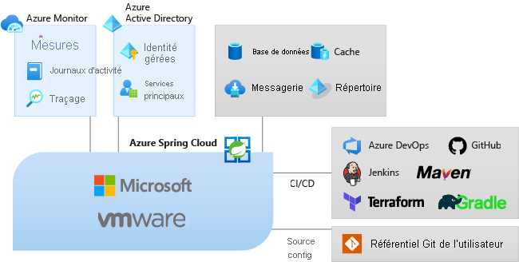

# Qu’est-ce qu’Azure Spring Cloud ?

Azure Spring Cloud permet de déployer facilement des applications de microservices Spring Boot sur Azure, et sans aucune modification du code.  Le service gère l’infrastructure des applications Spring Cloud, ce qui permet aux développeurs de se concentrer sur leur code.  Azure Spring Cloud assure la gestion du cycle de vie en utilisant des outils complets, tels que la supervision et les diagnostics, la gestion des configurations, la découverte de services, l’intégration CI/CD, les déploiements bleus-verts, etc.

## Pourquoi utiliser Azure Spring Cloud ?

Le déploiement d’applications sur Azure Spring Cloud présente de nombreux avantages.  Vous pouvez :
* Migrer efficacement les applications Spring existantes et gérer les coûts ainsi que la mise à l’échelle du cloud.
* Moderniser les applications à l’aide des modèles Spring Cloud pour améliorer l’agilité et la rapidité de livraison.
* Exécuter Java à l’échelle du cloud et augmenter l’utilisation sans infrastructure complexe.
* Développer et déployer rapidement sans dépendance de conteneurisation.
* Superviser efficacement et sans effort les charges de travail de production.

Azure Spring Cloud prend en charge les applications Java [Spring Boot](https://spring.io/projects/spring-boot) et ASP.NET Core [Steeltoe](https://steeltoe.io/). La prise en charge de Steeltoe est actuellement en préversion publique. Les offres en préversion publique vous permettent de tester les nouvelles fonctionnalités avant leur publication officielle. Les fonctionnalités et services en préversion publique ne sont pas destinés à une utilisation en contexte de production. Pour plus d’informations, consultez la [FAQ](https://azure.microsoft.com/support/faq/) ou faites une [demande de support](https://docs.microsoft.com/azure/azure-portal/supportability/how-to-create-azure-support-request).

## Présentation du service

Composant de l’écosystème Azure, Azure Spring Cloud permet une liaison facile avec d’autres services Azure, notamment le stockage, les bases de données, la supervision, etc.  

  

* Azure Spring Cloud est un service entièrement managé pour les applications Spring Boot, ce qui vous permet de vous consacrer pleinement à la création et à l’exécution d’applications sans vous soucier de la gestion de l’infrastructure.

* Déployez simplement vos fichiers jar ou votre code, et Azure Spring Cloud connectera automatiquement vos applications au runtime du service Spring et au cycle de vie des applications intégrées.

* La supervision est simple. Après le déploiement, vous pouvez superviser les performances des applications, corriger les erreurs et améliorer rapidement les applications. 

* Intégration complète aux écosystèmes et services d’Azure.

* Azure Spring Cloud est adapté au monde de l’entreprise, avec son infrastructure entièrement managée, une gestion du cycle de vie intégrée et une facilité de supervision.

## Vue d’ensemble de la documentation
Cette documentation inclut des sections expliquant comment bien commencer et tirer parti des services Azure Spring Cloud.

* Bien démarrer
    * [Lancer votre première application](spring-cloud-quickstart.md)
    * [Provisionner un service Azure Spring Cloud](spring-cloud-quickstart-provision-service-instance.md)
    * [Configurer le serveur de configuration]()
    * [Créer et déployer des applications](spring-cloud-quickstart-deploy-apps.md)
    * [Utiliser les journaux, les métriques et le suivi](spring-cloud-quickstart-logs-metrics-tracing.md)
* Procédures
    * [Développement](spring-cloud-tutorial-prepare-app-deployment.md) : Préparez une application Java Spring existante pour le déploiement dans Azure Spring Cloud. Lorsqu’il est correctement configuré, Azure Spring Cloud fournit des services robustes pour superviser, mettre à l’échelle et mettre à jour des applications Java Spring Cloud.
    * [Deploy](spring-cloud-howto-staging-environment.md) : Comment configurer un déploiement intermédiaire à l’aide du modèle de déploiement bleu-vert dans Azure Spring Cloud. Le déploiement bleu/vert est un modèle de livraison continue Azure DevOps qui consiste à garder en service une version existante (bleue) pendant le déploiement d’une nouvelle version (verte).
    * [Configuration des applications](spring-cloud-howto-start-stop-delete.md) :  Démarrez, arrêtez et supprimez vos applications Azure Spring Cloud. Changez l’état d’une application dans Azure Spring Cloud en utilisant le portail Azure ou l’interface Azure CLI.
    * [Mise à l’échelle](spring-cloud-tutorial-scale-manual.md) : Mettez à l’échelle une application de microservices à partir du tableau de bord Azure Spring Cloud sur le portail Azure, ou à l’aide des paramètres de mise à l’échelle automatique. Les adresses IP publiques sont disponibles pour communiquer avec des ressources externes, telles que des bases de données, du stockage et des coffres de clés.
    * [Supervision des applications](spring-cloud-tutorial-distributed-tracing.md) : Outils de suivi distribué pour déboguer et superviser facilement les problèmes complexes. Azure Spring Cloud intègre Azure Spring Cloud Sleuth au service Application Insights d’Azure. Cette intégration fournit une fonctionnalité puissante de suivi distribué qui est disponible dans le portail Azure.
    * [Applications sécurisées](spring-cloud-howto-enable-system-assigned-managed-identity.md) : Les ressources Azure fournissent une identité managée automatiquement dans Azure Active Directory. Vous pouvez utiliser cette identité pour vous authentifier sur n’importe quel service prenant en charge l’authentification Azure AD, sans avoir d’informations d’identification dans votre code.
    * [Intégration à d’autres services Azure](spring-cloud-tutorial-bind-cosmos.md) : Au lieu de configurer manuellement vos applications Spring Boot, vous pouvez lier automatiquement à vos applications les services Azure sélectionnés, par exemple en liant votre application à une base de données Azure Cosmos DB.
    * [Automatisation](spring-cloud-howto-cicd.md) : Les outils d’intégration continue et de livraison continue vous permettent de déployer rapidement des mises à jour d’applications existantes avec un minimum d’effort et de risque. Azure DevOps permet d’organiser et de contrôler ces tâches essentielles. 
    * [Résoudre les problèmes](spring-cloud-howto-self-diagnose-solve.md) : Les diagnostics Azure Spring Cloud offrent une expérience interactive permettant de résoudre les problèmes d’application. Aucune configuration n'est requise. Lorsque vous rencontrez des problèmes, la fonctionnalité de diagnostic Azure Spring Cloud identifie les incidents et vous guide vers les informations qui vous aident au dépannage et à la résolution des problèmes.
    * [Migration](https://docs.microsoft.com/azure/developer/java/migration/migrate-spring-boot-to-azure-spring-cloud) : Comment migrer une application Spring Cloud ou Spring Boot existante pour l’exécuter sur Azure Spring Cloud.

## Étapes suivantes

Pour commencer, suivez le [guide de démarrage rapide Spring Cloud](spring-cloud-quickstart.md).

Des exemples sont disponibles sur GitHub. [Exemples Azure Spring Cloud](https://github.com/Azure-Samples/Azure-Spring-Cloud-Samples/tree/master/).
