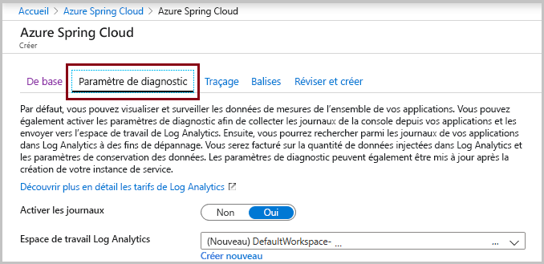
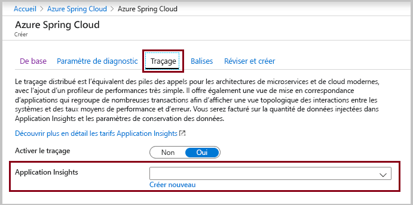
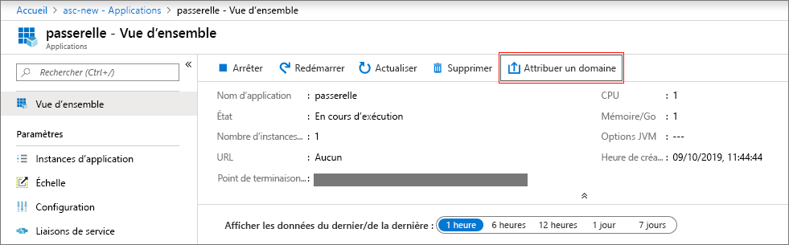
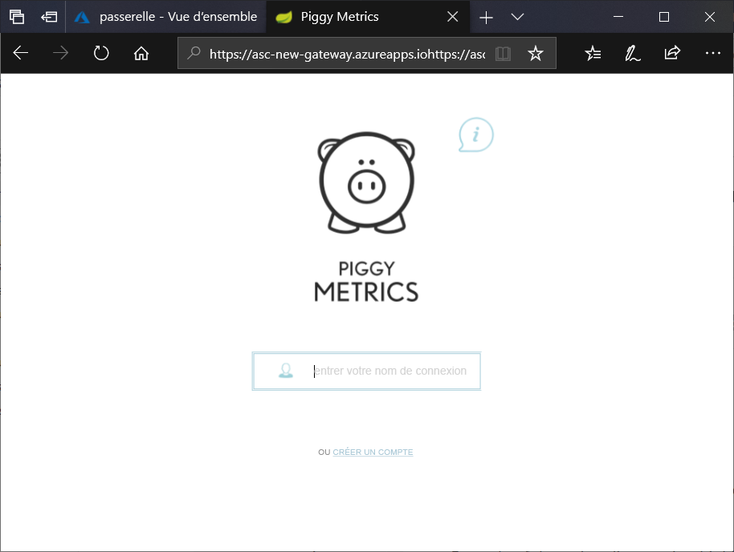

# <a name="quickstart-launch-an-existing-azure-spring-cloud-application-using-the-azure-portal"></a>Démarrage rapide : Lancer une application Azure Spring Cloud existante en utilisant le portail Azure

Ce guide de démarrage rapide vous montre comment déployer une application Spring Cloud sur Azure. Azure Spring Cloud vous permet d’exécuter facilement sur Azure une application de microservices basée sur Spring Cloud. 

Vous trouverez l’exemple de code d’application utilisé dans ce tutoriel dans notre [référentiel d’exemples GitHub](https://github.com/Azure-Samples/PiggyMetrics). Quand vous aurez terminé, vous pourrez accéder à l’exemple d’application fourni en ligne et à le gérer via le portail Azure.

Dans ce guide de démarrage rapide, vous découvrez comment :

> [!div class="checklist"]
> * Provisionner une instance de service
> * Définir un serveur de configuration pour une instance
> * Générer localement une application de microservices
> * Déployer chaque microservice
> * Affecter un point de terminaison public pour votre application

## <a name="prerequisites"></a>Prérequis

>[!Note]
> Azure Spring Cloud est actuellement disponible en préversion publique. Les offres en préversion publique permettent aux clients de tester les nouvelles fonctionnalités avant leur publication officielle.  Les fonctionnalités et services en préversion publique ne sont pas destinés à une utilisation en contexte de production.  Pour en savoir plus sur le support offert avec les préversions, consultez notre [FAQ](https://azure.microsoft.com/support/faq/) ou soumettez une [demande de support](https://docs.microsoft.com/azure/azure-portal/supportability/how-to-create-azure-support-request).

>[!TIP]
> Azure Cloud Shell est un interpréteur de commandes interactif et gratuit que vous pouvez utiliser pour exécuter les étapes de cet article.  Les outils Azure les plus courants sont préinstallés, notamment les dernières versions de Git, JDK, Maven et Azure CLI. Si vous êtes connecté à votre abonnement Azure, lancez [Azure Cloud Shell](https://shell.azure.com) à partir de shell.azure.com.  Pour en savoir plus sur Azure Cloud Shell, consultez [notre documentation](../cloud-shell/overview.md).

Pour suivre ce guide de démarrage rapide :

1. [Installez Git](https://git-scm.com/)
2. [Installez JDK 8](https://docs.microsoft.com/java/azure/jdk/?view=azure-java-stable)
3. [Installez Maven 3.0 ou ultérieur](https://maven.apache.org/download.cgi)
4. [Installez Azure CLI 2.0.67 ou version ultérieure](https://docs.microsoft.com/cli/azure/install-azure-cli?view=azure-cli-latest)
5. [Souscrire à un abonnement Azure](https://azure.microsoft.com/free/)

## <a name="provision-a-service-instance-on-the-azure-portal"></a>Provisionner une instance de service sur le portail Azure

1. Sous un nouvel onglet, ouvrez le [portail Azure](https://ms.portal.azure.com/). 

2. Dans la zone de recherche supérieure, recherchez **Azure Spring Cloud**.

3. Sélectionnez **Azure Spring Cloud** dans les résultats.

 

4. Dans la page Azure Spring Cloud, cliquez sur **+ Ajouter**.

 

5. Remplissez le formulaire sur la page **Créer** Azure Spring Cloud.  Tenez compte des recommandations suivantes :
    - **Abonnement**: Sélectionnez l’abonnement à facturer pour cette ressource.  Vérifiez que cet abonnement a été ajouté à notre liste verte pour Azure Spring Cloud.
    - **Groupe de ressources** : Une bonne pratique consiste à créer des groupes de ressources pour les nouvelles ressources.
    - **Détails/Nom du service** : Spécifiez le nom de votre instance de service.  Le nom doit comporter entre 4 et 32 caractères, et contenir uniquement des lettres minuscules, des chiffres et des traits d’union.  Le premier caractère du nom du service doit être une lettre, et le dernier doit être une lettre ou un chiffre.
    - **Emplacement** : Sélectionnez l’emplacement de votre instance de service. Les emplacements actuellement pris en charge sont USA Est, USA Ouest 2, Europe Ouest et Asie Sud-Est.

    

6. Cliquez sur l’onglet **Paramètre de diagnostic** pour ouvrir la boîte de dialogue suivante.

7. Vous pouvez définir **Activer les journaux** sur *Oui* ou *Non* en fonction de vos besoins.

    

8. Cliquez sur l’onglet **Traçage**.

9. Vous pouvez définir **Activer le traçage** sur *Oui* ou *Non* en fonction de vos besoins.  Si vous définissez **Activer le traçage** sur Oui, sélectionnez également un insight d’application existant ou créez-en un. Sans la spécification **Application Insights**, une erreur de validation se produit.


    

10. Cliquez sur **Vérifier et créer**.

11. Vérifiez vos spécifications, puis cliquez sur **Créer**.

Le déploiement du service nécessite environ 5 minutes.  Une fois le déploiement terminé, la page **Vue d’ensemble** de l’instance de service apparaît.

> [!div class="nextstepaction"]
> [J’ai rencontré un problème](https://www.research.net/r/javae2e?tutorial=asc-portal-quickstart&step=provision)


## <a name="set-up-your-configuration-server"></a>Configurer votre serveur de configuration

1. Accédez à la page **Vue d’ensemble** du service, puis sélectionnez **Serveur de configuration**.

2. Dans la section **Dépôt par défaut**, définissez **URI** sur « https://github.com/Azure-Samples/piggymetrics-config  ».

3. Sélectionnez **Appliquer** pour enregistrer vos modifications.

    

> [!div class="nextstepaction"]
> [J’ai rencontré un problème](https://www.research.net/r/javae2e?tutorial=asc-portal-quickstart&step=config-server)

## <a name="build-and-deploy-microservice-applications"></a>Générer et déployer des applications de microservices

1. Ouvrez [Azure Cloud Shell](https://shell.azure.com) ou votre interpréteur de commandes local avec Azure CLI installé. Nous commençons ici par créer un répertoire temporaire nommé `source-code` avant de cloner l’exemple d’application.

    ```console
    mkdir source-code
    cd source-code
    git clone https://github.com/Azure-Samples/piggymetrics
    ```

2. Générez le package cloné.

    ```console
    cd piggymetrics
    mvn clean package -DskipTests
    ```

3. Installer l’extension Azure Spring Cloud pour Azure CLI avec la commande suivante

    ```azurecli
    az extension add --name spring-cloud
    ```

4. Affectez des noms à votre groupe de ressources et à votre service. Veillez à remplacer les espaces réservés ci-dessous par le nom du groupe de ressources et le nom du service que vous avez précédemment provisionnés dans ce tutoriel.

    ```azurecli
    az configure --defaults group=<resource group name>
    az configure --defaults spring-cloud=<service instance name>
    ```

5. Créez l’application `gateway` et déployez le fichier JAR.

    À l’aide de l’extension Spring Cloud, créez l’application :

    ```azurecli
    az spring-cloud app create -n gateway
    az spring-cloud app deploy -n gateway --jar-path ./gateway/target/gateway.jar
    ```

6. En suivant le même modèle, créez les applications `account-service` et `auth-service`, et déployez leurs fichiers JAR.

    ```azurecli
    az spring-cloud app create -n account-service
    az spring-cloud app deploy -n account-service --jar-path ./account-service/target/account-service.jar
    az spring-cloud app create -n auth-service
    az spring-cloud app deploy -n auth-service --jar-path ./auth-service/target/auth-service.jar
    ```

7. Le déploiement des applications prend quelques minutes. Pour vérifier qu’elles ont été déployées, accédez au panneau **Applications** dans le portail Azure. Vous devez voir une ligne pour chacune des trois applications.

> [!div class="nextstepaction"]
> [J’ai rencontré un problème](https://www.research.net/r/javae2e?tutorial=asc-portal-quickstart&step=deploy)

## <a name="assign-a-public-endpoint-to-gateway"></a>Affecter un point de terminaison public à la passerelle

1. Ouvrez l’onglet **Applications** dans le menu de gauche.

2. Sélectionnez l’application `gateway` pour afficher la page **Vue d’ensemble**.

3. Sélectionnez **Affecter un point de terminaison** pour affecter un point de terminaison public à la passerelle. Cette opération peut prendre quelques minutes.

    

4. Entrez le point de terminaison IP public affecté (libellé **URL**) dans votre navigateur pour voir votre application en cours d’exécution.

    

> [!div class="nextstepaction"]
> [J’ai rencontré un problème](https://www.research.net/r/javae2e?tutorial=asc-portal-quickstart&step=public-endpoint)

## <a name="next-steps"></a>Étapes suivantes

Dans ce démarrage rapide, vous avez appris comment :

> [!div class="checklist"]
> * Provisionner une instance de service
> * Définir un serveur de configuration pour une instance
> * Générer localement une application de microservices
> * Déployer chaque microservice
> * Affecter un point de terminaison public pour votre passerelle d’application

> [!div class="nextstepaction"]
> [Préparer votre application Azure Spring Cloud pour le déploiement](spring-cloud-tutorial-prepare-app-deployment.md)

D’autres exemples sont disponibles sur GitHub : [Exemples Azure Spring Cloud](https://github.com/Azure-Samples/Azure-Spring-Cloud-Samples/tree/master/service-binding-cosmosdb-sql).
