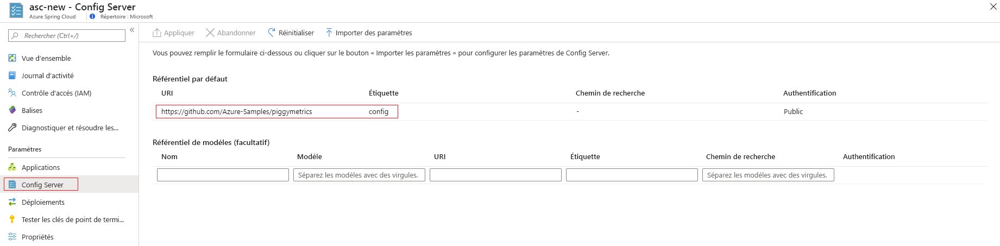

# <a name="set-up-a-spring-cloud-config-server-instance-for-your-service"></a>Configurer une instance de serveur de configuration Spring Cloud pour votre service

Ce tutoriel vous montre comment connecter une instance de serveur de configuration Spring Cloud à votre service Azure Spring Cloud.

La configuration Spring Cloud offre la prise en charge côté serveur et côté client d’une configuration externalisée dans un système distribué. L’instance de serveur de configuration vous fournit un emplacement centralisé pour gérer les propriétés externes des applications dans tous les environnements. Pour plus d’informations, consultez [Informations de référence sur le serveur de configuration Spring Cloud](https://spring.io/projects/spring-cloud-config).

## <a name="prerequisites"></a>Prérequis
* Un abonnement Azure. Si vous n’avez pas d’abonnement Azure, créez un [compte gratuit](https://azure.microsoft.com/free/?WT.mc_id=A261C142F) avant de commencer. 
* Un service Azure Spring Cloud déjà provisionné et en cours d’exécution. Pour configurer et lancer un service Azure Spring Cloud, consultez [Démarrage rapide : Lancer une application Java Spring en utilisant Azure CLI](spring-cloud-quickstart.md).

## <a name="restriction"></a>Restriction

Certaines restrictions s’appliquent quand vous utilisez le serveur de configuration avec un back-end Git. Certaines propriétés sont automatiquement injectées dans votre environnement d’application pour accéder au serveur de configuration et à la découverte des services. Si vous configurez aussi ces propriétés dans les fichiers de votre serveur de configuration, vous vous exposez à des conflits et à un comportement inattendu. Ces propriétés sont les suivantes : 

```yaml
eureka.client.service-url.defaultZone
eureka.client.tls.keystore
server.port
spring.cloud.config.tls.keystore
spring.application.name
spring.jmx.enabled
```

> [!CAUTION]
> Nous vous _déconseillons_ fortement d’inclure les propriétés ci-dessus dans les fichiers d’application de votre serveur de configuration.

## <a name="create-your-config-server-files"></a>Créer les fichiers de votre serveur de configuration

Azure Spring Cloud prend en charge Azure DevOps, GitHub, GitLab et Bitbucket pour le stockage des fichiers de votre serveur de configuration. Une fois que votre dépôt est prêt, créez les fichiers de configuration en suivant les instructions ci-dessous et stockez-les dans le dépôt.

Par ailleurs, certaines propriétés configurables sont disponibles uniquement pour certains types. Les sous-sections suivantes listent les propriétés pour chaque type de dépôt.

### <a name="public-repository"></a>Dépôt public

Quand vous utilisez un dépôt public, vos propriétés configurables sont plus limitées.

Toutes les propriétés configurables servant à configurer le dépôt Git public sont listées dans le tableau suivant :

> [!NOTE]
> L’utilisation d’un trait d’union (-) pour séparer les mots est la seule convention de nommage actuellement prise en charge. Par exemple, vous pouvez utiliser *default-label*, mais pas *defaultLabel*.

| Propriété        | Obligatoire | Fonctionnalité                                                      |
| :-------------- | -------- | ------------------------------------------------------------ |
| `uri`           | Oui    | URI du dépôt Git utilisé comme back-end du serveur de configuration, commence par *http://* , *https://* , *git@* ou *ssh://* . |
| `default-label` | Non     | Étiquette par défaut du dépôt Git, doit être le *nom de branche*, le *nom d’étiquette* ou le *commit-id* du dépôt. |
| `search-paths`  | Non     | Tableau de chaînes utilisé pour effectuer une recherche dans les sous-répertoires du dépôt Git. |

------

### <a name="private-repository-with-ssh-authentication"></a>Dépôt privé avec authentification SSH

Toutes les propriétés configurables servant à configurer un dépôt Git privé avec SSH sont listées dans le tableau suivant :

> [!NOTE]
> L’utilisation d’un trait d’union (-) pour séparer les mots est la seule convention de nommage actuellement prise en charge. Par exemple, vous pouvez utiliser *default-label*, mais pas *defaultLabel*.

| Propriété                   | Obligatoire | Fonctionnalité                                                      |
| :------------------------- | -------- | ------------------------------------------------------------ |
| `uri`                      | Oui    | URI du dépôt Git utilisé comme back-end du serveur de configuration, doit commencer par *http://* , *https://* , *git@* ou *ssh://* . |
| `default-label`            | Non     | Étiquette par défaut du dépôt Git, doit être le *nom de branche*, le *nom d’étiquette* ou le *commit-id* du dépôt. |
| `search-paths`             | Non     | Tableau de chaînes utilisé pour effectuer une recherche dans les sous-répertoires du dépôt Git. |
| `private-key`              | Non     | Clé privée SSH pour accéder au dépôt Git, _obligatoire_ quand l’URI commence par *git@* ou *ssh://* . |
| `host-key`                 | Non     | La clé hôte du serveur du dépôt Git ne doit pas inclure le préfixe d’algorithme tel qu’il est couvert par `host-key-algorithm`. |
| `host-key-algorithm`       | Non     | Algorithme de clé d’hôte, doit être *ssh-dss*, *ssh-rsa*, *ecdsa-sha2-nistp256*, *ecdsa-sha2-nistp384* ou *ecdsa-sha2-nistp521*. *Obligatoire* uniquement si `host-key` existe. |
| `strict-host-key-checking` | Non     | Indique si l’instance du serveur de configuration ne peut pas démarrer en cas d’utilisation de la `host-key` privée. Doit être *true* (valeur par défaut) ou *false*. |

-----

### <a name="private-repository-with-basic-authentication"></a>Dépôt privé avec authentification de base

Toutes les propriétés configurables servant à configurer un dépôt Git privé avec l’authentification de base sont listées ci-dessous.

> [!NOTE]
> L’utilisation d’un trait d’union (-) pour séparer les mots est la seule convention de nommage actuellement prise en charge. Par exemple, utilisez *default-label* et non *defaultLabel*.

| Propriété        | Obligatoire | Fonctionnalité                                                      |
| :-------------- | -------- | ------------------------------------------------------------ |
| `uri`           | Oui    | URI du dépôt Git utilisé comme back-end du serveur de configuration, doit commencer par *http://* , *https://* , *git@* ou *ssh://* . |
| `default-label` | Non     | Étiquette par défaut du dépôt Git, doit être le *nom de branche*, le *nom d’étiquette* ou le *commit-id* du dépôt. |
| `search-paths`  | Non     | Tableau de chaînes utilisé pour effectuer une recherche dans les sous-répertoires du dépôt Git. |
| `username`      | Non     | Nom d’utilisateur utilisé pour accéder au serveur du dépôt Git, _obligatoire_ quand le serveur du dépôt Git prend en charge `Http Basic Authentication`. |
| `password`      | Non     | Mot de passe utilisé pour accéder au serveur du dépôt Git, _obligatoire_ quand le serveur du dépôt Git prend en charge `Http Basic Authentication`. |

> [!NOTE]
> De nombreux serveurs de dépôt `Git` prennent en charge l’utilisation des jetons à la place des mots de passe pour l’authentification de base HTTP. Certains dépôts, tels que GitHub, permettent aux jetons d’être conservés indéfiniment. Toutefois, certains serveurs de dépôt Git, notamment Azure DevOps, forcent les jetons à expirer en quelques heures. Les dépôts qui entraînent l’expiration des jetons ne doivent pas utiliser l’authentification par jeton avec Azure Spring Cloud.

### <a name="git-repositories-with-pattern"></a>Dépôts Git avec modèle

Toutes les propriétés configurables servant à configurer les dépôts Git avec un modèle sont listées ci-dessous.

> [!NOTE]
> L’utilisation d’un trait d’union (-) pour séparer les mots est la seule convention de nommage actuellement prise en charge. Par exemple, utilisez *default-label* et non *defaultLabel*.

| Propriété                           | Obligatoire         | Fonctionnalité                                                      |
| :--------------------------------- | ---------------- | ------------------------------------------------------------ |
| `repos`                            | Non             | Carte comprenant les paramètres d’un dépôt Git avec un nom donné. |
| `repos."uri"`                      | Oui sur `repos` | URI du dépôt Git utilisé comme back-end du serveur de configuration, doit commencer par *http://* , *https://* , *git@* ou *ssh://* . |
| `repos."name"`                     | Oui sur `repos` | Nom permettant d’identifier le dépôt Git, _obligatoire_ uniquement si `repos` existe. Par exemple, *team-A*, *team-B*. |
| `repos."pattern"`                  | Non             | Tableau de chaînes utilisé pour faire correspondre un nom d’application. Pour chaque modèle, utilisez le format `{application}/{profile}` avec des caractères génériques. |
| `repos."default-label"`            | Non             | Étiquette par défaut du dépôt Git, doit être le *nom de branche*, le *nom d’étiquette* ou le *commit-id* du dépôt. |
| `repos."search-paths`"             | Non             | Tableau de chaînes utilisé pour effectuer une recherche dans les sous-répertoires du dépôt Git. |
| `repos."username"`                 | Non             | Nom d’utilisateur utilisé pour accéder au serveur du dépôt Git, _obligatoire_ quand le serveur du dépôt Git prend en charge `Http Basic Authentication`. |
| `repos."password"`                 | Non             | Mot de passe utilisé pour accéder au serveur du dépôt Git, _obligatoire_ quand le serveur du dépôt Git prend en charge `Http Basic Authentication`. |
| `repos."private-key"`              | Non             | Clé privée SSH pour accéder au dépôt Git, _obligatoire_ quand l’URI commence par *git@* ou *ssh://* . |
| `repos."host-key"`                 | Non             | La clé hôte du serveur du dépôt Git ne doit pas inclure le préfixe d’algorithme tel qu’il est couvert par `host-key-algorithm`. |
| `repos."host-key-algorithm"`       | Non             | Algorithme de clé d’hôte, doit être *ssh-dss*, *ssh-rsa*, *ecdsa-sha2-nistp256*, *ecdsa-sha2-nistp384* ou *ecdsa-sha2-nistp521*. *Obligatoire* uniquement si `host-key` existe. |
| `repos."strict-host-key-checking"` | Non             | Indique si l’instance du serveur de configuration ne peut pas démarrer en cas d’utilisation de la `host-key` privée. Doit être *true* (valeur par défaut) ou *false*. |

## <a name="attach-your-config-server-repository-to-azure-spring-cloud"></a>Attacher le dépôt de votre serveur de configuration à Azure Spring Cloud

Maintenant que vous avez enregistré vos fichiers de configuration dans un dépôt, vous devez le connecter à Azure Spring Cloud.

1. Connectez-vous au [portail Azure](https://portal.azure.com).

1. Accédez à la page **Vue d’ensemble** de votre instance Azure Spring Cloud.

1. Sélectionnez le service à configurer.

1. Dans le volet gauche de la page du service, sous **Paramètres**, sélectionnez l’onglet **Serveur de configuration**.



### <a name="enter-repository-information-directly-to-the-azure-portal"></a>Entrer les informations de dépôt directement dans le portail Azure

#### <a name="default-repository"></a>Dépôt par défaut

* **Dépôt public** : Dans la section **Dépôt par défaut**, collez l’URI du dépôt dans la zone **URI**.  Définissez l’**Étiquette** sur **config**. Vérifiez que le paramètre **Authentification** est défini sur **Public**, puis sélectionnez **Appliquer** pour terminer. 

* **Dépôt privé** : Azure Spring Cloud prend en charge l’authentification de base par mot de passe/jeton et SSH.

    * **Authentification de base** : Dans la section **Dépôt par défaut**, dans la zone **URI**, collez l’URI du dépôt, puis sélectionnez le bouton **Authentification** (icône de stylo). Dans le volet **Modifier l’authentification**, dans la liste déroulante **Type d’authentification**, sélectionnez **HTTP de base**, puis entrez votre nom d’utilisateur et votre mot de passe/jeton pour accorder l’accès à Azure Spring Cloud. Sélectionnez **OK**, puis **Appliquer** pour terminer la configuration de votre instance de serveur de configuration.

    
    
    > [!CAUTION]
    > Certains serveurs de dépôt Git, comme GitHub, utilisent un *jeton personnel* ou un *jeton d’accès* (par exemple, un mot de passe), pour l’**Authentification de base**. Vous pouvez utiliser ce type de jeton comme mot de passe dans Azure Spring Cloud, car il n’expire jamais. Toutefois, pour les autres serveurs de dépôt Git de type BitBucket et Azure DevOps, le *jeton d’accès* expire au bout d’une ou deux heures. Dès lors, cette option n’est pas viable si vous utilisez ces serveurs de dépôt avec Azure Spring Cloud.

    * **SSH** : Dans la section **Dépôt par défaut**, dans la zone **URI**, collez l’URI du dépôt, puis sélectionnez le bouton **Authentification** (icône de stylo). Dans le volet **Modifier l’authentification**, dans la liste déroulante **Type d’authentification**, sélectionnez **SSH**, puis entrez votre **Clé privée**. Vous pouvez également spécifier votre **Clé d’hôte** et l’**Algorithme de la clé d’hôte**. Veillez à inclure votre clé publique dans le dépôt de votre serveur de configuration. Sélectionnez **OK**, puis **Appliquer** pour terminer la configuration de votre instance de serveur de configuration.

    

#### <a name="pattern-repository"></a>Dépôt de modèles

Si vous souhaitez utiliser un **Dépôt de modèles** pour configurer votre service, spécifiez l'**URI** et l'**Authentification** de la même manière que pour le **Dépôt par défaut**. Veillez à inclure un **Nom** pour votre modèle, puis sélectionnez **Appliquer** pour l’attacher à votre instance. 

### <a name="enter-repository-information-into-a-yaml-file"></a>Entrer les informations de dépôt dans un fichier YAML

Si vous avez écrit un fichier YAML avec les paramètres de votre dépôt, vous pouvez importer le fichier directement de votre machine locale vers Azure Spring Cloud. Un fichier YAML pour un dépôt privé avec authentification de base se présente comme suit :

```yml
spring:
    cloud:
        config:
            server:
                git:
                    uri: https://github.com/azure-spring-cloud-samples/config-server-repository.git
                    username: <username>
                    password: <password/token>

```

Sélectionnez le bouton **Importer les paramètres**, puis sélectionnez le fichier YAML dans le répertoire de votre projet. Sélectionnez **Importer**. Une opération `async` s’affiche dans vos **Notifications**. Après une ou deux minutes, elle doit aboutir.


Les informations de votre fichier YAML doivent s’afficher dans le portail Azure. Sélectionnez **Appliquer** pour terminer. 

## <a name="using-azure-repos-for-azure-spring-cloud-configuration"></a>Utiliser Azure Repos pour la configuration d'Azure Spring Cloud

Azure Spring Cloud peut accéder aux référentiels Git publics, sécurisés par SSH ou sécurisés à l'aide de l'authentification de base HTTP. Nous allons utiliser cette dernière option car elle est plus facile à créer et à gérer avec Azure Repos.

### <a name="get-repo-url-and-credentials"></a>Récupérer l'URL et les informations d'identification du référentiel
1. Sur le portail Azure Repos de votre projet, cliquez sur le bouton « Cloner » :

    

1. Copiez l'URL du clone à partir de la zone de texte. Cette URL se présente généralement sous la forme suivante :

    ```Text
    https://<organization name>@dev.azure.com/<organization name>/<project name>/_git/<repository name>
    ```

    Supprimez tout ce qui se trouve après `https://` et avant `dev.azure.com`, y compris le symbole `@`. L'URL qui en résulte doit se présenter sous la forme suivante :

    ```Text
    https://dev.azure.com/<organization name>/<project name>/_git/<repository name>
    ```

    Enregistrez cette URL car vous en aurez besoin dans la section suivante.

1. Cliquez sur « Générer les informations d'identification Git ». Un nom d'utilisateur et un mot de passe apparaissent. Enregistrez-les car vous en aurez besoin dans la section suivante.


### <a name="configure-azure-spring-cloud-to-access-the-git-repository"></a>Configurer Azure Spring Cloud pour accéder au dépôt Git

1. Connectez-vous au [portail Azure](https://portal.azure.com).

1. Accédez à la page **Vue d’ensemble** de votre instance Azure Spring Cloud.

1. Sélectionnez le service à configurer.

1. Dans le volet gauche de la page du service, sous **Paramètres**, sélectionnez l’onglet **Serveur de configuration**. Configurez le référentiel que nous avons créé précédemment :
   - Ajoutez l'URL du référentiel que vous avez enregistrée dans la section précédente.
   - Cliquez sur `Authentication`, puis sélectionnez `HTTP Basic`.
   - Le __nom d'utilisateur__ est celui qui a été enregistré dans la section précédente.
   - Le __mot de passe__ est celui qui a été enregistré dans la section précédente.
   - Cliquez sur « Appliquer » et attendez la fin de l'opération.

   

## <a name="delete-your-app-configuration"></a>Supprimer la configuration de votre application

Une fois que vous avez enregistré un fichier de configuration, le bouton **Supprimer la configuration d’application** apparaît sous l’onglet **Configuration**. Cliquez sur ce bouton pour effacer complètement les paramètres existants. Vous pouvez le faire si vous voulez connecter votre instance de serveur de configuration à une autre source, par exemple, pour passer de GitHub à Azure DevOps.


## <a name="next-steps"></a>Étapes suivantes

Dans cet article, vous avez appris à activer et à configurer votre instance Config Server Spring Cloud. Pour en savoir plus sur la gestion de votre application, consultez [Mettre à l’échelle une application dans Azure Spring Cloud](spring-cloud-tutorial-scale-manual.md).
