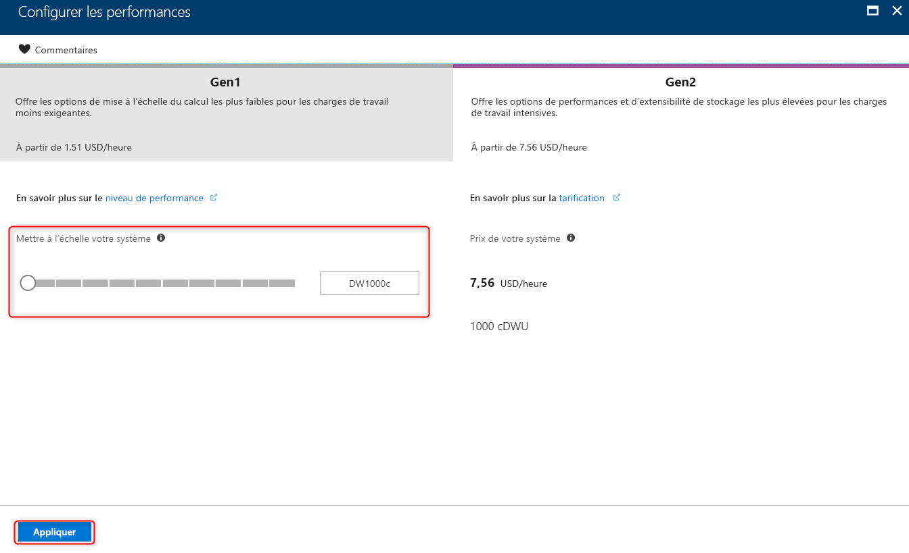
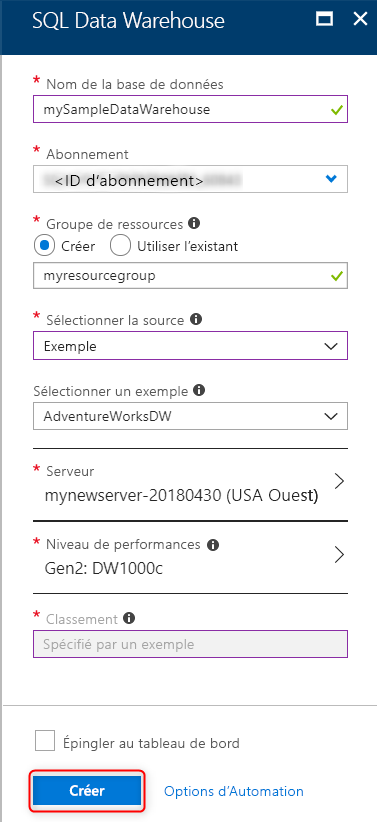
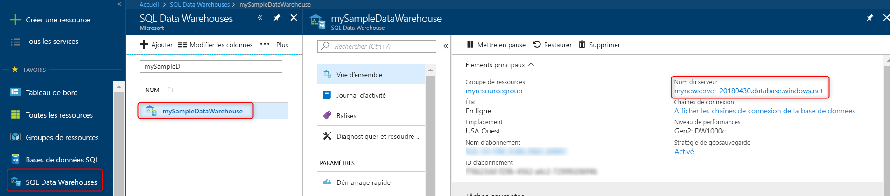
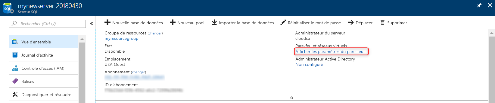
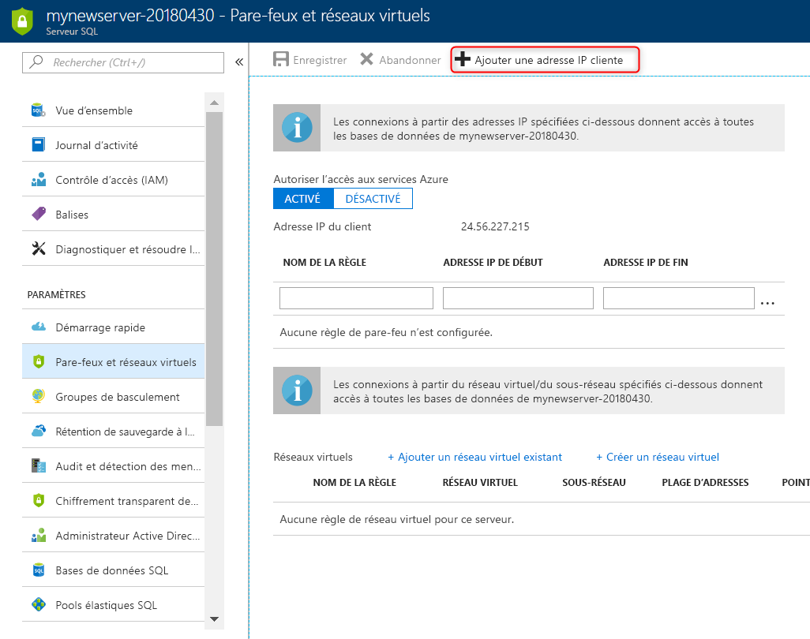
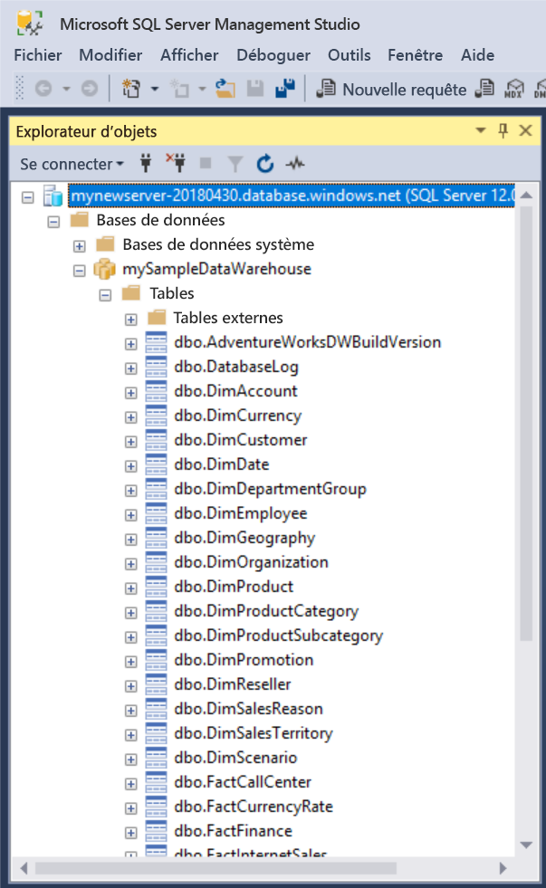
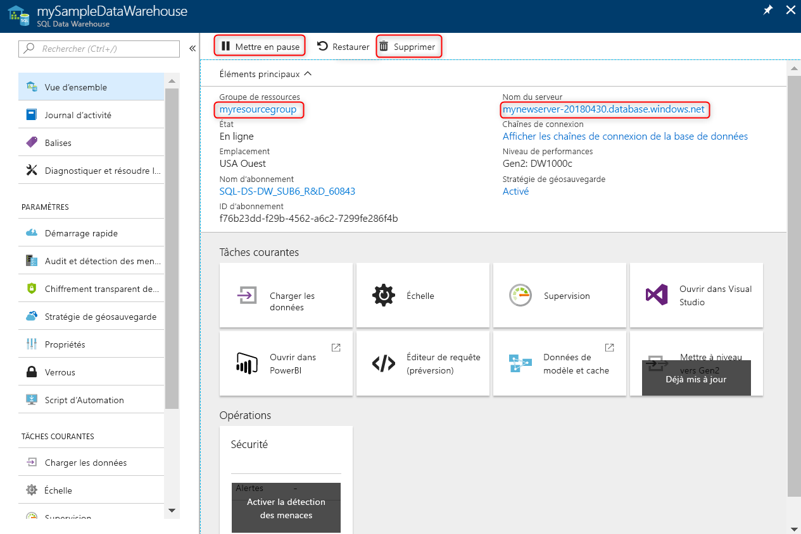

# <a name="quickstart-create-and-query-an-azure-sql-data-warehouse-in-the-azure-portal"></a>Démarrage rapide : Créer et interroger un entrepôt de données SQL Azure dans le portail Azure

Créez et interrogez rapidement un entrepôt SQL Azure dans le portail Azure.

Si vous n’avez pas d’abonnement Azure, créez un compte [gratuit](https://azure.microsoft.com/free/) avant de commencer.

> [!NOTE]
> La création d’un entrepôt SQL Data Warehouse peut entraîner un nouveau service facturable. Pour en savoir plus, voir [SQL Data Warehouse - Tarification](https://azure.microsoft.com/pricing/details/sql-data-warehouse/).

## <a name="before-you-begin"></a>Avant de commencer

Téléchargez et installez la dernière version de [SQL Server Management Studio](/sql/ssms/download-sql-server-management-studio-ssms) (SSMS).

## <a name="sign-in-to-the-azure-portal"></a>Connectez-vous au portail Azure.

Connectez-vous au [portail Azure](https://portal.azure.com/).

## <a name="create-a-data-warehouse"></a>Créer un entrepôt de données

Un entrepôt Azure SQL Data Warehouse est créé avec un ensemble défini de [ressources de calcul](memory-concurrency-limits.md). La base de données est créée dans un [groupe de ressources Azure](../azure-resource-manager/management/overview.md) et dans un [serveur logique Azure SQL](../sql-database/sql-database-logical-servers.md). 

Suivez ces étapes pour créer un entrepôt de données SQL qui contient l’exemple de base de données AdventureWorksDW. 

1. Cliquez sur **Créer une ressource** en haut à gauche du portail Azure.

2. Sélectionnez **Bases de données** dans la page **Nouveau** et sélectionnez **SQL Data Warehouse** sous **Sélection** dans la page **Nouveau**.

    

3. Remplissez le formulaire SQL Data Warehouse avec les informations suivantes :

    | Paramètre | Valeur suggérée | Description |
    | :------ | :-------------- | :---------- |
    | **Abonnement** | Votre abonnement | Pour plus d’informations sur vos abonnements, consultez [Abonnements](https://account.windowsazure.com/Subscriptions). |
    | **Groupe de ressources** | myResourceGroup | Pour les noms de groupe de ressources valides, consultez [Naming conventions](/azure/architecture/best-practices/resource-naming) (Conventions d’affectation de nom). |
    | **Nom de l’entrepôt de données** | mySampleDataWarehouse | Pour les noms de base de données valides, consultez [Database Identifiers](/sql/relational-databases/databases/database-identifiers) (Identificateurs de base de données). Notez qu’un entrepôt de données est un type de base de données.|
    ||||

    

4. Sélectionnez un **serveur** existant ou cliquez sur **Créer nouveau** pour créer et configurer un nouveau serveur pour votre nouvelle base de données. Remplissez le **formulaire de nouveau serveur** avec les informations suivantes : 

    | Paramètre | Valeur suggérée | Description |
    | :------ | :-------------- | :---------- |
    | **Nom du serveur** | Nom globalement unique | Pour les noms de serveur valides, consultez [Naming conventions](/azure/architecture/best-practices/resource-naming) (Conventions d’affectation de nom). |
    | **Connexion d’administrateur du serveur** | Nom valide | Pour les noms de connexion valides, consultez [Database Identifiers](https://docs.microsoft.com/sql/relational-databases/databases/database-identifiers) (Identificateurs de base de données).|
    | **Mot de passe** | Mot de passe valide | Votre mot de passe doit comporter au moins 8 caractères et contenir des caractères appartenant à trois des catégories suivantes : majuscules, minuscules, chiffres et caractères non alphanumériques. |
    | **Lieu** | Emplacement valide | Pour plus d’informations sur les régions, consultez [Régions Azure](https://azure.microsoft.com/regions/). |
    ||||

    

5. Cliquez sur **Sélectionner**.

6. Cliquez sur **Niveau de performances** pour spécifier la configuration des performances de l’entrepôt de données.

7. Sélectionnez **Gen2** pour ce tutoriel. Par défaut, le curseur est défini sur **DW1000c**. Déplacez-le vers le haut et le bas pour voir son fonctionnement. 

    

8. Cliquez sur **Appliquer**.

9. Maintenant que vous avez renseigné l’onglet Informations de base du formulaire SQL Data Warehouse, cliquez sur **Vérifier + créer** pour provisionner la base de données. Le provisionnement prend quelques minutes.

    

10. Dans la barre d’outils, cliquez sur **Notifications** pour surveiller le processus de déploiement.
    
     

## <a name="create-a-server-level-firewall-rule"></a>Créer une règle de pare-feu au niveau du serveur

Le service SQL Data Warehouse crée un pare-feu au niveau du serveur. Ce pare-feu empêche les outils et les applications externes de se connecter au serveur ou aux bases de données sur le serveur. Pour activer la connectivité, vous pouvez ajouter des règles de pare-feu qui activent la connectivité pour des adresses IP spécifiques. Suivez ces étapes pour créer une [règle de pare-feu au niveau du serveur](../sql-database/sql-database-firewall-configure.md) pour l’adresse IP de votre client.

> [!NOTE]
> SQL Data Warehouse communique sur le port 1433. Si vous essayez de vous connecter à partir d’un réseau d’entreprise, le trafic sortant sur le port 1433 peut être bloqué par le pare-feu de votre réseau. Dans ce cas, vous ne pouvez pas vous connecter à votre serveur Azure SQL Database, sauf si votre service informatique ouvre le port 1433.

1. Lorsque le déploiement est terminé, sélectionnez **Tous les services** dans le menu de gauche. Choisissez **Bases de données**, sélectionnez l’étoile en regard de **Entrepôts de données SQL Data Warehouse** pour ajouter des entrepôts de données SQL à vos favoris.
1. Sélectionnez **Entrepôts de données SQL** dans le menu de gauche, puis cliquez sur **mySampleDataWarehouse** dans la page **Entrepôts de données SQL**. La page de présentation de votre base de données s’ouvre, elle affiche le nom de serveur complet (tel que **mynewserver-20180430.database.windows.net**) et fournit des options pour poursuivre la configuration.
1. Copiez le nom complet du serveur pour vous connecter à votre serveur et à ses bases de données dans ce guide de démarrage rapide et les suivants. Pour ouvrir les paramètres du serveur, cliquez sur le nom du serveur.

   

1. Cliquez sur **Afficher les paramètres de pare-feu**.

   

1. La page **Paramètres de pare-feu** du serveur SQL Database s’ouvre.

   

1. Pour ajouter votre adresse IP actuelle à une nouvelle règle de pare-feu, cliquez sur **Ajouter une adresse IP cliente** dans la barre d’outils. Une règle de pare-feu peut ouvrir le port 1433 pour une seule adresse IP ou une plage d’adresses IP.

1. Cliquez sur **Enregistrer**. Une règle de pare-feu au niveau du serveur est créée pour votre adresse IP actuelle et ouvre le port 1433 sur le serveur logique.

1. Cliquez sur **OK**, puis fermez la page **Paramètres de pare-feu**.

Vous pouvez maintenant vous connecter au serveur SQL et à ses entrepôts de données à l’aide de cette adresse IP. La connexion fonctionne à partir de SQL Server Management Studio ou d’un autre outil de votre choix. Quand vous vous connectez, utilisez le compte ServerAdmin que vous avez créé précédemment.

> [!IMPORTANT]
> Par défaut, l’accès via le pare-feu SQL Database est activé pour tous les services Azure. Cliquez sur **OFF** dans cette page, puis sur **Enregistrer** pour désactiver le pare-feu pour tous les services Azure.

## <a name="get-the-fully-qualified-server-name"></a>Obtenir le nom complet du serveur

Obtenez le nom complet de votre serveur SQL dans le portail Azure. Vous utiliserez le nom complet du serveur par la suite pour vous connecter au serveur.

1. Connectez-vous au [portail Azure](https://portal.azure.com/).
2. Sélectionnez **Entrepôts de données SQL Data Warehouse** dans le menu de gauche, puis cliquez sur votre entrepôt de données dans la page **Entrepôts de données SQL Data Warehouse**.
3. Dans le volet **Essentials** de la page du portail Azure pour votre base de données, recherchez et copiez le **nom du serveur**. Dans cet exemple, le nom complet est mynewserver-20180430.database.windows.net.

    

## <a name="connect-to-the-server-as-server-admin"></a>Se connecter au serveur comme administrateur du serveur

Cette section utilise [SQL Server Management Studio](/sql/ssms/download-sql-server-management-studio-ssms) (SSMS) pour établir une connexion à votre serveur Azure SQL.

1. Ouvrez SQL Server Management Studio.

2. Dans la fenêtre **Se connecter au serveur**, entrez les valeurs suivantes :

   | Paramètre | Valeur suggérée | Description |
   | :------ | :-------------- | :---------- |
   | Type de serveur | Moteur de base de données | Cette valeur est obligatoire |
   | Nom du serveur | Nom complet du serveur | Voici un exemple : **mynewserver-20180430.database.windows.net**. |
   | Authentication | l’authentification SQL Server | L’authentification SQL est le seul type d’authentification configuré dans ce didacticiel. |
   | Connexion | Compte d’administrateur de serveur | Compte que vous avez spécifié lorsque vous avez créé le serveur. |
   | Mot de passe | Mot de passe de votre compte d’administrateur de serveur | Mot de passe que vous avez spécifié quand vous avez créé le serveur. |
   ||||

    

3. Cliquez sur **Connecter**. La fenêtre Explorateur d’objets s’ouvre dans SSMS. 

4. Dans l’Explorateur d’objets, développez **Bases de données**. Ensuite, développez **mySampleDatabase** pour afficher les objets dans votre nouvelle base de données.

     

## <a name="run-some-queries"></a>Exécuter des requêtes

SQL Data Warehouse utilise T-SQL comme langage de requête. Pour ouvrir une fenêtre de requête et exécuter des requêtes T-SQL, effectuez les étapes suivantes :

1. Cliquez avec le bouton droit sur **mySampleDataWarehouse** et sélectionnez **Nouvelle requête**. Une nouvelle fenêtre de requête s’ouvre.
2. Dans la fenêtre de requête, entrez la commande suivante pour afficher la liste des bases de données.

    ```sql
    SELECT * FROM sys.databases
    ```

3. Cliquez sur **Exécuter**. Les résultats de requête montrent deux bases de données : **master** et **mySampleDataWarehouse**.

    

4. Pour examiner des données, utilisez la commande suivante pour afficher le nombre de clients dont le nom de famille est Adams et qui ont trois enfants au foyer. Les résultats donnent six clients. 

    ```sql
    SELECT LastName, FirstName FROM dbo.dimCustomer
    WHERE LastName = 'Adams' AND NumberChildrenAtHome = 3;
    ```

    

## <a name="clean-up-resources"></a>Nettoyer les ressources

Vous êtes facturé pour les Data Warehouse Units et les données stockées dans votre entrepôt de données. Ces ressources de calcul et de stockage sont facturées séparément.

- Si vous voulez conserver les données dans le stockage, vous pouvez suspendre le calcul quand vous n’utilisez pas l’entrepôt de données. Quand vous suspendez le calcul, vous êtes facturé uniquement pour le stockage des données. Vous pouvez reprendre le calcul chaque fois que vous êtes prêt à travailler avec les données.
- Si vous voulez éviter des frais futurs, vous pouvez supprimer l’entrepôt de données.

Suivez ces étapes pour nettoyer les ressources dont vous n’avez plus besoin.

1. Connectez-vous au [portail Azure](https://portal.azure.com) et cliquez sur votre entrepôt de données.

    

2. Pour suspendre le calcul, cliquez sur le bouton **Suspendre**. Quand l’entrepôt de données est suspendu, un bouton **Reprendre** est visible. Pour reprendre le calcul, cliquez sur **Reprendre**.

3. Pour supprimer l’entrepôt de données afin de ne pas être facturé pour le calcul ou le stockage, cliquez sur **Supprimer**.

4. Pour supprimer le serveur SQL que vous avez créé, cliquez sur **mynewserver-20180430.database.windows.net** dans l’image précédente, puis sur **Supprimer**. N’oubliez pas que la suppression du serveur supprime également toutes les bases de données qui lui sont attribuées.

5. Pour supprimer le groupe de ressources, cliquez sur **myResourceGroup**, puis sur **Supprimer le groupe de ressources**.

## <a name="next-steps"></a>Étapes suivantes

Vous avez créé un entrepôt de données, créé une règle de pare-feu, vous vous êtes connecté à votre entrepôt de données et vous avez exécuté quelques requêtes. Pour en savoir plus sur Azure SQL Data Warehouse, continuez avec le didacticiel de chargement des données.

> [!div class="nextstepaction"]
> [Charger des données dans un entrepôt SQL Data Warehouse](load-data-from-azure-blob-storage-using-polybase.md)
