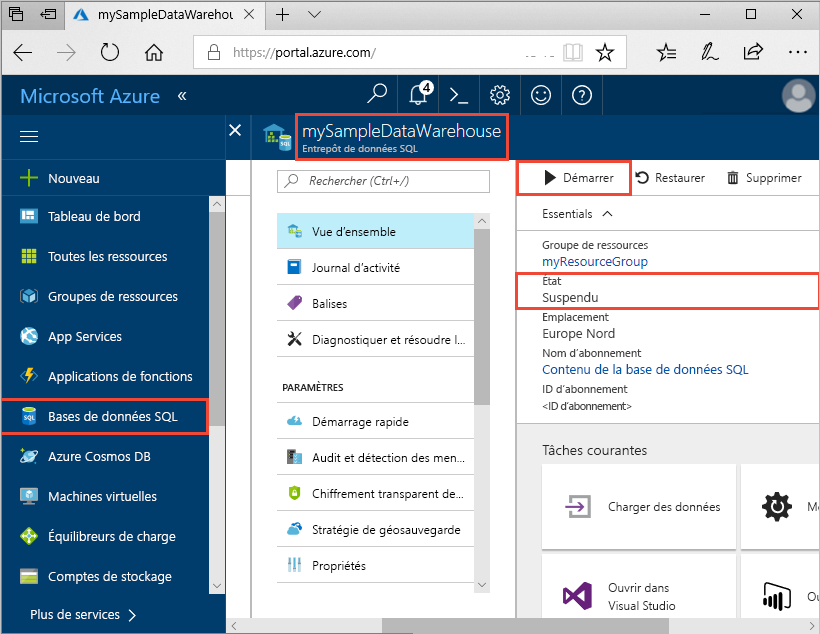
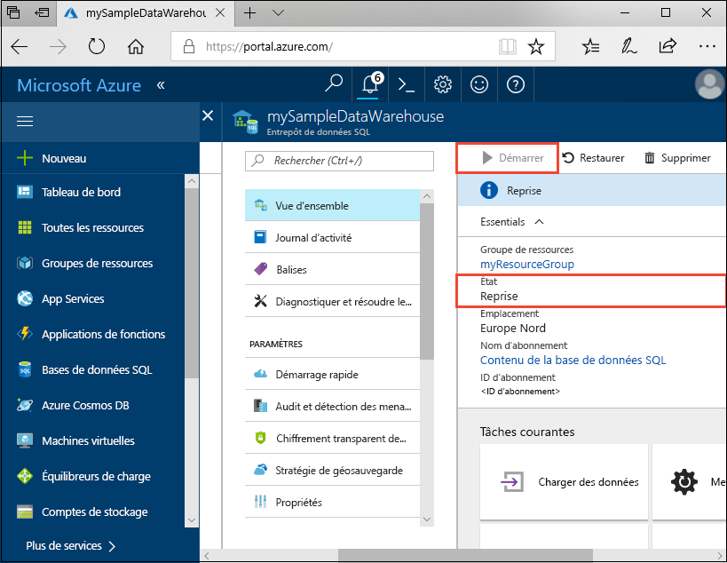

# Démarrage rapide : Mettre en pause et reprendre le calcul dans le pool SQL Azure Synapse Analytics dans le portail Azure

Utilisez le portail Azure afin de mettre en pause le calcul pour le pool SQL en vue de réduire les coûts. [Reprenez le calcul](sql-data-warehouse-manage-compute-overview.md) quand vous êtes prêt à utiliser l’entrepôt de données.

Si vous n’avez pas d’abonnement Azure, créez un compte [gratuit](https://azure.microsoft.com/free/) avant de commencer.

## Connectez-vous au portail Azure.

Connectez-vous au [portail Azure](https://portal.azure.com/).

## Avant de commencer

Utilisez [Créer et connecter - Portail](create-data-warehouse-portal.md) pour créer un pool SQL nommé **mySampleDataWarehouse**. 

## Mise en pause du calcul

Pour réduire les coûts, vous pouvez interrompre et reprendre des ressources de calcul à la demande. Par exemple, si vous n’utilisez pas la base de données pendant la nuit et les week-ends, vous pouvez la mettre en pause et la reprendre pendant la journée. Aucune ressource de calcul ne vous sera facturée tant que la base de données restera en pause. Le stockage, en revanche, continuera à occasionner des frais. 

Suivez ces étapes pour mettre en pause le pool SQL.

1. Connectez-vous au [portail Azure](https://portal.azure.com/).
2. Cliquez sur **Azure Synapse Analytics (anciennement SQL DW)** dans la page de navigation de gauche du portail Azure.
2. Sélectionnez **mySampleDataWarehouse** dans la page **Azure Synapse Analytics (anciennement SQL DW)** pour ouvrir le pool SQL. 
3. Sur la page **mySampleDataWarehouse**, **l’État** est **En ligne**.

    

4. Pour mettre en pause un pool SQL, cliquez sur le bouton **Suspendre**. 
5. Une question de confirmation apparaît, vous demandant si vous souhaitez continuer. Cliquez sur **Oui**.
6. Après quelques instants, **l’État** passe à **Suspension en cours**.

    

7. Une fois l’opération de mise en pause terminée, l’état est **Suspendu** et la case d’option est **Reprendre**.
8. Les ressources de calcul du pool SQL sont maintenant hors ligne. Le calcul ne vous sera pas facturé tant que le service n’aura pas repris.

    

## Reprise du calcul

Suivez ces étapes pour la reprise du pool SQL.

1. Cliquez sur **Azure Synapse Analytics (anciennement SQL DW)** dans la page de gauche du portail Azure.
2. Sélectionnez **mySampleDataWarehouse** dans la page **Azure Synapse Analytics (anciennement SQL DW)** pour ouvrir la page du pool SQL. 
3. Sur la page **mySampleDataWarehouse**, **l’État** est **Suspendu**.

    

4. Pour la reprise du pool SQL, cliquez sur **Reprendre**. 
5. Une question de confirmation apparaît, vous demandant si vous souhaitez le démarrer. Cliquez sur **Oui**.
6. **L’État** passe à **Reprise en cours**.

    

7. Une fois le pool SQL de nouveau en ligne, l’état est **En ligne** et la case d’option est **Suspendre**.
8. Les ressources de calcul du pool SQL sont à présent en ligne. Vous pouvez utiliser le service. Les frais de calcul ont repris.

    

## Nettoyer les ressources

Les unités Data Warehouse Unit et les données stockées dans votre entrepôt de données vous sont facturées. Ces ressources de calcul et de stockage sont facturées séparément. 

- Si vous souhaitez conserver les données dans le stockage, mettez en pause le calcul.
- Si vous voulez éviter des frais à venir, vous pouvez supprimer le pool SQL. 

Suivez ces étapes pour nettoyer les ressources selon vos besoins.

1. Connectez-vous au [portail Azure](https://portal.azure.com), puis cliquez sur votre pool SQL.

    

1. Pour mettre en pause le calcul, cliquez sur le bouton **Suspendre**. 

2. Pour supprimer le pool SQL afin de ne pas être facturé pour le calcul ou le stockage, cliquez sur **Supprimer**.

3. Pour supprimer le serveur SQL que vous avez créé, cliquez sur **sqlpoolservername.database.windows.net**, puis sur **Supprimer**.  N’oubliez pas que la suppression du serveur supprime également toutes les bases de données qui lui sont attribuées.

4. Pour supprimer le groupe de ressources, cliquez sur **myResourceGroup**, puis sur **Supprimer le groupe de ressources**.

## Étapes suivantes

Vous venez de mettre en pause et de reprendre le calcul pour votre pool SQL. Pour connaître les étapes suivantes, passez au tutoriel sur le chargement des données.

> [!div class="nextstepaction"]
> [Charger des données dans un pool SQL](load-data-from-azure-blob-storage-using-polybase.md)
