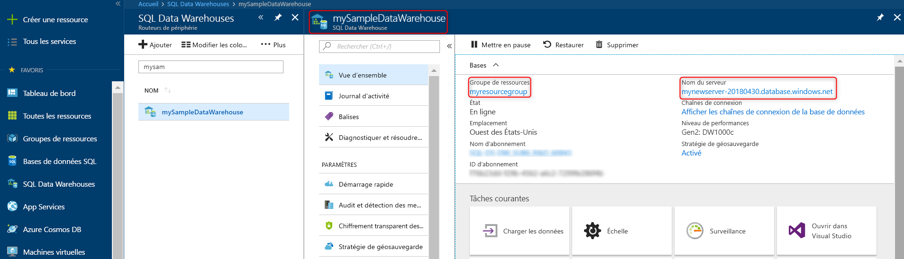

# <a name="quickstart-pause-and-resume-compute-in-azure-synapse-analytics-sql-pool-with-azure-powershell"></a>Démarrage rapide : Suspendre et reprendre le calcul dans le pool SQL Azure Synapse Analytics avec Azure PowerShell

Utilisez Azure PowerShell afin de mettre en pause le calcul pour le pool SQL en vue de réduire les coûts. [Reprenez le calcul](sql-data-warehouse-manage-compute-overview.md) quand vous êtes prêt à utiliser l’entrepôt de données.

Si vous n’avez pas d’abonnement Azure, créez un compte [gratuit](https://azure.microsoft.com/free/) avant de commencer.

## <a name="before-you-begin"></a>Avant de commencer

[!INCLUDE [updated-for-az](../../includes/updated-for-az.md)]

Ce guide de démarrage rapide part du principe que vous avez déjà un pool SQL que vous pouvez mettre en pause et reprendre. Si vous devez en créer un, vous pouvez utiliser [Créer et connecter - Portail](create-data-warehouse-portal.md) pour créer un pool SQL nommé **mySampleDataWarehouse**.

## <a name="log-in-to-azure"></a>Connexion à Azure

Connectez-vous à votre abonnement Azure avec la commande [Connect-AzAccount](/powershell/module/az.accounts/connect-azaccount) et suivez les instructions indiquées à l’écran.

```powershell
Connect-AzAccount
```

Pour voir l’abonnement que vous utilisez, exécutez [Get-AzSubscription](/powershell/module/az.accounts/get-azsubscription).

```powershell
Get-AzSubscription
```

Si vous devez utiliser un autre abonnement que celui par défaut, exécutez [Set-AzContext](/powershell/module/az.accounts/set-azcontext).

```powershell
Set-AzContext -SubscriptionName "MySubscription"
```

## <a name="look-up-data-warehouse-information"></a>Rechercher des informations sur l’entrepôt de données

Recherchez le nom de la base de données, le nom du serveur et le groupe de ressources du pool SQL que vous envisagez de mettre en pause et de reprendre.

Suivez ces étapes pour rechercher des informations de localisation de votre pool SQL.

1. Connectez-vous au [portail Azure](https://portal.azure.com/).
1. Cliquez sur **Azure Synapse Analytics (anciennement SQL DW)** dans la page de gauche du portail Azure.
1. Sélectionnez **mySampleDataWarehouse** dans la page **Azure Synapse Analytics (anciennement SQL DW)** . L’entrepôt de données s’ouvre.

    

1. Notez le nom de l’entrepôt de données, utilisé comme nom de base de données. Notez également le nom du serveur et le groupe de ressources.
1. Utilisez uniquement la première partie du nom du serveur dans les applets de commande PowerShell. Dans l’image précédente, le nom complet du serveur est sqlpoolservername.database.windows.net. Nous utilisons **sqlpoolservername** comme nom de serveur dans l’applet de commande PowerShell.

## <a name="pause-compute"></a>Suspension du calcul

Pour réduire les coûts, vous pouvez interrompre et reprendre des ressources de calcul à la demande. Par exemple, si vous n’utilisez pas la base de données pendant la nuit et les week-ends, vous pouvez la suspendre à ces moments et la reprendre pendant la journée. Aucune ressource de calcul ne vous sera facturée tant que la base de données restera suspendue. Le stockage, en revanche, continue à occasionner des frais.

Pour suspendre une base de données, utilisez la cmdlet [Suspend-AzureRmSqlDatabase](/powershell/module/az.sql/suspend-azsqldatabase). L’exemple suivant suspend un entrepôt de données nommé **mySampleDataWarehouse** hébergé sur un serveur nommé **sqlpoolservername**. Le serveur est un groupe de ressources Azure nommé **myResourceGroup**.


```Powershell
Suspend-AzSqlDatabase –ResourceGroupName "myResourceGroup" `
–ServerName "nsqlpoolservername" –DatabaseName "mySampleDataWarehouse"
```

Une variante, l'exemple suivant récupère la base de données dans l'objet $database. Il canalise ensuite l’objet vers [Suspend-AzSqlDatabase](/powershell/module/az.sql/suspend-azsqldatabase). Les résultats sont stockés dans l'objet resultDatabase. La dernière commande affiche les résultats.

```Powershell
$database = Get-AzSqlDatabase –ResourceGroupName "myResourceGroup" `
–ServerName "sqlpoolservername" –DatabaseName "mySampleDataWarehouse"
$resultDatabase = $database | Suspend-AzSqlDatabase
$resultDatabase
```

## <a name="resume-compute"></a>Reprise du calcul

Pour démarrer une base de données, utilisez la cmdlet [Resume-AzSqlDatabase](/powershell/module/az.sql/resume-azsqldatabase). L’exemple suivant démarre un entrepôt de données nommé **mySampleDataWarehouse** hébergé sur un serveur nommé **sqlpoolservername**. Le serveur est un groupe de ressources Azure nommé **myResourceGroup**.

```Powershell
Resume-AzSqlDatabase –ResourceGroupName "myResourceGroup" `
–ServerName "sqlpoolservername" -DatabaseName "mySampleDataWarehouse"
```

Une variante, l'exemple suivant récupère la base de données dans l'objet $database. Il canalise ensuite l’objet vers [Resume-AzSqlDatabase](/powershell/module/az.sql/resume-azsqldatabase) et stocke les résultats dans $resultDatabase. La dernière commande affiche les résultats.

```Powershell
$database = Get-AzSqlDatabase –ResourceGroupName "myResourceGroup" `
–ServerName "sqlpoolservername" –DatabaseName "mySampleDataWarehouse"
$resultDatabase = $database | Resume-AzSqlDatabase
$resultDatabase
```

## <a name="check-status-of-your-data-warehouse-operation"></a>Vérifiez l’état de votre opération d’entrepôt de données

Pour vérifier l’état de votre entrepôt de données, utilisez l’applet de commande [Get-AzSqlDatabaseActivity](https://docs.microsoft.com/powershell/module/az.sql/Get-AzSqlDatabaseActivity#description).

```Powershell
Get-AzSqlDatabaseActivity -ResourceGroupName "myResourceGroup" -ServerName "sqlpoolservername" -DatabaseName "mySampleDataWarehouse"
```

## <a name="clean-up-resources"></a>Nettoyer les ressources

Vous êtes facturé pour les Data Warehouse Units et les données stockées dans votre entrepôt de données. Ces ressources de calcul et de stockage sont facturées séparément.

- Si vous souhaitez conserver les données dans le stockage, suspendez le calcul.
- Si vous voulez éviter des frais à venir, vous pouvez supprimer le pool SQL.

Suivez ces étapes pour nettoyer les ressources selon vos besoins.

1. Connectez-vous au [portail Azure](https://portal.azure.com), puis cliquez sur votre pool SQL.

    

2. Pour suspendre le calcul, cliquez sur le bouton **Suspendre**. Quand le pool SQL est suspendu, un bouton **Démarrer** est visible.  Pour reprendre le calcul, cliquez sur **Démarrer**.

3. Pour supprimer le pool SQL afin de ne pas être facturé pour le calcul ou le stockage, cliquez sur **Supprimer**.

4. Pour supprimer le serveur SQL que vous avez créé, cliquez sur **sqlpoolservername.database.windows.net**, puis sur **Supprimer**.  N’oubliez pas que la suppression du serveur supprime également toutes les bases de données qui lui sont attribuées.

5. Pour supprimer le groupe de ressources, cliquez sur **myResourceGroup**, puis sur **Supprimer le groupe de ressources**.


## <a name="next-steps"></a>Étapes suivantes

Vous venez de mettre en pause et de reprendre le calcul pour votre pool SQL. Pour en savoir plus sur le pool SQL, passez au tutoriel sur le chargement des données.

> [!div class="nextstepaction"]
> [Charger des données dans un pool SQL](load-data-from-azure-blob-storage-using-polybase.md)
