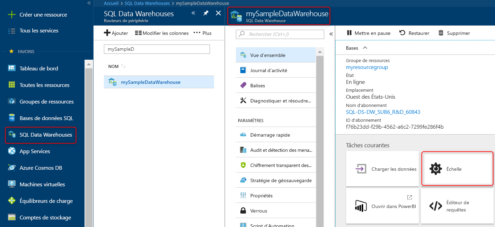
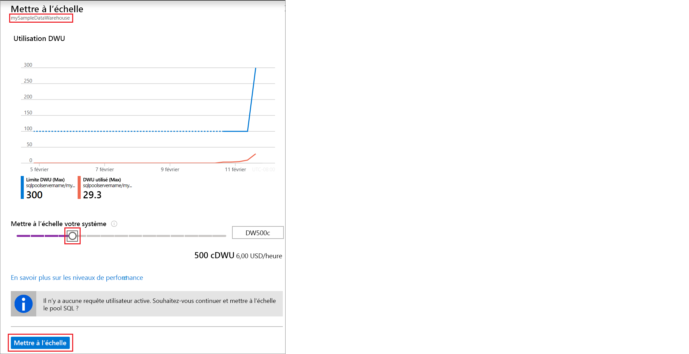

# Démarrage rapide : Mettre à l’échelle le calcul dans Azure SQL Data Warehouse sur le Portail Azure

Mettez à l’échelle le calcul dans Azure SQL Data Warehouse sur le Portail Azure. [Augmentez le calcul](sql-data-warehouse-manage-compute-overview.md) pour améliorer les performances, ou réduisez-le pour diminuer les coûts. 

Si vous n’avez pas d’abonnement Azure, créez un compte [gratuit](https://azure.microsoft.com/free/) avant de commencer.

## Connectez-vous au portail Azure.

Connectez-vous au [Portail Azure](https://portal.azure.com/).

## Avant de commencer

Vous pouvez mettre à l’échelle un entrepôt de données que vous possédez déjà, ou utiliser la section [Démarrage rapide : Créer et connecter – Portail](create-data-warehouse-portal.md) pour créer un entrepôt de données nommé **mySampleDataWarehouse**.  Ce guide de démarrage rapide met à l’échelle **mySampleDataWarehouse**.

## Mise à l’échelle des ressources de calcul

Dans SQL Data Warehouse, vous pouvez augmenter ou réduire les ressources de calcul en ajustant les unités Data Warehouse Unit. Le guide [Créer et connecter – Portail](create-data-warehouse-portal.md) a permis de créer **mySampleDataWarehouse** et de l’initialiser avec 400 DWU. Les étapes suivantes ajustent les DWU de **mySampleDataWarehouse**.

Pour modifier les unités Data Warehouse Unit :

1. Cliquez sur **Entrepôts de données SQL Data Warehouse** sur la page de gauche du portail Azure.
2. Sélectionnez **mySampleDataWarehouse** sur la page **Entrepôts de données SQL Data Warehouse**. L’entrepôt de données s’ouvre.
3. Cliquez sur **Scale**.

    

2. Dans le panneau Mettre à l’échelle, déplacez le curseur vers la gauche ou vers la droite pour modifier le paramètre DWU.

    

3. Cliquez sur **Enregistrer**. Un message de confirmation s’affiche. Cliquez sur **Oui** pour confirmer ou sur **Non** pour annuler.

    

## Étapes suivantes
Vous savez maintenant mettre à l’échelle le calcul pour votre entrepôt de données. Pour en savoir plus sur Azure SQL Data Warehouse, continuez avec le didacticiel de chargement des données.

> [!div class="nextstepaction"]
>[Charger des données dans un entrepôt SQL Data Warehouse](load-data-from-azure-blob-storage-using-polybase.md)
