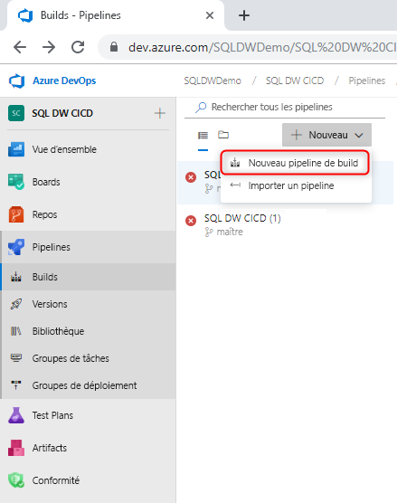
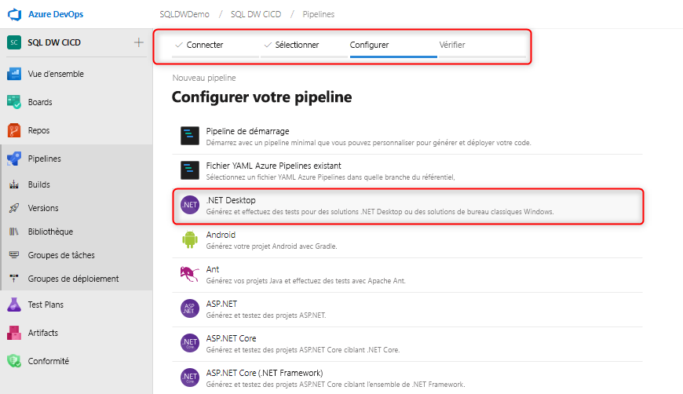
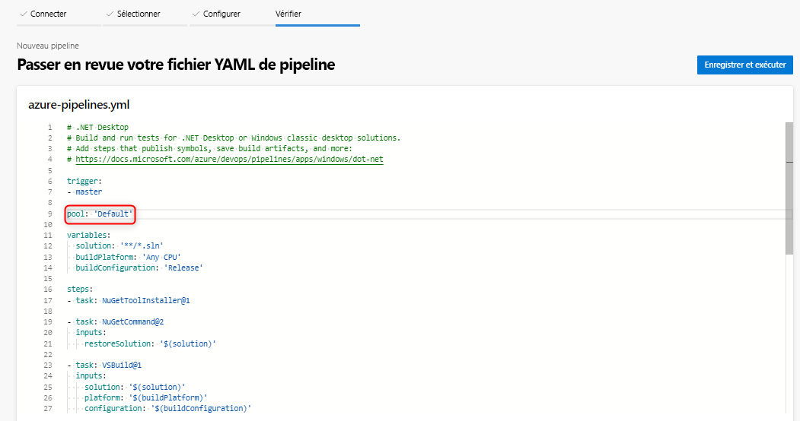
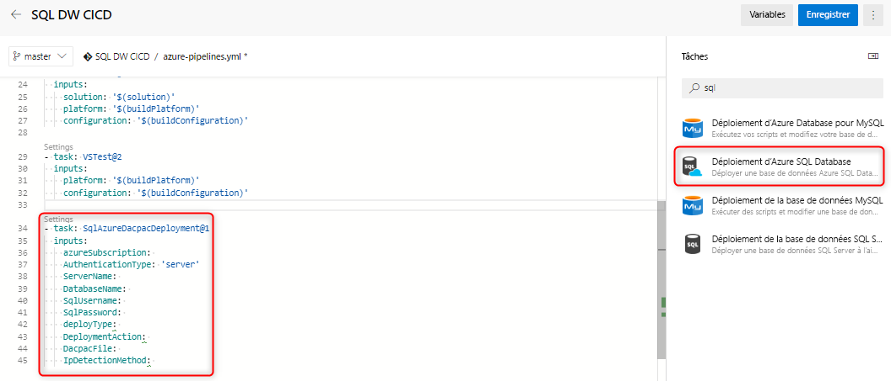
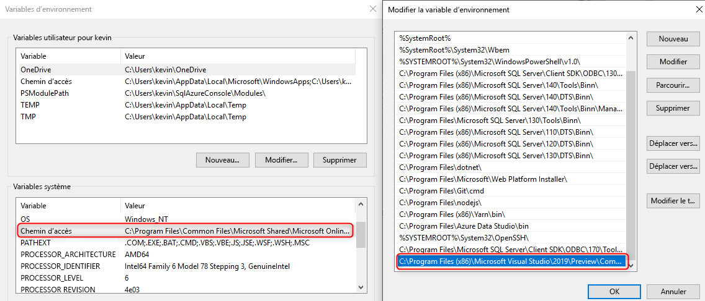

# Intégration et déploiement continus pour Azure SQL Data Warehouse

Ce tutoriel simple décrit comment intégrer votre projet de base de données SQL Server Data Tools (SSDT) à Azure DevOps et comment tirer parti d’Azure Pipelines pour configurer l’intégration et le déploiement continus. Ce tutoriel constitue la seconde étape de la création de votre pipeline d’intégration et de déploiement continus avec SQL Data Warehouse. 

## Avant de commencer

- Parcourez le [tutoriel sur l’intégration du contrôle de code source](https://docs.microsoft.com/azure/sql-data-warehouse/sql-data-warehouse-source-control-integration)

- Configurer Azure DevOps et s’y connecter

## Intégration continue avec la build Visual Studio

1. Accédez à Azure Pipelines et créez un pipeline de build

      

2. Sélectionnez votre référentiel de code source (Azure Repos Git) et sélectionnez le modèle d’application de bureau .NET

       

3. Modifiez votre fichier YAML pour utiliser le pool approprié de votre agent. Votre fichier YAML doit ressembler à ce qui suit :

      

À ce stade, vous disposez d’un environnement simple dans lequel tout enregistrement dans la branche principale de votre référentiel de contrôle de code source doit déclencher automatiquement une build Visual Studio réussie de votre projet de base de données. Vérifiez que l’automatisation fonctionne de bout en bout en apportant une modification dans votre projet de base de données locale et en enregistrant cette modification dans votre branche principale.

## Déploiement continu avec la tâche de déploiement Azure SQL Data Warehouse (ou Database)

1. Ajoutez une nouvelle tâche à l’aide de la [tâche de déploiement Azure SQL Database](https://docs.microsoft.com/azure/devops/pipelines/tasks/deploy/sql-azure-dacpac-deployment?view=azure-devops) et renseignez les champs obligatoires pour vous connecter à votre entrepôt de données cible. Pendant l’exécution de cette tâche, le DACPAC généré à partir du processus de génération précédent est déployé dans l’entrepôt de données cible. Vous pouvez également utiliser la [tâche de déploiement Azure SQL Data Warehouse](https://marketplace.visualstudio.com/items?itemName=ms-sql-dw.SQLDWDeployment). 

      

2. Si vous utilisez un agent autohébergé, veillez à définir votre variable d’environnement pour utiliser le bon fichier SqlPackage.exe pour SQL Data Warehouse. Le chemin doit être similaire à celui-ci :

      

   C:\Program Files (x86)\Microsoft Visual Studio\2019\Preview\Common7\IDE\Extensions\Microsoft\SQLDB\DAC\150  

   Exécutez et validez votre pipeline. Vous pouvez apporter des modifications localement et les enregistrer dans votre contrôle de code source qui devraient générer une build et un déploiement automatiques.

## Étapes suivantes

- Explorer la section [Architecture Azure SQL Data Warehouse](/azure/sql-data-warehouse/massively-parallel-processing-mpp-architecture)
- [Créer rapidement un entrepôt de données SQL Data Warehouse][create a SQL Data Warehouse]
- [Charger des exemples de données][load sample data]
- Explorer les [vidéos](/azure/sql-data-warehouse/sql-data-warehouse-videos)

<!--Image references-->

[1]: ./media/sql-data-warehouse-overview-what-is/dwarchitecture.png

<!--Article references-->
[Create a support ticket]: ./sql-data-warehouse-get-started-create-support-ticket.md
[load sample data]: ./sql-data-warehouse-load-sample-databases.md
[create a SQL Data Warehouse]: ./sql-data-warehouse-get-started-provision.md
[Migration documentation]: ./sql-data-warehouse-overview-migrate.md
[SQL Data Warehouse solution partners]: ./sql-data-warehouse-partner-business-intelligence.md
[Integrated tools overview]: ./sql-data-warehouse-overview-integrate.md
[Backup and restore overview]: ./sql-data-warehouse-restore-database-overview.md
[Azure glossary]: ../azure-glossary-cloud-terminology.md

<!--MSDN references-->

<!--Other Web references-->
[Blogs]: https://azure.microsoft.com/blog/tag/azure-sql-data-warehouse/
[Customer Advisory Team blogs]: https://blogs.msdn.microsoft.com/sqlcat/tag/sql-dw/
[Feature requests]: https://feedback.azure.com/forums/307516-sql-data-warehouse
[MSDN forum]: https://social.msdn.microsoft.com/Forums/azure/home?forum=AzureSQLDataWarehouse
[Stack Overflow forum]: https://stackoverflow.com/questions/tagged/azure-sqldw
[Twitter]: https://twitter.com/hashtag/SQLDW
[Videos]: https://azure.microsoft.com/documentation/videos/index/?services=sql-data-warehouse
[SLA for SQL Data Warehouse]: https://azure.microsoft.com/support/legal/sla/sql-data-warehouse/v1_0/
[Volume Licensing]: https://www.microsoftvolumelicensing.com/DocumentSearch.aspx?Mode=3&DocumentTypeId=37
[Service Level Agreements]: https://azure.microsoft.com/support/legal/sla/
