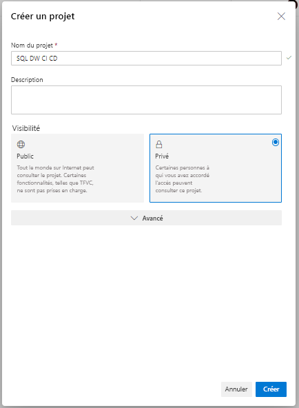
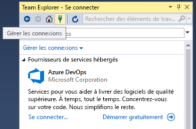
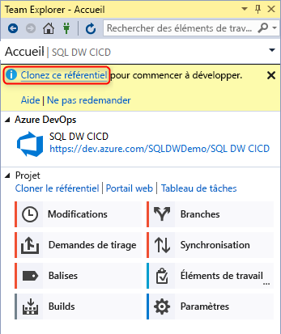
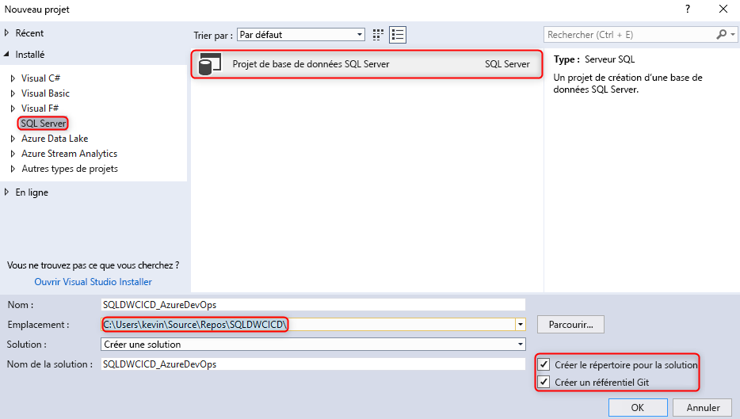
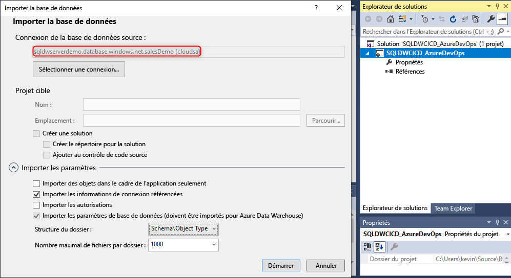
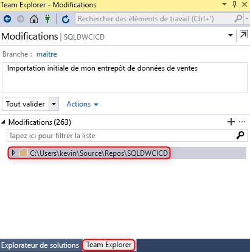
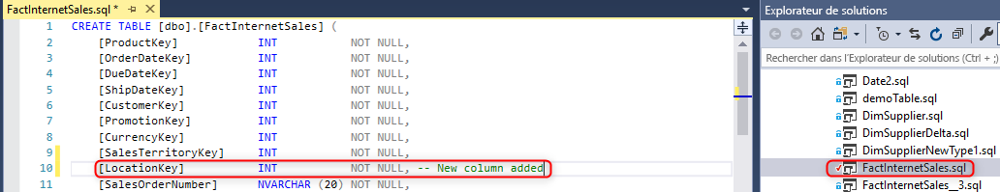
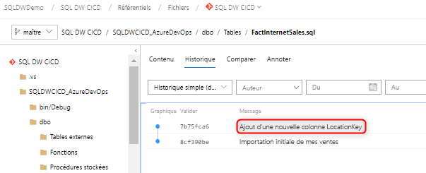

# Intégration du contrôle de code source pour Azure SQL Data Warehouse

Ce tutoriel explique comment intégrer votre projet de base de données SSDT (SQL Server Data Tools) au contrôle de code source.  L’intégration du contrôle de code source est la première étape de la création de votre pipeline d’intégration et de déploiement continus avec SQL Data Warehouse. 

## Avant de commencer

- Inscrivez-vous pour créer une [organisation Azure DevOps](https://azure.microsoft.com/services/devops/).
- Parcourez le tutoriel [Créer et connecter](https://docs.microsoft.com/azure/sql-data-warehouse/create-data-warehouse-portal).
-  [Installez Visual Studio 2019](https://visualstudio.microsoft.com/vs/older-downloads/). 

## Configurer Azure DevOps et s’y connecter

1. Dans votre organisation Azure DevOps, créez un projet destiné à héberger votre projet de base de données SSDT par le biais d’un dépôt Azure.

   

2. Ouvrez Visual Studio et connectez-vous à votre organisation et à votre projet Azure DevOps à l’étape 1 en sélectionnant « Gérer des connexions ».

   

   

3. Clonez votre dépôt Azure à partir de votre projet sur votre ordinateur local.

   

## Créer et connecter votre projet

1. Dans Visual Studio, créez un projet de base de données SQL Server avec un répertoire et un dépôt Git local dans votre **dépôt cloné local**.

     

2. Cliquez avec le bouton droit sur votre projet SQL vide et importez votre entrepôt de données dans le projet de base de données.

     

3. Dans Team Explorer dans Visual Studio, validez tous les changements apportés à votre dépôt Git local. 

     

4. Les changements étant validés localement dans le dépôt cloné, synchronisez-les et envoyez-les (push) à votre dépôt Azure dans votre projet Azure DevOps.

    - Préproduction")

   ")  

## Validation

1. Vérifiez que les changements ont été envoyés (push) à votre dépôt Azure en mettant à jour une colonne de table dans votre projet de base de données à partir de Visual Studio SQL Server Data Tools (SSDT).

   

2. Validez le changement et envoyez-la (push) depuis votre dépôt local vers votre dépôt Azure.

    des modifications")

3. Vérifiez que le changement a été envoyé (push) dans votre dépôt Azure.

   

4. (**Facultatif**) Utilisez la comparaison de schémas et mettez à jour les changements apportés à votre entrepôt de données cible à l’aide de SSDT pour vous assurer que les définitions d’objets dans votre dépôt Azure et le dépôt local reflètent votre entrepôt de données.

## Étapes suivantes

- [Développement pour Azure SQL Data Warehouse](sql-data-warehouse-overview-develop.md)
