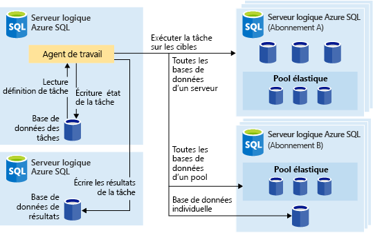
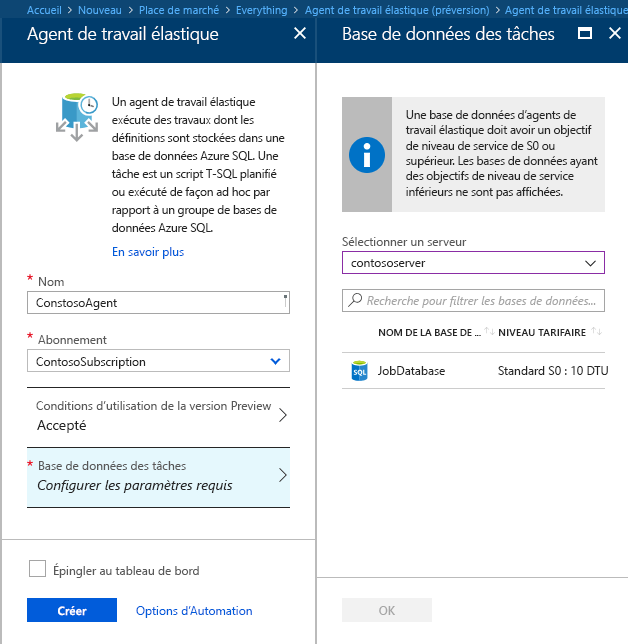
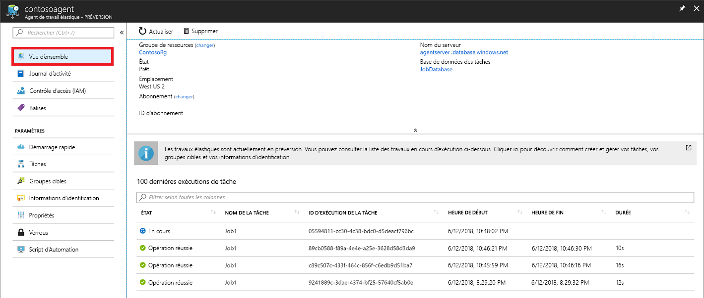

# <a name="manage-groups-of-databases-with-elastic-database-jobs"></a>Gérer des groupes de bases de données avec des travaux de base de données élastique

Les **travaux de base de données élastiques** permettent d’exécuter un ou plusieurs scripts T-SQL en parallèle sur un grand nombre de bases de données, selon une planification ou à la demande.

**Exécutez des travaux sur n’importe quelle combinaison de bases de données** : une ou plusieurs bases de données individuelles, toutes les bases de données d’un serveur, toutes les bases de données dans un pool élastique ou une carte de partitions, avec en plus la possibilité d’inclure ou d’exclure des bases de données spécifiques. **Les travaux peuvent s’exécuter sur plusieurs serveurs, plusieurs pools et même sur des bases de données dans différents abonnements.** Les serveurs et les pools sont énumérés dynamiquement au moment de l’exécution, ce qui permet aux travaux de s’exécuter sur toutes les bases de données présentes dans le groupe cible au moment de l’exécution.

L’image suivante montre un agent de travail qui exécute des travaux sur les différents types de groupes cibles :




## <a name="why-use-elastic-jobs"></a>Pourquoi utiliser des travaux élastiques ?

### <a name="manage-many-databases"></a>Gérer plusieurs bases de données

- Planifier l’exécution de tâches d’administration (tous les jours de la semaine, en dehors des heures de bureau, etc.).
- Déployer des changements de schéma, la gestion des informations d’identification, la collecte des données de performances ou la collecte des données de télémétrie du locataire (client). Mettre à jour les données de référence (informations communes à toutes les bases de données).
- Recréer des indexes pour améliorer les performances d’une requête. Configurer des travaux de manière à ce qu’ils s’exécutent sur une collection de bases de données de façon récurrente, par exemple pendant les heures creuses.
- Collecter les résultats de la requête à partir d'un ensemble de bases de données dans une table centrale sur une base continue. Les requêtes de performances peuvent être exécutées en permanence et configurées pour déclencher des tâches supplémentaires à exécuter.

### <a name="collect-data-for-reporting"></a>Collecter des données de création de rapports

- Agréger des données provenant d’une collection de bases de données SQL Azure dans un tableau de destination unique.
- Exécuter des requêtes de traitement de données avec un temps d’exécution plus long sur un grand ensemble de bases de données, par exemple, la collection de télémétrie de client. Les résultats sont rassemblés dans une table de destination unique pour une analyse ultérieure.

### <a name="reduce-overhead"></a>Réduire la surcharge

- Normalement, vous devez vous connecter indépendamment à chaque base de données pour exécuter les instructions Transact-SQL ou effectuer d'autres tâches administratives. Un travail gère la tâche de connexion à chaque base de données dans le groupe cible. Vous pouvez également définir, gérer et conserver des scripts Transact-SQL à exécuter dans un groupe de bases de données SQL Azure.

### <a name="accounting"></a>Comptabilité

- Les travaux journalisent l’état d’exécution pour chaque base de données. De plus, une nouvelle tentative est lancée automatiquement en cas d’échec.

### <a name="flexibility"></a>Flexibilité

- Définir des groupes personnalisés de bases de données SQL Azure, ainsi que des planifications pour l’exécution d’un travail.


## <a name="elastic-job-components"></a>Composants des travaux élastiques

|Composant  | Description (détails supplémentaires sous le tableau) |
|---------|---------|
|[**Agent de travail élastique**](#elastic-job-agent) |  Ressource Azure que vous créez pour exécuter et gérer des travaux.   |
|[**Base de données de travaux**](#job-database)    |    Base de données SQL Azure utilisée par l’agent de travail pour stocker les données associées aux travaux, les définitions des travaux, etc.      |
|[**Groupe cible**](#target-group)      |  Ensemble de serveurs, de pools, de bases de données et de cartes de partitions sur lesquels un travail est exécuté.       |
|[**Travail**](#job)  |  Un travail est composé d’une ou plusieurs [étapes de travail](#job-step). Celles-ci spécifient le script T-SQL à exécuter, ainsi que d’autres détails nécessaires pour exécuter le script.  |


### <a name="elastic-job-agent"></a>Agent de travail élastique

Un agent de travail élastique est la ressource Azure qui permet de créer, d’exécuter et de gérer des travaux. L’agent de travail élastique est une ressource Azure que vous créez dans le portail ([PowerShell](elastic-jobs-powershell.md) et REST sont également pris en charge). 

La création d’un **agent de travail élastique** nécessite une base de données SQL existante. L’agent configure cette base de données existante comme [*base de données de travaux*](#job-database).

L’agent de travail élastique est gratuit. La base de données de travaux est facturée au même tarif que les autres bases de données SQL.

### <a name="job-database"></a>Base de données de travaux

La *base de données de travaux* permet de définir des travaux et de suivre l’état et l’historique des exécutions des travaux. La *base de données de travaux* permet également de stocker les métadonnées de l’agent, les journaux, les résultats et les définitions des travaux. Par ailleurs, elle contient de nombreuses procédures stockées utiles, ainsi que d’autres objets de base de données pour créer, exécuter et gérer des travaux avec T-SQL.

Pour la préversion actuelle, une base de données SQL Azure existante (S0 au minimum) est nécessaire pour créer un agent de travail élastique.

La *base de données de travaux* ne doit pas nécessairement être nouvelle, mais elle doit être nettoyée, vide et configurée avec le niveau de service S0 ou supérieur. Le niveau de service recommandé pour la *base de données de travaux* est au moins S1, mais il varie en fonction des besoins en termes de performances de vos travaux : nombre d’étapes de travail, nombre de fois que les travaux sont exécutés et fréquence d’exécution. Par exemple, une base de données S0 peut convenir à un agent de travail qui exécute quelques travaux par heure, mails ses performances risquent d’être insuffisantes pour exécuter un travail toutes les minutes. Dans ce cas, un niveau de service plus élevé peut être préférable.


#### <a name="job-database-permissions"></a>Autorisations associées à la base de données de travaux

Durant la création de l’agent de travail, un schéma, des tables et un rôle appelé *jobs_reader* sont créés dans la *base de données de travaux*. Le rôle, créé avec l’autorisation suivante, est conçu pour permettre aux administrateurs de contrôler plus précisément les accès aux travaux à des fins de monitoring :


|Nom de rôle  |Autorisations de schéma « jobs »  |Autorisations de schéma « jobs_internal »  |
|---------|---------|---------|
|**jobs_reader**     |    SELECT     |    Aucun     |

> [!IMPORTANT]
> Tenez compte des implications en matière de sécurité avant d’accorder l’accès à la *base de données de travaux* en tant qu’administrateur de base de données. Un utilisateur malveillant disposant d’autorisations appropriées peut créer ou modifier un travail utilisant des informations d’identification stockées pour se connecter à une base de données, ce qui peut ensuite lui permettre de déterminer le mot de passe associé aux informations d’identification.


### <a name="target-group"></a>Groupe cible

Un *groupe cible* définit l’ensemble de bases de données sur lequel une étape de travail s’exécute. Un groupe cible peut contenir les éléments suivants, dont le nombre et la combinaison peuvent varier :

- **Serveur SQL Azure** : si un serveur est spécifié, toutes les bases de données présentes dans le serveur au moment de l’exécution du travail font partie du groupe. Les informations d’identification de la base de données master doivent être fournies pour que le groupe puisse être énuméré et mis à jour avant l’exécution du travail.
- **Pool élastique** : si un pool élastique est spécifié, toutes les bases de données qui se trouvent dans ce pool au moment de l’exécution du travail font partie du groupe. Au même titre qu’un serveur, les informations d’identification de la base de données master doivent être fournies pour que le groupe puisse être mis à jour avant l’exécution du travail.
- **Base de données unique** : spécifiez une ou plusieurs bases de données individuelles à inclure dans le groupe.
- **Carte de partitions** : bases de données d’une carte de partitions.

> [!TIP]
> Au moment de l’exécution du travail, *l’énumération dynamique* réévalue l’ensemble des bases de données dans les groupes de cibles qui incluent des serveurs ou des pools. L’énumération dynamique garantit que **les travaux s’exécutent sur toutes les bases de données qui existent dans le serveur ou le pool au moment de l’exécution du travail**. La réévaluation de la liste des bases de données au moment de l’exécution est particulièrement utile dans les scénarios où l’appartenance au pool ou au serveur change fréquemment.


Il est possible de désigner des pools et des bases de données uniques comme faisant partie ou non du groupe. Vous pouvez ainsi créer un groupe cible avec n’importe quelle combinaison de bases de données. Par exemple, vous pouvez ajouter un serveur à un groupe cible, mais exclure certaines bases de données d’un pool élastique (ou exclure un pool entier).

Un groupe cible peut inclure des bases de données dans plusieurs abonnements et dans plusieurs régions. Notez que les exécutions entre régions ont une latence plus élevée que celles dans une même région.


### <a name="job"></a>Travail

Un *travail* est un élément unitaire exécuté selon une planification ou de manière ponctuelle. Un travail est constitué d’une ou plusieurs *étapes de travail*.

#### <a name="job-step"></a>Étape de travail

Chaque étape de travail spécifie un script T-SQL à exécuter, un ou plusieurs groupes cibles sur lesquels exécuter le script T-SQL, ainsi que les informations d’identification dont l’agent de travail a besoin pour se connecter à la base de données cible. Chaque étape de travail est associée à un délai d’expiration et à des stratégies de nouvelle tentative personnalisables, et peut éventuellement spécifier des paramètres de sortie.

#### <a name="job-output"></a>Sortie du travail

Les résultats des étapes d’un travail sur chaque base de données sont enregistrés en détail, et la sortie du script peut être capturée dans une table spécifiée. Vous pouvez aussi indiquer une base de données pour enregistrer toutes les données retournées par un travail.

#### <a name="job-history"></a>Historique des travaux

L’historique d’exécution des travaux est stocké dans la *base de données de travaux*. Un travail de nettoyage système vide les éléments de l’historique d’exécution qui datent de plus de 45 jours. Pour supprimer ceux de moins de 45 jours, appelez la procédure stockée **sp_purge_history** dans la *base de données des travaux*.

## <a name="workflow-to-create-configure-and-manage-jobs"></a>Flux de travail pour créer, configurer et gérer des travaux

### <a name="create-and-configure-the-agent"></a>Créer et configurer l’agent

1. Créez ou identifiez une base de données SQL de niveau S0 ou supérieur. Celle-ci sera utilisée comme *base de données des travaux* durant la création de l’agent de travail élastique.
2. Créez un agent de travail élastique dans le [portail](https://portal.azure.com/#create/Microsoft.SQLElasticJobAgent) ou avec [PowerShell](elastic-jobs-powershell.md#create-the-elastic-job-agent).

   

### <a name="create-run-and-manage-jobs"></a>Créer, exécuter et gérer des travaux

1. Créez des informations d’identification pour l’exécution de travaux dans la *base de données des travaux* à l’aide de [PowerShell](elastic-jobs-powershell.md#create-job-credentials-so-that-jobs-can-execute-scripts-on-its-targets) ou de [T-SQL](elastic-jobs-tsql.md#create-a-credential-for-job-execution).
2. Définissez le groupe cible (bases de données sur lesquelles exécuter le travail) à l’aide de [PowerShell](elastic-jobs-powershell.md#define-the-target-databases-you-want-to-run-the-job-against) ou de [T-SQL](elastic-jobs-tsql.md#create-a-target-group-servers).
3. Créez des informations d’identification d’agent de travail dans chaque base de données sur laquelle le travail sera exécuté [(ajoutez l’utilisateur, ou le rôle, à chaque base de données dans le groupe)](https://docs.microsoft.com/azure/sql-database/sql-database-control-access). Pour obtenir un exemple, consultez le [tutoriel PowerShell](elastic-jobs-powershell.md#create-job-credentials-so-that-jobs-can-execute-scripts-on-its-targets).
4. Créez un travail à l’aide de [PowerShell](elastic-jobs-powershell.md#create-a-job) ou de [T-SQL](elastic-jobs-tsql.md#deploy-new-schema-to-many-databases).
5. Ajoutez des étapes de travail à l’aide de [PowerShell](elastic-jobs-powershell.md#create-a-job-step) ou de [T-SQL](elastic-jobs-tsql.md#deploy-new-schema-to-many-databases).
6. Exécutez un travail à l’aide de [PowerShell](elastic-jobs-powershell.md#run-the-job) ou de [T-SQL](elastic-jobs-tsql.md#begin-ad-hoc-execution-of-a-job).
7. Surveillez l’état d’exécution du travail à l’aide du portail, de [PowerShell](elastic-jobs-powershell.md#monitor-status-of-job-executions) ou de [T-SQL](elastic-jobs-tsql.md#monitor-job-execution-status).

   

## <a name="credentials-for-running-jobs"></a>Informations d’identification pour l’exécution de travaux

Les travaux utilisent des [informations d’identification incluses dans l’étendue de la base de données](/sql/t-sql/statements/create-database-scoped-credential-transact-sql) pour se connecter aux bases de données spécifiées par le groupe cible lors de l’exécution. Si un groupe cible contient des serveurs ou des pools, ces informations d’identification incluses dans l’étendue de la base de données sont utilisées pour se connecter à la base de données master afin d’énumérer les bases de données disponibles.

La configuration d’informations d’identification appropriées pour exécuter un travail pouvant parfois porter à confusion, gardez à l’esprit les points suivants :

- Les informations d’identification incluses dans l’étendue de la base de données doivent être créées dans la *base de données de travaux*.
- **Toutes les bases de données cibles doivent avoir une connexion disposant [d’autorisations suffisantes](https://docs.microsoft.com/sql/relational-databases/security/permissions-database-engine) pour que le travail s’exécute** (jobuser dans le diagramme ci-dessous).
- Les informations d’identification sont censées être réutilisées dans les différents travaux, et les mots de passe associés sont chiffrés et sécurisés pour que les utilisateurs ayant accès en lecture seule aux objets de travail ne puissent y accéder.

L’image suivante est conçue pour vous aider à comprendre et à configurer les informations d’identification de travail appropriées. **N’oubliez pas de créer l’utilisateur dans chaque base de données (toutes les *bases de données utilisateur cibles*) sur laquelle le travail doit s’exécuter**.


## <a name="security-best-practices"></a>Meilleures pratiques en matière de sécurité

Voici quelques bonnes pratiques liées à l’utilisation de travaux élastiques :

- Limitez l'utilisation des API aux personnes de confiance.
- Les informations d’identification doivent avoir les privilèges minimaux nécessaires pour effectuer l’étape de travail. Pour plus d’informations, consultez [Autorisations et permissions dans SQL Server](https://docs.microsoft.com/dotnet/framework/data/adonet/sql/authorization-and-permissions-in-sql-server).
- Quand vous utilisez le membre d’un groupe cible dans un serveur et/ou un pool, il est fortement recommandé de créer des informations d’identification distinctes avec des droits sur la base de données master pour afficher/répertorier les listes de bases de données afin de développer les listes de bases de données du ou des serveurs/pools avant l’exécution du travail.


## <a name="agent-performance-capacity-and-limitations"></a>Performances, capacité et limitations de l’agent

Les travaux élastiques utilisent des ressources de calcul minimales dans l’attente de la finalisation des travaux de longue durée.

En fonction de la taille du groupe cible de bases de données et du délai d’exécution souhaité d’un travail (nombre de workers simultanés), l’agent nécessite différents niveaux de calcul et de performance de la part de la *base de données de travaux* (plus le nombre de cibles et de travaux est élevé, plus les calculs nécessaires sont importants).

La préversion est actuellement limitée à 100 travaux simultanés.

### <a name="prevent-jobs-from-reducing-target-database-performance"></a>Empêcher les travaux de réduire le niveau de performance de la base de données cible

Pour éviter la surcharge des ressources durant l’exécution de travaux sur des bases de données dans un pool élastique SQL, vous pouvez configurer les travaux de manière à limiter le nombre de bases de données sur lesquelles un travail peut s’exécuter simultanément.

##  <a name="differences-between-elastic-jobs-and-sql-server-agent"></a>Différences entre les travaux élastiques et SQL Server Agent

Il convient de noter quelques différences importantes entre SQL Server Agent (disponible en local et dans le cadre de SQL Database Managed Instance) et l’agent de travail élastique Azure SQL Database (désormais disponible pour SQL Database et SQL Data Warehouse).


|  |Travaux élastiques  |Agent SQL Server |
|---------|---------|---------|
|Étendue     |  N’importe quel nombre de bases de données et/ou d’entrepôts de données Azure SQL Database dans le même cloud Azure que l’agent de travail. Les cibles peuvent se trouver dans des serveurs logiques, régions et/ou abonnements différents. <br><br>Les groupes cibles peuvent être composés de bases de données ou d’entrepôts de données individuels, ou bien de toutes les bases de données d’un serveur, d’un pool ou d’une carte de partitions (énumérées dynamiquement au moment de l’exécution du travail). | N’importe quelle base de données unique dans la même instance SQL Server que l’agent SQL. |
|API et outils pris en charge     |  Portail, PowerShell, T-SQL, Azure Resource Manager      |   T-SQL, SSMS (SQL Server Management Studio)     |


## <a name="best-practices-for-creating-jobs"></a>Bonnes pratiques relatives à la création de travaux

### <a name="idempotent-scripts"></a>Scripts idempotents
Les scripts T-SQL d’un travail doivent être [idempotents](https://en.wikipedia.org/wiki/Idempotence). **Idempotent** signifie que si le script réussit et qu’il est réexécuté, le résultat est le même. Un script peut échouer en raison de problèmes réseau provisoires. Dans ce cas, le travail va automatiquement refaire des tentatives d’exécution du script un nombre prédéfini de fois. Un script idempotent a le même résultat, même s’il a été correctement exécuté deux fois (ou plus).

Une tactique simple consiste à tester l’existence d’un objet avant de créer ce dernier.


```sql
IF NOT EXIST (some_object)
    -- Create the object
    -- If it exists, drop the object before recreating it.
```

De même, un script doit être capable d’exécuter avec succès par une vérification logique et s’adapter aux conditions qu’il rencontre.


## <a name="next-steps"></a>Étapes suivantes

- [Créer et gérer des tâches élastiques à l’aide de PowerShell](elastic-jobs-powershell.md)
- [Créer et gérer des tâches élastiques à l’aide de T-SQL (Transact-SQL)](elastic-jobs-tsql.md)