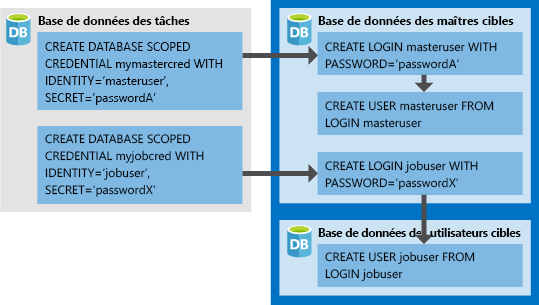

# <a name="create-an-elastic-job-agent-using-powershell"></a>Créer un agent de travail élastique à l’aide de PowerShell

Les [travaux élastique](sql-database-job-automation-overview.md#elastic-database-jobs) permettent l’exécution d’un ou plusieurs scripts Transact-SQL (T-SQL) en parallèle sur plusieurs bases de données.

Dans ce tutoriel vous découvrez les étapes requises pour exécuter une requête sur plusieurs bases de données :

> [!div class="checklist"]
> * Créer un agent de travail élastique
> * Créer des informations d’identification de travail afin que les travaux puissent exécuter des scripts sur ses cibles
> * Définir les cibles (serveurs, pools élastiques, bases de données, cartes de partitions) sur lesquelles vous voulez exécuter le travail
> * Créer des informations d’identification limitées à une base de données dans les bases de données cibles afin que l’agent se connecte et exécute des travaux
> * Création d’un travail
> * Ajouter des étapes de travail à un travail
> * Démarrer l’exécution d’un travail
> * Surveiller un travail

## <a name="prerequisites"></a>Prérequis

La version mise à niveau des tâches de base de données élastique comprend un nouvel ensemble d’applets de commande PowerShell à utiliser lors de la migration. Ces nouvelles applets de commande transfèrent l’ensemble des informations d’identification de tâche, des cibles (dont les bases de données, serveurs, collections personnalisées), des déclencheurs de tâche, des planifications de tâches, du contenu de la tâche ainsi que des tâches vers un nouvel agent de travail élastique.

### <a name="install-the-latest-elastic-jobs-cmdlets"></a>Installer les dernières applets de commande de tâches élastiques

Si vous n’avez pas encore d’abonnement Azure, [créez un compte gratuit](https://azure.microsoft.com/free/) avant de commencer.

Installez la préversion 1.1.1 du module **Az.Sql** pour obtenir les applets de commande de travail élastique les plus récentes. Exécutez les commandes suivantes dans PowerShell avec un accès administrateur.

```powershell
# Installs the latest PackageManagement powershell package which PowershellGet v1.6.5 is dependent on
Find-Package PackageManagement -RequiredVersion 1.1.7.2 | Install-Package -Force

# Installs the latest PowershellGet module which adds the -AllowPrerelease flag to Install-Module
Find-Package PowerShellGet -RequiredVersion 1.6.5 | Install-Package -Force

# Restart your powershell session with administrative access

# Places Az.Sql preview cmdlets side by side with existing Az.Sql version
Install-Module -Name Az.Sql -RequiredVersion 1.1.1-preview -AllowPrerelease

# Import the Az.Sql module
Import-Module Az.Sql -RequiredVersion 1.1.1

# Confirm if module successfully imported - if the imported version is 1.1.1, then continue
Get-Module Az.Sql
```

- En plus de la préversion 1.1.1 du module **Az.Sql**, ce didacticiel nécessite le module PowerShell *sqlserver*. Pour plus d’informations, consultez [Installer le module SQL Server PowerShell](https://docs.microsoft.com/sql/powershell/download-sql-server-ps-module).


## <a name="create-required-resources"></a>Créer les ressources nécessaires

La création d’un agent de travail élastique requiert une base de données (S0 ou une version ultérieure) pour une utilisation en tant que [Base de données des travaux](sql-database-job-automation-overview.md#job-database). 

*Le script ci-dessous crée un nouveau groupe de ressources, un serveur et une base de données pour une utilisation comme Base de données des travaux. Le script ci-dessous crée également un second serveur avec 2 bases de données vides par rapport auxquelles exécuter les travaux.*

Travaux élastiques n’ont aucune exigence d’affectation de noms, c’est la raison pour laquelle vous pouvez utiliser n’importe quelle convention d’affectation de noms, tant qu’elle est conforme aux [conditions requises pour Azure](https://docs.microsoft.com/azure/architecture/best-practices/naming-conventions).

```powershell
# Sign in to your Azure account
Connect-AzAccount

# Create a resource group
Write-Output "Creating a resource group..."
$ResourceGroupName = Read-Host "Please enter a resource group name"
$Location = Read-Host "Please enter an Azure Region"
$Rg = New-AzResourceGroup -Name $ResourceGroupName -Location $Location
$Rg

# Create a server
Write-Output "Creating a server..."
$AgentServerName = Read-Host "Please enter an agent server name"
$AgentServerName = $AgentServerName + "-" + [guid]::NewGuid()
$AdminLogin = Read-Host "Please enter the server admin name"
$AdminPassword = Read-Host "Please enter the server admin password"
$AdminPasswordSecure = ConvertTo-SecureString -String $AdminPassword -AsPlainText -Force
$AdminCred = New-Object -TypeName "System.Management.Automation.PSCredential" -ArgumentList $AdminLogin, $AdminPasswordSecure
$AgentServer = New-AzSqlServer -ResourceGroupName $ResourceGroupName -Location $Location -ServerName $AgentServerName -ServerVersion "12.0" -SqlAdministratorCredentials ($AdminCred)

# Set server firewall rules to allow all Azure IPs
Write-Output "Creating a server firewall rule..."
$AgentServer | New-AzSqlServerFirewallRule -AllowAllAzureIPs
$AgentServer

# Create the job database
Write-Output "Creating a blank SQL database to be used as the Job Database..."
$JobDatabaseName = "JobDatabase"
$JobDatabase = New-AzSqlDatabase -ResourceGroupName $ResourceGroupName -ServerName $AgentServerName -DatabaseName $JobDatabaseName -RequestedServiceObjectiveName "S0"
$JobDatabase
```

```powershell
# Create a target server and some sample databases - uses the same admin credential as the agent server just for simplicity
Write-Output "Creating target server..."
$TargetServerName = Read-Host "Please enter a target server name"
$TargetServerName = $TargetServerName + "-" + [guid]::NewGuid()
$TargetServer = New-AzSqlServer -ResourceGroupName $ResourceGroupName -Location $Location -ServerName $TargetServerName -ServerVersion "12.0" -SqlAdministratorCredentials ($AdminCred)

# Set target server firewall rules to allow all Azure IPs
$TargetServer | New-AzSqlServerFirewallRule -AllowAllAzureIPs
$TargetServer | New-AzSqlServerFirewallRule -StartIpAddress 0.0.0.0 -EndIpAddress 255.255.255.255 -FirewallRuleName AllowAll
$TargetServer

# Create some sample databases to execute jobs against...
$Db1 = New-AzSqlDatabase -ResourceGroupName $ResourceGroupName -ServerName $TargetServerName -DatabaseName "TargetDb1"
$Db1
$Db2 = New-AzSqlDatabase -ResourceGroupName $ResourceGroupName -ServerName $TargetServerName -DatabaseName "TargetDb2"
$Db2
```

## <a name="enable-the-elastic-jobs-preview-for-your-subscription"></a>Activer la préversion de Travaux élastiques pour votre abonnement

Pour utiliser les travaux élastiques, inscrivez la fonctionnalité dans votre abonnement Azure en exécutant la commande suivante. Exécutez cette commande une seule fois pour l’abonnement dans lequel vous souhaitez provisionner l’agent de travail élastique. Il n’est pas nécessaire d’inscrire les abonnements qui contiennent uniquement des bases de données et qui sont des cibles de travail.

```powershell
Register-AzProviderFeature -FeatureName sqldb-JobAccounts -ProviderNamespace Microsoft.Sql
```

## <a name="create-the-elastic-job-agent"></a>Créer l’agent de travail élastique

Un agent de travail élastique est une ressource Azure permettant de créer, exécuter et gérer des travaux. L’agent exécute les travaux selon un calendrier ou de manière ponctuelle.

La cmdlet **New-AzSqlElasticJobAgent** requiert la préexistence d’une base de données Azure SQL, de sorte que les paramètres *ResourceGroupName*, *ServerName*, et *DatabaseName* doivent tous pointer vers des ressources existantes.

```powershell
Write-Output "Creating job agent..."
$AgentName = Read-Host "Please enter a name for your new Elastic Job agent"
$JobAgent = $JobDatabase | New-AzSqlElasticJobAgent -Name $AgentName
$JobAgent
```

## <a name="create-job-credentials-so-that-jobs-can-execute-scripts-on-its-targets"></a>Créer des informations d’identification de travail afin que les travaux puissent exécuter des scripts sur ses cibles

Les travaux utilisent des informations d’identification limitées à la base de données pour se connecter aux bases de données cibles spécifiées par le groupe cible lors de l’exécution. Ces informations d’identification sont également utilisées pour se connecter à la base de données MASTER afin d’énumérer toutes les bases de données d’un serveur ou d’un pool élastique, lorsque l’une d’entre elles est utilisée en tant que type de membre du groupe cible.

Ces informations d’identification doivent être créées dans la base de données des travaux.  
Toutes les bases de données cibles doivent avoir une connexion disposant d’autorisations suffisantes pour que le travail s’exécute avec succès.



Outre les informations d’identification de l’image, notez l’ajout des commandes *GRANT* dans le script suivant. Ces autorisations sont requises pour le script que nous avons choisi pour cet exemple de travail. Dans la mesure où l’exemple crée une nouvelle table dans les bases de données ciblées, chaque base de données cible requiert les autorisations appropriées pour s’exécuter avec succès.

Pour créer les informations d’identification de travail requises (dans la base de données des travaux), exécutez le script suivant :

```powershell
# In the master database (target server)
# - Create the master user login
# - Create the master user from master user login
# - Create the job user login
$Params = @{
  'Database' = 'master'
  'ServerInstance' =  $TargetServer.ServerName + '.database.windows.net'
  'Username' = $AdminLogin
  'Password' = $AdminPassword
  'OutputSqlErrors' = $true
  'Query' = "CREATE LOGIN masteruser WITH PASSWORD='password!123'"
}
Invoke-SqlCmd @Params
$Params.Query = "CREATE USER masteruser FROM LOGIN masteruser"
Invoke-SqlCmd @Params
$Params.Query = "CREATE LOGIN jobuser WITH PASSWORD='password!123'"
Invoke-SqlCmd @Params

# For each of the target databases
# - Create the jobuser from jobuser login
# - Make sure they have the right permissions for successful script execution
$TargetDatabases = @( $Db1.DatabaseName, $Db2.DatabaseName )
$CreateJobUserScript =  "CREATE USER jobuser FROM LOGIN jobuser"
$GrantAlterSchemaScript = "GRANT ALTER ON SCHEMA::dbo TO jobuser"
$GrantCreateScript = "GRANT CREATE TABLE TO jobuser"

$TargetDatabases | % {
  $Params.Database = $_

  $Params.Query = $CreateJobUserScript
  Invoke-SqlCmd @Params

  $Params.Query = $GrantAlterSchemaScript
  Invoke-SqlCmd @Params

  $Params.Query = $GrantCreateScript
  Invoke-SqlCmd @Params
}

# Create job credential in Job database for master user
Write-Output "Creating job credentials..."
$LoginPasswordSecure = (ConvertTo-SecureString -String "password!123" -AsPlainText -Force)

$MasterCred = New-Object -TypeName "System.Management.Automation.PSCredential" -ArgumentList "masteruser", $LoginPasswordSecure
$MasterCred = $JobAgent | New-AzSqlElasticJobCredential -Name "masteruser" -Credential $MasterCred

$JobCred = New-Object -TypeName "System.Management.Automation.PSCredential" -ArgumentList "jobuser", $LoginPasswordSecure
$JobCred = $JobAgent | New-AzSqlElasticJobCredential -Name "jobuser" -Credential $JobCred
```

## <a name="define-the-target-databases-you-want-to-run-the-job-against"></a>Définir les bases de données cibles sur lesquelles vous souhaitez exécuter le travail

Un [groupe cible](sql-database-job-automation-overview.md#target-group) définit l’ensemble de base de données sur lequel une étape de travail s’exécute. 

L’extrait de code suivant crée deux groupes cibles : *ServerGroup* et *ServerGroupExcludingDb2*. *ServerGroup* cible toutes les bases de données existant sur le serveur au moment de l’exécution, et *ServerGroupExcludingDb2* toutes les bases de données sur le serveur, à l’exception de *TargetDb2* :

```powershell
Write-Output "Creating test target groups..."
# Create ServerGroup target group
$ServerGroup = $JobAgent | New-AzSqlElasticJobTargetGroup -Name 'ServerGroup'
$ServerGroup | Add-AzSqlElasticJobTarget -ServerName $TargetServerName -RefreshCredentialName $MasterCred.CredentialName

# Create ServerGroup with an exclusion of Db2
$ServerGroupExcludingDb2 = $JobAgent | New-AzSqlElasticJobTargetGroup -Name 'ServerGroupExcludingDb2'
$ServerGroupExcludingDb2 | Add-AzSqlElasticJobTarget -ServerName $TargetServerName -RefreshCredentialName $MasterCred.CredentialName
$ServerGroupExcludingDb2 | Add-AzSqlElasticJobTarget -ServerName $TargetServerName -Database $Db2.DatabaseName -Exclude
```

## <a name="create-a-job"></a>Création d’un travail

```powershell
Write-Output "Creating a new job"
$JobName = "Job1"
$Job = $JobAgent | New-AzSqlElasticJob -Name $JobName -RunOnce
$Job
```

## <a name="create-a-job-step"></a>Créer une étape de travail

Cet exemple définit deux étapes de travail pour le travail à exécuter. La première étape de travail (*step1*) crée une nouvelle table (*Step1Table*) dans chaque base de données du groupe cible *ServerGroup*. La deuxième étape de travail (*step2*) crée une nouvelle table (*Step2Table*) dans chaque base de données à l’exception de *TargetDb2*, car le groupe cible [défini précédemment](#define-the-target-databases-you-want-to-run-the-job-against) avait indiqué de l’exclure.

```powershell
Write-Output "Creating job steps"
$SqlText1 = "IF NOT EXISTS (SELECT * FROM sys.tables WHERE object_id = object_id('Step1Table')) CREATE TABLE [dbo].[Step1Table]([TestId] [int] NOT NULL);"
$SqlText2 = "IF NOT EXISTS (SELECT * FROM sys.tables WHERE object_id = object_id('Step2Table')) CREATE TABLE [dbo].[Step2Table]([TestId] [int] NOT NULL);"

$Job | Add-AzSqlElasticJobStep -Name "step1" -TargetGroupName $ServerGroup.TargetGroupName -CredentialName $JobCred.CredentialName -CommandText $SqlText1
$Job | Add-AzSqlElasticJobStep -Name "step2" -TargetGroupName $ServerGroupExcludingDb2.TargetGroupName -CredentialName $JobCred.CredentialName -CommandText $SqlText2
```


## <a name="run-the-job"></a>Exécution de la tâche

Pour démarrer le travail immédiatement, utilisez la commande suivante :

```powershell
Write-Output "Start a new execution of the job..."
$JobExecution = $Job | Start-AzSqlElasticJob
$JobExecution
```

Une fois le travail réussi, vous devez voir deux nouvelles tables dans TargetDb1 et seulement une nouvelle table dans TargetDb2 :


   


## <a name="monitor-status-of-job-executions"></a>Surveiller l’état d’exécution des travaux

L’extrait de code suivant obtient les informations relatives au travail d’exécution :

```powershell
# Get the latest 10 executions run
$JobAgent | Get-AzSqlElasticJobExecution -Count 10

# Get the job step execution details
$JobExecution | Get-AzSqlElasticJobStepExecution

# Get the job target execution details
$JobExecution | Get-AzSqlElasticJobTargetExecution -Count 2
```

## <a name="schedule-the-job-to-run-later"></a>Planifier le travail pour une exécution ultérieure

Pour planifier l’exécution ultérieure d’un travail, exécutez la commande suivante :

```powershell
# Run every hour starting from now
$Job | Set-AzSqlElasticJob -IntervalType Hour -IntervalCount 1 -StartTime (Get-Date) -Enable
```

## <a name="clean-up-resources"></a>Supprimer des ressources

Supprimez les ressources Azure créées dans ce tutoriel en supprimant le groupe de ressources.

> [!TIP]
> Si vous envisagez de continuer à travailler avec ces travaux, ne nettoyez pas les ressources créées dans cet article. Dans le cas contraire, procédez aux étapes suivantes pour supprimer toutes les ressources créées dans cet article.
>

```powershell
Remove-AzResourceGroup -ResourceGroupName $ResourceGroupName
```


## <a name="next-steps"></a>Étapes suivantes

Dans ce tutoriel, vous avez exécuté un script Transact-SQL sur un ensemble de bases de données.  Vous avez appris à effectuer les tâches suivantes :

> [!div class="checklist"]
> * Créer un agent de travail élastique
> * Créer des informations d’identification de travail afin que les travaux puissent exécuter des scripts sur ses cibles
> * Définir les cibles (serveurs, pools élastiques, bases de données, cartes de partitions) sur lesquelles vous voulez exécuter le travail
> * Créer des informations d’identification limitées à une base de données dans les bases de données cibles afin que l’agent se connecte et exécute des travaux
> * Création d’un travail
> * Ajout d’une étape au travail
> * Démarrage d’une exécution du travail
> * Surveiller la tâche

> [!div class="nextstepaction"]
>[Gérer des travaux élastiques à l’aide de Transact-SQL](elastic-jobs-tsql.md)
