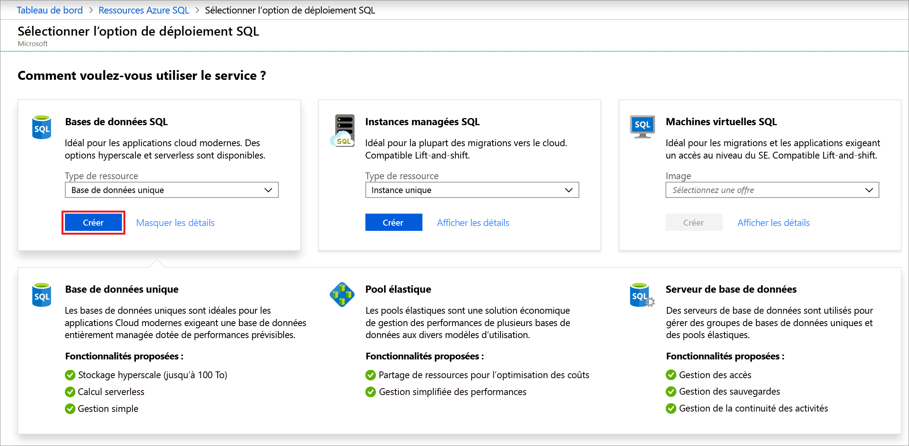
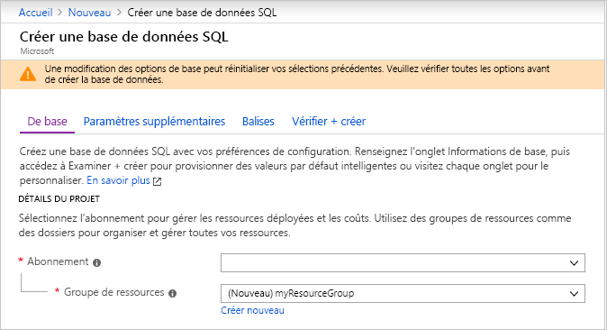
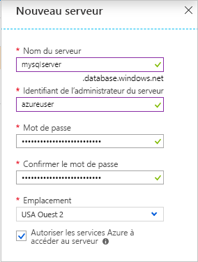
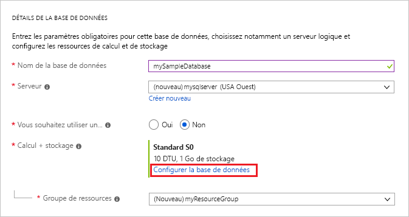
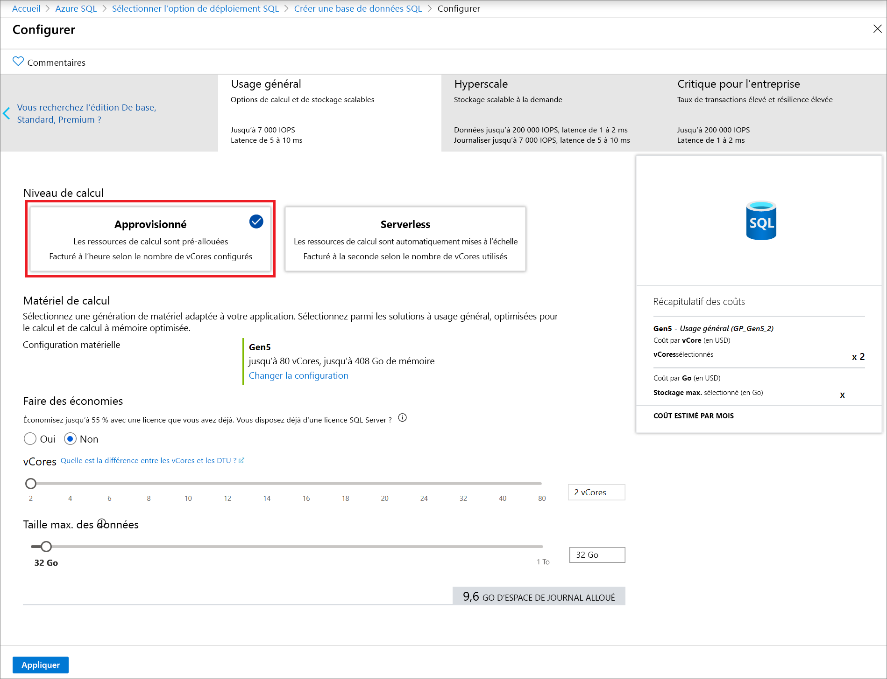
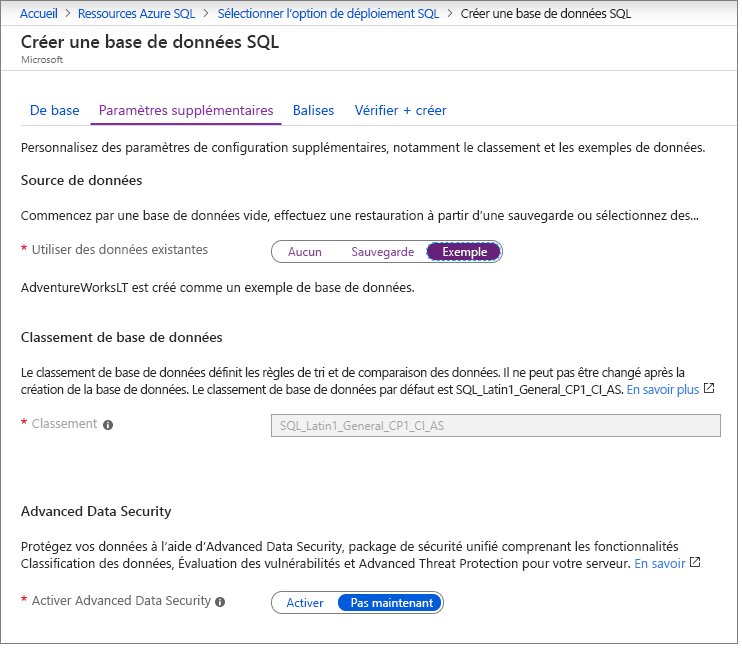

Au cours de cette étape, vous allez créer une base de données unique Azure SQL Database. 

> [!IMPORTANT]
> Veillez à configurer des règles de pare-feu pour pouvoir utiliser l’adresse IP publique de l’ordinateur sur lequel vous effectuez les étapes de cet article.
>
> Pour plus d’informations, consultez [Créer une règle de pare-feu au niveau du serveur](/sql/relational-databases/system-stored-procedures/sp-set-database-firewall-rule-azure-sql-database) ou, pour déterminer l’adresse IP utilisée pour la règle de pare-feu au niveau du serveur pour votre ordinateur, consultez [Créer une règle de pare-feu au niveau du serveur](../sql-database-server-level-firewall-rule.md).  

# <a name="portal"></a>[Portail](#tab/azure-portal)

Créez votre groupe de ressources et votre base de données unique à l’aide du portail Azure.

1. Dans le menu de gauche du **Portail Azure**, sélectionnez [Azure SQL](https://portal.azure.com). Si **Azure SQL** ne figure pas dans la liste, sélectionnez **Tous les services**, puis tapez *Azure SQL* dans la zone de recherche. (Facultatif) Sélectionnez l’étoile en regard d’**Azure SQL** pour l’ajouter aux favoris et l’ajouter en tant qu’élément dans le volet de navigation de gauche. 
2. Sélectionnez **+Ajouter** pour ouvrir la page **Sélectionner l’option de déploiement SQL**. Vous pouvez afficher des informations supplémentaires sur les différentes bases de données en sélectionnant **Afficher les détails** sur la vignette **Bases de données**.
3. Sélectionnez **Créer** :

   

4. Sous l’onglet **Bases**, dans la section **Détails du projet**, tapez ou sélectionnez les valeurs suivantes :

   - **Abonnement**: Faites défiler la liste et sélectionnez l’abonnement approprié, s’il n’apparaît pas.
   - **Groupe de ressources** : sélectionnez **Créer**, tapez `myResourceGroup`, puis sélectionnez **OK**.

     

5. Dans la section formulaire **Détails de la base de données**, tapez ou sélectionnez les valeurs suivantes :

   - **Nom de la base de données** : Entrez `mySampleDatabase`.
   - **Serveur** : sélectionnez **Créer**, entrez les valeurs suivantes, puis sélectionnez **Sélectionner**.
       - **Nom du serveur** : tapez `mysqlserver` ainsi que des chiffres à des fins d’unicité.
       - **Connexion administrateur au serveur** : Tapez `azureuser`.
       - **Mot de passe** : tapez un mot de passe complexe qui répond aux exigences de mot de passe.
       - **Emplacement** : choisissez un emplacement dans la liste déroulante, tel que `West US`.

         

      > [!IMPORTANT]
      > Mémorisez votre nom d’utilisateur et mot de passe de connexion d’administrateur au serveur, car vous en aurez besoin pour vous connecter au serveur et aux bases de données dans le cadre de ce guide ou d’autres guides de démarrage rapide. Si vous oubliez votre mot de passe ou vos identifiants de connexion, vous pouvez obtenir le nom de connexion ou réinitialiser le mot de passe sur la page **SQL Server**. Pour ouvrir la page **SQL Server** , sélectionnez le nom du serveur sur la page **Vue d’ensemble** de la base de données une fois cette dernière créée.

   - **Vous souhaitez utiliser un pool élastique SQL ?**  : sélectionnez l’option **Non**.
   - **Calcul + stockage** : Sélectionnez **Configurer la base de données**. 

     

   - Sélectionnez **Provisionné**.  Vous pouvez également sélectionner **Serverless** pour créer une base de données serverless.

     

   - Passez en revue les paramètres pour **vCores** et **Taille max. des données**. Modifiez-les comme vous le souhaitez. 
     - Si vous le souhaitez, vous pouvez également sélectionner **Changer la configuration** pour modifier la génération matérielle.
   - Sélectionnez **Appliquer**.

6. Sélectionnez l’onglet **Réseau** et décidez si vous souhaitez [**Autoriser les services et ressources Azure à accéder à ce serveur**](../sql-database-networkaccess-overview.md), ou ajoutez un [point de terminaison privé](../../private-link/private-endpoint-overview.md).

   

7. Sélectionnez l’onglet **Paramètres supplémentaires**. 
8. Dans la section **Source de données**, sous **Utiliser des données existantes**, sélectionnez `Sample`.

   

   > [!IMPORTANT]
   > Veillez à sélectionner les données **Exemple (AdventureWorksLT)** pour pouvoir facilement suivre le présent guide ainsi que d’autres articles dédiés à Azure SQL Database qui utilisent ces données.

9. Laissez le reste des valeurs par défaut, puis sélectionnez **Vérifier + créer** en bas du formulaire.
10. Passez en revue les paramètres finaux et sélectionnez **Créer**.

11. Sur le formulaire **SQL Database**, sélectionnez **Créer** pour déployer et configurer le groupe de ressources, le serveur et la base de données.

# <a name="powershell"></a>[PowerShell](#tab/azure-powershell)

[!INCLUDE [updated-for-az](../../../includes/updated-for-az.md)]

Créez votre groupe de ressources et votre base de données unique à l’aide de PowerShell.

   ```powershell-interactive
   # Set variables for your server and database
   $subscriptionId = '<SubscriptionID>'
   $resourceGroupName = "myResourceGroup-$(Get-Random)"
   $location = "West US"
   $adminLogin = "azureuser"
   $password = "PWD27!"+(New-Guid).Guid
   $serverName = "mysqlserver-$(Get-Random)"
   $databaseName = "mySampleDatabase"

   # The ip address range that you want to allow to access your server 
   # (leaving at 0.0.0.0 will prevent outside-of-azure connections to your DB)
   $startIp = "0.0.0.0"
   $endIp = "0.0.0.0"

   # Show randomized variables
   Write-host "Resource group name is" $resourceGroupName 
   Write-host "Password is" $password  
   Write-host "Server name is" $serverName 

   # Connect to Azure
   Connect-AzAccount

   # Set subscription ID
   Set-AzContext -SubscriptionId $subscriptionId 

   # Create a resource group
   Write-host "Creating resource group..."
   $resourceGroup = New-AzResourceGroup -Name $resourceGroupName -Location $location -Tag @{Owner="SQLDB-Samples"}
   $resourceGroup

   # Create a server with a system wide unique server name
   Write-host "Creating primary logical server..."
   $server = New-AzSqlServer -ResourceGroupName $resourceGroupName `
      -ServerName $serverName `
      -Location $location `
      -SqlAdministratorCredentials $(New-Object -TypeName System.Management.Automation.PSCredential `
      -ArgumentList $adminLogin, $(ConvertTo-SecureString -String $password -AsPlainText -Force))
   $server

   # Create a server firewall rule that allows access from the specified IP range
   Write-host "Configuring firewall for primary logical server..."
   $serverFirewallRule = New-AzSqlServerFirewallRule -ResourceGroupName $resourceGroupName `
      -ServerName $serverName `
      -FirewallRuleName "AllowedIPs" -StartIpAddress $startIp -EndIpAddress $endIp
   $serverFirewallRule

   # Create General Purpose Gen4 database with 1 vCore
   Write-host "Creating a gen5 2 vCore database..."
   $database = New-AzSqlDatabase  -ResourceGroupName $resourceGroupName `
      -ServerName $serverName `
      -DatabaseName $databaseName `
      -Edition GeneralPurpose `
      -VCore 2 `
      -ComputeGeneration Gen5 `
      -MinimumCapacity 2 `
      -SampleName "AdventureWorksLT"
   $database
   ```

Cette partie de l’article utilise les cmdlets PowerShell suivantes :

| Commande | Notes |
|---|---|
| [New-AzResourceGroup](/powershell/module/az.resources/new-azresourcegroup) | Crée un groupe de ressources dans lequel toutes les ressources sont stockées. |
| [New-AzSqlServer](/powershell/module/az.sql/new-azsqlserver) | Crée un serveur SQL Database qui héberge des bases de données uniques et des pools élastiques. |
| [New-AzSqlServerFirewallRule](/powershell/module/az.sql/new-azsqlserverfirewallrule) | Crée une règle de pare-feu pour un serveur logique. | 
| [New-AzSqlDatabase](/powershell/module/az.sql/new-azsqldatabase) | Crée une base de données unique Azure SQL Database. | 

# <a name="azure-cli"></a>[Azure CLI](#tab/azure-cli)

Créez votre groupe de ressources et votre base de données unique à l’aide de l’interface CLI AZ.

   ```azurecli-interactive
   #!/bin/bash
   # set variables
   $subscription = "<subscriptionID>"
   $randomIdentifier = $(Get-Random)

   $resourceGroup = "resource-$randomIdentifier"
   $location = "East US"
   
   $login = "sampleLogin"
   $password = "samplePassword123!"

   $server = "server-$randomIdentifier"
   $database = "database-$randomIdentifier"
  
   az login # connect to Azure
   az account set -s $subscription # set subscription context for the Azure account

   echo "Creating resource group..."
   az group create --name $resourceGroup --location $location

   echo "Creating primary logical server..."
   az sql server create --name $server --resource-group $resourceGroup --location $location --admin-user $login --admin-password $password

   echo "Creating a gen5 2 vCore database..."
   az sql db create --resource-group $resourceGroup --server $server --name $database --sample-name AdventureWorksLT --edition GeneralPurpose --family Gen5 --capacity 2
   ```

Ce script utilise les commandes suivantes. Chaque commande du tableau renvoie à une documentation spécifique.

| Commande | Notes |
|---|---|
| [az account set](/cli/azure/account?view=azure-cli-latest#az-account-set) | Définit un abonnement en tant qu’abonnement actif. | 
| [az group create](/cli/azure/group#az-group-create) | Crée un groupe de ressources dans lequel toutes les ressources sont stockées. |
| [az sql server create](/cli/azure/sql/server#az-sql-server-create) | Crée un serveur SQL Database qui héberge des bases de données uniques et des pools élastiques. |
| [az sql server firewall-rule create](/cli/azure/sql/server/firewall-rule) | Crée les règles de pare-feu d’un serveur. | 
| [az sql db create](/cli/azure/sql/db?view=azure-cli-latest) | Crée une base de données. | 


---
