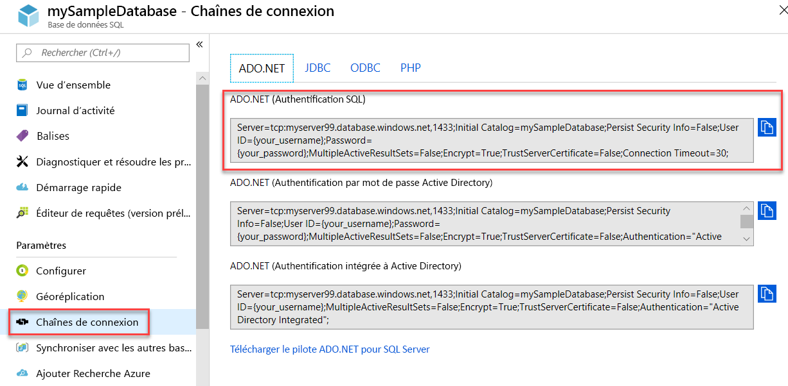

# <a name="quickstart-use-net-core-c-to-query-an-azure-sql-database"></a>Démarrage rapide : Utiliser .NET Core (C#) pour interroger une base de données Azure SQL

Dans ce guide de démarrage rapide, vous allez utiliser [.NET Core](https://www.microsoft.com/net/) et du code C# pour vous connecter à une base de données Azure SQL. Vous allez ensuite exécuter une instruction Transact-SQL pour interroger des données.

> [!TIP]
> Le module Microsoft Learn suivant vous aide à apprendre gratuitement comment [Développer et configurer une application ASP.Net qui interroge une base de données Azure SQL Database](https://docs.microsoft.com/learn/modules/develop-app-that-queries-azure-sql/).

## <a name="prerequisites"></a>Conditions préalables requises

Pour ce didacticiel, vous avez besoin des éléments suivants :

- base de données Azure SQL. Utilisez l’un de ces guides de démarrage rapide pour créer et configurer une base de données dans Azure SQL Database :

  || Base de données unique | Instance gérée |
  |:--- |:--- |:---|
  | Créer| [Portail](sql-database-single-database-get-started.md) | [Portail](sql-database-managed-instance-get-started.md) |
  || [INTERFACE DE LIGNE DE COMMANDE](scripts/sql-database-create-and-configure-database-cli.md) | [INTERFACE DE LIGNE DE COMMANDE](https://medium.com/azure-sqldb-managed-instance/working-with-sql-managed-instance-using-azure-cli-611795fe0b44) |
  || [PowerShell](scripts/sql-database-create-and-configure-database-powershell.md) | [PowerShell](scripts/sql-database-create-configure-managed-instance-powershell.md) |
  | Configurer | [Règle de pare-feu IP au niveau du serveur](sql-database-server-level-firewall-rule.md)| [Connectivité à partir d’une machine virtuelle](sql-database-managed-instance-configure-vm.md)|
  |||[Connectivité à partir d’une machine locale](sql-database-managed-instance-configure-p2s.md)
  |Charger les données|Adventure Works chargé dans le cadre du guide de démarrage rapide|[Restaurer Wide World Importers](sql-database-managed-instance-get-started-restore.md)
  |||Restaurer ou importer Adventure Works à partir du fichier [BACPAC](sql-database-import.md) disponible sur [GitHub](https://github.com/Microsoft/sql-server-samples/tree/master/samples/databases/adventure-works)|
  |||

  > [!IMPORTANT]
  > Les scripts fournis dans cet article utilisent la base de données Adventure Works. Avec une instance managée, vous devez importer la base de données Adventure Works dans une base de données d’instance, ou modifier les scripts fournis dans cet article pour utiliser la base de données Wide World Importers.

- Une version installée de [.NET Core pour votre système d’exploitation](https://www.microsoft.com/net/core).

> [!NOTE]
> Ce guide de démarrage rapide utilise la base de données *mySampleDatabase*. Si vous souhaitez utiliser une autre base de données, vous devrez modifier les références de base de données et modifier la requête `SELECT` dans le code C#.

## <a name="get-sql-server-connection-information"></a>Obtenir des informations de connexion SQL Server

Procurez-vous les informations de connexion dont vous avez besoin pour vous connecter à la base de données Azure SQL. Vous aurez besoin du nom complet du serveur ou de l’hôte, du nom de la base de données et des informations de connexion pour les procédures suivantes.

1. Connectez-vous au [portail Azure](https://portal.azure.com/).

2. Accédez à la page **Bases de données SQL** ou **Instances managées SQL**.

3. Dans la page **Vue d’ensemble**, vérifiez le nom complet du serveur à côté de **Nom du serveur** pour une base de données, ou le nom complet du serveur à côté de **Hôte** pour une instance managée. Pour copier le nom du serveur ou de l’hôte, pointez dessus et sélectionnez l’icône **Copier**.

## <a name="get-adonet-connection-information-optional"></a>Obtenir des informations de connexion ADO.NET (facultatif)

1. Accédez à la page **mySampleDatabase**, puis, sous **Paramètres**, sélectionnez **Chaînes de connexion**.

2. Examinez la chaîne de connexion **ADO.NET** complète.

    

3. Copiez la chaîne de connexion **ADO.NET** si vous voulez l’utiliser.
  
## <a name="create-a-new-net-core-project"></a>Créer un nouveau projet .NET Core

1. Ouvrez une invite de commandes et créez un dossier nommé **sqltest**. Accédez à ce dossier et exécutez cette commande.

    ```cmd
    dotnet new console
    ```
    Cette commande crée de nouveaux fichiers projet d’application, y compris un fichier de code C# initial (**Program.cs**), un fichier de configuration XML (**sqltest.csproj**) et les fichiers binaires nécessaires.

2. Dans un éditeur de texte, ouvrez **sqltest.csproj** et collez le code XML suivant entre les balises `<Project>`. Ce code XML ajoute `System.Data.SqlClient` en tant que dépendance.

    ```xml
    <ItemGroup>
        <PackageReference Include="System.Data.SqlClient" Version="4.6.0" />
    </ItemGroup>
    ```

## <a name="insert-code-to-query-sql-database"></a>Insertion du code pour interroger la base de données SQL

1. Ouvrez le fichier **Program.cs** dans un éditeur de texte.

2. Remplacez le contenu par le code suivant et ajoutez les valeurs appropriées pour votre serveur, base de données, nom d’utilisateur et mot de passe.

> [!NOTE]
> Pour utiliser une chaîne de connexion ADO.NET, remplacez les 4 lignes dans le code définissant le serveur, la base de données, le nom d’utilisateur et le mot de passe par la ligne ci-dessous. Dans la chaîne, définissez votre nom d’utilisateur et votre mot de passe.
>
>    `builder.ConnectionString="<your_ado_net_connection_string>";`

```csharp
using System;
using System.Data.SqlClient;
using System.Text;

namespace sqltest
{
    class Program
    {
        static void Main(string[] args)
        {
            try 
            { 
                SqlConnectionStringBuilder builder = new SqlConnectionStringBuilder();

                builder.DataSource = "<your_server.database.windows.net>"; 
                builder.UserID = "<your_username>";            
                builder.Password = "<your_password>";     
                builder.InitialCatalog = "<your_database>";
         
                using (SqlConnection connection = new SqlConnection(builder.ConnectionString))
                {
                    Console.WriteLine("\nQuery data example:");
                    Console.WriteLine("=========================================\n");
                    
                    connection.Open();       
                    StringBuilder sb = new StringBuilder();
                    sb.Append("SELECT TOP 20 pc.Name as CategoryName, p.name as ProductName ");
                    sb.Append("FROM [SalesLT].[ProductCategory] pc ");
                    sb.Append("JOIN [SalesLT].[Product] p ");
                    sb.Append("ON pc.productcategoryid = p.productcategoryid;");
                    String sql = sb.ToString();

                    using (SqlCommand command = new SqlCommand(sql, connection))
                    {
                        using (SqlDataReader reader = command.ExecuteReader())
                        {
                            while (reader.Read())
                            {
                                Console.WriteLine("{0} {1}", reader.GetString(0), reader.GetString(1));
                            }
                        }
                    }                    
                }
            }
            catch (SqlException e)
            {
                Console.WriteLine(e.ToString());
            }
            Console.WriteLine("\nDone. Press enter.");
            Console.ReadLine(); 
        }
    }
}
```

## <a name="run-the-code"></a>Exécuter le code

1. À l’invite, exécutez les commandes suivantes.

   ```cmd
   dotnet restore
   dotnet run
   ```

2. Vérifiez que les 20 premières lignes sont retournées.

   ```text
   Query data example:
   =========================================

   Road Frames HL Road Frame - Black, 58
   Road Frames HL Road Frame - Red, 58
   Helmets Sport-100 Helmet, Red
   Helmets Sport-100 Helmet, Black
   Socks Mountain Bike Socks, M
   Socks Mountain Bike Socks, L
   Helmets Sport-100 Helmet, Blue
   Caps AWC Logo Cap
   Jerseys Long-Sleeve Logo Jersey, S
   Jerseys Long-Sleeve Logo Jersey, M
   Jerseys Long-Sleeve Logo Jersey, L
   Jerseys Long-Sleeve Logo Jersey, XL
   Road Frames HL Road Frame - Red, 62
   Road Frames HL Road Frame - Red, 44
   Road Frames HL Road Frame - Red, 48
   Road Frames HL Road Frame - Red, 52
   Road Frames HL Road Frame - Red, 56
   Road Frames LL Road Frame - Black, 58
   Road Frames LL Road Frame - Black, 60
   Road Frames LL Road Frame - Black, 62

   Done. Press enter.
   ```
3. Appuyez sur **Entrée** pour fermer la fenêtre d’application.

## <a name="next-steps"></a>Étapes suivantes

- [Prise en main de .NET Core sur Windows/Linux/macOS à l’aide de la ligne de commande](/dotnet/core/tutorials/using-with-xplat-cli).
- Découvrez comment [connecter et interroger une base de données Azure SQL à l’aide du .NET Framework et Visual Studio](sql-database-connect-query-dotnet-visual-studio.md).  
- Découvrez comment [Concevoir votre première base de données Azure SQL à l’aide de SSMS](sql-database-design-first-database.md) ou comment [Concevoir une base de données Azure SQL et se connecter avec C# et ADO.NET](sql-database-design-first-database-csharp.md).
- Pour plus d’informations sur .NET, consultez la [documentation .NET](https://docs.microsoft.com/dotnet/).
