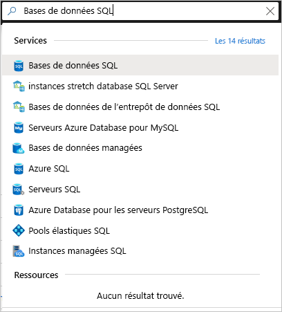
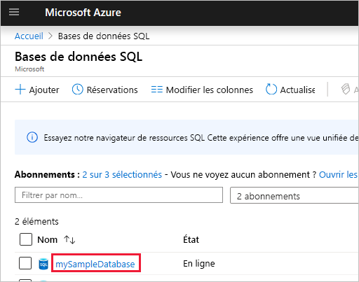
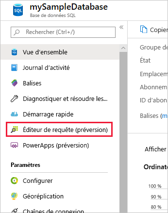
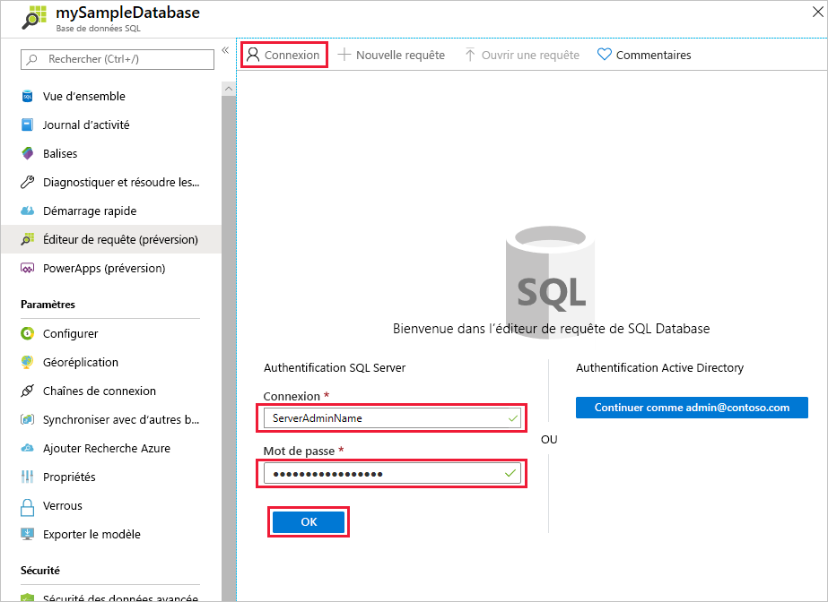
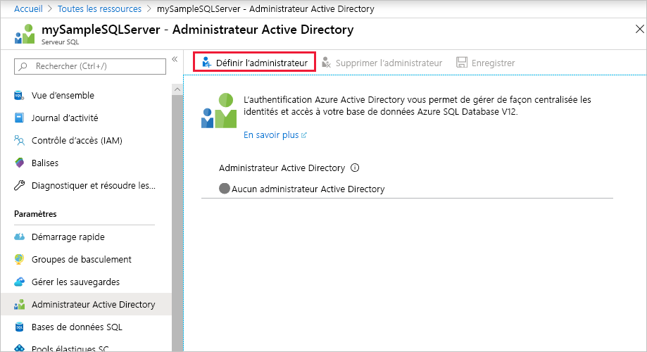
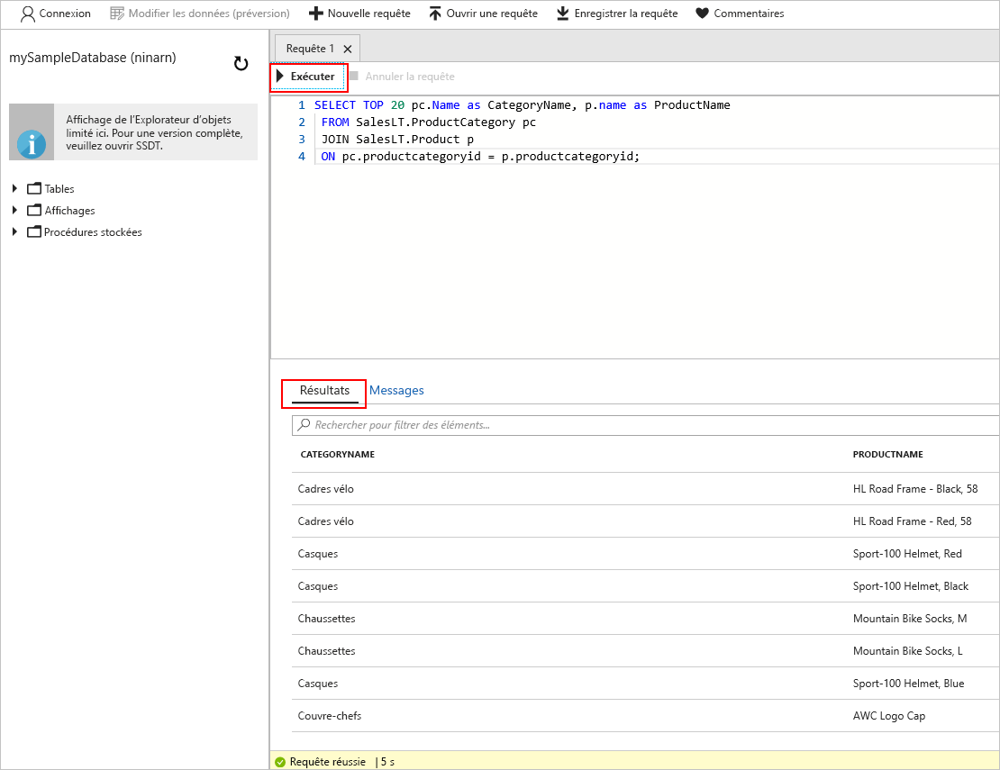

# <a name="quickstart-use-the-azure-portals-sql-query-editor-to-connect-and-query-data"></a>Démarrage rapide : Utiliser l’éditeur de requête SQL du portail Azure pour se connecter et interroger des données

L’éditeur de requête SQL est un outil de navigateur du portail Azure qui offre un moyen simple d’exécuter des requêtes SQL sur votre base de données Azure SQL ou sur un entrepôt de données Azure SQL. Dans ce guide de démarrage rapide, vous utilisez l’éditeur de requête pour vous connecter à une base de données SQL, puis exécutez des instructions Transact-SQL pour interroger, insérer, mettre à jour et supprimer des données.

## <a name="prerequisites"></a>Prérequis

Pour suivre ce didacticiel, vous avez besoin des éléments suivants :

- base de données Azure SQL. Utilisez l’un de ces guides de démarrage rapide pour créer et configurer une base de données dans Azure SQL Database :

  || Base de données unique |
  |:--- |:--- |
  | Créer| [Portail](sql-database-single-database-get-started.md) |
  || [INTERFACE DE LIGNE DE COMMANDE](scripts/sql-database-create-and-configure-database-cli.md) |
  || [PowerShell](scripts/sql-database-create-and-configure-database-powershell.md) |
  | Configurer | [Règle de pare-feu IP au niveau du serveur](sql-database-server-level-firewall-rule.md)|
  |||

> [!NOTE]
> L’éditeur de requête utilise les ports 443 et 1443 pour communiquer.  Vérifiez que vous avez activé le trafic HTTPS sortant sur ces ports. Vous devrez également ajouter votre adresse IP sortante aux les règles d’autorisation de pare-feu du serveur pour accéder à vos bases de données et entrepôts de données.

## <a name="sign-in-the-azure-portal"></a>Se connecter au portail Azure

Connectez-vous au [portail Azure](https://portal.azure.com/).

## <a name="connect-using-sql-authentication"></a>Se connecter avec l’authentification SQL

1. Accédez au portail Azure pour vous connecter à une base de données SQL. Recherchez et sélectionnez **Base de données SQL**.

    

2. Sélectionnez votre base de données SQL.

    

3. Dans le menu **Base de données SQL**, sélectionnez **Éditeur de requête (préversion)** .

    

4. Dans la page **Connexion**, sous l’étiquette **Authentification SQL Server**, entrez l’ID de **connexion** et le **mot de passe** du compte d’administrateur du serveur utilisé pour créer la base de données. Sélectionnez ensuite **OK**.

    

## <a name="connect-using-azure-active-directory"></a>Se connecter avec Azure Active Directory

La configuration d’un administrateur Azure Active Directory (Azure AD) vous permet d’utiliser une même identité pour vous connecter au portail Azure et à votre base de données SQL. Suivez les étapes ci-dessous afin de configurer un administrateur Azure AD pour votre serveur SQL Server.

> [!NOTE]
> * Les comptes de messagerie (par exemple outlook.com, gmail.com, yahoo.com, etc.) ne sont pas encore pris en charge comme administrateurs Azure AD. Veillez à choisir un utilisateur créé en mode natif dans Azure AD ou fédéré dans Azure AD.
> * La connexion d’un administrateur Azure AD ne fonctionne pas avec les comptes pour lesquels l’authentification à deux facteurs est activée.

1. Dans le menu du Portail Azure ou dans la page **Accueil**, sélectionnez **Toutes les ressources**.

2. Sélectionnez votre serveur SQL.

3. Dans le menu **Serveur SQL**, sous **Paramètres**, sélectionnez **Administrateur Active Directory**.

4. Dans la barre d’outils de la page **Administrateur Active Directory**, sélectionnez **Définir l’administrateur**, puis choisissez l’utilisateur ou le groupe destiné à être votre administrateur Azure Active Directory.

    

5. Dans la page **Ajouter un administrateur**, dans la zone de recherche, entrez un utilisateur ou un groupe à rechercher, sélectionnez-le en tant qu’administrateur, puis cliquez sur le bouton **Sélectionner**.

6. De retour dans la barre d’outils de la page SQL Server **Administrateur Active Directory**, sélectionnez **Enregistrer**.

7. Dans le menu **SQL Server**, sélectionnez **Bases de données SQL**, puis sélectionnez votre base de données SQL.

8. Dans le menu **Base de données SQL**, sélectionnez **Éditeur de requête (préversion)** . Dans la page **Connexion**, sous l’étiquette **Authentification Active Directory**, un message s’affiche indiquant que vous vous êtes connecté si vous êtes un administrateur Azure AD. Sélectionnez ensuite le bouton **Continuer en tant que** *\<votre ID d’utilisateur ou de groupe>* .

## <a name="view-data"></a>Afficher les données

1. Une fois que vous êtes authentifié, collez le code SQL suivant dans l’éditeur de requête pour extraire les 20 premiers produits par catégorie.

   ```sql
    SELECT TOP 20 pc.Name as CategoryName, p.name as ProductName
    FROM SalesLT.ProductCategory pc
    JOIN SalesLT.Product p
    ON pc.productcategoryid = p.productcategoryid;
   ```

2. Dans la barre d’outils, sélectionnez **Exécuter**, puis passez en revue la sortie dans le volet **Résultats**.

   

## <a name="insert-data"></a>Insertion des données

Exécutez l’instruction Transact-SQL [INSERT](https://msdn.microsoft.com/library/ms174335.aspx) suivante pour ajouter un nouveau produit dans la table `SalesLT.Product`.

1. Remplacez la requête précédente par celle-ci.

    ```sql
    INSERT INTO [SalesLT].[Product]
           ( [Name]
           , [ProductNumber]
           , [Color]
           , [ProductCategoryID]
           , [StandardCost]
           , [ListPrice]
           , [SellStartDate]
           )
    VALUES
           ('myNewProduct'
           ,123456789
           ,'NewColor'
           ,1
           ,100
           ,100
           ,GETDATE() );
   ```


2. Sélectionnez **Exécuter** pour insérer une nouvelle ligne dans la table `Product`. Le volet **Messages** affiche **Requête réussie : Lignes affectées : 1**.


## <a name="update-data"></a>Mettre à jour des données

Exécutez l’instruction Transact-SQL [UPDATE](https://msdn.microsoft.com/library/ms177523.aspx) suivante pour modifier votre nouveau produit.

1. Remplacez la requête précédente par celle-ci.

   ```sql
   UPDATE [SalesLT].[Product]
   SET [ListPrice] = 125
   WHERE Name = 'myNewProduct';
   ```

2. Sélectionnez **Exécuter** pour mettre à jour la ligne spécifiée dans la table `Product`. Le volet **Messages** affiche **Requête réussie : Lignes affectées : 1**.

## <a name="delete-data"></a>Suppression de données

Exécutez l’instruction Transact-SQL [DELETE](https://msdn.microsoft.com/library/ms189835.aspx) suivante pour supprimer votre nouveau produit.

1. Remplacez la requête précédente par celle-ci :

   ```sql
   DELETE FROM [SalesLT].[Product]
   WHERE Name = 'myNewProduct';
   ```

2. Sélectionnez **Exécuter** pour supprimer la ligne spécifiée dans la table `Product`. Le volet **Messages** affiche **Requête réussie : Lignes affectées : 1**.


## <a name="query-editor-considerations"></a>Considérations relatives à l’éditeur de requête

Il y a quelques informations à connaître quand vous travaillez avec l’éditeur de requête.

* L’éditeur de requête utilise les ports 443 et 1443 pour communiquer.  Vérifiez que vous avez activé le trafic HTTPS sortant sur ces ports. Vous devrez également ajouter votre adresse IP sortante aux les règles d’autorisation de pare-feu du serveur pour accéder à vos bases de données et entrepôts de données.

* L’éditeur de requête fonctionne avec Private Link sans qu’il soit nécessaire d’ajouter l’adresse IP du client au pare-feu SQL Database.

* Le fait d’appuyer sur F5 réinitialise la page de l’éditeur de requête, effaçant la requête sur laquelle vous travaillez.

* L’éditeur de requête ne prend pas en charge la connexion à la base de données `master`.

* Il y a un délai d’expiration de 5 minutes pour l’exécution des requêtes.

* L’éditeur de requête prend en charge seulement la projection cylindrique des types de données géographiques.

* IntelliSense n’est pas pris en charge pour les tables et les vues de base de données. L’éditeur prend cependant en charge la complétion automatique des noms déjà saisis.


## <a name="next-steps"></a>Étapes suivantes

Pour plus d’informations sur les instructions Transact-SQL prises en charge dans les bases de données Azure SQL, consultez [Résolution des différences de Transact-SQL durant la migration vers SQL Database](sql-database-transact-sql-information.md).
