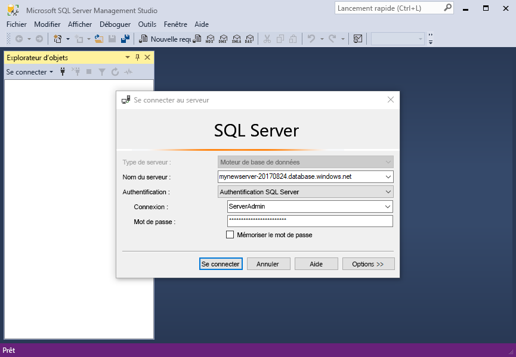
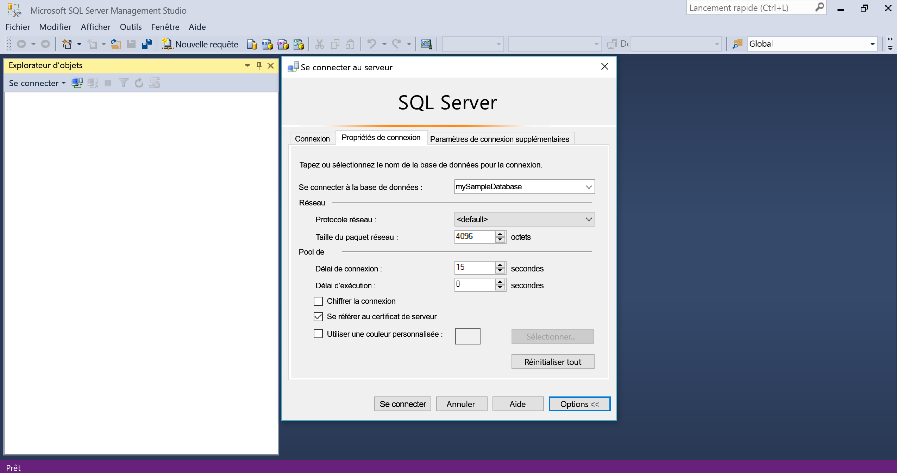
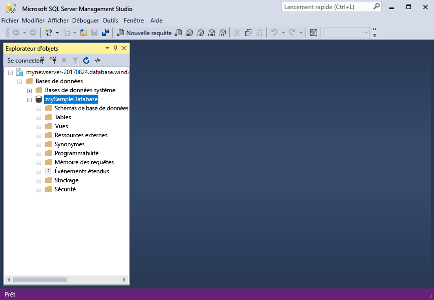
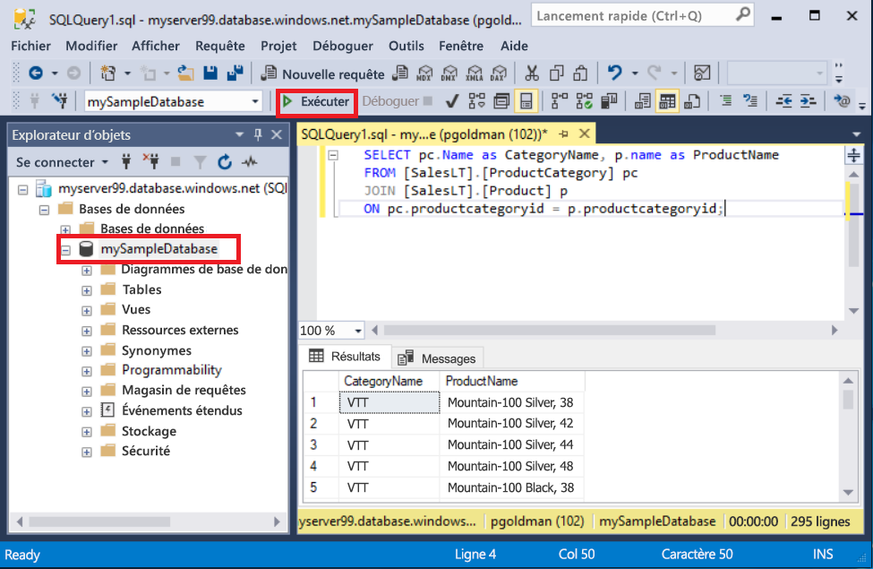
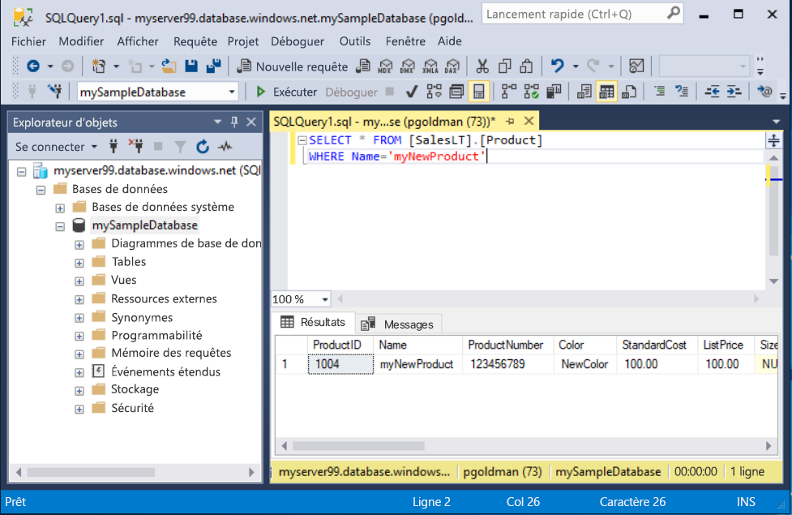

# <a name="quickstart-use-sql-server-management-studio-to-connect-and-query-an-azure-sql-database"></a>Démarrage rapide : Utilisez SQL Server Management Studio pour se connecter et interroger une base de données Azure SQL

Dans ce guide de démarrage rapide, vous allez utiliser [SQL Server Management Studio][ssms-install-latest-84g] (SSMS) pour établir la connexion à une base de données Azure SQL. Vous allez ensuite utiliser les instructions Transact-SQL pour interroger les données, les mettre à jour et en supprimer. Vous pouvez utiliser (SSMS) pour gérer les infrastructures SQL, de SQL Server à SQL Database pour Microsoft Windows.  

## <a name="prerequisites"></a>Prérequis

base de données Azure SQL. Utilisez l’un de ces guides de démarrage rapide pour créer et configurer une base de données dans Azure SQL Database :

  || Base de données unique | Instance gérée |
  |:--- |:--- |:---|
  | Créer| [Portal](sql-database-single-database-get-started.md) | [Portal](sql-database-managed-instance-get-started.md) |
  || [INTERFACE DE LIGNE DE COMMANDE](scripts/sql-database-create-and-configure-database-cli.md) | [INTERFACE DE LIGNE DE COMMANDE](https://medium.com/azure-sqldb-managed-instance/working-with-sql-managed-instance-using-azure-cli-611795fe0b44) |
  || [PowerShell](scripts/sql-database-create-and-configure-database-powershell.md) | [PowerShell](scripts/sql-database-create-configure-managed-instance-powershell.md) |
  | Configuration | [Règle de pare-feu IP au niveau du serveur](sql-database-server-level-firewall-rule.md)| [Connectivité à partir d’une machine virtuelle](sql-database-managed-instance-configure-vm.md)|
  |||[Connectivité à partir d’une machine locale](sql-database-managed-instance-configure-p2s.md)
  |Charger des données|Adventure Works chargé dans le cadre du guide de démarrage rapide|[Restaurer Wide World Importers](sql-database-managed-instance-get-started-restore.md)
  |||Restaurer ou importer Adventure Works à partir du fichier [BACPAC](sql-database-import.md) disponible sur [GitHub](https://github.com/Microsoft/sql-server-samples/tree/master/samples/databases/adventure-works)|

  > [!IMPORTANT]
  > Les scripts fournis dans cet article utilisent la base de données Adventure Works. Avec une instance managée, vous devez importer la base de données Adventure Works dans une base de données d’instance, ou modifier les scripts fournis dans cet article pour utiliser la base de données Wide World Importers.

## <a name="install-the-latest-ssms"></a>Installer la dernière version de SSMS

Avant de commencer, assurez-vous d'avoir installé la dernière version de [SSMS][ssms-install-latest-84g].

## <a name="get-sql-server-connection-information"></a>Obtenir des informations de connexion SQL Server

Procurez-vous les informations de connexion dont vous avez besoin pour vous connecter à la base de données Azure SQL. Vous aurez besoin du nom complet du serveur ou de l’hôte, du nom de la base de données et des informations de connexion pour les procédures suivantes.

1. Connectez-vous au [Portail Azure](https://portal.azure.com/).

2. Accédez à la page **Bases de données SQL** ou **Instances managées SQL**.

3. Dans la page **Vue d’ensemble**, vérifiez le nom complet du serveur à côté de **Nom du serveur** pour une base de données, ou le nom complet du serveur à côté de **Hôte** pour une instance managée. Pour copier le nom du serveur ou de l’hôte, pointez dessus et sélectionnez l’icône **Copier**.

## <a name="connect-to-your-database"></a>Connectez-vous à votre base de données

Dans SMSS, connectez-vous à votre serveur Azure SQL Database.

> [!IMPORTANT]
> Un serveur Azure SQL Database écoute sur le port 1433. Pour vous connecter à un serveur SQL Database derrière un pare-feu d’entreprise, le port de ce dernier doit être ouvert.
>

1. Ouvrez SSMS. La boîte de dialogue **Se connecter au serveur** s’affiche.

2. Entrez les informations suivantes :

   | Paramètre      | Valeur suggérée    | Description |
   | ------------ | ------------------ | ----------- |
   | **Type de serveur** | Moteur de base de données | Valeur requise |
   | **Nom du serveur** | Nom complet du serveur | Similaire à ce qui suit : **mynewserver20170313.database.windows.net**. |
   | **Authentification** | l’authentification SQL Server | Ce tutoriel utilise l’authentification SQL. |
   | **Connexion** | ID utilisateur du compte d'administrateur de serveur | ID utilisateur du compte d'administrateur de serveur utilisé pour créer le serveur. |
   | **Mot de passe** | Mot de passe du compte d'administrateur de serveur | Mot de passe du compte d'administrateur de serveur utilisé pour créer le serveur. |
   ||||

     

3. Sélectionnez **Options** dans la boîte de dialogue **Se connecter au serveur**. Dans le menu déroulant **Se connecter à la base de données**, sélectionnez **mySampleDatabase**. Si vous laissez la liste déroulante par défaut, la connexion est établie avec la base de données **master**.

     

4. Sélectionnez **Connecter**. La fenêtre Explorateur d’objets s’ouvre.

5. Pour afficher les objets de la base de données, développez **Bases de données**, puis **mySampleDatabase**.

     

## <a name="query-data"></a>Données de requête

Exécutez ce code Transact-SQL [SELECT](https://msdn.microsoft.com/library/ms189499.aspx) pour rechercher les 20 premiers produits par catégorie.

1. Dans l’Explorateur d’objets, cliquez avec le bouton droit sur **mySampleDatabase**, puis sélectionnez **Nouvelle requête**. Une nouvelle fenêtre de requête connectée à votre base de données s’ouvre.

2. Dans la fenêtre de requête, collez cette requête SQL.

   ```sql
   SELECT pc.Name as CategoryName, p.name as ProductName
   FROM [SalesLT].[ProductCategory] pc
   JOIN [SalesLT].[Product] p
   ON pc.productcategoryid = p.productcategoryid;
   ```

3. Dans la barre d’outils, sélectionnez **Exécuter** pour récupérer des données à partir des tables `Product` et `ProductCategory`.

    

## <a name="insert-data"></a>Insertion des données

Exécutez ce code Transact-SQL [INSERT](https://msdn.microsoft.com/library/ms174335.aspx) pour créer un produit dans la table `SalesLT.Product`.

1. Remplacez la requête précédente par celle-ci.

   ```sql
   INSERT INTO [SalesLT].[Product]
           ( [Name]
           , [ProductNumber]
           , [Color]
           , [ProductCategoryID]
           , [StandardCost]
           , [ListPrice]
           , [SellStartDate] )
     VALUES
           ('myNewProduct'
           ,123456789
           ,'NewColor'
           ,1
           ,100
           ,100
           ,GETDATE() );
   ```

2. Sélectionnez **Exécuter** pour insérer une nouvelle ligne dans la table `Product`. Le volet **Messages** affiche **(1 ligne affectée)** .

## <a name="view-the-result"></a>Afficher le résultat

1. Remplacez la requête précédente par celle-ci.

   ```sql
   SELECT * FROM [SalesLT].[Product]
   WHERE Name='myNewProduct'
   ```

2. Sélectionnez **Exécuter**. Le résultat suivant s’affiche.

   

## <a name="update-data"></a>Mettre à jour des données

Exécutez ce code Transact-SQL [UPDATE](https://msdn.microsoft.com/library/ms177523.aspx) pour modifier votre nouveau produit.

1. Remplacez la requête précédente par celle-ci.

   ```sql
   UPDATE [SalesLT].[Product]
   SET [ListPrice] = 125
   WHERE Name = 'myNewProduct';
   ```

2. Sélectionnez **Exécuter** pour mettre à jour la ligne spécifiée dans la table `Product`. Le volet **Messages** affiche **(1 ligne affectée)** .

## <a name="delete-data"></a>Suppression de données

Exécutez ce code Transact-SQL [DELETE](https://msdn.microsoft.com/library/ms189835.aspx) pour supprimer votre nouveau produit.

1. Remplacez la requête précédente par celle-ci.

   ```sql
   DELETE FROM [SalesLT].[Product]
   WHERE Name = 'myNewProduct';
   ```

2. Sélectionnez **Exécuter** pour supprimer la ligne spécifiée dans la table `Product`. Le volet **Messages** affiche **(1 ligne affectée)** .

## <a name="next-steps"></a>Étapes suivantes

- Pour plus d’informations sur SSMS, consultez [SQL Server Management Studio](https://msdn.microsoft.com/library/ms174173.aspx).
- Pour vous connecter et exécuter des requêtes via le portail Azure, consultez [Se connecter et effectuer des requêtes avec l’éditeur de requêtes SQL du portail Azure](sql-database-connect-query-portal.md).
- Pour vous connecter et exécuter des requêtes à l’aide de Visual Studio Code, consultez l’article décrivant comment [se connecter et effectuer des requêtes avec Visual Studio Code](sql-database-connect-query-vscode.md).
- Pour vous connecter et exécuter des requêtes à l’aide de .NET, consultez l’article décrivant comment [se connecter et effectuer des requêtes avec .NET](sql-database-connect-query-dotnet.md).
- Pour vous connecter et exécuter des requêtes avec PHP, consultez la page [se connecter et effectuer des requêtes avec PHP](sql-database-connect-query-php.md).
- Pour vous connecter et exécuter des requêtes avec Node.js, consultez la page [se connecter et effectuer des requêtes avec Node.js](sql-database-connect-query-nodejs.md).
- Pour vous connecter et exécuter des requêtes avec Java, consultez la page [se connecter et effectuer des requêtes avec Java](sql-database-connect-query-java.md).
- Pour vous connecter et exécuter des requêtes avec Python, consultez la page [se connecter et effectuer des requêtes avec Python](sql-database-connect-query-python.md).
- Pour vous connecter et exécuter des requêtes avec Ruby, consultez la page [se connecter et effectuer des requêtes avec Ruby](sql-database-connect-query-ruby.md).

<!-- Article link references. -->

[ssms-install-latest-84g]: https://docs.microsoft.com/sql/ssms/sql-server-management-studio-ssms
