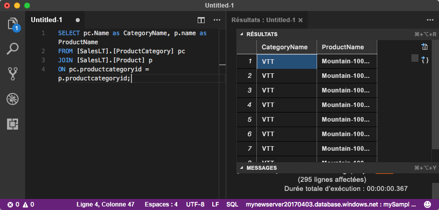

# <a name="quickstart-use-visual-studio-code-to-connect-and-query-an-azure-sql-database"></a>Démarrage rapide : utiliser Visual Studio Code pour vous connecter et interroger une base de données SQL Azure

[Visual Studio Code](https://code.visualstudio.com/docs) est un éditeur de code graphique pour Linux, macOS et Windows. Il prend en charge les extensions, notamment [l’extension mssql](https://aka.ms/mssql-marketplace) pour l’exécution de requêtes dans Microsoft SQL Server, Azure SQL Database et SQL Data Warehouse. Dans ce guide de démarrage rapide, vous utilisez Visual Studio Code pour vous connecter à une base de données SQL Azure, puis exécutez des instructions Transact-SQL pour interroger, insérer, mettre à jour et supprimer des données.

## <a name="prerequisites"></a>Prérequis

Pour suivre ce didacticiel, vous avez besoin des éléments suivants :

[!INCLUDE [prerequisites-create-db](../../includes/sql-database-connect-query-prerequisites-create-db-includes.md)]

#### <a name="install-visual-studio-code"></a>Installation de Visual Studio Code

Assurez-vous d'avoir installé la dernière version de [Visual Studio Code](https://code.visualstudio.com/Download) et chargé l’[extension mssql](https://aka.ms/mssql-marketplace). Pour obtenir des conseils d’installation concernant l’extension mssql, consultez [Installation de VS Code](https://docs.microsoft.com/sql/linux/sql-server-linux-develop-use-vscode#install-vs-code) et [mssql pour Visual Studio Code](https://marketplace.visualstudio.com/items?itemName=ms-mssql.mssql). 

## <a name="configure-visual-studio-code"></a>Configurer Visual Studio Code 

### <a name="mac-os"></a>**Mac OS**
Pour macOS, vous devez installer OpenSSL qui est un composant requis pour .Net Core utilisé par l’extension mssql. Ouvrez votre terminal et entrez les commandes ci-après pour installer **brew** et **OpenSSL**. 

```bash
ruby -e "$(curl -fsSL https://raw.githubusercontent.com/Homebrew/install/master/install)"
brew update
brew install openssl
mkdir -p /usr/local/lib
ln -s /usr/local/opt/openssl/lib/libcrypto.1.0.0.dylib /usr/local/lib/
ln -s /usr/local/opt/openssl/lib/libssl.1.0.0.dylib /usr/local/lib/
```

### <a name="linux-ubuntu"></a>**Linux (Ubuntu)**

Aucune configuration spéciale nécessaire.

### <a name="windows"></a>**Windows**

Aucune configuration spéciale nécessaire.

## <a name="sql-server-connection-information"></a>Informations de connexion SQL Server

[!INCLUDE [prerequisites-server-connection-info](../../includes/sql-database-connect-query-prerequisites-server-connection-info-includes.md)]

## <a name="set-language-mode-to-sql"></a>Définition du mode de langage sur SQL

Dans Visual Studio Code, définissez le mode de langage sur **SQL** pour activer les commandes mssql et T-SQL IntelliSense.

1. Ouvrez une nouvelle fenêtre Visual Studio Code. 

2. Appuyez sur **CTRL**+**N**. Un nouveau fichier texte brut s’ouvre. 

3. Sélectionnez **Texte brut** dans le coin inférieur droit de la barre d’état.

4. Dans le menu déroulant **Sélectionner un mode de langage** qui s’affiche, sélectionnez **SQL**. 

## <a name="connect-to-your-database"></a>Connectez-vous à votre base de données

Utilisez Visual Studio Code pour établir une connexion à votre serveur Azure SQL Database.

> [!IMPORTANT]
> Avant de poursuivre, vérifiez que votre serveur est prêt et que vous avez vos informations de connexion. Une fois que vous avez commencé à saisir les informations concernant le profil de connexion, si vous modifiez le focus à partir de Visual Studio Code, vous devez redémarrer la création du profil.
>

1. Dans Visual Studio Code, appuyez sur **Ctrl+Maj+P** (ou **F1**) pour ouvrir la Palette de commandes.

2. Sélectionnez **MS SQL : Se Connecter** et choisissez **Entrée**.

3. Sélectionnez **Créer un profil de connexion**.

4. Suivez les invites pour spécifier les propriétés du nouveau profil de connexion. Après avoir spécifié chaque valeur, choisissez **Entrée** pour continuer. 

   | Propriété       | Valeur suggérée | DESCRIPTION |
   | ------------ | ------------------ | ------------------------------------------------- | 
   | **Nom du serveur** | Nom complet du serveur | Similaire à ce qui suit : **mynewserver20170313.database.windows.net**. |
   | **Nom de la base de données** | mySampleDatabase | Base de données à laquelle se connecter. |
   | **Authentification** | Connexion SQL| Ce tutoriel utilise l’authentification SQL. |
   | **Nom d'utilisateur** | Nom d'utilisateur | Nom d'utilisateur du compte d'administrateur de serveur utilisé pour créer le serveur. |
   | **Mot de passe (connexion SQL)** | Mot de passe | Mot de passe du compte d'administrateur de serveur utilisé pour créer le serveur. |
   | **Enregistrer le mot de passe ?** | Oui ou Non | Sélectionnez **Oui** si vous ne souhaitez pas entrer le mot de passe à chaque fois. |
   | **Entrez un nom pour ce profil** | Nom de profil, par exemple **mySampleProfile** | Un profil enregistré permet d’accélérer votre connexion lors des connexions suivantes. | 

   Si cela aboutit, une notification s’affiche et indique que votre profil est créé et connecté.

## <a name="query-data"></a>Données de requête

Exécutez l’instruction Transact-SQL [SELECT](https://msdn.microsoft.com/library/ms189499.aspx) suivante pour interroger les 20 premiers produits par catégorie.

1. Dans la fenêtre de l'éditeur, collez la requête SQL suivante.

   ```sql
   SELECT pc.Name as CategoryName, p.name as ProductName
   FROM [SalesLT].[ProductCategory] pc
   JOIN [SalesLT].[Product] p
   ON pc.productcategoryid = p.productcategoryid;
   ```

2. Appuyez sur **Ctrl**+**Maj**+**E** pour exécuter la requête et afficher les résultats à partir des tables `Product` et `ProductCategory`.

    

## <a name="insert-data"></a>Insertion des données

Exécutez l’instruction Transact-SQL [INSERT](https://msdn.microsoft.com/library/ms174335.aspx) suivante pour ajouter un nouveau produit dans la table `SalesLT.Product`.

1. Remplacez la requête précédente par celle-ci.

   ```sql
   INSERT INTO [SalesLT].[Product]
           ( [Name]
           , [ProductNumber]
           , [Color]
           , [ProductCategoryID]
           , [StandardCost]
           , [ListPrice]
           , [SellStartDate]
           )
     VALUES
           ('myNewProduct'
           ,123456789
           ,'NewColor'
           ,1
           ,100
           ,100
           ,GETDATE() );
   ```

2. Appuyez sur **Ctrl**+**Maj**+**E** pour insérer une nouvelle ligne dans la table `Product`.

## <a name="update-data"></a>Mettre à jour des données

Exécutez l’instruction Transact-SQL [UPDATE](https://msdn.microsoft.com/library/ms177523.aspx) suivante pour mettre à jour le produit ajouté.

1. Remplacez la requête précédente par celle-ci :

   ```sql
   UPDATE [SalesLT].[Product]
   SET [ListPrice] = 125
   WHERE Name = 'myNewProduct';
   ```

2. Appuyez sur **Ctrl**+**Maj**+**E** pour mettre à jour la ligne spécifiée dans la table `Product`.

## <a name="delete-data"></a>Suppression de données

Exécutez l’instruction Transact-SQL [DELETE](https://docs.microsoft.com/sql/t-sql/statements/delete-transact-sql) suivante pour supprimer le nouveau produit.

1. Remplacez la requête précédente par celle-ci :

   ```sql
   DELETE FROM [SalesLT].[Product]
   WHERE Name = 'myNewProduct';
   ```

2. Appuyez sur **Ctrl**+**Maj**+**E** pour supprimer la ligne spécifiée dans la table `Product`.

## <a name="next-steps"></a>Étapes suivantes

- Pour vous connecter et effectuer des requêtes à l’aide de SQL Server Management Studio, consultez [Démarrage rapide : Utilisez SQL Server Management Studio pour vous connecter à une base de données SQL Azure et interroger les données](sql-database-connect-query-ssms.md).
- Pour vous connecter et effectuer des requêtes à l’aide du portail Azure, consultez [Démarrage rapide : Utilisez l’éditeur de requête SQL dans le portail Azure pour vous connecter et interroger les données](sql-database-connect-query-portal.md).
- Pour lire un article du magazine MSDN sur l’utilisation de Visual Studio Code, consultez le [billet de blog Créer un IDE de base de données avec une extension MSSQL](https://msdn.microsoft.com/magazine/mt809115).
