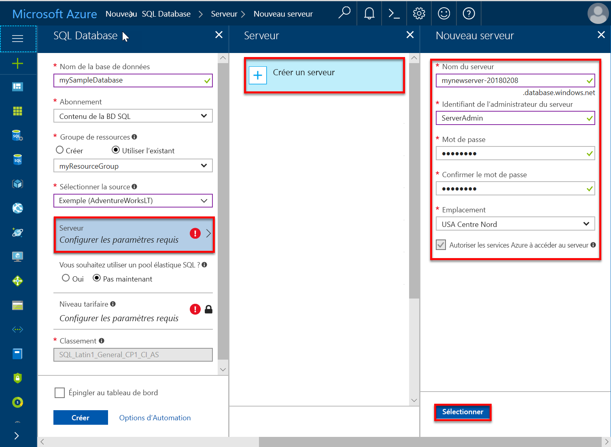
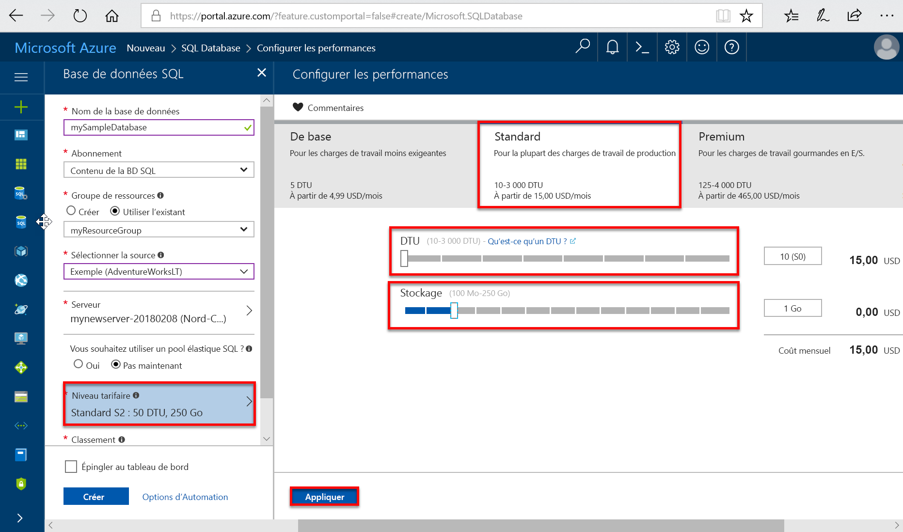
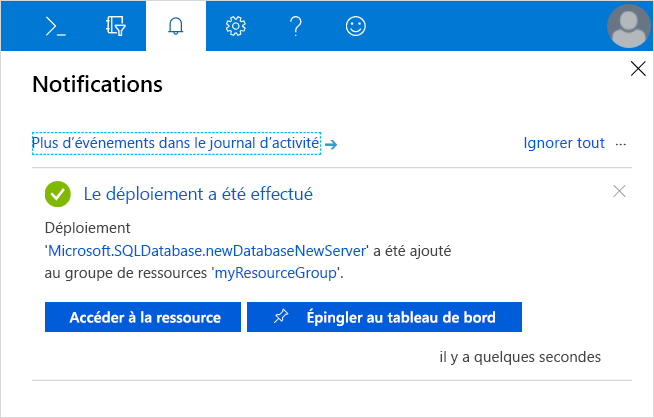
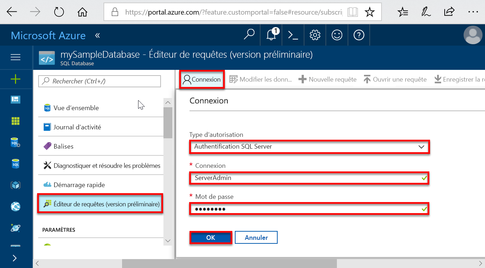
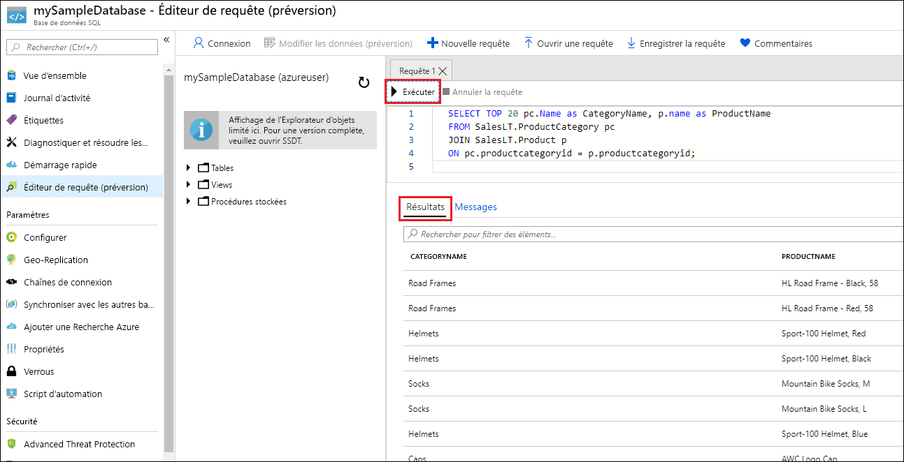

# <a name="quickstart-create-an-azure-sql-database-in-the-azure-portal"></a>Démarrage rapide : Création d’une base de données SQL Azure dans le portail Azure

Azure SQL Database est une offre de type *base de données en tant que service* qui vous permet d’exécuter et de mettre à l’échelle des bases de données SQL Server hautement disponibles dans le cloud. Ce guide de démarrage rapide vous montre comment commencer en créant une base de données SQL Azure à l’aide du Portail Azure, puis en effectuant des requêtes. 

Si vous n’avez pas d’abonnement Azure, [créez un compte gratuit](https://azure.microsoft.com/free/).

Pour toutes les étapes de ce guide de démarrage rapide, connectez-vous au [Portail Azure](https://portal.azure.com/).

## <a name="create-a-sql-database"></a>Créer une base de données SQL

Une base de données SQL Azure possède un ensemble défini de [ressources de calcul et de stockage](sql-database-service-tiers-dtu.md). La base de données est créée dans un [serveur logique Azure SQL Database](sql-database-features.md) à l’intérieur d’un [groupe de ressources Azure](../azure-resource-manager/resource-group-overview.md).

Comment créer une base de données SQL contenant les exemples de données Adventure Works LT :

1. Sélectionnez **Créer une ressource** dans le coin supérieur gauche du portail Azure.
   
1. Sélectionnez **Bases de données**, puis **Base de données SQL**.
   
1. Dans le formulaire **Créer une base de données SQL**, tapez ou sélectionnez les valeurs suivantes : 
   
   - **Nom de la base de données** : Entrez *mySampleDatabase*.
   - **Abonnement**: Faites défiler la liste et sélectionnez l’abonnement approprié, s’il n’apparaît pas.
   - **Groupe de ressources** : Sélectionnez **Créer**, entrez *myResourceGroup* et sélectionnez **OK**. 
   - **Sélectionner la source** : Sélectionnez **Sample (AdventureWorksLT)** dans la liste.
    
    >[!IMPORTANT]
    >Veillez à sélectionner les données **Exemple (AdventureWorksLT)** pour pouvoir suivre le présent guide ainsi que d’autres articles dédiés à Azure SQL Database qui utilisent ces données.
  
   
   
1. Sous **Serveur**, sélectionnez **Créer**. 
   
1. Dans le formulaire **Nouveau serveur**, saisissez ou sélectionnez les valeurs suivantes : 
   
   - **Nom du serveur** : Entrez *mysqlserver*.
   - **Connexion administrateur au serveur** : Tapez *azureuser*. 
   - **Mot de passe** : Entrez *Azure1234567*. 
   - **Confirmer le mot de passe** : Retapez le mot de passe.
   - **Emplacement** : Sélectionnez n’importe quel emplacement valide dans la liste.  
   
   >[!IMPORTANT]
   >Mémorisez votre nom d’utilisateur et mot de passe de connexion d’administrateur au serveur, car vous en aurez besoin pour vous connecter au serveur et aux bases de données dans le cadre de ce guide ou d’autres guides de démarrage rapide. Si vous oubliez votre mot de passe ou vos identifiants de connexion, vous pouvez obtenir le nom de connexion ou réinitialiser le mot de passe sur la page **SQL Server**. Pour ouvrir la page **SQL Server** , sélectionnez le nom du serveur sur la page **Vue d’ensemble** de la base de données une fois cette dernière créée.
   
    

1. Choisissez **Select**.
   
1. Sur le formulaire **SQL Database**, sélectionnez **Niveau tarifaire**. Explorez la quantité de DTU et de stockage disponible pour chaque niveau de service.
   
   >[!NOTE]
   >Ce gudie de démarrage rapide utilise le [modèle d’achat DTU](sql-database-service-tiers-dtu.md), mais le [modèle d’achat vCore](sql-database-service-tiers-vcore.md) est également disponible.
   
   >[!NOTE]
   >Un espace de stockage supérieur à 1 To au niveau Premium est actuellement disponible dans les toutes régions sauf les suivantes : Royaume-Uni Nord, USA Centre-Ouest, Royaume-Uni Sud 2, Chine Est, USDoDCentral, Allemagne Centre, USDoDEast, US Gov Sud-Ouest, US Gov Centre-Sud, Allemagne Nord-Est, Chine Nord et US Gov Est. Dans ces régions, l’espace de stockage maximal au niveau Premium est limité à 1 To. Pour plus d’informations, voir les [limitations actuelles P11-P15](sql-database-dtu-resource-limits-single-databases.md#single-database-limitations-of-p11-and-p15-when-the-maximum-size-greater-than-1-tb).  
   
1. Pour ce démarrage rapide, sélectionnez le niveau de service **Standard** et utilisez le curseur pour sélectionner **10 DTU (S0)** et **1** Go de stockage.
   
1. Sélectionnez **Appliquer**.  
   
   
   
1. Sur le formulaire **SQL Database**, sélectionnez **Créer** pour déployer et configurer le groupe de ressources, le serveur et la base de données. 
   
   Le déploiement prend quelques minutes. Pour surveiller la progression du déploiement, sélectionnez **Notifications** dans la barre d’outils.

   

## <a name="query-the-sql-database"></a>Interroger la base de données SQL

Maintenant que vous avez créé une base de données Azure SQL, utilisez l’outil de requête intégré au Portail Azure pour vous connecter à la base de données et interroger les données.

1. Sur la page **SQL Database** de votre base de données, sélectionnez **Éditeur de requête (préversion)** dans le menu de gauche. 
   
   
   
1. Entrez vos informations de connexion, puis sélectionnez **OK**.
   
1. Entrez la requête suivante dans le volet **Éditeur de requêtes**.
   
   ```sql
   SELECT TOP 20 pc.Name as CategoryName, p.name as ProductName
   FROM SalesLT.ProductCategory pc
   JOIN SalesLT.Product p
   ON pc.productcategoryid = p.productcategoryid;
   ```
   
1. Sélectionnez **Exécuter**, puis passez en revue les résultats de la requête dans le volet **Résultats**.

   
   
1. Fermez la page **Éditeur de requêtes**, puis sélectionnez **OK** à l’invite pour ignorer les modifications que vous n’avez pas enregistrées.

## <a name="clean-up-resources"></a>Supprimer des ressources

Conservez ce groupe de ressources, ce serveur SQL et cette base de données SQL pour accéder aux [Étapes suivantes](#next-steps). Les étapes suivantes vous montrent comment vous connecter à votre base de données et comment l’interroger via différentes méthodes. 

Une fois que vous avez fini d’utiliser ces ressources, vous pouvez les supprimer comme suit :

1. Dans le menu de gauche du Portail Azure, cliquez sur **Groupes de ressources**, puis sur **myResourceGroup**.
1. Dans la page de votre groupe de ressources, sélectionnez **Supprimer le groupe de ressources**. 
1. Entrez *myResourceGroup* dans le champ, puis sélectionnez **Supprimer**.

## <a name="next-steps"></a>Étapes suivantes

- Créez une règle de pare-feu au niveau du serveur pour vous connecter à votre base de données SQL Azure à l’aide d’outils de contrôle locaux ou à distance. Pour plus d’informations, consultez [Créer une règle de pare-feu au niveau du serveur](sql-database-get-started-portal-firewall.md).
- Après avoir créé une règle de pare-feu au niveau du serveur, [connectez et interrogez](sql-database-connect-query.md) votre base de données à l’aide de plusieurs outils et langues différents. 
  - [Se connecter et effectuer des requêtes à l’aide de SQL Server Management Studio](sql-database-connect-query-ssms.md)
  - [Se connecter et effectuer des requêtes à l’aide d’Azure Data Studio](https://docs.microsoft.com/sql/azure-data-studio/quickstart-sql-database?toc=/azure/sql-database/toc.json)
- Pour créer des bases de données SQL Azure à l’aide d’Azure CLI, consultez [Exemples d’interface de ligne de commande Azure](sql-database-cli-samples.md).
- Pour créer des bases de données SQL Azure à l’aide d’Azure PowerShell, consultez [Exemples Azure PowerShell](sql-database-powershell-samples.md).
