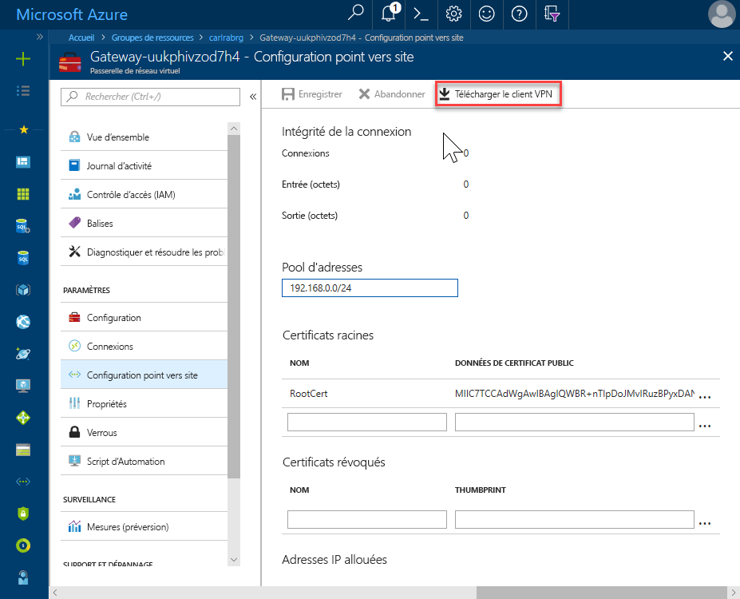
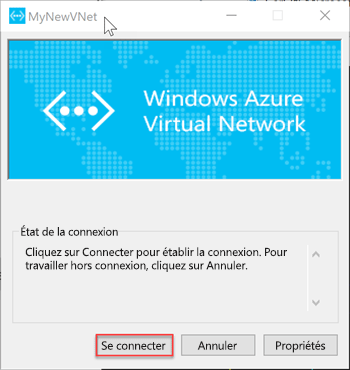

# <a name="quickstart-configure-a-point-to-site-connection-to-an-azure-sql-database-managed-instance-from-on-premises"></a>Démarrage rapide : configurer une connexion point à site sur Azure SQL Database Managed Instance à partir d’un emplacement local

Ce guide de démarrage rapide vous montre comment vous connecter à Azure SQL Database Managed Instance à l’aide de [SQL Server Management Studio](https://docs.microsoft.com/sql/ssms/sql-server-management-studio-ssms) (SSMS) à partir d’un ordinateur client local via une connexion point à site. Pour plus d’informations sur les connexions point à site, consultez l’article [À propos des VPN point à site](../vpn-gateway/point-to-site-about.md).

## <a name="prerequisites"></a>Conditions préalables requises

Dans ce guide de démarrage rapide :

- Utilise les ressources créées dans [Créer une instance gérée](sql-database-managed-instance-get-started.md) comme point de départ.
- PowerShell 5.1 et Azure PowerShell 1.4.0 ou ultérieur doivent être installés sur votre ordinateur client local. Au besoin, consultez les instructions d’[installation du module Azure PowerShell](https://docs.microsoft.com/powershell/azure/install-az-ps#install-the-azure-powershell-module).
- La version la plus récente de [SQL Server Management Studio](https://docs.microsoft.com/sql/ssms/sql-server-management-studio-ssms) (SSMS) doit être installée sur votre ordinateur client local.

## <a name="attach-a-vpn-gateway-to-your-managed-instance-virtual-network"></a>Attacher une passerelle VPN à votre réseau virtuel Managed Instance

1. Ouvrez PowerShell sur votre ordinateur client local.

2. Copiez ce script PowerShell. Ce script attache une passerelle VPN au réseau virtuel Managed Instance que vous avez créé dans le guide de démarrage rapide [Créer une instance gérée](sql-database-managed-instance-get-started.md). Ce script utilise le module Azure PowerShell Az et effectue les opérations suivantes pour les hôtes basés sur Windows ou Linux :

   - Il crée et installe des certificats sur l’ordinateur client.
   - Il calcule la future plage d’adresses IP du sous-réseau de la passerelle VPN.
   - Il crée le sous-réseau de la passerelle.
   - Il déploie le modèle Azure Resource Manager qui attache la passerelle VPN au sous-réseau VPN.

     ```powershell
     $scriptUrlBase = 'https://raw.githubusercontent.com/Microsoft/sql-server-samples/master/samples/manage/azure-sql-db-managed-instance/attach-vpn-gateway'

     $parameters = @{
       subscriptionId = '<subscriptionId>'
       resourceGroupName = '<resourceGroupName>'
       virtualNetworkName = '<virtualNetworkName>'
       certificateNamePrefix  = '<certificateNamePrefix>'
       }

     Invoke-Command -ScriptBlock ([Scriptblock]::Create((iwr ($scriptUrlBase+'/attachVPNGateway.ps1?t='+ [DateTime]::Now.Ticks)).Content)) -ArgumentList $parameters, $scriptUrlBase
     ```

3. Collez le script dans votre fenêtre PowerShell et indiquez les paramètres obligatoires. Les valeurs des paramètres `<subscriptionId>`, `<resourceGroup>` et `<virtualNetworkName>` doivent correspondre à celles que vous avez utilisées dans le guide de démarrage rapide [Créer une instance gérée](sql-database-managed-instance-get-started.md). Pour le paramètre `<certificateNamePrefix>`, vous pouvez saisir la chaîne de votre choix.

4. Exécutez le script PowerShell.

> [!IMPORTANT]
> Ne continuez pas tant que le script PowerShell n’est pas terminé.

## <a name="create-a-vpn-connection-to-your-managed-instance"></a>Créer une connexion VPN à votre instance Managed Instance

1. Connectez-vous au [portail Azure](https://portal.azure.com/).
2. Ouvrez le groupe de ressources dans lequel vous avez créé la passerelle de réseau virtuel, puis ouvrez la ressource de la passerelle de réseau virtuel.
3. Sélectionnez **Configuration de point à site**, puis **Télécharger le client VPN**.

      
4. Sur votre ordinateur client local, décompressez le fichier zip, puis ouvrez le dossier contenant les fichiers extraits.
5. Ouvrez le dossier `**WindowsAmd64** et le fichier **VpnClientSetupAmd64.exe**.
6. Si le message **Windows a protégé votre ordinateur** apparaît, cliquez sur **Informations complémentaires**, puis sur **Exécuter quand même**.

    \
7. Dans la boîte de dialogue du contrôle de compte d’utilisateur, cliquez sur **Oui** pour continuer.
8. Dans la boîte de dialogue de votre réseau virtuel, sélectionnez **Oui** pour installer le client VPN qui lui correspond.

## <a name="connect-to-the-vpn-connection"></a>Établir la connexion VPN

1. Accédez à **VPN** dans **Réseau et Internet** sur votre ordinateur client local et sélectionnez votre réseau virtuel Managed Instance pour établir une connexion à ce réseau virtuel. Dans l’image suivante, le réseau virtuel est nommé **MyNewVNet**.

      
2. Sélectionnez **Connecter**.
3. Dans la boîte de dialogue, sélectionnez **Connecter**.

      
4. Lorsque vous êtes invité à accorder un privilège élevé au gestionnaire de connexions pour mettre à jour votre table d’itinéraires, choisissez **Continuer**.
5. Sélectionnez **Oui** dans la boîte de dialogue du contrôle de compte d’utilisateur pour continuer.

   Vous avez établi une connexion VPN à votre réseau virtuel Managed Instance.

      

## <a name="use-ssms-to-connect-to-the-managed-instance"></a>Utiliser SSMS pour se connecter à l’instance managée

1. Sur l’ordinateur client local, ouvrez SQL Server Management Studio (SSMS).
2. Dans la boîte de dialogue **Se connecter au serveur**, entrez le **nom d’hôte** complet de votre instance managée dans la zone **Nom du serveur**.
3. Sélectionnez **Authentification SQL Server**, fournissez votre nom d’utilisateur et votre mot de passe, puis sélectionnez **Connecter**.

      

Une fois que vous êtes connecté, vous pouvez afficher vos bases de données système et utilisateur dans le nœud Bases de données. Vous pouvez également afficher les différents objets des nœuds Sécurité, Objets serveur, Réplication, Gestion, SQL Server Agent et XEvent Profiler.

## <a name="next-steps"></a>Étapes suivantes

- Pour consulter le guide de démarrage rapide permettant de comprendre comment se connecter à partir d’une machine virtuelle Azure, consultez l’article [Configurer une connexion point à site](sql-database-managed-instance-configure-p2s.md).
- Pour obtenir une vue d’ensemble des options de connexion pour les applications, consultez [Connecter vos applications à Managed Instance](sql-database-managed-instance-connect-app.md).
- Pour restaurer une base de données SQL Server locale existante dans une instance managée, vous pouvez utiliser [Azure Database Migration Service (DMS) pour la migration](../dms/tutorial-sql-server-to-managed-instance.md) ou la [commande T-SQL RESTORE](sql-database-managed-instance-get-started-restore.md) pour effectuer la restauration à partir d’un fichier de sauvegarde de base de données.
