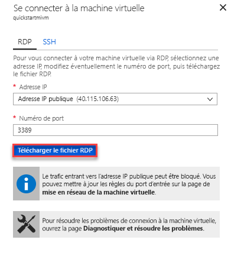

# Démarrage rapide : Configurer la machine virtuelle Azure pour qu’elle se connecte à Azure SQL Database Managed Instance

Ce guide de démarrage rapide vous montre comment configurer une machine virtuelle Azure pour qu’elle se connecte à une instance Azure SQL Database Managed Instance à l’aide de SQL Server Management Studio (SSMS). Pour un guide de démarrage rapide montrant comment se connecter à partir d’un ordinateur client local à l’aide d’une connexion point à site, consultez [Configurer une connexion point à site](sql-database-managed-instance-configure-p2s.md).

## Prérequis

Ce guide de démarrage rapide utilise les ressources créées dans [Créer une instance managée](sql-database-managed-instance-get-started.md) comme point de départ.

## Connectez-vous au portail Azure.

Connectez-vous au [portail Azure](https://portal.azure.com/).

## Créer un sous-réseau dans le réseau virtuel Managed Instance

Les étapes suivantes créent un sous-réseau dans le réseau virtuel Managed Instance pour permettre à une machine virtuelle Azure de se connecter à l’instance managée. Le sous-réseau Managed Instance est dédié à des instances managées. Vous ne pouvez pas créer d’autres ressources que sont notamment les machines virtuelles Azure dans ce sous-réseau.

1. Ouvrez le groupe de ressources pour l’instance managée que vous avez créée dans le guide de démarrage rapide[Créer une instance managée](sql-database-managed-instance-get-started.md). Sélectionnez le réseau virtuel pour votre instance managée.

   

2. Sélectionnez **Sous-réseaux** et **+ Sous-réseau** pour créer un sous-réseau.

   

3. Remplissez le formulaire en utilisant les informations contenues dans ce tableau :

   | Paramètre| Valeur suggérée | Description |
   | ---------------- | ----------------- | ----------- |
   | **Nom** | Nom valide|Pour connaître les noms valides, consultez [Conventions d’affectation de noms](/azure/architecture/best-practices/resource-naming).|
   | **Plage d’adresses (bloc CIDR)** | Plage valide | La valeur par défaut convient pour ce guide de démarrage rapide.|
   | **Groupe de sécurité réseau** | None | La valeur par défaut convient pour ce guide de démarrage rapide.|
   | **Table de routage** | None | La valeur par défaut convient pour ce guide de démarrage rapide.|
   | **Points de terminaison de service** | 0 sélectionné | La valeur par défaut convient pour ce guide de démarrage rapide.|
   | **Délégation de sous-réseau** | None | La valeur par défaut convient pour ce guide de démarrage rapide.|

   

4. Sélectionnez **OK** pour créer ce sous-réseau supplémentaire dans le réseau virtuel Managed Instance.

## Créer une machine virtuelle dans le nouveau sous-réseau du réseau virtuel

Les étapes suivantes vous montrent comment créer une machine virtuelle dans le nouveau réseau virtuel pour vous connecter à l’instance managée.

## Préparer la machine virtuelle Azure

Dans la mesure où l’instance managée SQL est placée dans votre réseau virtuel privé, vous devez créer une machine virtuelle Azure et y installer un outil client SQL comme SQL Server Management Studio ou Azure Data Studio. Cet outil vous permet de vous connecter à l’instance managée et d’exécuter des requêtes. Ce guide de démarrage rapide utilise SQL Server Management Studio.

Pour créer une machine virtuelle cliente avec tous les outils nécessaires, le plus simple consiste à utiliser les modèles Azure Resource Manager.

1. Vérifiez que vous êtes connecté au portail Azure dans un autre onglet de navigateur. Cliquez ensuite sur le bouton suivant pour créer une machine virtuelle cliente et installer SQL Server Management Studio :

    

2. Remplissez le formulaire en utilisant les informations contenues dans le tableau suivant :

   | Paramètre| Valeur suggérée | Description |
   | ---------------- | ----------------- | ----------- |
   | **Abonnement** | Un abonnement valide | Doit être un abonnement dans lequel vous êtes autorisé à créer des ressources. |
   | **Groupe de ressources** |Groupe de ressources que vous avez spécifié dans le guide de démarrage rapide [Créer une instance managée](sql-database-managed-instance-get-started.md).|Ce groupe de ressources doit être celui dans lequel se trouve le réseau virtuel.|
   | **Lieu** | Emplacement du groupe de ressources | Cette valeur est renseignée en fonction du groupe de ressources sélectionné. |
   | **Nom de la machine virtuelle**  | Nom valide | Pour connaître les noms valides, consultez [Conventions d’affectation de noms](/azure/architecture/best-practices/resource-naming).|
   |**Nom de l’utilisateur administrateur**|Tout nom d’utilisateur valide|Pour connaître les noms valides, consultez [Conventions d’affectation de noms](/azure/architecture/best-practices/resource-naming). N’utilisez pas « serveradmin », car il s’agit d’un rôle réservé au niveau du serveur. Vous utilisez ce nom d’utilisateur chaque fois que vous vous [connectez à la machine virtuelle](#connect-to-virtual-machine).|
   |**Mot de passe**|Mot de passe valide|Le mot de passe doit contenir au moins 12 caractères et satisfaire aux [exigences de complexité définies](../virtual-machines/windows/faq.md#what-are-the-password-requirements-when-creating-a-vm). Vous utilisez ce mot de passe chaque fois que vous vous [connectez à la machine virtuelle](#connect-to-virtual-machine).|
   | **Taille de la machine virtuelle** | Toute taille valide | La valeur par défaut **Standard_B2s** de ce modèle est suffisante pour ce guide de démarrage rapide. |
   | **Lieu**|[resourceGroup().location].| Ne changez pas cette valeur. |
   | **Nom du réseau virtuel**|Réseau virtuel dans lequel vous avez créé l’instance gérée.|
   | **Nom du sous-réseau**|Nom du sous-réseau que vous avez créé dans la procédure précédente| Ne choisissez pas le sous-réseau dans lequel vous avez créé l’instance managée.|
   | **Emplacement des artefacts** | [deployment().properties.templateLink.uri] | Ne changez pas cette valeur. |
   | **Jeton SAP de l’emplacement des artefacts** | laisser vide | Ne changez pas cette valeur. |

   

   Si vous avez utilisé le nom de réseau virtuel suggéré et le sous-réseau par défaut dans [Créer une instance managée](sql-database-managed-instance-get-started.md), vous n’avez pas besoin de modifier les deux derniers paramètres. Sinon, vous devez remplacer ces valeurs par les valeurs que vous avez entrées lorsque vous avez configuré l’environnement réseau.

3. Cochez la case **J’accepte les termes et conditions mentionnés ci-dessus**.
4. Sélectionnez **Acheter** pour déployer la machine virtuelle Azure dans votre réseau.
5. Sélectionnez l’icône **Notifications** pour afficher l’état du déploiement.

> [!IMPORTANT]
> Attendez environ 15 minutes après la création de la machine virtuelle afin de donner le temps aux scripts de post-création d'installer SQL Server Management Studio.

## Connexion à la machine virtuelle

Les étapes suivantes vous montrent comment vous connecter à votre machine virtuelle nouvellement créée à l’aide d’une connexion Bureau à distance.

1. Une fois le déploiement terminé, accédez à la ressource de machine virtuelle.

      

2. Sélectionnez **Connecter**.

   Un formulaire de fichier .rdp (Remote Desktop Protocol) s’affiche avec l’adresse IP publique et le numéro de port de la machine virtuelle.

     

3. Sélectionnez **Télécharger le fichier RDP**.

   > [!NOTE]
   > Vous pouvez également utiliser le protocole SSH pour vous connecter à votre machine virtuelle.

4. Fermez le formulaire **Se connecter à la machine virtuelle**.
5. Pour vous connecter à votre machine virtuelle, ouvrez le fichier RDP téléchargé.
6. Lorsque vous y êtes invité, sélectionnez **Connexion**. Sur un Mac, vous avez besoin d’un client RDP similaire à ce [Client Bureau à distance](https://apps.apple.com/app/microsoft-remote-desktop-10/id1295203466?mt=12) disponible sur le Mac App Store.

7. Entrez le nom d’utilisateur et le mot de passe que vous avez spécifiés au moment de créer la machine virtuelle, puis choisissez **OK**.

8. Un avertissement de certificat peut s’afficher pendant le processus de connexion. Choisissez **Oui** ou **Continuer** pour établir la connexion.

Vous êtes connecté à votre machine virtuelle dans le tableau de bord Gestionnaire de serveur.

## Utiliser SSMS pour se connecter à l’instance managée

1. Dans la machine virtuelle, ouvrez SQL Server Management Studio (SSMS).

   L’ouverture de SSMS est un peu plus longue à l’occasion de son premier démarrage, car il doit être configuré.
2. Dans la boîte de dialogue **Se connecter au serveur**, entrez le **nom d’hôte** complet de votre instance managée dans la zone **Nom du serveur**. Sélectionnez **Authentification SQL Server**, fournissez votre nom d’utilisateur et votre mot de passe, puis sélectionnez **Connecter**.

      

Après vous être connecté, vous pouvez voir votre système et vos bases de données utilisateur dans le nœud Bases de données, ainsi que divers objets dans les nœuds Sécurité, Objets serveur, Réplication, Gestion, SQL Server Agent et XEvent Profiler.

## Étapes suivantes

- Pour un guide de démarrage rapide montrant comment se connecter à partir d’un ordinateur client local à l’aide d’une connexion point à site, consultez [Configurer une connexion point à site](sql-database-managed-instance-configure-p2s.md).
- Pour obtenir une vue d’ensemble des options de connexion pour les applications, consultez [Connecter vos applications à Managed Instance](sql-database-managed-instance-connect-app.md).
- Pour restaurer une base de données SQL Server locale existante dans une instance managée, vous pouvez utiliser [Azure Database Migration Service (DMS) pour la migration](../dms/tutorial-sql-server-to-managed-instance.md) ou la [commande T-SQL RESTORE](sql-database-managed-instance-get-started-restore.md) pour effectuer la restauration à partir d’un fichier de sauvegarde de base de données.
