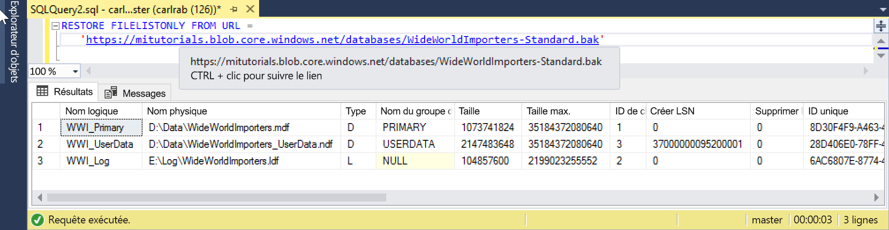

# <a name="restore-a-database-backup-to-an-azure-sql-database-managed-instance"></a>Restaurer une sauvegarde de base de données dans Azure SQL Database Managed Instance

Ce guide de démarrage rapide montre comment restaurer une sauvegarde d’une base de données stockée dans Stockage Blob Azure dans l’instance Managed Instance à l’aide du fichier de sauvegarde Wide World Importers - Standard. Cette méthode nécessite un temps d’arrêt. 

> [!VIDEO https://www.youtube.com/embed/RxWYojo_Y3Q]

Pour un tutoriel utilisant le service Azure Database Migration Service (DMS) pour la migration, consultez [Migrer SQL vers Azure SQL Database Managed Instance](../dms/tutorial-sql-server-to-managed-instance.md). Pour une discussion des diverses méthodes migration, consultez [Migration d’une instance SQL Server vers Azure SQL Database Managed Instance](sql-database-managed-instance-migrate.md).

## <a name="prerequisites"></a>Prérequis

Dans ce guide de démarrage rapide :
- Nous utilisons la ressource créée dans le guide de démarrage rapide [Créer une instance gérée](sql-database-managed-instance-get-started.md) comme point de départ.
- La version la plus récente de [SQL Server Management Studio](https://docs.microsoft.com/sql/ssms/sql-server-management-studio-ssms) doit être installée sur votre ordinateur client local.
- Vous devez vous connecter à votre instance Managed Instance à l’aide de SQL Server Management Studio. Pour connaître les options de connectivité disponibles, consultez ces guides de démarrage rapide :
  - [Se connecter à une instance Azure SQL Database Managed Instance à partir d’une machine virtuelle Azure](sql-database-managed-instance-configure-vm.md)
  - [Se connecter à une instance Azure SQL Database Managed Instance à l’aide d’une connexion point à site](sql-database-managed-instance-configure-p2s.md)
- Nous utilisons un compte Stockage Blob Azure préconfiguré contenant le fichier de sauvegarde Wide World Importers - Standard (téléchargé à partir de https://github.com/Microsoft/sql-server-samples/releases/download/wide-world-importers-v1.0/WideWorldImporters-Standard.bak).

> [!NOTE]
> Pour plus d’informations sur la sauvegarde et la restauration d’une base de données SQL Server à l’aide de Stockage Blob Azure et d’une signature d’accès partagé (SAP), consultez [Sauvegarde SQL Server vers une URL](sql-database-managed-instance-get-started-restore.md).

## <a name="restore-the-wide-world-importers-database-from-a-backup-file"></a>Restaurer la base de données Wide World Importers à partir d’un fichier de sauvegarde

Avec SSMS, procédez comme suit pour restaurer la base de données Wide World Importers à partir du fichier de sauvegarde dans votre option Managed Instance.

1. Ouvrez SQL Server Management Studio (SSMS) et connectez-vous à votre instance Managed Instance.
2. Dans SSMS, ouvrez une nouvelle fenêtre de requête.
3. Utilisez le script suivant pour créer des informations d’identification dans l’instance Managed Instance à l’aide du compte de stockage préconfiguré et de la clé SAP.

   ```sql
   CREATE CREDENTIAL [https://mitutorials.blob.core.windows.net/databases] 
   WITH IDENTITY = 'SHARED ACCESS SIGNATURE'
   , SECRET = 'sv=2017-11-09&ss=bfqt&srt=sco&sp=rwdlacup&se=2028-09-06T02:52:55Z&st=2018-09-04T18:52:55Z&spr=https&sig=WOTiM%2FS4GVF%2FEEs9DGQR9Im0W%2BwndxW2CQ7%2B5fHd7Is%3D' 
   ```

    

    > [!NOTE]
    > Veillez à toujours supprimer le caractère **?** de début de la clé SAP générée.
  
3. Utilisez le script suivant pour vérifier les informations d’identification SAP et la validité de la sauvegarde, en fournissant l’URL du conteneur avec le fichier de sauvegarde :

   ```sql
   RESTORE FILELISTONLY FROM URL = 
      'https://mitutorials.blob.core.windows.net/databases/WideWorldImporters-Standard.bak'
   ```

    

4. Utilisez le script suivant pour restaurer la base de données Wide World Importers à partir d’un fichier de sauvegarde, en fournissant l’URL du conteneur avec le fichier de sauvegarde :

   ```sql
   RESTORE DATABASE [Wide World Importers] FROM URL =
     'https://mitutorials.blob.core.windows.net/databases/WideWorldImporters-Standard.bak'
   ```

    

5. Pour suivre l’état de votre restauration, exécutez la requête suivante dans une nouvelle session de requête :

   ```sql
   SELECT session_id as SPID, command, a.text AS Query, start_time, percent_complete
      , dateadd(second,estimated_completion_time/1000, getdate()) as estimated_completion_time 
   FROM sys.dm_exec_requests r 
   CROSS APPLY sys.dm_exec_sql_text(r.sql_handle) a 
   WHERE r.command in ('BACKUP DATABASE','RESTORE DATABASE')`
   ```

6. Une fois la restauration terminée, affichez-la dans l’Explorateur d’objets. 

## <a name="next-steps"></a>Étapes suivantes

- Pour résoudre les problèmes liés à la sauvegarde vers une URL, consultez [Bonnes pratiques et résolution des problèmes liés à la sauvegarde SQL Server vers une URL](https://docs.microsoft.com/sql/relational-databases/backup-restore/sql-server-backup-to-url-best-practices-and-troubleshooting).
- Pour une vue d’ensemble des options de connexion pour les applications, consultez [Connecter vos applications à Managed Instance](sql-database-managed-instance-connect-app.md).
- Pour lancer des requêtes à l’aide d’un de vos outils ou langages préférés, consultez [Se connecter et effectuer des requêtes](sql-database-connect-query.md).
