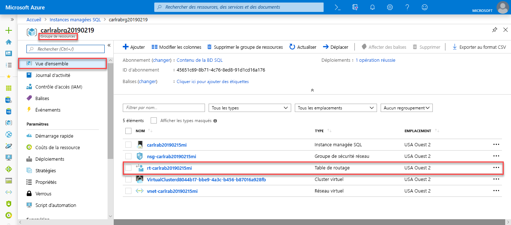
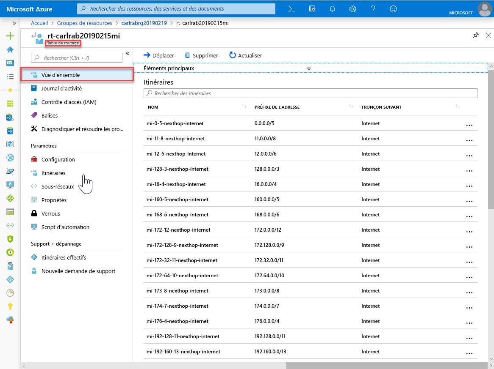
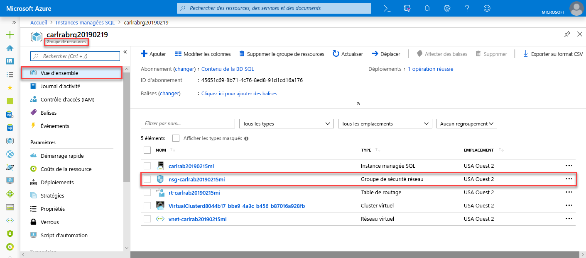
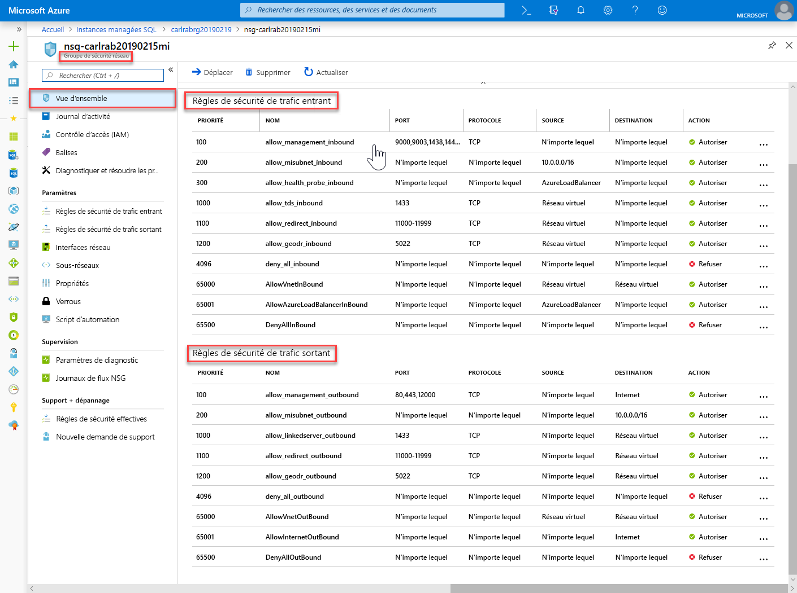
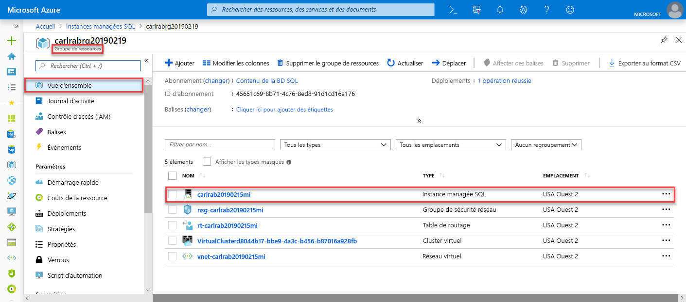

# Démarrage rapide : Créer une instance managée Azure SQL Database

Ce guide de démarrage rapide vous montre comment créer une [instance managée](sql-database-managed-instance.md) Azure SQL Database dans le portail Azure.

Si vous ne disposez pas d’abonnement Azure, créez un [compte gratuit](https://azure.microsoft.com/free/) avant de commencer.

## Connectez-vous au portail Azure.

Connectez-vous au [Portail Azure](https://portal.azure.com/).

## Créer une instance gérée

Les étapes suivantes détaillent la création d’une instance managée.

1. Sélectionnez **Créer une ressource** dans le coin supérieur gauche du Portail Azure.
2. Recherchez **managed instance**, puis sélectionnez **Azure SQL Managed Instance**.
3. Sélectionnez **Créer**.

   

4. Renseignez le formulaire de l’option **Instance managée SQL** avec les informations demandées, en utilisant les données du tableau suivant :

   | Paramètre| Valeur suggérée | Description |
   | ------ | --------------- | ----------- |
   | **Abonnement** | Votre abonnement | Abonnement dans lequel vous êtes autorisé à créer des ressources. |
   |**Nom de l’instance managée**|Nom valide|Pour connaître les noms valides, consultez les [conventions de nommage](https://docs.microsoft.com/azure/architecture/best-practices/naming-conventions).|
   |**Connexion administrateur de l’instance managée**|Nom d’utilisateur valide|Pour connaître les noms valides, consultez les [conventions de nommage](https://docs.microsoft.com/azure/architecture/best-practices/naming-conventions). N’utilisez pas « serveradmin », car il s’agit d’un rôle réservé au niveau du serveur.|
   |**Mot de passe**|Mot de passe valide|Le mot de passe doit contenir au moins 16 caractères et satisfaire aux [exigences de complexité définies](../virtual-machines/windows/faq.md#what-are-the-password-requirements-when-creating-a-vm).|
   |**Classement**|Classement à utiliser pour votre instance managée|Si vous migrez des bases de données depuis SQL Server, vérifiez le classement de la source avec `SELECT SERVERPROPERTY(N'Collation')` et utilisez cette valeur. Pour plus d’informations sur les classements, consultez les [classements au niveau du serveur](https://docs.microsoft.com/sql/relational-databases/collations/set-or-change-the-server-collation).|
   |**Lieu**|Emplacement dans lequel vous souhaitez créer l’instance managée|Pour plus d’informations sur les régions, consultez [Régions Azure](https://azure.microsoft.com/regions/).|
   |**Réseau virtuel**|Sélectionnez **Créer un réseau virtuel** ou un réseau virtuel et un sous-réseau valides.| Si un réseau/sous-réseau est grisé, il doit être [modifié pour respecter la configuration réseau exigée](sql-database-managed-instance-configure-vnet-subnet.md) avant de pouvoir être sélectionné en tant que cible pour la nouvelle instance managée. Pour obtenir des informations sur les exigences liées à la configuration de l’environnement réseau d’une instance managée, voir la [configuration d’un réseau virtuel pour une instance managée](sql-database-managed-instance-connectivity-architecture.md). |
   |**Groupe de ressources**|Nouveau groupe de ressources ou groupe de ressources existant.|Pour les noms de groupe de ressources valides, consultez [Naming conventions](https://docs.microsoft.com/azure/architecture/best-practices/naming-conventions) (Conventions d’affectation de nom).|

   

5. Pour utiliser l’instance managée en tant que groupe de basculement d’instances secondaire, activez la case à cocher de l’option et spécifiez l’instance managée DnsAzurePartner. Cette fonctionnalité est en préversion et ne figure pas dans la capture d’écran qui accompagne cet article.
6. Sélectionnez **Niveau tarifaire** pour dimensionner les ressources de calcul et de stockage, ainsi que pour examiner les options de niveau tarifaire. Le niveau tarifaire Usage général avec 32 Go de mémoire et 16 vCores est la valeur par défaut.
7. Utilisez les curseurs ou zones de texte pour spécifier la quantité de stockage et le nombre de v-cores.
8. Lorsque vous avez terminé, choisissez **Appliquer** pour enregistrer votre sélection.  
9. Sélectionnez **Créer** pour déployer l’instance managée.
10. Sélectionnez l’icône **Notifications** pour afficher l’état du déploiement.

    

11. Sélectionnez **Déploiement en cours** pour ouvrir la fenêtre de l’instance managée et superviser de façon plus approfondie la progression du déploiement.

> [!IMPORTANT]
> Pour la première instance dans un sous-réseau, la durée de déploiement est généralement plus importante que pour les instances ultérieures. N’annulez pas l’opération de déploiement car elle dure plus longtemps que prévu. La création de la deuxième instance managée dans le sous-réseau ne prend que quelques minutes.

## Passer en revue les ressources et récupérer le nom complet du serveur

Une fois le déploiement terminé, passez en revue les ressources créées et récupérez le nom complet du serveur en vue d’une utilisation dans les guides de démarrage rapide ultérieurs.

1. Ouvrez le groupe de ressources de votre instance managée et examinez les ressources créées pour vous dans le démarrage rapide, à la [création d’une instance managée](#create-a-managed-instance).

   

2. Sélectionnez la table de routage pour examiner celle définie par l’utilisateur, qui a été créée pour vous.

   

3. Dans la table de routage, passez en revue les entrées pour acheminer le trafic à partir du réseau virtuel de l’instance managée et au sein de celui-ci. Si vous créez ou configurez votre table de routage manuellement, vous devez veiller à créer ces entrées dans la table de routage.

   

4. Revenez au groupe de ressources et sélectionnez le groupe de sécurité réseau pour examiner les règles de sécurité.

   

5. Passez en revue les règles de sécurité entrantes et sortantes.

   

6. Revenez au groupe de ressources et sélectionnez votre instance managée.

   

7. Sous l’onglet **Vue d’ensemble**, recherchez la propriété **Hôte** et copiez l’adresse complète de l’hôte pour l’instance managée, car elle va vous être utile dans le prochain guide de démarrage rapide.

   

   Le nom est similaire à **nom_de_votre_machine.a1b2c3d4e5f6.database.windows.net**.

## Étapes suivantes

- Pour savoir comment se connecter à une instance managée, consultez les références suivantes :
  - Pour obtenir une vue d’ensemble des options de connexion pour les applications, voir [Connecter vos applications à une instance managée](sql-database-managed-instance-connect-app.md).
  - Pour obtenir un guide de démarrage rapide montrant comment se connecter à une instance managée à partir d’une machine virtuelle Azure, voir [Configurer une connexion de machine virtuelle Azure](sql-database-managed-instance-configure-vm.md).
  - Pour obtenir un guide de démarrage rapide montrant comment se connecter à une instance managée à partir d’un ordinateur client local avec une connexion point à site, voir [Configurer une connexion point à site](sql-database-managed-instance-configure-p2s.md).
- Pour restaurer une base de données SQL Server locale existante vers une instance Managed Instance, vous pouvez utiliser [Azure Database Migration Service (DMS) pour la migration](../dms/tutorial-sql-server-to-managed-instance.md) ou la [commande T-SQL RESTORE](sql-database-managed-instance-get-started-restore.md) afin d’effectuer la restauration à partir d’un fichier de sauvegarde de base de données.
- Pour une supervision avancée des performances de base de données d’instance managée avec des informations de dépannage intégrées, consultez [Superviser Azure SQL Database avec Azure SQL Analytics](../azure-monitor/insights/azure-sql.md)
