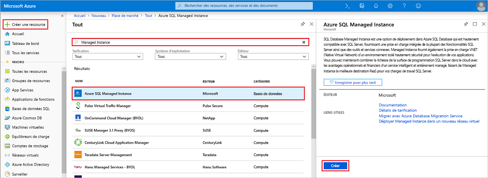
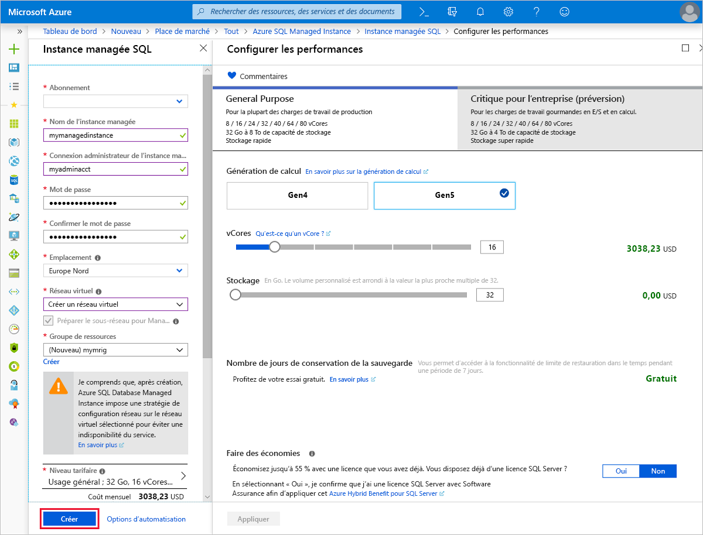
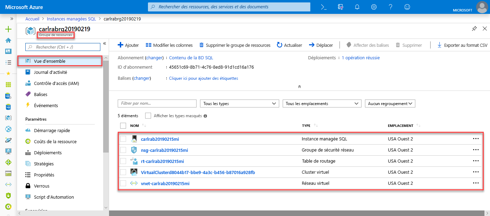
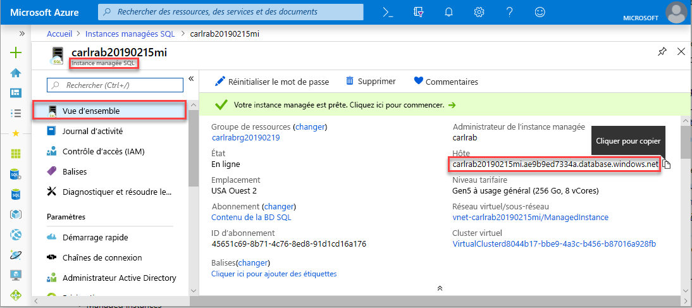

# Créer une instance Azure SQL Database Managed Instance

Ce guide de démarrage rapide vous montre comment créer une instance Azure SQL Database [Managed Instance](sql-database-managed-instance.md) dans le portail Azure. 

Si vous n’avez pas d’abonnement Azure, créez un compte [gratuit](https://azure.microsoft.com/free/) avant de commencer.

## Connectez-vous au portail Azure.

Connectez-vous au [Portail Azure](https://portal.azure.com/).

## Créer une option Managed Instance

La procédure suivante explique comment créer une instance Managed Instance.

1. Cliquez sur **Créer une ressource** en haut à gauche du portail Azure.
2. Recherchez **Managed Instance**, puis sélectionnez **Azure SQL Managed Instance**.
3. Cliquez sur **Créer**.

   

4. Remplissez le formulaire de l’option Managed Instance avec les informations demandées, en utilisant les données du tableau suivant :

   | Paramètre| Valeur suggérée | Description |
   | ------ | --------------- | ----------- |
   | **Abonnement** | Votre abonnement | Abonnement dans lequel vous êtes autorisé à créer des ressources. |
   |**Nom de l’instance managée**|Nom valide|Pour connaître les noms valides, consultez [Conventions d’affectation de noms](https://docs.microsoft.com/azure/architecture/best-practices/naming-conventions).|
   |**Connexion administrateur de l’instance managée**|Nom d’utilisateur non valide|Pour connaître les noms valides, consultez [Conventions d’affectation de noms](https://docs.microsoft.com/azure/architecture/best-practices/naming-conventions). N’utilisez pas « serveradmin », car il s’agit d’un rôle réservé au niveau du serveur.| 
   |**Mot de passe**|Mot de passe valide|Le mot de passe doit contenir au moins 16 caractères et satisfaire aux [exigences de complexité définies](../virtual-machines/windows/faq.md#what-are-the-password-requirements-when-creating-a-vm).|
   |**Groupe de ressources**|Nouveau groupe de ressources ou groupe de ressources existant.|Pour les noms de groupe de ressources valides, consultez [Naming conventions](https://docs.microsoft.com/azure/architecture/best-practices/naming-conventions) (Conventions d’affectation de nom).|
   |**Lieu**|Emplacement dans lequel vous souhaitez créer l’instance Managed Instance.|Pour plus d’informations sur les régions, consultez [Régions Azure](https://azure.microsoft.com/regions/).|
   |**Réseau virtuel**|Sélectionnez **Créer un réseau virtuel** ou un réseau virtuel créé précédemment dans le groupe de ressources que vous avez fourni précédemment dans ce formulaire.| Pour configurer un réseau virtuel pour une instance Managed Instance avec des paramètres personnalisés, consultez [Configurer un modèle d’environnement de réseau virtuel SQL Managed Instance](https://github.com/Azure/azure-quickstart-templates/tree/master/101-sql-managed-instance-azure-environment) dans GitHub. Pour plus d’informations sur les exigences liées à la configuration de l’environnement réseau pour une instance Managed Instance, consultez [Configurer un réseau virtuel pour Azure SQL Database Managed Instance](sql-database-managed-instance-vnet-configuration.md) |

   

5. Cliquez sur **Niveau de tarification** pour dimensionner les ressources de calcul et de stockage, ainsi que pour examiner les options de niveau tarifaire. Le niveau tarifaire Usage général avec 32 Go de mémoire et 16 vCores est la valeur par défaut.
6. Utilisez les curseurs ou zones de texte pour spécifier la quantité de stockage et le nombre de v-cores. 
7. Lorsque vous avez terminé, cliquez sur **Appliquer** pour enregistrer votre sélection.  
8. Cliquez sur **Créer** pour déployer l’option Managed Instance.
9. Cliquez sur l’icône **Notifications** pour afficher l’état du déploiement.

    

10. Cliquez sur **Déploiement en cours** pour ouvrir la fenêtre de l’option Managed Instance et surveiller de façon précise la progression du déploiement. 

> [!IMPORTANT]
> Pour la première instance dans un sous-réseau, la durée du déploiement est généralement plus importante que celle des instances suivantes. N’annulez pas l’opération de déploiement car elle dure plus longtemps que prévu. La création de la deuxième instance Managed Instance dans le sous-réseau ne prend que quelques minutes.

## Passer en revue les ressources et récupérer le nom complet du serveur

Une fois le déploiement terminé, passez en revue les ressources créées et récupérez le nom complet du serveur en vue d’une utilisation dans les guides de démarrage rapide ultérieurs.

1. Ouvrez le groupe de ressources de votre instance Managed Instance et examinez les ressources créés pour vous dans le guide de démarrage rapide [Créer une instance gérée](sql-database-managed-instance-get-started.md).

   Ouvrez votre ressource Managed Instance dans le portail Azure.

2. Cliquez sur votre instance Managed Instance.
3. Sous l’onglet **Vue d’ensemble**, recherchez la propriété **Hôte** et copiez l’adresse complète de l’hôte pour l’instance Managed Instance.

   

   Le nom est similaire à ceci : **nom_machine_virtuelle.neu15011648751ff.database.windows.net**.

## Étapes suivantes

- Pour savoir comment se connecter à une instance Managed Instance, consultez :
  - Pour obtenir une vue d’ensemble des options de connexion pour les applications, consultez [Connecter vos applications à Managed Instance](sql-database-managed-instance-connect-app.md).
  - Pour obtenir un guide de démarrage rapide montrant comment se connecter à une instance Managed Instance à partir d’une machine virtuelle Azure, consultez [Configurer une connexion de machine virtuelle Azure](sql-database-managed-instance-configure-vm.md).
  - Pour obtenir un guide de démarrage rapide montrant comment se connecter à une instance Managed Instance à partir d’un ordinateur client local à l’aide d’une connexion point à site, consultez [Configurer une connexion point à site](sql-database-managed-instance-configure-p2s.md).
- Pour restaurer une base de données SQL Server locale existante vers une instance Managed Instance, vous pouvez utiliser [Azure Database Migration Service (DMS) pour la migration](../dms/tutorial-sql-server-to-managed-instance.md) ou la [commande T-SQL RESTORE](sql-database-managed-instance-get-started-restore.md) afin d’effectuer la restauration à partir d’un fichier de sauvegarde de base de données.
