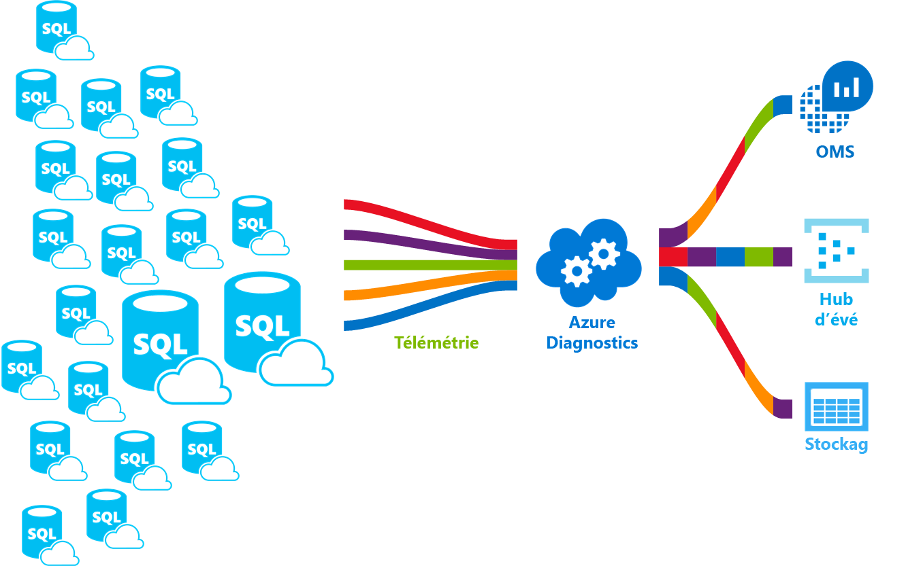

# <a name="configure-streaming-export-of-azure-sql-database-diagnostic-telemetry"></a>Configurer l’exportation en continu de la télémétrie de diagnostic d’Azure SQL Database

Dans cet article, vous allez découvrir les métriques de performances et les journaux des ressources pour Azure SQL Database que vous pouvez exporter vers l’une des différentes destinations à des fins d’analyse. Vous allez apprendre à configurer l’exportation en continu de cette télémétrie de diagnostic via le Portail Azure, PowerShell, Azure CLI, l’API REST et des modèles Azure Resource Manager.

Vous découvrirez également les destinations vers lesquelles vous pouvez transmettre en continu cette télémétrie de diagnostic et la manière de choisir parmi ces options. Vos options de destination sont les suivantes :

- [Log Analytics et SQL Analytics](#stream-into-sql-analytics)
- [Hubs d'événements](#stream-into-event-hubs)
- [Stockage Azure](#stream-into-azure-storage)

## <a name="diagnostic-telemetry-for-export-for-azure-sql-database"></a>Télémétrie de diagnostic pour l’exportation pour Azure SQL Database

Parmi les données de télémétrie de diagnostic que vous pouvez exporter, la plus importante est le journal Intelligent Insights (SQLInsights). [Intelligent Insights](sql-database-intelligent-insights.md) utilise l’intelligence intégrée pour surveiller en permanence l’utilisation de la base de données et détecter les événements perturbateurs entraînant des performances médiocres. Une fois un tel événement détecté, une analyse détaillée est effectuée, qui génère un journal Intelligent Insights avec une évaluation intelligente du problème. Cette évaluation se compose d’une analyse de cause racine du problème de performances de la base de données et, dans la mesure du possible, de recommandations pour une amélioration des performances. Vous devez configurer l’exportation en continu de ce journal pour en afficher le contenu.

En plus d’exporter en continu le journal Intelligent Insights, vous pouvez également exporter une variété de métriques de performances et des journaux SQL Database supplémentaires. Le tableau suivant décrit les métriques de performances et les journaux de ressources que vous pouvez configurer pour l’exportation en continu vers l’une des destinations possibles. Cette télémétrie de diagnostic peut être configurée pour des bases de données uniques, des pools élastiques et des bases de données mises en pool, ainsi que des instances gérées et des bases de données d’instance.

| Télémétrie de diagnostic pour les bases de données | Prise en charge d’une base de données unique et d’une base de données mise en pool | Prise en charge d'une base de données d'instance gérée |
| :------------------- | ----- | ----- |
| [Métriques de base](#basic-metrics) : Pourcentage DTU/CPU, Limite DTU/CPU, Pourcentage de lecture de données physiques, Pourcentage d’écriture du journal, Connexions réussies/en échec/bloquées par pare-feu, Pourcentage de sessions, Pourcentage de workers, Stockage, Pourcentage de stockage, Pourcentage de stockage XTP. | Oui | Non |
| [Métriques avancées d’instance et d’application](#advanced-metrics) : contient la taille du fichier journal et des données de la base de données système tempdb ainsi que le pourcentage d’utilisation du fichier journal de tempdb. | Oui | Non |
| [QueryStoreRuntimeStatistics](#query-store-runtime-statistics) : contient des informations sur les statistiques d’exécution de requête comme les statistiques concernant l’utilisation du processeur et la durée des requêtes. | Oui | Oui |
| [QueryStoreWaitStatistics](#query-store-wait-statistics) : contient des informations sur les statistiques d’attente des requêtes (ce que vos requêtes ont attendu) comme CPU, LOG et LOCKING. | Oui | Oui |
| [Erreurs](#errors-dataset) : contient des informations sur les erreurs SQL au niveau d’une base de données. | Oui | Oui |
| [DatabaseWaitStatistics](#database-wait-statistics-dataset) : contient des informations sur le temps qu’une base de données a passé à attendre différents types d’attente. | Oui | Non |
| [Timeouts](#time-outs-dataset) : contient des informations sur les erreurs SQL au niveau d’une base de données. | Oui | Non |
| [Blocks](#blockings-dataset) : contient des informations sur les événements bloquants au niveau d’une base de données. | Oui | Non |
| [Deadlocks](#deadlocks-dataset) : contient des informations sur les événements Deadlock au niveau d’une base de données. | Oui | Non |
| [AutomaticTuning](#automatic-tuning-dataset) : contient des informations sur les recommandations de réglage automatique pour une base de données. | Oui | Non |
| [SQLInsights](#intelligent-insights-dataset) : contient des informations Intelligent Insights relatives aux performances pour une base de données. Pour plus d’informations, consultez [Intelligent Insights](sql-database-intelligent-insights.md). | Oui | Oui |

> [!NOTE]
> Les paramètres de diagnostic ne peuvent pas être configurés pour les **bases de données système**, telles que les bases de données master, msdb, model, resource et tempdb.

## <a name="streaming-export-destinations"></a>Destinations de l’exportation en continu

Cette télémétrie de diagnostic peut être transmise en continu vers l’une des ressources Azure suivantes à des fins d’analyse.

- **[Espace de travail Log Analytics](#stream-into-sql-analytics)**  :

  Les données transmises en continu à un [espace de travail Log Analytics](../azure-monitor/platform/resource-logs-collect-workspace.md) peuvent être consommées par [SQL Analytics](../azure-monitor/insights/azure-sql.md). SQL Analytics est une solution de supervision cloud uniquement permettant une surveillance intelligente de vos bases de données, avec des rapports de performances, des alertes et des recommandations d’atténuation. Les données transmises en continu vers un espace de travail Log Analytics peuvent être analysées avec d’autres données de surveillance collectées, ce qui vous permet également d’exploiter d’autres fonctionnalités Azure Monitor, notamment les alertes et les visualisations.
- **[Azure Event Hubs](#stream-into-event-hubs)** :

  Les données transmises en continu à un [Event Hub Azure](../azure-monitor/platform/resource-logs-stream-event-hubs.md) offrent les fonctionnalités suivantes :

  - **Transmettre en continu des journaux vers des systèmes tiers de journalisation et de télémétrie** : Diffusion en continu de toutes vos métriques et de tous vos journaux de ressources vers un Event Hub unique pour envoyer les données de journal vers un outil SIEM ou d’analytique des journaux d’activité tiers.
  - **Créer une plateforme de journalisation et de télémétrie personnalisée** : La nature hautement évolutive d’Event Hubs et de son modèle publication-abonnement vous permet d’ingérer de manière flexible les métriques et les journaux de ressources dans une plateforme de télémétrie personnalisée. Pour plus d’informations, consultez [Conception et dimensionnement d’une plateforme de télémétrie à échelle mondiale sur Azure Event Hubs](https://azure.microsoft.com/documentation/videos/build-2015-designing-and-sizing-a-global-scale-telemetry-platform-on-azure-event-Hubs/).
  - **Afficher l’intégrité du service en transmettant en continu des données vers Power BI** : Utilisez Event Hubs, Stream Analytics et Power BI pour transformer vos données de diagnostic en informations en quasi temps réel sur vos services Azure. Consultez [Stream Analytics et Power BI : tableau de bord d’analyse en temps réel pour les données de streaming](https://docs.microsoft.com/azure/stream-analytics/stream-analytics-power-bi-dashboard) pour plus de détails sur cette solution.
- **[Stockage Azure](#stream-into-azure-storage)** :

  Les données transmises en continu à [Stockage Azure](../azure-monitor/platform/resource-logs-collect-storage.md) vous permettent d’archiver de grandes quantités de télémétrie de diagnostic pour une fraction du coût des deux options de diffusion en continu précédentes.

Cette télémétrie de diagnostic transmise à l’une de ces destinations peut être utilisée pour évaluer l’utilisation des ressources et les statistiques d’exécution de requête afin de faciliter la supervision des performances.



## <a name="enable-and-configure-the-streaming-export-of-diagnostic-telemetry"></a>Activer et configurer l’exportation en continu de la télémétrie de diagnostic

Vous pouvez activer et gérer la journalisation des métriques et de la télémétrie de diagnostic à l’aide de l’une des méthodes suivantes :

- Portail Azure
- PowerShell
- Azure CLI
- API REST Azure Monitor
- Modèle Azure Resource Manager

> [!NOTE]
> Pour activer la diffusion en continu des journaux d’audit de la télémétrie de sécurité, consultez [Configurer l’audit pour votre base de données](sql-database-auditing.md#setup-auditing) et les [journaux d’audit dans les journaux d’activité Azure Monitor et Azure Event Hubs](https://techcommunity.microsoft.com/t5/Azure-SQL-Database/SQL-Audit-logs-in-Azure-Log-Analytics-and-Azure-Event-Hubs/ba-p/386242).

## <a name="configure-the-streaming-export-of-diagnostic-telemetry"></a>Configurer l’exportation en continu de la télémétrie de diagnostic

Le menu **Paramètres de diagnostic** du Portail Azure vous permet d’activer et de configurer la diffusion en continu de la télémétrie de diagnostic. En outre, vous pouvez utiliser PowerShell, Azure CLI, l'[API REST](https://docs.microsoft.com/rest/api/monitor/diagnosticsettings) et les [modèles Resource Manager](../azure-monitor/platform/diagnostic-settings-template.md) pour configurer la diffusion en continu des données de télémétrie de diagnostic. Vous pouvez définir les destinations suivantes pour diffuser en continu la télémétrie de diagnostic : Stockage Azure, Azure Event Hubs et les journaux Azure Monitor.

> [!IMPORTANT]
> L’exportation en continu de la télémétrie de diagnostic n’est pas activée par défaut.

Sélectionnez l’un des onglets suivants pour obtenir des instructions pas à pas sur la configuration de l’exportation en continu de la télémétrie de diagnostic dans le Portail Azure, ainsi que des scripts pour accomplir la même chose avec PowerShell et Azure CLI.

# <a name="azure-portal"></a>[Azure portal](#tab/azure-portal)

### <a name="elastic-pools"></a>Pools élastiques

Vous pouvez configurer une ressource de pool élastique de sorte qu’elle collecte la télémétrie de diagnostic suivante :

| Ressource | Supervision des données de télémétrie |
| :------------------- | ------------------- |
| **Pool élastique** | [Métriques de base](sql-database-metrics-diag-logging.md#basic-metrics) : pourcentage eDTU/UC, limite eDTU/UC, pourcentage de lecture de données physiques, pourcentage d’écriture du journal, pourcentage de sessions, pourcentage de Workers, stockage, pourcentage de stockage, limite de stockage, pourcentage de stockage XTP. |

Pour configurer la diffusion en continu de la télémétrie de diagnostic pour les pools élastiques et les bases de données mises en pool, vous devez procéder séparément :

- Activer la diffusion en continu de la télémétrie de diagnostic pour un pool élastique
- Activer la diffusion en continu de la télémétrie de diagnostic pour chaque base de données au sein d’un pool élastique

Le conteneur de pool élastique possède ses propres données de télémétrie, distinctes des données de télémétrie de chaque base de données mise en pool.

Pour activer le streaming de la télémétrie de diagnostic pour une ressource de pool élastique, procédez comme suit :

1. Accédez à la ressource de **pool élastique** sur le portail Azure.
2. Sélectionnez **Paramètres de diagnostic**.
3. Sélectionnez **Activer les diagnostics** s’il n’existe aucun paramètre précédent, ou sélectionnez **Modifier le paramètre** pour modifier un paramètre précédent.

   

4. Entrez un nom de paramètre pour référence personnelle.
5. Sélectionnez la ressource de destination pour les données de diagnostic de streaming : **Archiver dans un compte de stockage**, **Diffuser vers un hub d’événements** ou **Envoyer à Log Analytics**.
6. Pour Log Analytics, sélectionnez **Configurer** et créez un espace de travail en sélectionnant **+Créer un espace de travail**, ou sélectionnez un espace de travail existant.
7. Activez la case à cocher pour la télémétrie de diagnostic du pool élastique : Métriques **de base**.
   

8. Sélectionnez **Enregistrer**.
9. En outre, configurez la diffusion en continu de la télémétrie de diagnostic pour chaque base de données au sein du pool élastique que vous souhaitez surveiller en suivant les étapes décrites dans la section suivante.

> [!IMPORTANT]
> Outre la configuration de la télémétrie de diagnostic pour un pool élastique, vous devez également configurer la télémétrie de diagnostic pour chaque base de données au sein du pool élastique.

### <a name="single-or-pooled-database"></a>Base de données unique ou mise en pool

Vous pouvez configurer une ressource de base de données unique ou mise en pool de sorte qu’elle collecte la télémétrie de diagnostic suivante :

| Ressource | Supervision des données de télémétrie |
| :------------------- | ------------------- |
| **Base de données unique ou mise en pool** | Les [métriques de base](sql-database-metrics-diag-logging.md#basic-metrics) contiennent ce qui suit : Pourcentage DTU, Limite DTU, Pourcentage UC, Pourcentage de lecture de données physiques, Pourcentage d’écriture du journal, Connexions réussies/en échec/bloquées par pare-feu, Pourcentage de sessions, Pourcentage de workers, Stockage, Pourcentage de stockage, Pourcentage de stockage XTP et blocages. |

Pour activer la diffusion en continu de la télémétrie de diagnostic pour une base de données unique ou mise en pool, procédez comme suit :

1. Accédez à la ressource **Base de données SQL** Azure.
2. Sélectionnez **Paramètres de diagnostic**.
3. Sélectionnez **Activer les diagnostics** s’il n’existe aucun paramètre précédent, ou sélectionnez **Modifier le paramètre** pour modifier un paramètre précédent. Vous pouvez créer jusqu’à trois connexions parallèles pour transmettre en continu la télémétrie de diagnostic.
4. Sélectionnez **Ajouter un paramètre de diagnostic** pour configurer le streaming parallèle des données de diagnostic vers plusieurs ressources.

   

5. Entrez un nom de paramètre pour référence personnelle.
6. Sélectionnez la ressource de destination pour les données de diagnostic de streaming : **Archiver dans un compte de stockage**, **Diffuser vers un hub d’événements** ou **Envoyer à Log Analytics**.
7. Pour une expérience de supervision standard basée sur les événements, cochez les cases suivantes pour les données de télémétrie de journal de diagnostic de base de données : **SQLInsights**, **AutomaticTuning**, **QueryStoreRuntimeStatistics**, **QueryStoreWaitStatistics**, **Errors**, **DatabaseWaitStatistics**, **Timeouts**, **Blocks** et **Deadlocks**.
8. Pour une expérience de supervision avancée à la minute, cochez la case pour les métriques **de base**.

   
9. Sélectionnez **Enregistrer**.
10. Répétez ces étapes pour chaque base de données que vous voulez superviser.

> [!TIP]
> Répétez ces étapes pour chaque base de données unique ou mise en pool que vous souhaitez superviser.

### <a name="managed-instance"></a>Instance gérée

Vous pouvez configurer une ressource d’instance gérée de sorte qu’elle collecte la télémétrie de diagnostic suivante :

| Ressource | Supervision des données de télémétrie |
| :------------------- | ------------------- |
| **instance gérée** | [ResourceUsageStats](#resource-usage-stats-for-managed-instances) contient le nombre de vCores, le pourcentage de processeur moyen, le requêtes d’E/S, les octets lus/écrits, l’espace de stockage réservé et l’espace de stockage utilisé. |

Pour configurer la diffusion en continu de la télémétrie de diagnostic pour les instances gérées et les bases de données d’instance, vous devez procéder séparément :

- Activer la diffusion en continu de la télémétrie de diagnostic pour une instance gérée
- Activer la diffusion en continu de la télémétrie de diagnostic pour chaque base de données d’instance

Le conteneur d'instance gérée possède ses propres données de télémétrie, distinctes des données de télémétrie de chaque base de données d'instance.

Pour activer la diffusion en continu de la télémétrie de diagnostic pour une ressource d’instance gérée, procédez comme suit :

1. Accédez à la ressource **instance gérée** sur le Portail Microsoft Azure.
2. Sélectionnez **Paramètres de diagnostic**.
3. Sélectionnez **Activer les diagnostics** s’il n’existe aucun paramètre précédent, ou sélectionnez **Modifier le paramètre** pour modifier un paramètre précédent.

   

4. Entrez un nom de paramètre pour référence personnelle.
5. Sélectionnez la ressource de destination pour les données de diagnostic de streaming : **Archiver dans un compte de stockage**, **Diffuser vers un hub d’événements** ou **Envoyer à Log Analytics**.
6. Pour Log Analytics, sélectionnez **Configurer** et créez un espace de travail en sélectionnant **+Créer un espace de travail**, ou utilisez un espace de travail existant.
7. Activez la case à cocher pour la télémétrie de diagnostic du pool élastique : **ResourceUsageStats**.

   

8. Sélectionnez **Enregistrer**.
9. En outre, configurez la diffusion en continu de la télémétrie de diagnostic pour chaque base de données d’instance au sein de l’instance gérée que vous souhaitez surveiller en suivant les étapes décrites dans la section suivante.

> [!IMPORTANT]
> Outre la configuration de la télémétrie de diagnostic pour une instance gérée, vous devez également configurer la télémétrie de diagnostic pour chaque base de données d’instance.

### <a name="instance-database"></a>Base de données d’instance

Vous pouvez configurer une ressource de base de données d’instance gérée de sorte qu’elle collecte la télémétrie de diagnostic suivante :

| Ressource | Supervision des données de télémétrie |
| :------------------- | ------------------- |
| **Base de données d'instance** | [ResourceUsageStats](#resource-usage-stats-for-managed-instances) contient le nombre de vCores, le pourcentage de processeur moyen, le requêtes d’E/S, les octets lus/écrits, l’espace de stockage réservé et l’espace de stockage utilisé. |

Pour activer la diffusion en continu de la télémétrie de diagnostic pour une base de données d’instance, procédez comme suit :

1. Accédez à la ressource **base de données d’instance** au sein de l’instance gérée.
2. Sélectionnez **Paramètres de diagnostic**.
3. Sélectionnez **Activer les diagnostics** s’il n’existe aucun paramètre précédent, ou sélectionnez **Modifier le paramètre** pour modifier un paramètre précédent.
   - Vous pouvez créer jusqu’à trois (3) connexions parallèles pour transmettre en continu la télémétrie de diagnostic.
   - Sélectionnez **+Ajouter un paramètre de diagnostic** pour configurer le streaming parallèle des données de diagnostic vers plusieurs ressources.

   

4. Entrez un nom de paramètre pour référence personnelle.
5. Sélectionnez la ressource de destination pour les données de diagnostic de streaming : **Archiver dans un compte de stockage**, **Diffuser vers un hub d’événements** ou **Envoyer à Log Analytics**.
6. Activez les cases à cocher pour la télémétrie de diagnostic de la base de données : **SQLInsights**, **QueryStoreRuntimeStatistics**, **QueryStoreWaitStatistics** et **Errors**.
   
7. Sélectionnez **Enregistrer**.
8. Répétez ces étapes pour chaque base de données d’instance que vous souhaitez superviser.

> [!TIP]
> Répétez ces étapes pour chaque base de données d’instance que vous souhaitez superviser.

# <a name="powershell"></a>[PowerShell](#tab/azure-powershell)

[!INCLUDE [updated-for-az](../../includes/updated-for-az.md)]

> [!IMPORTANT]
> Le module PowerShell Azure Resource Manager est toujours pris en charge par Azure SQL Database, mais tous les développements futurs sont destinés au module Az.Sql. Pour ces cmdlets, voir [AzureRM.Sql](https://docs.microsoft.com/powershell/module/AzureRM.Sql/). Les arguments des commandes dans le module Az sont sensiblement identiques à ceux des modules AzureRm.

Vous pouvez activer les métriques et la journalisation des diagnostics à l’aide de PowerShell.

- Pour activer le stockage des métriques et des journaux de ressources dans un compte de stockage, utilisez cette commande :

  ```powershell
  Set-AzDiagnosticSetting -ResourceId [your resource id] -StorageAccountId [your storage account id] -Enabled $true
  ```

  L’ID de compte de stockage est l’ID de ressource du compte de stockage de destination.

- Pour activer la diffusion en continu des métriques et des journaux de ressources vers un Event Hub, utilisez cette commande :

  ```powershell
  Set-AzDiagnosticSetting -ResourceId [your resource id] -ServiceBusRuleId [your service bus rule id] -Enabled $true
  ```

  L’ID de règle Azure Service Bus est une chaîne au format suivant :

  ```powershell
  {service bus resource ID}/authorizationrules/{key name}
  ```

- Pour activer l’envoi de métriques et de journaux de ressources vers un espace de travail Log Analytics, utilisez cette commande :

  ```powershell
  Set-AzDiagnosticSetting -ResourceId [your resource id] -WorkspaceId [resource id of the log analytics workspace] -Enabled $true
  ```

- Vous pouvez obtenir l’ID de ressource de votre espace de travail Log Analytics à l’aide de la commande suivante :

  ```powershell
  (Get-AzOperationalInsightsWorkspace).ResourceId
  ```

Vous pouvez combiner ces paramètres pour activer plusieurs options de sortie.

**Pour configurer plusieurs ressources Azure**

Pour prendre en charge plusieurs abonnements, utilisez le script PowerShell de [Enable Azure resource metrics logging using PowerShell](https://blogs.technet.microsoft.com/msoms/20../../enable-azure-resource-metrics-logging-using-powershell/) (Activer la journalisation des mesures de ressources Azure à l’aide de PowerShell).

Indiquez l’ID de ressource d’espace de travail \<$WSID\> comme paramètre au moment d’exécuter le script `Enable-AzureRMDiagnostics.ps1` pour envoyer les données de diagnostic de plusieurs ressources vers l’espace de travail.

- Pour obtenir l’ID d’espace de travail \<$WSID\> de la destination de vos données de diagnostic, utilisez le script suivant :

  ```powershell
  $WSID = "/subscriptions/<subID>/resourcegroups/<RG_NAME>/providers/microsoft.operationalinsights/workspaces/<WS_NAME>"
  .\Enable-AzureRMDiagnostics.ps1 -WSID $WSID
  ```

  Remplacez \<subID\> par l’ID d’abonnement, \<RG_NAME\> par le nom de groupe de ressources, puis \<WS_NAME\> par le nom d’espace de travail.

# <a name="azure-cli"></a>[Azure CLI](#tab/azure-cli)

Vous pouvez activer les métriques et la journalisation des diagnostics à l’aide d’Azure CLI.

> [!IMPORTANT]
> Les scripts permettant l’activation de la journalisation des diagnostics sont pris en charge pour Azure CLI v1.0. Azure CLI v2.0 n’est pas pris en charge pour l’instant.

- Pour activer le stockage de métriques et de journaux de ressources dans un compte de stockage, utilisez cette commande :

  ```azurecli-interactive
  azure insights diagnostic set --resourceId <resourceId> --storageId <storageAccountId> --enabled true
  ```

  L’ID de compte de stockage est l’ID de ressource du compte de stockage de destination.

- Pour activer la diffusion en continu de métriques et de journaux de ressources vers un Event Hub, utilisez cette commande :

  ```azurecli-interactive
  azure insights diagnostic set --resourceId <resourceId> --serviceBusRuleId <serviceBusRuleId> --enabled true
  ```

  L’ID de règle Service Bus est une chaîne au format suivant :

  ```azurecli-interactive
  {service bus resource ID}/authorizationrules/{key name}
  ```

- Pour activer l’envoi de métriques et de journaux de ressources vers un espace de travail Log Analytics, utilisez cette commande :

  ```azurecli-interactive
  azure insights diagnostic set --resourceId <resourceId> --workspaceId <resource id of the log analytics workspace> --enabled true
  ```

Vous pouvez combiner ces paramètres pour activer plusieurs options de sortie.

---

## <a name="stream-into-sql-analytics"></a>Transmettre en continu vers SQL Analytics

Les métriques et les journaux de ressources SQL Database qui sont transmis en continu vers un espace de travail Log Analytics peuvent être consommés par Azure SQL Analytics. Azure SQL Analytics est une solution cloud qui supervise à grande échelle les performances des bases de données uniques, pools élastiques, bases de données mises en pool, instances gérées et bases de données d'instance entre plusieurs abonnements. Elle peut vous aider à collecter et visualiser des métriques de performances Azure SQL Database et intègre des fonctions d’intelligence destinées à résoudre les problèmes.


### <a name="installation-overview"></a>Vue d’ensemble de l’installation

Vous pouvez surveiller une collection de bases de données Azure SQL avec Azure SQL Analytics en procédant comme suit :

1. Créez une solution Azure SQL Analytics à partir de la Place de marché Azure.
2. Créez un espace de travail Log Analytics dans la solution.
3. Configurez les bases de données pour qu’elles diffusent en continu la télémétrie de diagnostic dans l’espace de travail.

Vous pouvez configurer l’exportation en continu de cette télémétrie de diagnostics à l’aide de l’option intégrée **Envoyer à Log Analytics** dans l’onglet Paramètres de diagnostic du Portail Azure. Vous pouvez également activer la diffusion en continu vers un espace de travail Log Analytics à l’aide des paramètres de diagnostic via des [cmdlets PowerShell](sql-database-metrics-diag-logging.md?tabs=azure-powershell#configure-the-streaming-export-of-diagnostic-telemetry), l’[interface de ligne de commande Azure](sql-database-metrics-diag-logging.md?tabs=azure-cli#configure-the-streaming-export-of-diagnostic-telemetry), l’[API REST Azure Monitor](https://docs.microsoft.com/rest/api/monitor/diagnosticsettings) ou des [modèles Resource Manager](../azure-monitor/platform/diagnostic-settings-template.md).

### <a name="create-an-azure-sql-analytics-resource"></a>Créer une ressource Azure SQL Analytics

1. Recherchez et sélectionnez Azure SQL Analytics dans la Place de marché Azure.

   

2. Sélectionnez **Créer** dans l’écran de présentation de la solution.

3. Complétez le formulaire Azure SQL Analytics avec les informations supplémentaires demandées : nom de l’espace de travail, abonnement, groupe de ressources, emplacement et niveau tarifaire.

   

4. Sélectionnez **OK** pour confirmer, puis **Créer**.

### <a name="configure-the-resource-to-record-metrics-and-resource-logs"></a>Configurer la ressource pour enregistrer des métriques et des journaux de ressources

Vous devez configurer séparément la diffusion en continu de la télémétrie de diagnostic pour les bases de données uniques et mises en pool, les pools élastiques, les instances gérées et les bases de données d’instance. Le moyen le plus simple de configurer l’emplacement d’enregistrement des métriques par une ressource est d’utiliser le Portail Azure. Pour obtenir des instructions détaillées, consultez [Configurer l’exportation en continu de la télémétrie de diagnostic](sql-database-metrics-diag-logging.md?tabs=azure-portal#configure-the-streaming-export-of-diagnostic-telemetry).

### <a name="use-azure-sql-analytics-for-monitoring-and-alerting"></a>Utiliser Azure SQL Analytics à des fins de surveillance et d'alerte

Vous pouvez utiliser SQL Analytics comme un tableau de bord hiérarchique pour afficher vos ressources SQL Database.

- Pour découvrir comment utiliser Azure SQL Analytics, consultez [Surveiller SQL Database à l’aide de SQL Analytics](../log-analytics/log-analytics-azure-sql.md).
- Pour savoir comment configurer des alertes dans SQL Analytics, consultez [Créer des alertes pour les bases de données, pools élastiques et instances gérées](../azure-monitor/insights/azure-sql.md#analyze-data-and-create-alerts).

## <a name="stream-into-event-hubs"></a>Transmission en continu vers Event Hubs

Vous pouvez diffuser en continu les métriques et les journaux de ressources SQL Database dans Event Hubs à l’aide de l’option intégrée **Diffuser vers un Event Hub** dans le Portail Azure. Vous pouvez également activer l’ID de règle Service Bus à l’aide de paramètres de diagnostic via les cmdlets PowerShell, l’interface CLI Azure ou l’API REST Azure Monitor. Veillez à ce que le hub d’événements se trouve dans la même région que votre base de données et votre serveur.

### <a name="what-to-do-with-metrics-and-resource-logs-in-event-hubs"></a>Que faire des métriques et des journaux de ressources dans Event Hubs

Après avoir sélectionné les données envoyées à Event Hub, vous vous rapprochez de l’activation de scénarios d’analyse avancée. Event Hubs fait office de porte d’entrée pour un pipeline d’événements. Les données recueillies dans un hub d’événements peuvent ensuite être transformées et stockées à l’aide d’un fournisseur d’analytique en temps réel ou d’un adaptateur de stockage. Event Hubs dissocie la production d’un flux d’événements de la consommation de ces événements. De cette façon, les consommateurs d’événements peuvent accéder aux événements sur leur propre calendrier. Pour plus d’informations sur Event Hubs, consultez :

- [Qu’est-ce qu’Azure Event Hubs ?](../event-hubs/event-hubs-what-is-event-hubs.md)
- [Prise en main des hubs d’événements](../event-hubs/event-hubs-csharp-ephcs-getstarted.md)

Vous pouvez utiliser des métriques de streaming dans Event Hubs pour :

- **Afficher l’intégrité du service en procédant au streaming des données de chemin réactif vers Power BI**

  En utilisant Event Hubs, Stream Analytics et PowerBI, vous pouvez facilement transformer vos données de métriques et de diagnostic en informations en temps réel sur vos services Azure. Pour une vue d’ensemble de la manière de configurer un concentrateur d’événements, de traiter les données avec Stream Analytics, et d’utiliser PowerBI comme sortie, voir [Stream Analytics et Power BI](../stream-analytics/stream-analytics-power-bi-dashboard.md).

- **Streaming des journaux vers des flux de journalisation et de données de télémétrie tiers**

  En utilisant la diffusion en continu vers Event Hubs, vous pouvez intégrer vos métriques et journaux de ressources à diverses solutions tierces de supervision et d’analytique des journaux d’activité.

- **Créer une plateforme de journalisation et de télémétrie personnalisée**

  Vous disposez déjà d’une plateforme de télémétrie personnalisée ou envisagez d’en créer une ? La nature hautement évolutive d’Event Hubs et de son modèle publication-abonnement vous permet d’ingérer de manière flexible les métriques et les journaux de ressources. Lisez le [guide de Dan Rosanova sur l’utilisation d’Event Hubs dans une plateforme de télémétrie à l’échelle mondiale](https://azure.microsoft.com/documentation/videos/build-2015-designing-and-sizing-a-global-scale-telemetry-platform-on-azure-event-Hubs/).

## <a name="stream-into-azure-storage"></a>Envoyer à Stockage Azure

Vous pouvez stocker des métriques et des journaux de ressources dans Stockage Azure en utilisant l’option intégrée **Archiver dans un compte de stockage** sur le Portail Azure. Vous pouvez aussi activer le stockage à l’aide de paramètres de diagnostic via les cmdlets PowerShell, l’interface de ligne de commande Azure (CLI) ou l’API REST Azure Monitor.

### <a name="schema-of-metrics-and-resource-logs-in-the-storage-account"></a>Schéma des métriques et des journaux de ressources dans le compte de stockage

Une fois que vous avez configuré la collecte des métriques et des journaux de ressources, un conteneur de stockage est créé dans le compte de stockage que vous avez sélectionné lorsque les premières lignes de données sont disponibles. La structure des objets blob est la suivante :

```powershell
insights-{metrics|logs}-{category name}/resourceId=/SUBSCRIPTIONS/{subscription ID}/ RESOURCEGROUPS/{resource group name}/PROVIDERS/Microsoft.SQL/servers/{resource_server}/ databases/{database_name}/y={four-digit numeric year}/m={two-digit numeric month}/d={two-digit numeric day}/h={two-digit 24-hour clock hour}/m=00/PT1H.json
```

Ou, plus simplement :

```powershell
insights-{metrics|logs}-{category name}/resourceId=/{resource Id}/y={four-digit numeric year}/m={two-digit numeric month}/d={two-digit numeric day}/h={two-digit 24-hour clock hour}/m=00/PT1H.json
```

Par exemple, un nom d’objet blob pour les métriques de base pourrait être :

```powershell
insights-metrics-minute/resourceId=/SUBSCRIPTIONS/s1id1234-5679-0123-4567-890123456789/RESOURCEGROUPS/TESTRESOURCEGROUP/PROVIDERS/MICROSOFT.SQL/ servers/Server1/databases/database1/y=2016/m=08/d=22/h=18/m=00/PT1H.json
```

Le nom d’un objet blob destiné à stocker les données d’un pool élastique se présente comme suit :

```powershell
insights-{metrics|logs}-{category name}/resourceId=/SUBSCRIPTIONS/{subscription ID}/ RESOURCEGROUPS/{resource group name}/PROVIDERS/Microsoft.SQL/servers/{resource_server}/ elasticPools/{elastic_pool_name}/y={four-digit numeric year}/m={two-digit numeric month}/d={two-digit numeric day}/h={two-digit 24-hour clock hour}/m=00/PT1H.json
```

## <a name="data-retention-policy-and-pricing"></a>Stratégie de rétention des données et tarification

Si vous sélectionnez Event Hubs ou un compte de stockage, vous pouvez spécifier une stratégie de rétention. Cette stratégie supprime les données antérieures à un intervalle de temps sélectionné. Si vous spécifiez Log Analytics, la stratégie de rétention dépend du niveau tarifaire sélectionné. Dans ce cas, les unités gratuites fournies pour l’ingestion de données permettent de superviser gratuitement plusieurs bases de données chaque mois. Toute utilisation de la télémétrie de diagnostic au-delà des unités gratuites peut occasionner des frais.

> [!IMPORTANT]
> Les bases de données actives associées à de lourdes charges de travail ingèrent davantage de données que les bases de données inactives. Pour plus d’informations, consultez [Tarification de Log Analytics](https://azure.microsoft.com/pricing/details/monitor/).

Si vous utilisez Azure SQL Analytics, vous pouvez superviser votre ingestion de données en sélectionnant **Espace de travail OMS** dans le menu de navigation d’Azure SQL Analytics, puis **Utilisation** et **Coûts estimés**.

## <a name="metrics-and-logs-available"></a>Métriques et journaux d’activité disponibles

La supervision des données de télémétrie disponibles pour les bases de données uniques, bases de données mises en pool, pools élastiques, instances gérées et bases de données d’instance est décrite dans cette section de l’article. Les données de télémétrie de supervision collectées au sein de SQL Analytics peuvent être utilisées pour votre propre analyse et développement d’application à l’aide du langage [des requêtes de journal Azure Monitor](https://docs.microsoft.com/azure/log-analytics/query-language/get-started-queries).

### <a name="basic-metrics"></a>Métriques de base

Pour plus d’informations sur les métriques de base par ressource, consultez les tableaux suivants.

> [!NOTE]
> L’option des métriques de base s’appelait auparavant Toutes les métriques. Seul le nom a été modifié, pas les métriques surveillées. Cette modification vise à permettre l’introduction de catégorie de métriques supplémentaires.

#### <a name="basic-metrics-for-elastic-pools"></a>Métriques de base pour les pools élastiques

|**Ressource**|**Métriques**|
|---|---|
|Pool élastique|Pourcentage DTU, eDTU utilisé, Limite eDTU, Pourcentage UC, Pourcentage de lecture de données physiques, Pourcentage d’écriture du journal, Pourcentage de sessions, Pourcentage de workers, Stockage, Pourcentage de stockage, Limite de stockage, Pourcentage de stockage XTP |

#### <a name="basic-metrics-for-single-and-pooled-databases"></a>Métriques de base pour les bases de données uniques et mises en pool

|**Ressource**|**Métriques**|
|---|---|
|Base de données unique et mise en pool|Pourcentage DTU, Limite DTU, Pourcentage UC, Pourcentage de lecture de données physiques, Pourcentage d’écriture du journal, Connexions réussies/en échec/bloquées par pare-feu, Pourcentage de sessions, Pourcentage de workers, Stockage, Pourcentage de stockage, Pourcentage de stockage XTP et blocages |

### <a name="advanced-metrics"></a>Métriques avancées

Consultez le tableau suivant pour obtenir des détails sur les métriques avancées.

|**Mesure**|**Nom d’affichage de la métrique**|**Description**|
|---|---|---|
|sqlserver_process_core_percent<sup>1</sup>|Pourcentage de cœurs de processus SQL Server|Pourcentage d’utilisation de l’UC pour le processus SQL Server, tel qu’il est mesuré par le système d’exploitation.|
|sqlserver_process_memory_percent<sup>1</sup> |Pourcentage de mémoire de processus SQL Server|Pourcentage d’utilisation de la mémoire pour le processus SQL Server, tel qu’il est mesuré par le système d’exploitation.|
|tempdb_data_size<sup>2</sup>| Taille du fichier de données tempdb en kilo-octets |Taille du fichier de données tempdb en kilo-octets.|
|tempdb_log_size<sup>2</sup>| Taille du fichier journal de tempdb en kilo-octets |Taille du fichier journal de tempdb en kilo-octets.|
|tempdb_log_used_percent<sup>2</sup>| Pourcentage d’utilisation du journal tempdb |Pourcentage d’utilisation du journal tempdb.|

<sup>1</sup> Cette métrique est disponible pour les bases de données utilisant le modèle d’achat vCore avec 2 vCores et plus ou 200 DTU et plus pour les modèles d’achat DTU. 

<sup>2</sup> Cette métrique est disponible pour les bases de données utilisant le modèle d’achat vCore avec 2 vCores et plus ou 200 DTU et plus pour les modèles d’achat DTU. Actuellement, cette métrique n’est pas disponible pour les entrepôts de données ou bases de données Hyperscale.

### <a name="basic-logs"></a>Journaux de base

Les détails des données de télémétrie disponibles pour tous les journaux sont documentés dans les tableaux suivants. Consultez la [télémétrie de diagnostic prise en charge](#diagnostic-telemetry-for-export-for-azure-sql-database) pour connaître les journaux pris en charge pour une version particulière de la base de données : base de données Azure SQL unique, mise en pool ou d’instance.

#### <a name="resource-usage-stats-for-managed-instances"></a>Statistiques d’utilisation des ressources pour des instances gérées

|Propriété|Description|
|---|---|
|TenantId|Votre ID d’abonné |
|SourceSystem|Toujours : Azure|
|TimeGenerated [UTC]|Horodatage indiquant à quel moment le journal a été enregistré |
|Type|Toujours : AzureDiagnostics |
|ResourceProvider|Nom du fournisseur de ressources. Toujours : MICROSOFT.SQL |
|Category|Nom de la catégorie. Toujours : ResourceUsageStats |
|Ressource|Nom de la ressource |
|ResourceType|Nom du type de ressource. Toujours : MANAGEDINSTANCES |
|SubscriptionId|GUID d’abonnement de la base de données |
|ResourceGroup|Nom du groupe de ressources de la base de données |
|LogicalServerName_s|Nom de l’instance gérée |
|ResourceId|URI de ressource |
|SKU_s|Référence SKU du produit d’instance gérée |
|virtual_core_count_s|Nombre de vCores disponibles |
|avg_cpu_percent_s|Pourcentage d’UC moyenne |
|reserved_storage_mb_s|Capacité de stockage réservée sur l’instance gérée |
|storage_space_used_mb_s|Stockage utilisé sur l’instance gérée |
|io_requests_s|Nombre d’IOPS |
|io_bytes_read_s|Octets d’IOPS lus |
|io_bytes_written_s|Octets d’IOPS écrits |

#### <a name="query-store-runtime-statistics"></a>Statistiques d’exécution du magasin des requêtes

|Propriété|Description|
|---|---|
|TenantId|Votre ID d’abonné |
|SourceSystem|Toujours : Azure |
|TimeGenerated [UTC]|Horodatage indiquant à quel moment le journal a été enregistré |
|Type|Toujours : AzureDiagnostics |
|ResourceProvider|Nom du fournisseur de ressources. Toujours : MICROSOFT.SQL |
|Category|Nom de la catégorie. Toujours : QueryStoreRuntimeStatistics |
|NomOpération|Nom de l’opération. Toujours : QueryStoreRuntimeStatisticsEvent |
|Ressource|Nom de la ressource |
|ResourceType|Nom du type de ressource. Toujours : SERVEURS/BASES DE DONNÉES |
|SubscriptionId|GUID d’abonnement de la base de données |
|ResourceGroup|Nom du groupe de ressources de la base de données |
|LogicalServerName_s|Nom du serveur de la base de données |
|ElasticPoolName_s|Nom du pool élastique de la base de données, le cas échéant |
|DatabaseName_s|Nom de la base de données |
|ResourceId|URI de ressource |
|query_hash_s|Hachage de requête |
|query_plan_hash_s|Hachage de plan de requête |
|statement_sql_handle_s|Descripteur sql d’instruction |
|interval_start_time_d|Démarre le datetimeoffset de l’intervalle en nombre de cycles à partir du 01-01-1900 |
|interval_end_time_d|Termine le datetimeoffset de l’intervalle en nombre de cycles à partir du 01-01-1900 |
|logical_io_writes_d|Nombre total d’écritures E/S logiques |
|max_logical_io_writes_d|Nombre maximal d’écritures E/S logiques par exécution |
|physical_io_reads_d|Nombre total de lectures E/S physiques |
|max_physical_io_reads_d|Nombre maximal de lectures E/S logiques par exécution |
|logical_io_reads_d|Nombre total de lectures E/S logiques |
|max_logical_io_reads_d|Nombre maximal de lectures E/S logiques par exécution |
|execution_type_d|Type d’exécution |
|count_executions_d|Nombre d’exécutions de la requête |
|cpu_time_d|Temps processeur total consommé par la requête, en microsecondes |
|max_cpu_time_d|Consommateur de temps processeur maximal par une exécution unique, en microsecondes |
|dop_d|Somme des degrés de parallélisme |
|max_dop_d|Degré maximal de parallélisme utilisé pour une seule exécution |
|rowcount_d|Nombre total de lignes retournées |
|max_rowcount_d|Nombre maximal de lignes retournées dans une seule exécution |
|query_max_used_memory_d|Quantité totale de mémoire utilisée en Ko |
|max_query_max_used_memory_d|Quantité maximale de mémoire utilisée par une seule exécution, en Ko |
|duration_d|Durée d’exécution totale en microsecondes |
|max_duration_d|Durée d’exécution maximale d’une seule exécution |
|num_physical_io_reads_d|Nombre total de lectures physiques |
|max_num_physical_io_reads_d|Nombre maximal de lectures physiques par exécution |
|log_bytes_used_d|Quantité totale d’octets de journal utilisés |
|max_log_bytes_used_d|Quantité maximale d’octets de journal utilisés par exécution |
|query_id_d|ID de la requête dans le magasin des requêtes |
|plan_id_d|ID du plan dans le magasin des requêtes |

En savoir plus sur les [données de statistiques d’exécution du magasin des requêtes](https://docs.microsoft.com/sql/relational-databases/system-catalog-views/sys-query-store-runtime-stats-transact-sql).

#### <a name="query-store-wait-statistics"></a>Statistiques d’attente du magasin des requêtes

|Propriété|Description|
|---|---|
|TenantId|Votre ID d’abonné |
|SourceSystem|Toujours : Azure |
|TimeGenerated [UTC]|Horodatage indiquant à quel moment le journal a été enregistré |
|Type|Toujours : AzureDiagnostics |
|ResourceProvider|Nom du fournisseur de ressources. Toujours : MICROSOFT.SQL |
|Category|Nom de la catégorie. Toujours : QueryStoreWaitStatistics |
|NomOpération|Nom de l’opération. Toujours : QueryStoreWaitStatisticsEvent |
|Ressource|Nom de la ressource |
|ResourceType|Nom du type de ressource. Toujours : SERVEURS/BASES DE DONNÉES |
|SubscriptionId|GUID d’abonnement de la base de données |
|ResourceGroup|Nom du groupe de ressources de la base de données |
|LogicalServerName_s|Nom du serveur de la base de données |
|ElasticPoolName_s|Nom du pool élastique de la base de données, le cas échéant |
|DatabaseName_s|Nom de la base de données |
|ResourceId|URI de ressource |
|wait_category_s|Catégorie de l’attente |
|is_parameterizable_s|Indique si la requête est paramétrable |
|statement_type_s|Type de l’instruction |
|statement_key_hash_s|Hachage de clé d’instruction |
|exec_type_d|Type d’exécution |
|total_query_wait_time_ms_d|Temps d’attente total de la requête dans la catégorie d’attente spécifique |
|max_query_wait_time_ms_d|Temps d’attente maximal de la requête dans une exécution individuelle sur la catégorie d’attente spécifique |
|query_param_type_d|0 |
|query_hash_s|Hachage de requête dans le magasin des requêtes |
|query_plan_hash_s|Hachage de plan de requêtes dans le magasin des requêtes |
|statement_sql_handle_s|Descripteur d’instruction dans le magasin des requêtes |
|interval_start_time_d|Démarre le datetimeoffset de l’intervalle en nombre de cycles à partir du 01-01-1900 |
|interval_end_time_d|Termine le datetimeoffset de l’intervalle en nombre de cycles à partir du 01-01-1900 |
|count_executions_d|Comptabilisation des exécutions de la requête |
|query_id_d|ID de la requête dans le magasin des requêtes |
|plan_id_d|ID du plan dans le magasin des requêtes |

Découvrez-en davantage sur les [données des statistiques d’attente du magasin des requêtes](https://docs.microsoft.com/sql/relational-databases/system-catalog-views/sys-query-store-wait-stats-transact-sql).

#### <a name="errors-dataset"></a>Jeu de données d’erreurs

|Propriété|Description|
|---|---|
|TenantId|Votre ID d’abonné |
|SourceSystem|Toujours : Azure |
|TimeGenerated [UTC]|Horodatage indiquant à quel moment le journal a été enregistré |
|Type|Toujours : AzureDiagnostics |
|ResourceProvider|Nom du fournisseur de ressources. Toujours : MICROSOFT.SQL |
|Category|Nom de la catégorie. Toujours : Erreurs |
|NomOpération|Nom de l’opération. Toujours : ErrorEvent |
|Ressource|Nom de la ressource |
|ResourceType|Nom du type de ressource. Toujours : SERVEURS/BASES DE DONNÉES |
|SubscriptionId|GUID d’abonnement de la base de données |
|ResourceGroup|Nom du groupe de ressources de la base de données |
|LogicalServerName_s|Nom du serveur de la base de données |
|ElasticPoolName_s|Nom du pool élastique de la base de données, le cas échéant |
|DatabaseName_s|Nom de la base de données |
|ResourceId|URI de ressource |
|Message|Message d’erreur en texte brut |
|user_defined_b|Indique si l’erreur est un bit défini par l’utilisateur |
|error_number_d|Code d'erreur |
|severity|Gravité de l’erreur |
|state_d|État de l’erreur |
|query_hash_s|Hachage de requête de la requête ayant échoué, si disponible |
|query_plan_hash_s|Hachage du plan de requête de la requête ayant échoué, si disponible |

En savoir plus sur les [messages d’erreur SQL Server](https://docs.microsoft.com/sql/relational-databases/errors-events/database-engine-events-and-errors?view=sql-server-ver15).

#### <a name="database-wait-statistics-dataset"></a>Jeu de données de statistiques d’attente de base de données

|Propriété|Description|
|---|---|
|TenantId|Votre ID d’abonné |
|SourceSystem|Toujours : Azure |
|TimeGenerated [UTC]|Horodatage indiquant à quel moment le journal a été enregistré |
|Type|Toujours : AzureDiagnostics |
|ResourceProvider|Nom du fournisseur de ressources. Toujours : MICROSOFT.SQL |
|Category|Nom de la catégorie. Toujours : DatabaseWaitStatistics |
|NomOpération|Nom de l’opération. Toujours : DatabaseWaitStatisticsEvent |
|Ressource|Nom de la ressource |
|ResourceType|Nom du type de ressource. Toujours : SERVEURS/BASES DE DONNÉES |
|SubscriptionId|GUID d’abonnement de la base de données |
|ResourceGroup|Nom du groupe de ressources de la base de données |
|LogicalServerName_s|Nom du serveur de la base de données |
|ElasticPoolName_s|Nom du pool élastique de la base de données, le cas échéant |
|DatabaseName_s|Nom de la base de données |
|ResourceId|URI de ressource |
|wait_type_s|Nom du type d’attente |
|start_utc_date_t [UTC]|Heure de début de la période mesurée |
|end_utc_date_t [UTC]|Heure de fin de la période mesurée |
|delta_max_wait_time_ms_d|Temps d’attente maximal par exécution |
|delta_signal_wait_time_ms_d|Durée d’attente totale des signaux |
|delta_wait_time_ms_d|Durée d’attente totale dans la période |
|delta_waiting_tasks_count_d|Nombre de tâches en attente |

Apprenez-en davantage sur les [statistiques d’attente de base de données](https://docs.microsoft.com/sql/relational-databases/system-dynamic-management-views/sys-dm-os-wait-stats-transact-sql).

#### <a name="time-outs-dataset"></a>Jeu de données d’expirations

|Propriété|Description|
|---|---|
|TenantId|Votre ID d’abonné |
|SourceSystem|Toujours : Azure |
|TimeGenerated [UTC]|Horodatage indiquant à quel moment le journal a été enregistré |
|Type|Toujours : AzureDiagnostics |
|ResourceProvider|Nom du fournisseur de ressources. Toujours : MICROSOFT.SQL |
|Category|Nom de la catégorie. Toujours : Délais d’expiration |
|NomOpération|Nom de l’opération. Toujours : TimeoutEvent |
|Ressource|Nom de la ressource |
|ResourceType|Nom du type de ressource. Toujours : SERVEURS/BASES DE DONNÉES |
|SubscriptionId|GUID d’abonnement de la base de données |
|ResourceGroup|Nom du groupe de ressources de la base de données |
|LogicalServerName_s|Nom du serveur de la base de données |
|ElasticPoolName_s|Nom du pool élastique de la base de données, le cas échéant |
|DatabaseName_s|Nom de la base de données |
|ResourceId|URI de ressource |
|error_state_d|Code d’état d’erreur |
|query_hash_s|Hachage de requête, si disponible |
|query_plan_hash_s|Hachage du plan de requête, si disponible |

#### <a name="blockings-dataset"></a>Jeu de données de blocages

|Propriété|Description|
|---|---|
|TenantId|Votre ID d’abonné |
|SourceSystem|Toujours : Azure |
|TimeGenerated [UTC]|Horodatage indiquant à quel moment le journal a été enregistré |
|Type|Toujours : AzureDiagnostics |
|ResourceProvider|Nom du fournisseur de ressources. Toujours : MICROSOFT.SQL |
|Category|Nom de la catégorie. Toujours : Blocs |
|NomOpération|Nom de l’opération. Toujours : BlockEvent |
|Ressource|Nom de la ressource |
|ResourceType|Nom du type de ressource. Toujours : SERVEURS/BASES DE DONNÉES |
|SubscriptionId|GUID d’abonnement de la base de données |
|ResourceGroup|Nom du groupe de ressources de la base de données |
|LogicalServerName_s|Nom du serveur de la base de données |
|ElasticPoolName_s|Nom du pool élastique de la base de données, le cas échéant |
|DatabaseName_s|Nom de la base de données |
|ResourceId|URI de ressource |
|lock_mode_s|Mode de verrouillage utilisé par la requête |
|resource_owner_type_s|Propriétaire du verrou |
|blocked_process_filtered_s|XML de rapport de processus bloqué |
|duration_d|Durée du verrou en microsecondes |

#### <a name="deadlocks-dataset"></a>Jeu de données Deadlocks

|Propriété|Description|
|---|---|
|TenantId|Votre ID d’abonné |
|SourceSystem|Toujours : Azure |
|TimeGenerated [UTC] |Horodatage indiquant à quel moment le journal a été enregistré |
|Type|Toujours : AzureDiagnostics |
|ResourceProvider|Nom du fournisseur de ressources. Toujours : MICROSOFT.SQL |
|Category|Nom de la catégorie. Toujours : Blocages |
|NomOpération|Nom de l’opération. Toujours : DeadlockEvent |
|Ressource|Nom de la ressource |
|ResourceType|Nom du type de ressource. Toujours : SERVEURS/BASES DE DONNÉES |
|SubscriptionId|GUID d’abonnement de la base de données |
|ResourceGroup|Nom du groupe de ressources de la base de données |
|LogicalServerName_s|Nom du serveur de la base de données |
|ElasticPoolName_s|Nom du pool élastique de la base de données, le cas échéant |
|DatabaseName_s|Nom de la base de données |
|ResourceId|URI de ressource |
|deadlock_xml_s|XML de rapport de blocage |

#### <a name="automatic-tuning-dataset"></a>Jeu de données AutomaticTuning

|Propriété|Description|
|---|---|
|TenantId|Votre ID d’abonné |
|SourceSystem|Toujours : Azure |
|TimeGenerated [UTC]|Horodatage indiquant à quel moment le journal a été enregistré |
|Type|Toujours : AzureDiagnostics |
|ResourceProvider|Nom du fournisseur de ressources. Toujours : MICROSOFT.SQL |
|Category|Nom de la catégorie. Toujours : AutomaticTuning |
|Ressource|Nom de la ressource |
|ResourceType|Nom du type de ressource. Toujours : SERVEURS/BASES DE DONNÉES |
|SubscriptionId|GUID d’abonnement de la base de données |
|ResourceGroup|Nom du groupe de ressources de la base de données |
|LogicalServerName_s|Nom du serveur de la base de données |
|LogicalDatabaseName_s|Nom de la base de données |
|ElasticPoolName_s|Nom du pool élastique de la base de données, le cas échéant |
|DatabaseName_s|Nom de la base de données |
|ResourceId|URI de ressource |
|RecommendationHash_s|Hachage unique de la recommandation de réglage automatique |
|OptionName_s|Opération de paramétrage automatique |
|Schema_s|Schéma de base de données |
|Table_s|Table concernée |
|IndexName_s|Nom d’index |
|IndexColumns_s|Nom de la colonne |
|IncludedColumns_s|Colonnes incluses |
|EstimatedImpact_s|Impact estimé du JSON de recommandation de paramétrage automatique |
|Event_s|Type d’événement de paramétrage automatique |
|Timestamp_t|Horodatage de la dernière mise à jour |

#### <a name="intelligent-insights-dataset"></a>Jeu de données Intelligent Insights

Apprenez-en davantage sur le [format de journal Intelligent Insights](sql-database-intelligent-insights-use-diagnostics-log.md).

## <a name="next-steps"></a>Étapes suivantes

Pour savoir comment activer la journalisation et comprendre les catégories de journaux et de métriques prises en charge par les différents services Azure, consultez :

- [Vue d’ensemble des mesures dans Microsoft Azure](../monitoring-and-diagnostics/monitoring-overview-metrics.md)
- [Vue d’ensemble des journaux de plateforme Azure](../azure-monitor/platform/platform-logs-overview.md)

Pour plus d’informations sur les concentrateurs d’événements, lisez :

- [Nouveautés des concentrateurs d’événements Azure ?](../event-hubs/event-hubs-what-is-event-hubs.md)
- [Prise en main des hubs d’événements](../event-hubs/event-hubs-csharp-ephcs-getstarted.md)

Pour savoir comment configurer des alertes basées sur la télémétrie à partir de Log Analytics, consultez :

- [Création d'alertes pour SQL Database et une instance managée](../azure-monitor/insights/azure-sql.md#analyze-data-and-create-alerts)
