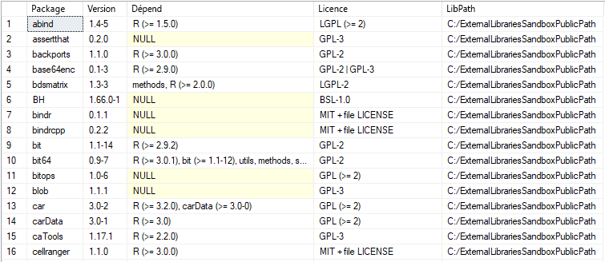

# <a name="quickstart-create-and-run-simple-r-scripts-in-azure-sql-database-machine-learning-services-preview"></a>Démarrage rapide : Créer et exécuter des scripts R simples dans Azure SQL Database Machine Learning Services (préversion)

Dans ce démarrage rapide, vous créez et exécutez un ensemble de scripts R à l’aide de Machine Learning Services (avec R) dans Azure SQL Database.

[!INCLUDE[ml-preview-note](../../includes/sql-database-ml-preview-note.md)]

## <a name="prerequisites"></a>Conditions préalables requises

- Un compte Azure avec un abonnement actif. [Créez gratuitement un compte](https://azure.microsoft.com/free/?ref=microsoft.com&utm_source=microsoft.com&utm_medium=docs&utm_campaign=visualstudio).
- Une [base de données Azure SQL](sql-database-single-database-get-started.md) avec une [règle de pare-feu au niveau du serveur](sql-database-server-level-firewall-rule.md)
- [Machine Learning Services](sql-database-machine-learning-services-overview.md) avec R activé. [Inscrivez-vous à la préversion](sql-database-machine-learning-services-overview.md#signup).
- [SSMS](/sql/ssms/sql-server-management-studio-ssms) (SQL Server Management Studio)

> [!NOTE]
> Pendant la préversion publique, Microsoft vous intégrera et activera le machine learning sur votre base de données nouvelle ou existante.

Cet exemple utilise la procédure stockée [sp_execute_external_script](/sql/relational-databases/system-stored-procedures/sp-execute-external-script-transact-sql) pour wrapper un script R bien formé.

## <a name="run-a-simple-script"></a>Exécuter un script simple

Pour exécuter un script R, vous allez le transmettre en tant qu’argument de la procédure stockée système [sp_execute_external_script](https://docs.microsoft.com/sql/relational-databases/system-stored-procedures/sp-execute-external-script-transact-sql).

Dans les étapes suivantes, vous allez exécuter cet exemple de script R dans votre base de données SQL :

```r
a <- 1
b <- 2
c <- a/b
d <- a*b
print(c(c, d))
```

1. Ouvrez **SQL Server Management Studio**, puis connectez-vous à votre base de données SQL.

   Si vous avez besoin d’aide pour la connexion, consultez [Démarrage rapide : utiliser SQL Server Management Studio pour se connecter à une base de données Azure SQL et l’interroger](sql-database-connect-query-ssms.md).

1. Transmettez la totalité du script R à la procédure stockée [sp_execute_external_script](https://docs.microsoft.com/sql/relational-databases/system-stored-procedures/sp-execute-external-script-transact-sql).

   Le script est transmis via l’argument `@script`. Tout ce qui se trouve dans l’argument `@script` doit être du code R valide.

    ```sql
    EXECUTE sp_execute_external_script @language = N'R'
        , @script = N'
    a <- 1
    b <- 2
    c <- a/b
    d <- a*b
    print(c(c, d))
    '
    ```

   Si vous rencontrez des erreurs, cela peut être dû au fait que la préversion publique de Machine Learning Services (avec R) n’est pas activée pour votre base de données SQL. Consultez [Composants requis](#prerequisites) ci-dessus.

   > [!NOTE]
   > Si vous êtes administrateur, vous pouvez exécuter automatiquement du code externe. Vous pouvez accorder des autorisations à d’autres utilisateurs à l’aide de la commande :
   <br>**GRANT EXECUTE ANY EXTERNAL SCRIPT TO** *\<nom_utilisateur\>* .

2. Le résultat correct est calculé et la fonction R `print` le retourne dans la fenêtre **Messages**.

   Voici comment il se présente.

    **Résultats**

    ```text
    STDOUT message(s) from external script:
    0.5 2
    ```

## <a name="run-a-hello-world-script"></a>Exécuter un script Hello World

Un exemple type de script est celui qui génère simplement la chaîne « Hello World ». Exécutez la commande suivante :

```sql
EXECUTE sp_execute_external_script @language = N'R'
    , @script = N'OutputDataSet<-InputDataSet'
    , @input_data_1 = N'SELECT 1 AS hello'
WITH RESULT SETS(([Hello World] INT));
GO
```

Les entrées dans cette procédure stockée incluent :

| | |
|-|-|
| @language | définit l’extension de langage à appeler, dans le cas présent, R |
| @script | définit les commandes transmises au runtime R. Tout votre script R doit être placé dans cet argument sous forme de texte Unicode. Vous pouvez aussi ajouter le texte à une variable de type **nvarchar**, puis appeler cette variable |
| @input_data_1 | données retournées par la requête, transmises au runtime R, qui retourne les données à SQL Server sous forme de trame de données |
|WITH RESULT SETS | la clause définit le schéma de la table de données retournée pour SQL Server, ajoutant « Hello World » comme nom de colonne, **int** pour le type de données |

La commande génère le texte suivant :

| Hello World |
|-------------|
| 1 |

## <a name="use-inputs-and-outputs"></a>Utiliser des entrées et des sorties

Par défaut, [sp_execute_external_script](https://docs.microsoft.com/sql/relational-databases/system-stored-procedures/sp-execute-external-script-transact-sql) accepte un seul jeu de données comme entrée, que vous fournissez en général sous la forme d’une requête SQL valide. Il retourne ensuite une seule trame de données R en sortie.

Pour l’instant, utilisons les variables par défaut d’entrée et de sortie de [sp_execute_external_script](https://docs.microsoft.com/sql/relational-databases/system-stored-procedures/sp-execute-external-script-transact-sql) : **InputDataSet** et **OutputDataSet**.

1. Créez une petite table de données de test.

    ```sql
    CREATE TABLE RTestData (col1 INT NOT NULL)
    
    INSERT INTO RTestData
    VALUES (1);
    
    INSERT INTO RTestData
    VALUES (10);
    
    INSERT INTO RTestData
    VALUES (100);
    GO
    ```

1. Utilisez l’instruction `SELECT` pour interroger la table.
  
    ```sql
    SELECT *
    FROM RTestData
    ```

    **Résultats**

    

1. Exécutez le script R suivant. Il récupère les données de la table en utilisant l’instruction `SELECT`, les transmet via le runtime R et retourne les données sous forme de trame de données. La clause `WITH RESULT SETS` définit le schéma de la table de données retournées pour SQL Database en ajoutant le nom de colonne *NewColName*.

    ```sql
    EXECUTE sp_execute_external_script @language = N'R'
        , @script = N'OutputDataSet <- InputDataSet;'
        , @input_data_1 = N'SELECT * FROM RTestData;'
    WITH RESULT SETS(([NewColName] INT NOT NULL));
    ```

    **Résultats**

    

1. À présent, changeons le nom des variables d’entrée et de sortie. Les variables d’entrée et de sortie se nomment par défaut **InputDataSet** et **OutputDataSet** ; ce script remplace ces noms par **SQL_in** et **SQL_out** :

    ```sql
    EXECUTE sp_execute_external_script @language = N'R'
        , @script = N' SQL_out <- SQL_in;'
        , @input_data_1 = N' SELECT 12 as Col;'
        , @input_data_1_name = N'SQL_in'
        , @output_data_1_name = N'SQL_out'
    WITH RESULT SETS(([NewColName] INT NOT NULL));
    ```

    Notez que R respecte la casse. Les variables d’entrée et de sortie utilisées dans le script R (**SQL_out**, **SQL_in**) doivent correspondre aux valeurs définies avec `@input_data_1_name` et `@output_data_1_name`, y compris la casse.

   > [!TIP]
   > Un seul jeu de données d’entrée peut être passé en tant que paramètre, et un seul jeu de données peut être renvoyé. Toutefois, vous pouvez appeler d’autres jeux de données dans votre code R et des sorties d’autres types peuvent être renvoyées en plus du jeu de données. Vous pouvez également ajouter le mot clé OUTPUT à n’importe quel paramètre pour qu’il soit retourné avec les résultats.

1. Vous pouvez aussi générer des valeurs en utilisant simplement le script R sans données d’entrée (`@input_data_1` est vide).

   Le script suivant génère le texte « hello » et « world ».

    ```sql
    EXECUTE sp_execute_external_script @language = N'R'
        , @script = N'
    mytextvariable <- c("hello", " ", "world");
    OutputDataSet <- as.data.frame(mytextvariable);
    '
        , @input_data_1 = N''
    WITH RESULT SETS(([Col1] CHAR(20) NOT NULL));
    ```

    **Résultats**

    

## <a name="check-r-version"></a>Vérifier la version de R

Si vous souhaitez savoir quelle version de R est installée dans votre base de données SQL, exécutez le script suivant.

```sql
EXECUTE sp_execute_external_script @language = N'R'
    , @script = N'print(version)';
GO
```

La fonction R `print` retourne la version dans la fenêtre **Messages**. Dans l’exemple ci-dessous, vous pouvez constater que dans ce cas, c’est la version R 3.4.4 qui est installée dans SQL Database.

**Résultats**

```text
STDOUT message(s) from external script:
                   _
platform       x86_64-w64-mingw32
arch           x86_64
os             mingw32
system         x86_64, mingw32
status
major          3
minor          4.4
year           2018
month          03
day            15
svn rev        74408
language       R
version.string R version 3.4.4 (2018-03-15)
nickname       Someone to Lean On
```

## <a name="list-r-packages"></a>Lister les packages R

Microsoft fournit un nombre de packages R préinstallés avec Machine Learning Services dans votre base de données SQL.

Pour afficher la liste des packages R installés, dont la version, les dépendances, la licence et le chemin de la bibliothèque, exécutez le script suivant.

```SQL
EXEC sp_execute_external_script @language = N'R'
    , @script = N'
OutputDataSet <- data.frame(installed.packages()[,c("Package", "Version", "Depends", "License", "LibPath")]);'
WITH result sets((
            Package NVARCHAR(255)
            , Version NVARCHAR(100)
            , Depends NVARCHAR(4000)
            , License NVARCHAR(1000)
            , LibPath NVARCHAR(2000)
            ));
```

La sortie provient de `installed.packages()` dans R et est retournée sous forme de jeu de résultats.

**Résultats**



## <a name="next-steps"></a>Étapes suivantes

Pour créer un modèle Machine Learning à l’aide de R dans SQL Database, suivez les instructions de ce guide de démarrage rapide :

> [!div class="nextstepaction"]
> [Créer et former un modèle prédictif dans R avec Azure SQL Database Machine Learning Services (préversion)](sql-database-quickstart-r-train-score-model.md)

Pour en savoir plus sur Machine Learning Services avec R dans Azure SQL Database (préversion), consultez les articles suivants.

- [Machine Learning Services avec R dans Azure SQL Database (préversion)](sql-database-machine-learning-services-overview.md)
- [Écrire des fonctions R avancées dans Azure SQL Database avec Machine Learning Services (préversion)](sql-database-machine-learning-services-functions.md)
- [Exploiter des données R et SQL dans Machine Learning Services d’Azure SQL Database (préversion)](sql-database-machine-learning-services-data-issues.md)
