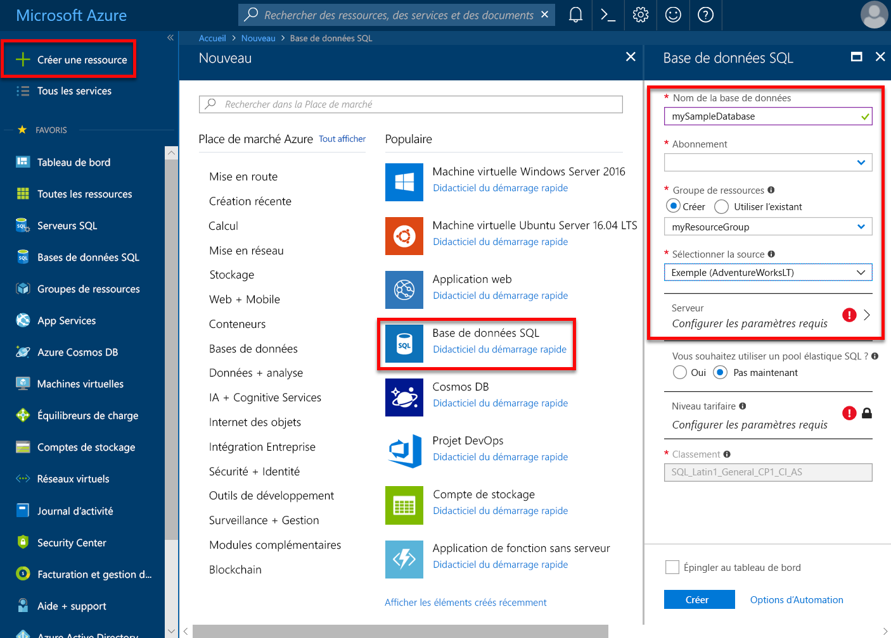
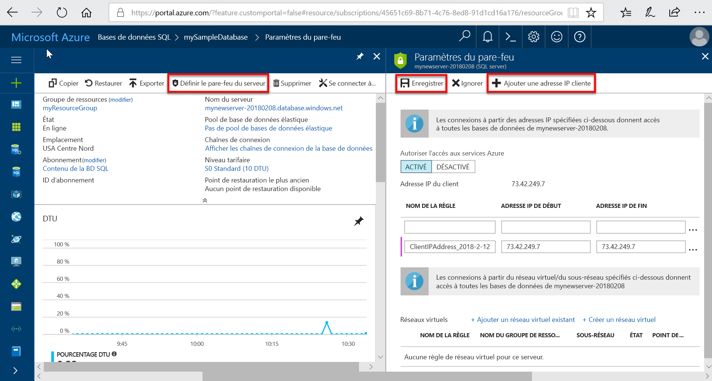

# Serveurs Azure SQL Database et leur gestion

## Qu’est-ce qu’un serveur Azure SQL Database ?

Un serveur SQL Database est une construction logique qui fait office de point d'administration central pour plusieurs bases de données uniques ou [regroupées](sql-database-elastic-pool.md), [connexions](sql-database-manage-logins.md), [règles de pare-feu](sql-database-firewall-configure.md), [règles d'audit](sql-database-auditing.md), [stratégies de détection des menaces](sql-database-threat-detection.md) et [groupes de basculement](sql-database-auto-failover-group.md). Un serveur SQL Database peut se trouver dans une région différente de celle de son groupe de ressources. Avant de pouvoir créer la base de données Azure SQL, vous devez déjà avoir un serveur SQL Database. Toutes les bases de données gérées par un serveur SQL Database sont créées dans la même région que le serveur SQL Database.

Un serveur SQL Database est distinct d’une instance SQL Server que vous connaissez peut-être dans le monde local. Plus précisément, le service SQL Database n’offre aucune garantie en ce qui concerne l’emplacement des bases de données par rapport au serveur SQL Database qui les gère et ne présente aucun accès ni aucune fonctionnalité au niveau de l’instance. En revanche, les bases de données d’instance dans une instance managée sont toutes colocalisées, de la même manière que celle que vous connaissez avec SQL Server dans le monde local.

Lorsque vous créez un serveur SQL Database, vous fournissez un compte de connexion du serveur et un mot de passe disposant de droits d’administration pour la base de données MASTER sur ce serveur, ainsi que sur l’ensemble des bases de données qui y sont créées. Ce compte initial est un compte de connexion SQL. Azure SQL Database prend en charge l’authentification SQL et l’authentification Azure Active Directory. Pour en savoir plus sur les connexions et l’authentification, consultez la page [Gestion des bases de données et des connexions dans Azure SQL Database](sql-database-manage-logins.md). L’authentification Windows n’est pas prise en charge.

Un serveur SQL Database :

- Est créé dans un abonnement Azure, mais peut être déplacé avec les ressources qu’il contient vers un autre abonnement
- Est la ressource parente pour les bases de données, les pools élastiques et les entrepôts de données
- Fournit un espace de noms pour les bases de données, les pools élastiques et les entrepôts de données
- Est un conteneur logique qui possède une forte sémantique de durée de vie : si vous supprimez un serveur, le serveur logique supprimera les bases de données autonomes, les pools élastiques et les entrepôts de données qu’il contient
- Fait partie d’un [contrôle d’accès en fonction du rôle Azure (RBAC)](/azure/role-based-access-control/overview) : les bases de données, les pools élastiques et les entrepôts de données d’un serveur héritent des droits d’accès du serveur
- Est un élément de poids dans l’identité des bases de données, des pools élastiques et des entrepôts de données à des fins de gestion des ressources Azure (voir le schéma d’URL pour les bases de données et les pools)
- Colocalise les ressources d’une région
- Fournit un point de terminaison de connexion pour l’accès aux bases de données (`<serverName>`. database.windows.net)
- Fournit l’accès aux métadonnées concernant l’accès aux ressources contenues via les DMV en vous connectant à une base de données MASTER
- Fournit l’étendue des stratégies de gestion qui s’appliquent à ses bases de données : connexions, pare-feu, audit, détection des menaces, etc.
- Est limité par un quota dans l’abonnement parent (six serveurs par abonnement par défaut ; [consultez les Limites d’abonnement ici](../azure-resource-manager/management/azure-subscription-service-limits.md))
- Fournit l’étendue du quota de base de données et du quota DTU ou vCore pour les ressources qu’il contient (par exemple, 45 000 DTU)
- Est la portée du contrôle de version pour les fonctionnalités activées sur les ressources qu’il contient
- Les connexions principales au niveau du serveur peuvent gérer toutes les bases de données sur un serveur
- Peut contenir des connexions semblables à celles des instances de SQL Server en local qui ont accès à une ou plusieurs bases de données sur le serveur et qui peuvent se voir octroyer des droits d’administration limités. Pour plus d’informations, consultez [Connexions](sql-database-manage-logins.md).
- Le classement par défaut pour toutes les bases de données créées sur un serveur SQL Database est `SQL_LATIN1_GENERAL_CP1_CI_AS`, où `LATIN1_GENERAL` est anglais (États-Unis), `CP1` est la page de codes 1252, `CI` ne respecte pas la casse, et `AS` est sensible aux accents.

## Gérer les serveurs, les bases de données et les pare-feu SQL Azure à l’aide du portail Azure

Vous pouvez créer le groupe de ressources de la base de données Azure SQL en avance ou lors de la création du serveur lui-même. Il existe plusieurs méthodes pour accéder à un nouveau formulaire de serveur SQL : en créant un nouveau serveur SQL ou dans le cadre de la création d’une base de données.

### Créer un serveur SQL Database vide

Pour créer un serveur Azure SQL Database (sans base de données) à l’aide du [portail Azure](https://portal.azure.com), accédez à un formulaire de serveur SQL vide (serveur logique).  

### Créer un exemple de base de données SQL ou une base de données SQL vide

Pour créer une base de données Azure SQL à l’aide du [portail Azure](https://portal.azure.com), accédez à un formulaire SQL Database vide et renseignez les informations demandées. Vous pouvez créer le groupe de ressources de la base de données Azure SQL et le serveur SQL Database en avance ou lors de la création de la base de données elle-même. Vous pouvez créer une base de données vide ou créer un exemple de base de données reposant sur Adventure Works LT.

  

> [!IMPORTANT]
> Pour plus d’informations sur la sélection du niveau tarifaire de votre base de données, consultez [Modèle d’achat DTU](sql-database-service-tiers-dtu.md) et [Modèle d’achat vCore](sql-database-service-tiers-vcore.md).

Pour créer une instance gérée, consultez [Créer une instance gérée](sql-database-managed-instance-get-started.md)

### Gérer un serveur SQL existant

Pour gérer un serveur existant, accédez au serveur à l’aide de plusieurs méthodes, à partir d’une page de base de données SQL spécifique, de la page **Serveurs SQL** ou de la page **Toutes les ressources**, par exemple.

Pour gérer une base de données existante, accédez à la page **Bases de données SQL** page, puis cliquez sur la base de données que vous souhaitez gérer. La capture d’écran suivante montre comment commencer à définir un pare-feu au niveau du serveur pour une base de données, à partir de la page **Vue d’ensemble** d’une base de données.

   

> [!IMPORTANT]
> Pour configurer les propriétés de performance d’une base de données, consultez [Modèle d’achat DTU](sql-database-service-tiers-dtu.md) et [Modèle d’achat vCore](sql-database-service-tiers-vcore.md).
> [!TIP]
> Pour un guide de démarrage rapide du portail Azure, consultez [Créer une base de données Azure SQL à l’aide du portail Azure](sql-database-single-database-get-started.md).

## Gérer les serveurs, les bases de données et les pare-feux SQL Azure à l’aide de PowerShell

[!INCLUDE [updated-for-az](../../includes/updated-for-az.md)]
> [!IMPORTANT]
> Le module PowerShell Azure Resource Manager est toujours pris en charge par Azure SQL Database, mais tous les développements futurs sont destinés au module Az.Sql. Pour ces cmdlets, voir [AzureRM.Sql](https://docs.microsoft.com/powershell/module/AzureRM.Sql/). Les arguments des commandes dans le module Az sont sensiblement identiques à ceux des modules AzureRm.

Pour créer et gérer le serveur, les bases de données et les pare-feux SQL Azure avec Azure PowerShell, utilisez les applets de commande PowerShell suivants. Si vous devez installer ou mettre à niveau PowerShell, consultez la section relative à [l’installation du module Azure PowerShell](/powershell/azure/install-az-ps). Pour créer et gérer des pools élastiques, consultez [Pools élastiques](sql-database-elastic-pool.md).

| Applet de commande | Description |
| --- | --- |
|[New-AzSqlDatabase](/powershell/module/az.sql/new-azsqldatabase)|Crée une base de données |
|[Get-AzSqlDatabase](/powershell/module/az.sql/get-azsqldatabase)|Obtient une ou plusieurs bases de données|
|[Set-AzSqlDatabase](/powershell/module/az.sql/set-azsqldatabase)|Définit les propriétés d’une base de données, ou déplace une base de données existante dans un pool élastique|
|[Remove-AzSqlDatabase](/powershell/module/az.sql/remove-azsqldatabase)|Supprime une base de données|
|[New-AzResourceGroup](/powershell/module/az.resources/new-azresourcegroup)|Crée un groupe de ressources|
|[New-AzSqlServer](/powershell/module/az.sql/new-azsqlserver)|Crée un serveur|
|[Get-AzSqlServer](/powershell/module/az.sql/get-azsqlserver)|Renvoie des informations concernant les serveurs|
|[Set-AzSqlServer](https://docs.microsoft.com/powershell/module/az.sql/set-azsqlserver)|Modifie les propriétés d’un serveur|
|[Remove-AzSqlServer](/powershell/module/az.sql/remove-azsqlserver)|Supprime un serveur|
|[New-AzSqlServerFirewallRule](/powershell/module/az.sql/new-azsqlserverfirewallrule)|Crée une règle de pare-feu au niveau du serveur |
|[Get-AzSqlServerFirewallRule](/powershell/module/az.sql/get-azsqlserverfirewallrule)|Obtient les règles de pare-feu d’un serveur|
|[Set-AzSqlServerFirewallRule](/powershell/module/az.sql/set-azsqlserverfirewallrule)|Modifie une règle de pare-feu sur un serveur|
|[Remove-AzSqlServerFirewallRule](/powershell/module/az.sql/remove-azsqlserverfirewallrule)|Supprime une règle de pare-feu d’un serveur|
| New-AzSqlServerVirtualNetworkRule | Crée une [*règle de réseau virtuel*](sql-database-vnet-service-endpoint-rule-overview.md), basée sur un sous-réseau qui est un point de terminaison de service de réseau virtuel. |

> [!TIP]
> Pour un démarrage rapide de PowerShell, consultez la page [Créer une base de données SQL Azure unique à l’aide de PowerShell](sql-database-single-database-get-started.md). Pour obtenir des exemples de script PowerShell, consultez [Utiliser PowerShell pour créer une base de données unique SQL Azure et configurer une règle de pare-feu](scripts/sql-database-create-and-configure-database-powershell.md) et [Utiliser PowerShell pour surveiller et mettre à l’échelle une base de données unique SQL Azure](scripts/sql-database-monitor-and-scale-database-powershell.md).
>

## Gérer les serveurs, les bases de données et les pare-feu SQL Azure à l’aide de l’interface de ligne de commande Azure

Pour créer et gérer un serveur, des bases de données et des pare-feux SQL Azure avec [Azure CLI](/cli/azure), utilisez les commandes [Azure CLI SQL Database](/cli/azure/sql/db) suivantes. Utilisez [Cloud Shell](/azure/cloud-shell/overview) pour exécuter l’interface CLI dans votre navigateur ou [l’installer](/cli/azure/install-azure-cli) sur macOS, Linux ou Windows. Pour créer et gérer des pools élastiques, consultez [Pools élastiques](sql-database-elastic-pool.md).

| Applet de commande | Description |
| --- | --- |
|[az sql db create](/cli/azure/sql/db#az-sql-db-create) |Crée une base de données|
|[az sql db list](/cli/azure/sql/db#az-sql-db-list)|Répertorie toutes les bases de données et les entrepôts de données d’un serveur, ou toutes les bases de données d’un pool élastique|
|[az sql db list-editions](/cli/azure/sql/db#az-sql-db-list-editions)|Répertorie les objectifs de service disponibles et les limites de stockage|
|[az sql db list-usages](/cli/azure/sql/db#az-sql-db-list-usages)|Renvoie les données d’utilisation de la base de données|
|[az sql db show](/cli/azure/sql/db#az-sql-db-show)|Obtient une base de données ou un entrepôt de données|
|[az sql db update](/cli/azure/sql/db#az-sql-db-update)|Met à jour une base de données|
|[az sql db delete](/cli/azure/sql/db#az-sql-db-delete)|Supprime une base de données|
|[az group create](/cli/azure/group#az-group-create)|Crée un groupe de ressources|
|[az sql server create](/cli/azure/sql/server#az-sql-server-create)|Crée un serveur|
|[az sql server list](/cli/azure/sql/server#az-sql-server-list)|Répertorie les serveurs|
|[az sql server list-usages](/cli/azure/sql/server#az-sql-server-list-usages)|Renvoie les données d’utilisation d’un serveur|
|[az sql server show](/cli/azure/sql/server#az-sql-server-show)|Obtient un serveur|
|[az sql server update](/cli/azure/sql/server#az-sql-server-update)|Met à jour un serveur|
|[az sql server delete](/cli/azure/sql/server#az-sql-server-delete)|Supprime un serveur.|
|[az sql server firewall-rule create](/cli/azure/sql/server/firewall-rule#az-sql-server-firewall-rule-create)|Crée la règle de pare-feu d’un serveur|
|[az sql server firewall-rule list](/cli/azure/sql/server/firewall-rule#az-sql-server-firewall-rule-list)|Répertorie les règles de pare-feu sur un serveur|
|[az sql server firewall-rule show](/cli/azure/sql/server/firewall-rule#az-sql-server-firewall-rule-show)|Affiche les détails d’une règle de pare-feu|
|[az sql server firewall-rule update](/cli/azure/sql/server/firewall-rule##az-sql-server-firewall-rule-update)|Met à jour une règle de pare-feu|
|[az sql server firewall-rule delete](/cli/azure/sql/server/firewall-rule#az-sql-server-firewall-rule-delete)|Supprime une règle de pare-feu|

> [!TIP]
> Pour un démarrage rapide d’Azure CLI, consultez [Exemples Azure CLI pour Azure SQL Database](sql-database-cli-samples.md). Pour obtenir des exemples de scripts Azure CLI, consultez [Utiliser CLI pour créer une base de données unique Azure SQL et configurer une règle de pare-feu](scripts/sql-database-create-and-configure-database-cli.md) et [Utiliser CLI pour surveiller et mettre à l’échelle une base de données unique SQL Azure](scripts/sql-database-monitor-and-scale-database-cli.md).
>

## Gérer les serveurs, les bases de données et les pare-feux SQL Azure à l’aide de Transact-SQL

Pour créer et gérer le serveur, les bases de données et les pare-feux SQL Azure avec Transact-SQL, utilisez les commandes T-SQL suivantes. Vous pouvez entrer ces commandes à l’aide du portail Azure, de [SQL Server Management Studio](/sql/ssms/use-sql-server-management-studio), de [Visual Studio Code](https://code.visualstudio.com/docs), ou de tout autre programme pouvant se connecter à un serveur Azure SQL Database et transmettre des commandes Transact-SQL. Pour gérer des pools élastiques, consultez la page [Pools élastiques](sql-database-elastic-pool.md).

> [!IMPORTANT]
> Vous ne pouvez pas créer ou supprimer un serveur à l’aide de Transact-SQL.
>

| Commande | Description |
| --- | --- |
|[CREATE DATABASE (Azure SQL Database)](/sql/t-sql/statements/create-database-azure-sql-database)|Crée une base de données. Vous devez être connecté à la base de données master pour créer une base de données.|
| [ALTER DATABASE (Azure SQL Database)](/sql/t-sql/statements/alter-database-azure-sql-database) |Modifie une base de données Azure SQL. |
|[ALTER DATABASE (Azure SQL Data Warehouse)](/sql/t-sql/statements/alter-database-azure-sql-data-warehouse)|Modifie un entrepôt de données Azure SQL Data Warehouse.|
|[DROP DATABASE (Transact-SQL)](/sql/t-sql/statements/drop-database-transact-sql)|Supprime une base de données.|
|[sys.database_service_objectives (Azure SQL Database)](/sql/relational-databases/system-catalog-views/sys-database-service-objectives-azure-sql-database)|Renvoie l’édition (niveau de service), l’objectif de service (niveau tarifaire) et, le cas échéant, le nom du pool élastique Azure SQL Database ou d’un entrepôt de données Azure SQL Data Warehouse. Si vous êtes connecté à la base de données MASTER d’un serveur Azure SQL Database, retourne les informations sur toutes les bases de données. Pour Azure SQL Data Warehouse, vous devez être connecté à la base de données MASTER.|
|[sys.dm_db_resource_stats (Azure SQL Database)](/sql/relational-databases/system-dynamic-management-views/sys-dm-db-resource-stats-azure-sql-database)| Retourne la consommation de mémoire, d’E/S et d’UC d’une base de données Azure SQL Database. Il existe une ligne pour chaque période de 15 secondes, même s'il n'y a aucune activité dans la base de données.|
|[sys.resource_stats (Azure SQL Database)](/sql/relational-databases/system-catalog-views/sys-resource-stats-azure-sql-database)|Renvoie les données de stockage et l’utilisation d’UC pour une base de données Azure SQL Database. Les données sont collectées et agrégées dans des intervalles de cinq minutes.|
|[sys.database_connection_stats (Azure SQL Database)](/sql/relational-databases/system-catalog-views/sys-database-connection-stats-azure-sql-database)|Contient des statistiques pour les événements de connectivité de base de données SQL Database, ce qui fournit une vue d’ensemble du nombre d’échecs et de réussites de connexion de base de données. |
|[sys.event_log (Azure SQL Database)](/sql/relational-databases/system-catalog-views/sys-event-log-azure-sql-database)|Renvoie les interblocages les échecs de connexion et les réussites de connexion de base de données Azure SQL Database. Vous pouvez utiliser ces informations pour suivre ou dépanner votre activité de base de données avec SQL Database.|
|[sp_set_firewall_rule (Azure SQL Database)](/sql/relational-databases/system-stored-procedures/sp-set-firewall-rule-azure-sql-database)|Crée ou met à jour les paramètres de pare-feu au niveau du serveur pour votre serveur SQL Database. Cette procédure stockée est uniquement disponible dans la base de données master à la connexion du principal au niveau du serveur. Une règle de pare-feu au niveau du serveur peut uniquement être créée à l’aide de Transact-SQL, après que la première règle de pare-feu au niveau du serveur a été créée par un utilisateur disposant des autorisations au niveau d’Azure|
|[sys.firewall_rules (Azure SQL Database)](/sql/relational-databases/system-catalog-views/sys-firewall-rules-azure-sql-database)|Renvoie des informations sur les paramètres de pare-feu au niveau du serveur associés à votre base de données Microsoft Azure SQL.|
|[sp_delete_firewall_rule (Azure SQL Database)](/sql/relational-databases/system-stored-procedures/sp-delete-firewall-rule-azure-sql-database)|Supprime les paramètres de pare-feu au niveau du serveur de votre serveur SQL Database. Cette procédure stockée est uniquement disponible dans la base de données master à la connexion du principal au niveau du serveur.|
|[sp_set_database_firewall_rule (Azure SQL Database)](/sql/relational-databases/system-stored-procedures/sp-set-database-firewall-rule-azure-sql-database)|Crée ou met à jour les règles de pare-feu au niveau de la base de données pour votre base de données pour votre instance Azure SQL Database ou SQL Data Warehouse. Les règles de pare-feu d’une base de données peuvent être configurées pour la base de données MASTER, ainsi que pour les bases de données utilisateur sur SQL Database. Les règles de pare-feu d’une base de données sont utiles lors de l’utilisation d’utilisateurs de base de données autonome. |
|[sys.database_firewall_rules (Azure SQL Database)](/sql/relational-databases/system-catalog-views/sys-database-firewall-rules-azure-sql-database)|Renvoie des informations sur les paramètres de pare-feu au niveau de la base de données associés à votre base de données Microsoft Azure SQL. |
|[sp_delete_database_firewall_rule (Azure SQL Database)](/sql/relational-databases/system-stored-procedures/sp-delete-database-firewall-rule-azure-sql-database)|Supprime les paramètres de pare-feu au niveau base de données de votre base de données Azure SQL ou de votre entrepôt de données SQL Data Warehouse. |

> [!TIP]
> Pour un guide de démarrage rapide en utilisant SQL Server Management Studio sur Microsoft Windows, consultez [Azure SQL Database : Utiliser SQL Server Management Studio pour se connecter et interroger des données](sql-database-connect-query-ssms.md). Pour un guide de démarrage rapide en utilisant Visual Studio Code sur macOS, Linux ou Windows, consultez [Azure SQL Database : Utiliser Visual Studio Code pour se connecter et interroger des données](sql-database-connect-query-vscode.md).

## Gérer les serveurs, les bases de données et les pare-feux SQL Azure à l’aide de l’API REST

Pour créer et gérer un serveur, des bases de données et des pare-feux Azure SQL, utilisez les requêtes suivantes de l’API REST.

| Commande | Description |
| --- | --- |
|[Servers - Create or update](https://docs.microsoft.com/rest/api/sql/servers/createorupdate)|Crée ou met à jour un serveur.|
|[Serveurs - Delete](https://docs.microsoft.com/rest/api/sql/servers/delete)|Supprime un serveur SQL.|
|[Serveurs - Get](https://docs.microsoft.com/rest/api/sql/servers/get)|Obtient un serveur.|
|[Serveurs - List](https://docs.microsoft.com/rest/api/sql/servers/list)|Retourne une liste de serveurs.|
|[Servers - List by resource Group](https://docs.microsoft.com/rest/api/sql/servers/listbyresourcegroup)|Retourne une liste de serveurs dans un groupe de ressources.|
|[Serveurs - Update](https://docs.microsoft.com/rest/api/sql/servers/update)|Met à jour un serveur existant.|
|[Databases - Create or update](https://docs.microsoft.com/rest/api/sql/databases/createorupdate)|Crée une base de données ou met à jour une base de données existante.|
|[Bases de données - Supprimer](https://docs.microsoft.com/rest/api/sql/databases/delete)|Supprime une base de données.|
|[Bases de données - Obtenir](https://docs.microsoft.com/rest/api/sql/databases/get)|Obtient une base de données.|
|[Databases - List by elastic pool](https://docs.microsoft.com/rest/api/sql/databases/listbyelasticpool)|Renvoie une liste des bases de données dans un pool élastique.|
|[Databases - List by server](https://docs.microsoft.com/rest/api/sql/databases/listbyserver)|Retourne une liste de bases de données d’un serveur.|
|[Bases de données - Mettre à jour](https://docs.microsoft.com/rest/api/sql/databases/update)|Met à jour une base de données existante.|
|[Firewall rules - Create or update](https://docs.microsoft.com/rest/api/sql/firewallrules/createorupdate)|Crée ou met à jour une règle de pare-feu.|
|[Firewall rules - Delete](https://docs.microsoft.com/rest/api/sql/firewallrules/delete)|Supprime une règle de pare-feu.|
|[Firewall rules - Get](https://docs.microsoft.com/rest/api/sql/firewallrules/get)|Obtient une règle de pare-feu.|
|[Firewall rules - List by server](https://docs.microsoft.com/rest/api/sql/firewallrules/listbyserver)|Retourne une liste de règles de pare-feu.|

## Étapes suivantes

- Pour en savoir plus sur la migration d’une base de données SQL Server, consultez la section [Migrer une base de données Azure SQL](sql-database-single-database-migrate.md).
- Pour plus d’informations sur les fonctionnalités prises en charge, consultez la page [Fonctionnalités](sql-database-features.md).
