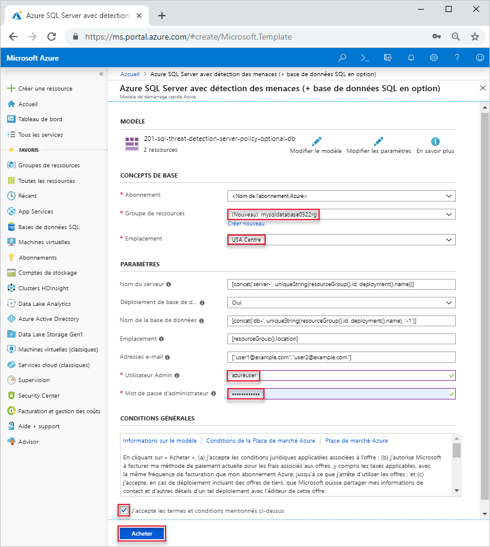

# <a name="quickstart-create-a-single-database-in-azure-sql-database-using-the-azure-resource-manager-template"></a>Démarrage rapide : Créer une base de données unique dans Azure SQL Database à l’aide du modèle Azure Resource Manager

La création d’une [base de données unique](sql-database-single-database.md) est l’option de déploiement la plus rapide et la plus simple pour créer une base de données dans Azure SQL Database. Ce guide de démarrage rapide montre comment créer une base de données unique à l’aide du modèle Azure Resource Manager. Pour plus d’informations, consultez [Documentation Azure Resource Manager](/azure/azure-resource-manager/).

Si vous n’avez pas d’abonnement Azure, [créez un compte gratuit](https://azure.microsoft.com/free/).

## <a name="create-a-single-database"></a>Créer une base de données unique

Une base de données comprend un ensemble défini de ressources (capacité de calcul, mémoire, E/S et stockage) qui varient selon l’un des deux [modèles d’achat](sql-database-purchase-models.md) choisi. Quand vous créez une base de données unique, vous définissez également un [serveur SQL Database](sql-database-servers.md) pour la gérer et la placer dans le [groupe de ressources Azure](../azure-resource-manager/resource-group-overview.md) d’une région spécifiée.

Le modèle utilisé dans ce guide de démarrage rapide est tiré des [modèles de démarrage rapide Azure](https://azure.microsoft.com/resources/templates/201-sql-threat-detection-server-policy-optional-db/). Le fichier JSON suivant est le modèle utilisé dans cet article. Vous trouverez d’autres exemples de modèles Azure SQL Database [ici](https://azure.microsoft.com/resources/templates/?resourceType=Microsoft.Sql&pageNumber=1&sort=Popular).

[!code-json[create-azure-sql-database](~/quickstart-templates/201-sql-threat-detection-server-policy-optional-db/azuredeploy.json)]

1. Cliquez sur l’image ci-après pour vous connecter à Azure et ouvrir un modèle.

    <a href="https://portal.azure.com/#create/Microsoft.Template/uri/https%3A%2F%2Fraw.githubusercontent.com%2FAzure%2Fazure-quickstart-templates%2Fmaster%2F201-sql-threat-detection-server-policy-optional-db%2Fazuredeploy.json"></a>

2. Sélectionnez ou entrez les valeurs suivantes.  

    

    Sauf indication contraire, utilisez les valeurs par défaut.

    * **Abonnement** : sélectionnez un abonnement Azure.
    * **Groupe de ressources** : sélectionnez **Créer**, entrez un nom unique pour le groupe de ressources, puis cliquez sur **OK**. 
    * **Emplacement** : sélectionnez un emplacement.  Par exemple, **USA Centre**.
    * **Utilisateur Admin** : spécifiez le nom d’utilisateur d’un administrateur de serveur de base de données SQL.
    * **Mot de passe administrateur** : spécifiez un mot de passe administrateur. 
    * **J’accepte les termes et conditions mentionnés ci-dessus** : cochez la case.
3. Sélectionnez **Achat**.

## <a name="query-the-database"></a>Interroger la base de données

Pour interroger la base de données, consultez [Interroger la base de données](./sql-database-single-database-get-started.md#query-the-database).

## <a name="clean-up-resources"></a>Supprimer des ressources

Conservez ce groupe de ressources, ce serveur SQL et cette base de données unique pour accéder aux [étapes suivantes](#next-steps). Les étapes suivantes vous montrent comment vous connecter à votre base de données et comment l’interroger via différentes méthodes.

Pour supprimer le groupe de ressources à l’aide d’Azure CLI ou d’Azure PowerShell :

```azurecli-interactive
echo "Enter the Resource Group name:" &&
read resourceGroupName &&
az group delete --name $resourceGroupName 
```

```azurepowershell-interactive
$resourceGroupName = Read-Host -Prompt "Enter the Resource Group name"
Remove-AzResourceGroup -Name $resourceGroupName 
```

## <a name="next-steps"></a>Étapes suivantes

- Créez une règle de pare-feu au niveau du serveur pour vous connecter à la base de données unique à l’aide d’outils locaux ou à distance. Pour plus d’informations, consultez [Créer une règle de pare-feu au niveau du serveur](sql-database-server-level-firewall-rule.md).
- Après avoir créé une règle de pare-feu au niveau du serveur, [connectez et interrogez](sql-database-connect-query.md) votre base de données à l’aide de plusieurs outils et langues différents.
  - [Se connecter et effectuer des requêtes à l’aide de SQL Server Management Studio](sql-database-connect-query-ssms.md)
  - [Se connecter et effectuer des requêtes à l’aide d’Azure Data Studio](https://docs.microsoft.com/sql/azure-data-studio/quickstart-sql-database?toc=/azure/sql-database/toc.json)
- Pour créer des bases de données uniques à l’aide d’Azure CLI, consultez [Exemples d’interface de ligne de commande Azure](sql-database-cli-samples.md).
- Pour créer des bases de données uniques à l’aide d’Azure PowerShell, consultez [Exemples Azure PowerShell](sql-database-powershell-samples.md).
