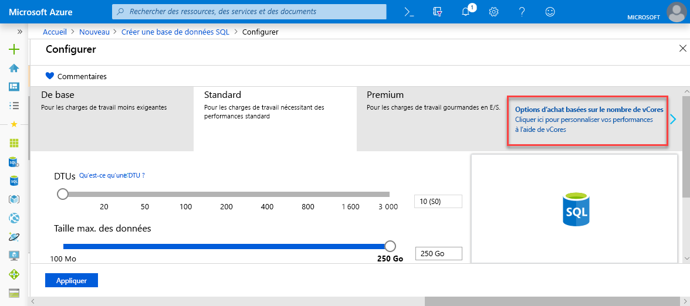
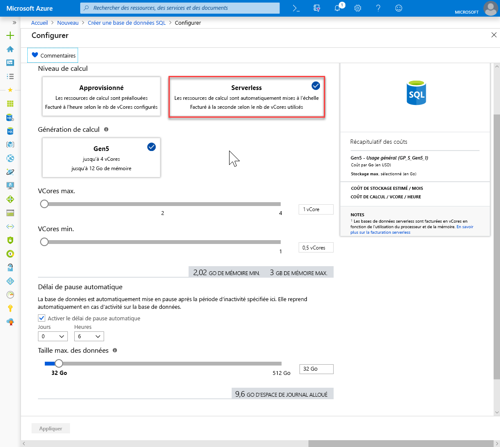

# <a name="quickstart-create-a-single-database-in-azure-sql-database-using-the-azure-portal"></a>Démarrage rapide : Créer et interroger une base de données unique dans Azure SQL Database à l’aide du portail Azure

La création d’une [base de données unique](sql-database-single-database.md) est l’option de déploiement la plus rapide et la plus simple pour créer une base de données dans Azure SQL Database. Ce guide de démarrage rapide vous montre comment créer et interroger une base de données unique à l’aide du portail Azure.

Si vous n’avez pas d’abonnement Azure, [créez un compte gratuit](https://azure.microsoft.com/free/).

Pour toutes les étapes de ce guide de démarrage rapide, connectez-vous au [Portail Azure](https://portal.azure.com/).

## <a name="create-a-single-database"></a>Créer une base de données unique

Une base de données unique peut être créée dans la couche de calcul approvisionnée ou serverless (préversion).

- Une base de données unique dans la couche de calcul approvisionnée a une quantité définie de ressources de calcul allouées au préalable et assorties d’un ensemble de ressources de mémoire et de stockage à l’aide d’un des deux [modèles d’achat](sql-database-purchase-models.md).
- Une base de données dans la couche de calcul serverless a une gamme de ressources de calcul qui sont automatiquement mises à l’échelle, plus une quantité spécifiée de mémoire par cœur et de ressources de stockage, et est uniquement disponible dans le [modèles d’achat vCore](sql-database-service-tiers-vcore.md).

Quand vous créez une base de données unique, vous définissez également un [serveur SQL Database](sql-database-servers.md) pour la gérer et la placer dans le [groupe de ressources Azure](../azure-resource-manager/resource-group-overview.md) d’une région spécifiée.

> [!NOTE]
> Ce démarrage rapide utilise le [modèle d’achat vCore](sql-database-service-tiers-vcore.md) et la couche de calcul [serverless](sql-database-serverless.md), mais le [modèle d’achat DTU](sql-database-service-tiers-DTU.md) est également disponible.

Pour créer une base de données unique contenant les exemples de données AdventureWorksLT :

1. Sélectionnez **Créer une ressource** dans le coin supérieur gauche du portail Azure.
2. Sélectionnez **Bases de données**, puis sélectionnez **Base de données SQL** pour ouvrir la page **Créer une base de données SQL**.

   

3. Sous l’onglet **Bases**, dans la section **Détails du projet**, tapez ou sélectionnez les valeurs suivantes :

   - **Abonnement**: Faites défiler la liste et sélectionnez l’abonnement approprié, s’il n’apparaît pas.
   - **Groupe de ressources** : sélectionnez **Créer**, tapez `myResourceGroup`, puis sélectionnez **OK**.

     

4. Dans la section formulaire **Détails de la base de données**, tapez ou sélectionnez les valeurs suivantes :

   - **Nom de la base de données** : Entrez `mySampleDatabase`.
   - **Server** (Serveur) : sélectionnez **Créer**, entrez les valeurs suivantes, puis sélectionnez **Sélectionner**.
       - **Nom du serveur** : tapez `mysqlserver` ainsi que des chiffres à des fins d’unicité.
       - **Connexion administrateur au serveur** : Saisissez `azureuser`.
       - **Mot de passe** : tapez un mot de passe complexe qui répond aux exigences de mot de passe.
       - **Emplacement** : choisissez un emplacement dans la liste déroulante, tel que `West US 2`.

         

      > [!IMPORTANT]
      > Mémorisez votre nom d’utilisateur et mot de passe de connexion d’administrateur au serveur, car vous en aurez besoin pour vous connecter au serveur et aux bases de données dans le cadre de ce guide ou d’autres guides de démarrage rapide. Si vous oubliez votre mot de passe ou vos identifiants de connexion, vous pouvez obtenir le nom de connexion ou réinitialiser le mot de passe sur la page **SQL Server**. Pour ouvrir la page **SQL Server** , sélectionnez le nom du serveur sur la page **Vue d’ensemble** de la base de données une fois cette dernière créée.

        

   - **Vous souhaitez utiliser un pool élastique SQL ?**  : sélectionnez l’option **Non**.
   - **Calcul + stockage** : Sélectionnez **Configurer la base de données** et, pour ce démarrage rapide, sélectionnez **options d’achat vCore**

     

   - Sélectionnez **serverless**.

     

   - Vérifiez les paramètres pour **vCores max.** , **vCores min.** , **Délai de pause automatique** et **Taille maximale de données**. Modifiez-les comme vous le souhaitez.
   - Acceptez les termes de la préversion et cliquez sur **OK**.
   - Sélectionnez **Appliquer**.

5. Sélectionnez l’onglet **Paramètres supplémentaires**. 
6. Dans la section **Source de données**, sous **Utiliser des données existantes**, sélectionnez `Sample`. 

   

   > [!IMPORTANT]
   > Veillez à sélectionner les données **Exemple (AdventureWorksLT)** pour pouvoir facilement suivre le présent guide ainsi que d’autres articles dédiés à Azure SQL Database qui utilisent ces données.

7. Laissez le reste des valeurs par défaut, puis sélectionnez **Vérifier + créer** en bas du formulaire.
8. Passez en revue les paramètres finaux et sélectionnez **Créer**.

9. Sur le formulaire **SQL Database**, sélectionnez **Créer** pour déployer et configurer le groupe de ressources, le serveur et la base de données.

## <a name="query-the-database"></a>Interroger la base de données

Maintenant que vous avez créé la base de données, utilisez l’outil de requête intégré au portail Azure pour vous connecter à la base de données et interroger les données.

1. Sur la page **SQL Database** de votre base de données, sélectionnez **Éditeur de requête (préversion)** dans le menu de gauche.

   

2. Entrez vos informations de connexion, puis sélectionnez **OK**.
3. Entrez la requête suivante dans le volet **Éditeur de requêtes**.

   ```sql
   SELECT TOP 20 pc.Name as CategoryName, p.name as ProductName
   FROM SalesLT.ProductCategory pc
   JOIN SalesLT.Product p
   ON pc.productcategoryid = p.productcategoryid;
   ```

4. Sélectionnez **Exécuter**, puis passez en revue les résultats de la requête dans le volet **Résultats**.

   

5. Fermez la page **Éditeur de requêtes**, puis sélectionnez **OK** à l’invite pour ignorer les modifications que vous n’avez pas enregistrées.

## <a name="clean-up-resources"></a>Supprimer des ressources

Conservez ce groupe de ressources, ce serveur SQL et cette base de données unique pour accéder aux [étapes suivantes](#next-steps). Les étapes suivantes vous montrent comment vous connecter à votre base de données et comment l’interroger via différentes méthodes.

Une fois que vous avez fini d’utiliser ces ressources, vous pouvez les supprimer comme suit :

1. Dans le menu de gauche du Portail Azure, cliquez sur **Groupes de ressources**, puis sur **myResourceGroup**.
2. Dans la page de votre groupe de ressources, sélectionnez **Supprimer le groupe de ressources**.
3. Entrez *myResourceGroup* dans le champ, puis sélectionnez **Supprimer**.

## <a name="next-steps"></a>Étapes suivantes

- Créez une règle de pare-feu au niveau du serveur pour vous connecter à la base de données unique à l’aide d’outils locaux ou à distance. Pour plus d’informations, consultez [Créer une règle de pare-feu au niveau du serveur](sql-database-server-level-firewall-rule.md).
- Après avoir créé une règle de pare-feu au niveau du serveur, [connectez et interrogez](sql-database-connect-query.md) votre base de données à l’aide de plusieurs outils et langues différents.
  - [Se connecter et effectuer des requêtes à l’aide de SQL Server Management Studio](sql-database-connect-query-ssms.md)
  - [Se connecter et effectuer des requêtes à l’aide d’Azure Data Studio](https://docs.microsoft.com/sql/azure-data-studio/quickstart-sql-database?toc=/azure/sql-database/toc.json)
- Pour créer une base de données unique dans la couche de calcul approvisionnée à l’aide d’Azure CLI, consultez [Exemples Azure CLI](sql-database-cli-samples.md).
- Pour créer une base de données unique dans la couche de calcul approvisionnée à l’aide d’Azure PowerShell, consultez [Exemples Azure PowerShell](sql-database-powershell-samples.md).
- Pour créer une base de données unique dans la couche de calcul serverless à l’aide d’Azure PowerShell, consultez [Créer une base de données serverless](sql-database-serverless.md#create-new-database-in-serverless-compute-tier).