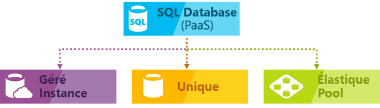
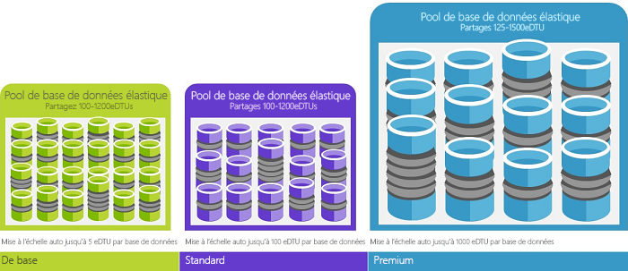

# Qu’est-ce que le service Azure SQL Database ?

Azure SQL Database est un service géré de bases de données relationnelles à usage général qui vous permet de créer une couche de stockage de données hautement disponible et performante pour les applications et solutions dans le cloud Microsoft Azure. SQL Database peut être le bon choix pour une variété d'applications modernes dans le cloud car il vous permet d'utiliser de puissantes fonctionnalités pour traiter à la fois des données relationnelles et des [structures non relationnelles](sql-database-multi-model-features.md), notamment des graphiques, des structures JSON, spatiales et XML. Il repose sur la dernière version stable du [moteur de base de données Microsoft SQL Server ](https://docs.microsoft.com/sql/sql-server/sql-server-technical-documentation?toc=/azure/sql-database/toc.json) et vous permet d'utiliser un riche ensemble de fonctions avancées de traitement des requêtes telles que les [technologies en mémoire hautes performances ](sql-database-in-memory.md) et le [traitement intelligent des requêtes ](https://docs.microsoft.com/sql/relational-databases/performance/intelligent-query-processing?toc=/azure/sql-database/toc.json).
Avec la stratégie orientée cloud de Microsoft, les dernières fonctionnalités de SQL Server sont tout d’abord publiées dans SQL Database, puis dans SQL Server. Cette approche vous procure les fonctionnalités SQL Server les plus récentes sans frais d’application de correctifs ou de mise à niveau, et ces fonctionnalités ont déjà été testées sur des millions de bases de données. SQL Database vous permet de définir et de mettre à l'échelle facilement les performances dans deux modèles d’achat différents : un [modèle d’achat vCore](sql-database-service-tiers-vcore.md) et un [modèle d’achat DTU](sql-database-service-tiers-dtu.md). SQL Database est un service entièrement géré qui intègre une haute disponibilité, des sauvegardes et d'autres opérations de maintenance courantes. Microsoft gère toutes les applications de correctifs et mises à jour du code SQL et du code du système d’exploitation en toute transparence, et élimine toute la gestion de l’infrastructure sous-jacente.

> [!NOTE]
> Pour connaître la signification des termes dans Azure SQL Database, consultez le [Lexique SQL Database](sql-database-glossary-terms.md).

## Modèles de déploiement

Azure SQL Database fournit les options de déploiement suivantes pour une base de données Azure SQL :

- [Base de données unique](sql-database-single-database.md) représente une base de données isolée entièrement gérée qui constitue le choix parfait pour les applications de cloud modernes et les microservices nécessitant une source de données unique et fiable. Une base de données unique est similaire à une [base de données autonome](https://docs.microsoft.com/sql/relational-databases/databases/contained-databases?toc=/azure/sql-database/toc.json) dans le [moteur de base de données Microsoft SQL Server](https://docs.microsoft.com/sql/sql-server/sql-server-technical-documentation?toc=/azure/sql-database/toc.json).
- [Instance gérée](sql-database-managed-instance.md) représente une instance entièrement gérée du [moteur de base de données Microsoft SQL Server](https://docs.microsoft.com/sql/sql-server/sql-server-technical-documentation?toc=/azure/sql-database/toc.json) contenant un ensemble de bases de données pouvant être utilisées ensemble. C'est le choix idéal pour une migration facile de bases de données SQL Server locales vers le cloud Azure et pour les applications qui doivent exploiter les puissantes fonctionnalités de bases de données fournies par le moteur de base de données SQL Server.
- [Pool élastique](sql-database-elastic-pool.md) représente une collection de [bases de données uniques](sql-database-single-database.md) avec un ensemble partagé de ressources telles que le processeur ou la mémoire. Les bases de données uniques peuvent être déplacées dans et hors d’un pool élastique.

> [!IMPORTANT]
> Pour comprendre les différences de fonctionnalités entre SQL Database et SQL Server, ainsi que les différences entre les diverses options de déploiement d’Azure SQL Database, voir [Fonctionnalités SQL](sql-database-features.md).

SQL Database offre des performances prévisibles pour plusieurs types de ressources, niveaux de service et tailles de calcul, ce qui permet une scalabilité dynamique sans temps d’arrêt, une optimisation intelligente intégrée, une scalabilité et une disponibilité globales, ainsi que des options avancées de sécurité, le tout avec très peu de tâches d’administration. Ces fonctionnalités vous permettent de vous concentrer sur le développement rapide de vos applications et d’accélérer leur mise sur le marché, plutôt que de consacrer du temps et des ressources à la gestion des machines virtuelles et de leur infrastructure. Le service SQL Database est actuellement présent dans 38 centres de données du monde entier, et de plus en plus de centres de données passent en ligne régulièrement, ce qui vous permet d’exécuter votre base de données dans un centre de données proche de chez vous.

## Pools et performances évolutives

Tous les types SQL Database vous permettent de définir la quantité de ressources qui seront affectées. 
- Avec des bases de données uniques, chaque base de données est isolée des autres et portable, avec sa propre garantie quantité de ressources de calcul, de mémoire et de stockage. La quantité de ressources assignée à la base de données est dédiée à cette base de données et ne sera pas partagée avec d'autres bases de données dans le cloud Azure. Vous pouvez mettre à l'échelle de façon dynamique des [ressources de base de données uniques](sql-database-single-database-scale.md). Base de données unique fournit différentes ressources de calcul, de mémoire et de stockage pour différents besoins, allant de 1 à 80 vCores, 32 Go à 4 To, etc. Le [niveau de service hyperscale](sql-database-service-tier-hyperscale.md) pour une base de données unique vous permet de mettre à l’échelle jusqu’à 100 To, avec des fonctionnalités de sauvegarde et de restauration rapides.
- Avec les pools élastiques, vous pouvez assigner des ressources qui seront partagées par toutes les bases de données du pool. Vous pouvez créer une base de données ou déplacer des bases de données uniques existantes vers un pool de ressources pour optimiser l’utilisation des ressources et réaliser des économies, en ayant la possibilité de [mettre à l’échelle des ressources de pool élastique](sql-database-elastic-pool-scale.md) de façon dynamique.
- Avec des instances gérées, chaque instance est isolée des autres avec des ressources garanties. Au sein d’une instance managée, les bases de données d’instance partagent un ensemble de ressources, avec la possibilité de [mettre à l’échelle des ressources d’instance managée](sql-database-managed-instance-resource-limits.md) de façon dynamique.

Vous pouvez créer votre première application dans une petite base de données unique pour un coût mensuel modique avec le niveau de service d’usage général, puis modifier ce niveau de service manuellement ou par programmation à tout moment en niveau critique pour l’entreprise afin de répondre aux besoins de votre solution. Vous pouvez ajuster les performances sans perturber le fonctionnement de votre application, ni l’expérience de vos clients. L’évolutivité dynamique permet à votre base de données de répondre en toute transparence aux besoins en ressources qui évoluent sans cesse et de payer uniquement les ressources dont vous avez besoin, lorsque vous en avez besoin.

La scalabilité dynamique est différente de la mise à l’échelle automatique. La mise à l’échelle survient lorsqu’un service se met à l’échelle automatiquement en fonction de critères, tandis que l’extensibilité dynamique permet la mise à l’échelle manuelle sans temps d’arrêt. Une base de données unique prend en charge l’extensibilité dynamique manuelle, mais pas la mise à l’échelle automatique. Pour plus expérience plus *automatique*, envisagez d’utiliser des pools élastiques, ce qui permet aux bases de données de partager des ressources dans un pool en fonction de leurs besoins individuels. Toutefois, il existe des scripts qui peuvent aider à automatiser l’extensibilité pour une base de données unique. Pour obtenir un exemple, consultez [Utiliser PowerShell pour surveiller et mettre à l’échelle une base de données SQL](scripts/sql-database-monitor-and-scale-database-powershell.md).

### Modèles d’achat

SQL Database est disponible en deux modèles d’achat :
- Le [modèle d’achat vCore](sql-database-service-tiers-vcore.md) vous permet de choisir le nombre de vCores, la quantité de mémoire et de stockage, ainsi que la vitesse de stockage. Le modèle d’achat vCore vous permet également d’utiliser **[Azure Hybrid Benefit pour SQL Server](https://azure.microsoft.com/pricing/hybrid-benefit/)** afin de réduire les coûts. Pour en savoir plus sur Azure Hybrid Benefit, consultez le [forum aux questions](#sql-database-frequently-asked-questions-faq).
- Le [modèle d’achat DTU](sql-database-service-tiers-dtu.md) offre une combinaison de ressources de calcul, de mémoire et d’E/S réparties sur trois niveaux de service pour prendre en charge les charges de travail de base de données, tant légères qu’importantes. Les tailles de calcul de chaque niveau fournissent une combinaison différente de ces ressources, auxquelles vous pouvez ajouter d’autres ressources de stockage.
- Le [modèle serverless](sql-database-serverless.md) met automatiquement à l’échelle les calculs en fonction de la demande de charge de travail et des factures pour la quantité de calculs utilisée chaque seconde. Le niveau de calcul serverless met aussi automatiquement en pause les bases de données pendant les périodes d’inactivité, quand seul le stockage est facturé, et reprend leur exécution automatiquement avec l’activité.

### Niveaux de service

Azure SQL Database offre trois niveaux de services conçus pour différents types d'applications :
- [Usage général/Standard](sql-database-service-tier-general-purpose.md) : adapté aux charges de travail courantes. Offre des options de calcul et de stockage équilibrées et économiques.
- [Critique pour l'entreprise/Premium](sql-database-service-tier-business-critical.md) : adapté aux applications OLTP avec des débits de transactions élevés et la latence des E/S la plus faible. Offre la meilleure résilience aux défaillances grâce à l’utilisation de plusieurs réplicas isolés.
- [HyperScale](sql-database-service-tier-hyperscale.md) : adapté aux très grandes bases de données OLTP, avec capacité de mise à l'échelle automatique du stockage et calcul de mise à l'échelle de manière fluide. 

### Pools élastiques pour optimiser l’utilisation des ressources

Pour de nombreuses entreprises et applications, la possibilité de créer des bases de données uniques et d’augmenter ou de ralentir les performances à la demande se révèle suffisante, surtout si les modèles d’utilisation sont relativement prévisibles. Mais si vous avez des modèles d'utilisation imprévisibles, il peut être difficile de gérer les coûts et votre modèle commercial. [Les pools élastiques](sql-database-elastic-pool.md) sont conçus pour résoudre ce problème. Le concept est simple. Vous allouez des ressources de performance à un pool plutôt qu’à une base de données individuelle et vous payez pour les ressources de performance d’un pool plutôt que pour celles d’une base de données unique.

   

Les pools élastiques vous permettent de ne pas avoir à ajuster les performances de la base de données en fonction des besoins en ressources. Les bases de données mises en pool consomment les ressources de performance du pool élastique en fonction des besoins. Les bases de données mises en pool consomment mais ne dépassent pas les limites du pool. Vos coûts restent prévisibles, même si l’utilisation de la base de données individuelle ne l’est pas. Par ailleurs, vous pouvez [ajouter et supprimer des bases de données du pool](sql-database-elastic-pool-manage-portal.md), mettre à l’échelle votre application en passant de quelques bases de données à des milliers, le tout dans les limites d’un budget que vous contrôlez. Vous pouvez également contrôler le nombre minimal et maximal de ressources disponibles pour les bases de données dans le pool. Cela vous permet de garantir qu’aucune base de données mise en pool n’utilise toutes les ressources du pool et que chaque base de données dispose d’un nombre minimal de ressources. Pour en savoir plus sur les modèles de conception pour les applications SaaS avec des pools élastiques, voir [Design Patterns for Multi-tenant SaaS Applications with Azure SQL Database](sql-database-design-patterns-multi-tenancy-saas-applications.md) (Modèles de conception pour les applications SaaS mutualisées avec SQL Database).

Les scripts aident à la surveillance et à la mise à l’échelle des pools élastiques. Pour un exemple, consultez [Utiliser PowerShell pour surveiller et mettre à l’échelle un pool élastique SQL dans Azure SQL Database](scripts/sql-database-monitor-and-scale-pool-powershell.md).

> [!IMPORTANT]
> Une instance gérée ne prend pas en charge les pools élastiques. Au lieu de cela, une instance managée est une collection de bases de données d’instance partageant des ressources d’instance managée.

### Fusionner les bases de données uniques avec les bases de données mises en pool

Vous pouvez fusionner des bases de données uniques avec des pools élastiques et changer les niveaux de service des bases de données uniques et des pools élastiques de façon simple et rapide pour vous adapter à votre situation. Grâce à la puissance et à la portée d’Azure, vous pouvez mélanger les autres services Azure avec SQL Database, afin de pouvoir répondre aux besoins uniques de vos applications en matière de conception, réduire les coûts, optimiser l’efficacité des ressources et créer de nouvelles opportunités professionnelles.

## Fonctionnalités étendues de surveillance et d’alerte

Azure SQL Database offre un ensemble de fonctions avancées de surveillance et de dépannage qui peuvent vous aider à obtenir un aperçu complet des caractéristiques de la charge de travail. Les caractéristiques et les outils peuvent être classés dans les catégories suivantes :
 - Les capacités de surveillance intégrées fournies par la dernière version du moteur de base de données SQL Server qui vous permettent d’obtenir en temps réel des informations sur les performances. 
 - Les capacités de surveillance PaaS fournies par la plate-forme Azure vous permettent de surveiller facilement un grand nombre d'instances de bases de données et de fournir des conseils de dépannage qui facilitent la résolution des problèmes de performances.

La fonction de surveillance du moteur de base de données intégrée la plus importante que vous devriez utiliser est le composant [Magasin des requêtes](sql-database-operate-query-store.md), qui consigne en temps réel les performances de vos requêtes et vous permet d'identifier les problèmes de performances potentiels et les principaux consommateurs de ressources. Réglage automatique et les recommandations fournissent des conseils concernant les requêtes avec les performances régressées et les index manquants ou dupliqués. Réglage automatique dans Azure SQL Database vous permet soit d'appliquer manuellement les scripts qui peuvent résoudre les problèmes, soit de laisser Azure SQL Database appliquer le correctif, le tester et vérifier s'il présente un certain avantage, et conserver ou annuler le changement en fonction du résultat. Outre les fonctions Magasin des requêtes et Réglage automatique, vous pouvez également utiliser des composants [DMV et XEvent](sql-database-monitoring-with-dmvs.md) standard pour surveiller les performances des charges de travail.

La plate-forme Azure fournit les [outils intégrés de surveillance](sql-database-performance.md) et d'[alerte](sql-database-insights-alerts-portal.md), combinés avec les évaluations de performance, qui vous permettent de surveiller facilement le statut de milliers de bases de données. Ces outils vous permettent d’évaluer rapidement l’impact des mises à l’échelle (montées ou descentes en charge) en fonction de vos besoins en performances actuels ou pour un projet. En outre, SQL Database peut [émettre des métriques et des journaux de diagnostic](sql-database-metrics-diag-logging.md) pour faciliter la supervision. Vous pouvez configurer SQL Database pour stocker l’utilisation des ressources, les employés et les sessions, ainsi que la connectivité dans une de ces ressources Azure :

- **Stockage Azure** : Pour archiver à petit prix de gros volumes de données de télémétrie.
- **Azure Event Hub** : Pour intégrer des données de télémétrie SQL Database à votre solution de supervision personnalisée ou à vos pipelines chauds.
- **Journaux d’activité Azure Monitor** : pour une solution de supervision intégrée offrant des fonctionnalités de génération de rapports, d’alerte et d’atténuation.

    

## Fonctionnalités de disponibilité

Dans un environnement SQL Server traditionnel, vous devez généralement avoir configuré (au moins) 2 machines localement avec des copies exactes (gérée de façon synchrone) des données (à l’aide de fonctionnalités telles que les groupes de disponibilité AlwaysOn ou d’instances de cluster de basculement) pour vous protéger contre la défaillance d’un ordinateur/composant unique. Cela assure une haute disponibilité, mais pas la protection contre une catastrophe naturelle détruisant votre centre de données.

La récupération d’urgence suppose qu’un événement catastrophique sera suffisamment localisé géographiquement pour avoir une autre machine/un autre ensemble de machines avec une copie de vos données à distance.  Dans SQL Server, vous pouvez utiliser des groupes de disponibilité Always On s’exécutant en mode asynchrone pour obtenir cette fonctionnalité.  Les problèmes de rapidité signifient généralement que les personnes ne souhaitent pas attendre que la réplication se produise si loin avant de valider une transaction. Il existe donc un risque potentiel de perte de données lorsque vous effectuez des basculements non planifiés.

Les bases de données des niveaux de service Premium et stratégique [effectuent déjà des actions très proches](sql-database-high-availability.md#premium-and-business-critical-service-tier-availability) de la synchronisation d’un groupe de disponibilité. Les bases de données des niveaux de service inférieurs assurent une redondance via le stockage à l’aide [d’un mécanisme différent, mais équivalent](sql-database-high-availability.md#basic-standard-and-general-purpose-service-tier-availability). Une logique assure la protection de la machine contre une défaillance unique.  La fonctionnalité de géoréplication active vous permet de protéger la machine contre les sinistres lorsqu’une région entière est détruite.

La fonctionnalité Zones de disponibilité Azure est active en matière de problème de haute disponibilité.  Elle essaie de protéger un centre de données unique au sein d’une seule et même région contre les pannes.  Par conséquent, elle souhaite assurer la protection contre la perte de puissance ou de réseau touchant un bâtiment. Dans SQL Azure, cela fonctionne en plaçant les différents réplicas dans diverses zones de disponibilité (avec efficacité dans différents bâtiments) fonctionnant par ailleurs comme avant.

En fait, avec un temps de disponibilité de 99,99 %, l’excellent contrat de niveau de service [(SLA)](https://azure.microsoft.com/support/legal/sla/) d’Azure, soutenu par un réseau mondial de centres de données gérés par Microsoft, permet d’exécuter votre application 24 heures sur 24, 7 jours sur 7. La plateforme Azure gère entièrement chaque base de données et garantit un pourcentage élevé de disponibilité des données, sans aucune perte. Azure gère automatiquement les tâches suivantes : mises à jour correctives, sauvegardes, réplication, détection des éventuelles défaillances matérielles, logicielles ou réseau sous-jacentes, déploiement de correctifs de bogues, basculements, mises à niveau de base de données et autres tâches de maintenance. Pour obtenir la disponibilité Standard, les couches de calcul et de stockage sont séparées. Pour obtenir la disponibilité Premium, les opérations de calcul et de stockage sont intégrées à un nœud unique afin d’améliorer les performances, puis une technologie similaire aux groupes de disponibilité Always On est implémentée en arrière-plan. Pour accéder à une description complète des fonctionnalités haute disponibilité d’Azure SQL Database, consultez [Disponibilité de SQL Database](sql-database-high-availability.md). En outre, SQL Database fournit des fonctionnalités intégrées de [continuité d’activité et d’évolutivité globale](sql-database-business-continuity.md), notamment :

- **[Sauvegardes automatiques](sql-database-automated-backups.md)** :

  SQL Database effectue automatiquement des sauvegardes complètes, différentielles et du journal des transactions de bases de données Azure SQL pour vous permettre de restaurer à n’importe quel point dans le temps. Pour des bases de données uniques et des bases de données mises en pool, vous pouvez configurer SQL Database de façon à stocker les sauvegardes de base de données complètes sur un stockage Azure en vue d’une conservation à long terme. Pour des instances gérées, vous pouvez également effectuer des sauvegardes de copie uniquement en vue d’une rétention à long terme.

- **[Restaurations à un point dans le temps](sql-database-recovery-using-backups.md)** :

  Toutes les options de déploiement de SQL Database prennent en charge la récupération à n’importe quel point dans le temps au cours de la période de conservation de sauvegarde automatique pour toute base de données Azure SQL.
- **[Géo-réplication active](sql-database-active-geo-replication.md)** :

  Une base de données unique et des bases de données mises en pool vous permettent de configurer jusqu’à quatre bases de données secondaires accessibles en lecture, que ce soit dans le même centre de données ou dans des centres de données distribués globalement.  Par exemple, si vous avez une application SaaS avec une base de données de catalogue qui a un volume élevé de transactions simultanées en lecture seule, utilisez la géo-réplication active pour permettre une mise à l’échelle de lecture globale et supprimer les goulots d’étranglement sur le serveur principal qui sont dus à des charges de travail en lecture. Pour des instances gérées, utilisez des groupes de basculement automatique.
- **[Groupes de basculement automatique](sql-database-auto-failover-group.md)**  :

  Toutes les options de déploiement de SQL Database vous permettent d’utiliser des groupes de basculement pour activer la haute disponibilité et l’équilibrage de charge à l’échelle globale, y compris la géo-réplication transparente ainsi que le basculement de grands ensembles de bases de données, de pools élastiques et d’instances gérées. Des groupes de basculement permettent de créer des applications SaaS globalement distribuées nécessitant une administration minimale, en laissant SQL Database se charger toutes les tâches complexes de surveillance, de routage et d’orchestration de basculement.
- **[Bases de données redondantes dans une zone](sql-database-high-availability.md)** :

  SQL Database vous permet d’approvisionner des bases de données ou des pools élastiques premium ou critiques pour l’entreprise dans plusieurs zones de disponibilité. Les bases de données et les pools élastiques ont plusieurs réplicas redondants pour une haute disponibilité. Placer ces réplicas dans plusieurs zones de disponibilité procure donc une résilience supérieure, et donne la possibilité d’effectuer une récupération automatique à partir des échecs de mise à l’échelle du centre de données sans perdre de données.

## Intelligence intégrée

Avec SQL Database, vous obtenez une intelligence intégrée qui permet de réduire considérablement les coûts d’exécution et de gestion des bases de données, et d’optimiser les performances et la sécurité de votre application. Via l’exécution de millions de charges de travail client 24 heures sur 24, SQL Database collecte et traite une quantité vertigineuse de données de télémétrie, tout en respectant également pleinement la confidentialité des clients en arrière-plan. Différents algorithmes évaluent en permanence les données de télémétrie afin que le service puisse apprendre et s’adapter à votre application. En fonction de cette analyse, le service propose des solutions pour améliorer les performances en tenant compte de votre charge de travail spécifique.

### Surveillance et réglage des performances automatiques

SQL Database fournit des informations détaillées sur les requêtes que vous devez surveiller. SQL Database en apprend plus sur les modèles de votre base de données et vous permet d’adapter le schéma de base de données à votre charge de travail. SQL Database propose des [recommandations pour le réglage des performances](sql-database-advisor.md), où vous pouvez passer en revue les actions de réglage et les appliquer.

Toutefois, la surveillance permanente d’une base de données est une tâche difficile et fastidieuse, en particulier lors du traitement de plusieurs bases de données. [Intelligent Insights](sql-database-intelligent-insights.md) effectue cette tâche pour vous en surveillant automatiquement les performances de SQL Database à l’échelle et vous informe des problèmes de dégradation des performances, identifie la cause du problème et fournit des recommandations pour l’amélioration des performances lorsque cela est possible.

La gestion efficace d’un très grand nombre de bases de données peut s’avérer impossible même avec tous les rapports et outils disponibles avec SQL Database et Azure. Au lieu de surveiller et de régler votre base de données manuellement, vous pouvez envisager de déléguer certaines actions de surveillance et de réglage à SQL Database grâce au [réglage automatique](sql-database-automatic-tuning.md). SQL Database applique automatiquement les recommandations, puis teste et vérifie chacune de ses actions de réglage afin de garantir l’amélioration continue des performances. De cette manière, SQL Database s’adapte automatiquement à votre charge de travail de façon contrôlée et sécurisée. Le réglage automatique signifie que les performances de votre base de données sont soigneusement surveillées et comparées avant et après chaque action de réglage et, si les performances ne s’améliorent pas, l’action de réglage est annulée.

Aujourd’hui, plusieurs de nos partenaires exécutant des [applications SaaS multi-locataires](sql-database-design-patterns-multi-tenancy-saas-applications.md) sur SQL Database font confiance au réglage des performances pour garantir que leurs applications ont toujours des performances stables et prévisibles. Pour eux, cette fonctionnalité réduit considérablement le risque de voir survenir un incident lié aux performances au milieu de la nuit. En outre, étant donné qu’une partie de leurs clients utilisent également SQL Server, ils se servent des mêmes recommandations d’indexation fournies par SQL Database pour aider leurs clients exécutant SQL Server.

Deux aspects de réglage automatique sont [disponibles dans SQL Database](sql-database-automatic-tuning.md) :

- **Gestion automatique des index** : identifie les index qui doivent être ajoutés à votre base de données et ceux qui doivent être supprimés.
- **Correction automatique du plan** : identifie les plans problématiques et résout les problèmes de performances du plan SQL (déployé prochainement, déjà disponible dans SQL Server 2017).

### Traitement adaptatif des requêtes

Nous ajoutons également à SQL Database la famille des fonctionnalités de [traitement adaptatif des requêtes](/sql/relational-databases/performance/intelligent-query-processing), y compris l’exécution entrelacée pour les fonctions TVF à instructions multiples, les commentaires d’allocation de mémoire en mode traitement par lots et les jointures adaptatives en mode de traitement par lots. Chacune de ces fonctionnalités de traitement adaptatif des requêtes applique des techniques similaires d’apprentissage et d’adaptation, ce qui contribue à résoudre les problèmes de performances liés aux soucis d’optimisation de requête historiquement intraitables.

## Sécurité et conformité avancées

SQL Database fournit toute une gamme de [fonctionnalités intégrées de sécurité et conformité](sql-database-security-overview.md) pour que votre application réponde aux différentes exigences de conformité et de sécurité.

> [!IMPORTANT]
> La base de données Azure SQL Database (toutes les options de déploiement) a été certifiée par rapport à plusieurs normes de conformité. Pour en savoir plus, accédez au [Centre de confidentialité Azure](https://gallery.technet.microsoft.com/Overview-of-Azure-c1be3942), qui inclut la liste la plus à jour des certifications de conformité de SQL Database.

### Protection avancée contre les menaces

Advanced Data Security est un package unifié de fonctionnalités de sécurité SQL avancées. Il inclut des fonctionnalités permettant de découvrir et de classifier les données sensibles, de gérer les vulnérabilités de votre base de données et de détecter les activités anormales pouvant indiquer une menace ciblant votre base de données. Il vous permet d’activer et de gérer ces fonctionnalités à partir d’un seul et même emplacement.

- [Découverte et classification des données](sql-database-data-discovery-and-classification.md) :

  cette fonctionnalité (actuellement en préversion) offre des fonctionnalités intégrées à Azure SQL Database pour la découverte, la classification, l’étiquetage et la protection des données sensibles dans vos bases de données. Cette fonctionnalité peut être utilisée pour fournir de la visibilité sur l’état de classification de votre base de données et pour suivre l’accès aux données sensibles dans la base de données et en dehors de celle-ci.
- [Évaluation des vulnérabilités](sql-vulnerability-assessment.md) :

  Ce service découvre, suit et facilite la correction des vulnérabilités potentielles de base de données. Elle offre une visibilité sur votre état de sécurité et inclut des mesures pratiques pour résoudre les problèmes de sécurité et améliorer la protection de votre base de données.
- [Détection des menaces](sql-database-threat-detection.md) :

  cette fonctionnalité détecte les activités anormales indiquant des tentatives d’accès ou d’exploitation inhabituelles et potentiellement dangereuses de votre base de données. Elle surveille en permanence votre base de données pour détecter des activités suspectes et envoie immédiatement des alertes de sécurité en cas de vulnérabilités éventuelles, d’attaques par injection de code SQL et de modèles d’accès anormaux à la base de données. Les alertes générées par la fonctionnalité Détection des menaces fournissent des informations sur les activités suspectes et recommandent l’action à entreprendre pour analyser et atténuer la menace.

### Audit de sécurité et de conformité

L’[audit](sql-database-auditing.md) suit les événements de base de données et les consigne dans un journal d’audit dans votre compte de stockage Azure. L’audit peut vous aider à respecter une conformité réglementaire, à comprendre l’activité de la base de données et à découvrir des discordances et anomalies susceptibles d’indiquer des problèmes pour l’entreprise ou des violations de la sécurité.

### Chiffrement des données

SQL Database protège vos données en chiffrant les données en mouvement avec un chiffrement [TLS (Transport Layer Security)](https://support.microsoft.com/kb/3135244), les données au repos avec un chiffrement [Transparent Data Encryption](https://docs.microsoft.com/sql/relational-databases/security/encryption/transparent-data-encryption-azure-sql) et les données en cours d’utilisation avec un chiffrement [Always Encrypted](https://docs.microsoft.com/sql/relational-databases/security/encryption/always-encrypted-database-engine).

### Intégration d’Azure Active Directory et authentification multifacteur

SQL Database vous permet de gérer de manière centralisée les identités d’utilisateur de base de données et d’autres services Microsoft avec l’[intégration d’Azure Active Directory](sql-database-aad-authentication.md). Cette fonctionnalité simplifie la gestion des autorisations et améliore la sécurité. Azure Active Directory prend en charge l’[authentification multifacteur](sql-database-ssms-mfa-authentication.md) (MFA) pour augmenter la sécurité des données et des applications, ainsi qu’un processus d’authentification unique.

### Certification de conformité

SQL Database participe à des audits réguliers et a été certifié par rapport à plusieurs normes de conformité. Pour en savoir plus, accédez au [Centre de confidentialité Azure](https://gallery.technet.microsoft.com/Overview-of-Azure-c1be3942), qui inclut la liste la plus à jour des certifications de conformité de SQL Database.

## Outils simples d’utilisation

SQL Database simplifie la création et la gestion des applications et vous fait gagner en productivité. SQL Database vous aide à vous concentrer sur ce que vous maîtrisez le mieux, à savoir le développement de formidables applications. Dans SQL Database, vous pouvez gérer et développer des applications à l’aide des outils et des compétences dont vous disposez déjà.

- **[Portail Azure](https://portal.azure.com/)** :

  application web dédiée à la gestion de tous les services Azure
- **[SQL Server Management Studio (SSMS)](https://docs.microsoft.com/sql/ssms/download-sql-server-management-studio-ssms)** :

  application client téléchargeable gratuitement dédiée à la gestion des infrastructures SQL, allant de SQL Server à SQL Database
- **[SQL Server Data Tools dans Visual Studio](https://docs.microsoft.com/sql/ssdt/download-sql-server-data-tools-ssdt)** :

  application cliente téléchargeable gratuite, dédiée au développement de bases de données relationnelles SQL Server, de bases de données Azure SQL, de packages Integration Services, de modèles de données Analysis Services et de rapports Reporting Services.
- **[Visual Studio Code](https://code.visualstudio.com/docs)** :

  éditeur de code open source téléchargeable gratuitement pour Linux, macOS et Windows, qui prend en charge les extensions, notamment [l’extension mssql](https://aka.ms/mssql-marketplace) pour l’exécution de requêtes dans Microsoft SQL Server, Azure SQL Database et SQL Data Warehouse.

SQL Database prend en charge la génération d’applications avec Python, Java, Node.js, PHP, Ruby et .NET sur MacOS, Linux et Windows. SQL Database prend en charge les mêmes [bibliothèques de connexions](sql-database-libraries.md) que SQL Server.

[!INCLUDE [sql-database-create-manage-portal](includes/sql-database-create-manage-portal.md)]

## Forum aux questions sur SQL Database

### Quelle est la version actuelle de SQL Database ?

La version actuelle de la base de données SQL est la version 12. La version 11 a été retirée.

### Puis-je contrôler le moment ou se produit le temps d’arrêt pour une mise à jour corrective ?

Non. L’impact d’une mise à jour corrective est généralement imperceptible si vous [utilisez une logique de nouvelle tentative](sql-database-develop-overview.md#resiliency) dans votre application. Pour plus d’informations sur la préparation aux événements de maintenance planifiée sur votre base de données Azure SQL, consultez [Planification des événements de maintenance Azure dans Azure SQL Database](sql-database-planned-maintenance.md).

### Questions sur Azure Hybrid Benefit

#### Y a-t-il des droits d’utilisation double avec Azure Hybrid Benefit pour SQL Server ?

Vous disposez de 180 jours de droits d’utilisation double de la licence pour vous assurer que les migrations s’exécutent en toute transparence. À l’issue de cette période de 180 jours, la licence SQL Server peut uniquement être utilisée dans le cloud dans SQL Database et n’a pas de droits d’utilisation double en local et dans le cloud.

#### Quelle est la différence entre Azure Hybrid Benefit pour SQL Server et la mobilité des licences ?

Aujourd’hui, nous proposons aux clients SQL Server des avantages de mobilité de licence Software Assurance qui leur permettent de réattribuer leurs licences à des serveurs partagés tiers. Cet avantage peut être utilisé sur Azure IaaS et AWS EC2.
La différence entre Azure Hybrid Benefit pour SQL Server et la mobilité de licence se trouve dans deux domaines clés :

- Azure Hybrid Benefit pour SQL Server propose des avantages économiques pour la migration de charges de travail hautement virtualisées vers Azure. Les clients EE SQL peuvent obtenir 4 cœurs dans Azure dans la référence SKU Usage général pour chacun des cœurs qu’ils possèdent en local pour des applications hautement virtualisées. La mobilité de licence n’offre aucun avantage spécifique en termes de coûts pour la migration des charges de travail virtualisées vers le cloud.
- Elle fournit une destination PaaS sur Azure (SQL Database Managed Instance) qui est hautement compatible avec SQL Server en local.

#### Quels sont les droits spécifiques associés à Azure Hybrid Benefit pour SQL Server ?

Les clients SQL Database auront les droits associés à Azure Hybrid Benefit pour SQL Server suivants :

|Encombrement de licence|Que vous propose Azure Hybrid Benefit pour SQL Server ?|
|---|---|
|Clients avec cœurs SQL Server Enterprise Edition et SA|<li>Possibilité de payer un taux de base pour les références SKU Usage général ou Critique pour l’entreprise</li> <li>1 cœur local = 4 cœurs dans la référence SKU Usage général</li> <li>1 cœur local = 1 cœur dans la référence SKU Critique pour l’entreprise</li>|
|Clients avec cœurs SQL Server Standard Edition et SA|<li>Possibilité de payer un taux de base pour la référence SKU Usage général uniquement</li> <li>1 cœur local = 1 cœur dans la référence SKU Usage général</li>|
|||

## Collaborer avec l’équipe d’ingénierie de SQL Server

- [DBA Stack Exchange](https://dba.stackexchange.com/questions/tagged/sql-server) : posez vos questions sur l'administration des bases de données.
- [Stack Overflow](https://stackoverflow.com/questions/tagged/sql-server) : posez vos questions sur le développement.
- [Forums MSDN](https://social.msdn.microsoft.com/Forums/home?category=sqlserver) : posez vos questions techniques.
- [Feedback](https://aka.ms/sqlfeedback) : signalez les bogues et demandez des fonctionnalités.
- [Reddit](https://www.reddit.com/r/SQLServer/) : échangez au sujet de SQL Server.

## Étapes suivantes

- Consultez la [page de tarification](https://azure.microsoft.com/pricing/details/sql-database/) pour obtenir un comparatif des coûts entre une base de données unique et des pools élastiques et accéder à des calculateurs.
- Consultez ces démarrages rapides pour bien commencer :

  - [Créer une base de données SQL dans le portail Azure](sql-database-single-database-get-started.md)  
  - [Créer une base de données SQL avec Azure CLI](sql-database-get-started-cli.md)
  - [Créer une base de données SQL à l’aide de PowerShell](sql-database-get-started-powershell.md)

- Pour accéder à des exemples Azure CLI et PowerShell, consultez :
  - [Exemples d’interface de ligne de commande Azure pour SQL Database](sql-database-cli-samples.md)
  - [Exemples Azure PowerShell pour SQL Database](sql-database-powershell-samples.md)

 - Pour plus d’informations sur les nouvelles fonctionnalités annoncées, voir 
   - **[Feuille de route Azure pour SQL Database](https://azure.microsoft.com/roadmap/?category=databases)**  : l’endroit où trouver les nouveautés et les futures fonctionnalités.
  - **[Blog Azure SQL Database](https://azure.microsoft.com/blog/topics/database)**  : c’est là où les membres de l’équipe produit SQL Server publient des billets de blog sur les nouveautés et les fonctionnalités de SQL Database.

