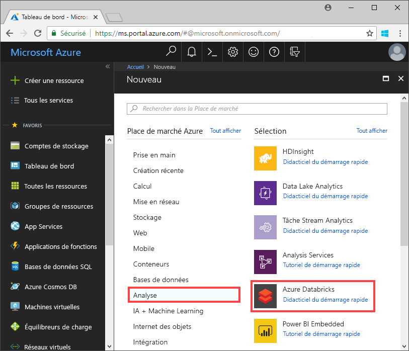
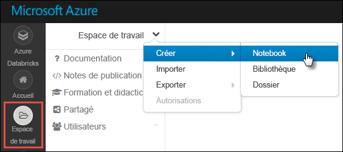

# <a name="tutorial-implement-the-data-lake-capture-pattern-to-update-a-databricks-delta-table"></a>Tutoriel : Implémenter le modèle de capture de lac de données pour mettre à jour une table Delta Databricks

Ce tutoriel vous montre comment gérer des événements dans un compte de stockage doté d’un espace de noms hiérarchique.

Vous allez créer une petite solution qui permet à un utilisateur de remplir une table Databricks Delta en chargeant un fichier de valeurs séparées par des virgules (CSV) qui décrit une commande client. Vous allez créer cette solution en associant un abonnement Event Grid, une fonction Azure et un [travail](https://docs.azuredatabricks.net/user-guide/jobs.html) dans Azure Databricks.

Ce didacticiel présente les procédures suivantes :

> [!div class="checklist"]
> * Créer un abonnement Event Grid qui appelle une fonction Azure
> * Créer une fonction Azure qui reçoit une notification d’un événement, puis exécute le travail dans Azure Databricks
> * Créer un travail Databricks qui insère une commande client dans une table Databricks Delta hébergée dans le compte de stockage

Pour créer cette solution, nous allons procéder dans l’ordre inverse et commencer par l’espace de travail Azure Databricks.

## <a name="prerequisites"></a>Prérequis

* Si vous n’avez pas d’abonnement Azure, créez un [compte gratuit](https://azure.microsoft.com/free/?WT.mc_id=A261C142F) avant de commencer.

* Créez un compte de stockage qui possède un espace de noms hiérarchique (Azure Data Lake Storage Gen2). Ce tutoriel utilise un compte de stockage nommé `contosoorders`. Vérifiez que le [rôle Contributeur aux données Blob du stockage](https://docs.microsoft.com/azure/storage/common/storage-auth-aad-rbac) est attribué à votre compte d’utilisateur.

  Voir [Créer un compte Azure Data Lake Storage Gen2](data-lake-storage-quickstart-create-account.md).

* Créer un principal de service. Consultez [Procédure : Utilisez le portail pour créer une application Azure AD et un principal du service pouvant accéder aux ressources](https://docs.microsoft.com/azure/active-directory/develop/howto-create-service-principal-portal).

  Vous devrez faire certaines choses spécifiques pendant que vous suivrez les étapes décrites dans cet article.

  :heavy_check_mark: Au cours des étapes décrites dans la section [Attribuer un rôle à l’application](https://docs.microsoft.com/azure/active-directory/develop/howto-create-service-principal-portal#assign-a-role-to-the-application) de l’article, veillez à affecter le rôle **Contributeur aux données Blob du stockage** au principal de service.

  > [!IMPORTANT]
  > Veillez à attribuer le rôle dans l’étendue du compte de stockage Data Lake Storage Gen2. Vous pouvez attribuer un rôle à l’abonnement ou au groupe de ressources parent, mais des erreurs d’autorisation sont générées tant que ces attributions de rôles ne sont pas propagées au compte de stockage.

  :heavy_check_mark: Au cours des étapes indiquées dans la section [Obtenir les valeurs de connexion](https://docs.microsoft.com/azure/active-directory/develop/howto-create-service-principal-portal#get-values-for-signing-in) de l’article, collez les valeurs de l’ID de locataire, de l’ID d’application et du mot de passe dans un fichier texte. Vous aurez besoin de ces valeurs ultérieurement.

## <a name="create-a-sales-order"></a>Créer une commande client

Tout d’abord, créez un fichier CSV qui décrit une commande client, puis chargez ce fichier dans le compte de stockage. Vous utiliserez les données de ce fichier ultérieurement pour remplir la première ligne de la table Databricks Delta.

1. Ouvrez l’Explorateur de stockage Azure. Accédez à votre compte de stockage, puis, dans la section **Conteneurs d’objets blob**, créez un conteneur nommé **data**.

   

   Pour plus d’informations sur l’utilisation de l’Explorateur Stockage, consultez [Utiliser l’Explorateur Stockage Azure pour gérer les données dans un compte Azure Data Lake Storage Gen2](data-lake-storage-explorer.md).

2. Dans le conteneur **data**, créez un dossier nommé **input**.

3. Dans un éditeur de texte, collez le texte suivant.

   ```
   InvoiceNo,StockCode,Description,Quantity,InvoiceDate,UnitPrice,CustomerID,Country
   536365,85123A,WHITE HANGING HEART T-LIGHT HOLDER,6,12/1/2010 8:26,2.55,17850,United Kingdom
   ```

4. Enregistrez ce fichier sur votre ordinateur local et nommez-le **data.csv**.

5. Dans l’Explorateur Stockage, chargez ce fichier dans le dossier **input**.  

## <a name="create-a-job-in-azure-databricks"></a>Créer un travail dans Azure Databricks

Dans cette section, vous allez effectuer les tâches suivantes :

* Créer un espace de travail Azure Databricks.
* Créez un bloc-notes.
* Créer et remplir une table Databricks Delta
* Ajouter du code qui insère des lignes dans la table Databricks Delta
* Créer un travail

### <a name="create-an-azure-databricks-workspace"></a>Créer un espace de travail Azure Databricks

Dans cette section, vous créez un espace de travail Azure Databricks en utilisant le portail Azure.

1. Dans le portail Azure, sélectionnez **Créer une ressource** >  **Analytique** > **Azure Databricks**.

    

2. Sous **Service Azure Databricks**, renseignez les valeurs pour créer un espace de travail Databricks.

    

    La création de l’espace de travail dure quelques minutes. Pour superviser l’état de l’opération, regardez la barre de progression située en haut.

### <a name="create-a-spark-cluster-in-databricks"></a>Créer un cluster Spark dans Databricks

1. Dans le [portail Azure](https://portal.azure.com), accédez à l’espace de travail Azure Databricks que vous avez créé, puis sélectionnez **Lancer l’espace de travail**.

2. Vous êtes redirigé vers le portail Azure Databricks. Dans le portail, sélectionnez **Nouveau** > **Cluster**.

    

3. Dans la page **Nouveau cluster**, renseignez les valeurs pour créer un cluster.

    

    Acceptez toutes les valeurs par défaut autres que les suivantes :

    * Entrez un nom pour le cluster.
    * Veillez à cocher la case **Arrêter après 120 minutes d’inactivité**. Spécifiez une durée (en minutes) pour arrêter le cluster, si le cluster n’est pas utilisé.

4. Sélectionnez **Créer un cluster**. Une fois que le cluster est en cours d’exécution, vous pouvez y attacher des notebooks et exécuter des travaux Spark.

Pour plus d’informations sur la création de clusters, consultez [Créer un cluster Spark dans Azure Databricks](https://docs.azuredatabricks.net/user-guide/clusters/create.html).

### <a name="create-a-notebook"></a>Créer un notebook

1. Dans le volet gauche, sélectionnez **Espace de travail**. Dans la liste déroulante **Espace de travail**, sélectionnez **Créer** > **Notebook**.

    

2. Dans la boîte de dialogue **Créer un bloc-notes**, entrez un nom pour le bloc-notes. Sélectionnez **Python** comme langage, puis sélectionnez le cluster Spark que vous avez créé précédemment.

    

    Sélectionnez **Create** (Créer).

### <a name="create-and-populate-a-databricks-delta-table"></a>Créer et remplir une table Databricks Delta

1. Dans le notebook que vous avez créé, copiez et collez le bloc de code suivant dans la première cellule, mais n’exécutez pas ce code pour l’instant.  

   Dans ce bloc de code, remplacez les valeurs d’espace réservé `appId`, `password` et `tenant` par celles que vous avez collectées au moment de la finalisation des prérequis de ce tutoriel.

    ```Python
    dbutils.widgets.text('source_file', "", "Source File")

    spark.conf.set("fs.azure.account.auth.type", "OAuth")
    spark.conf.set("fs.azure.account.oauth.provider.type", "org.apache.hadoop.fs.azurebfs.oauth2.ClientCredsTokenProvider")
    spark.conf.set("fs.azure.account.oauth2.client.id", "<appId>")
    spark.conf.set("fs.azure.account.oauth2.client.secret", "<password>")
    spark.conf.set("fs.azure.account.oauth2.client.endpoint", "https://login.microsoftonline.com/<tenant>/oauth2/token")

    adlsPath = 'abfss://data@contosoorders.dfs.core.windows.net/'
    inputPath = adlsPath + dbutils.widgets.get('source_file')
    customerTablePath = adlsPath + 'delta-tables/customers'
    ```

    Ce code crée un widget nommé **source_file**. Vous créerez plus tard une fonction Azure qui appelle ce code et transmet un chemin de fichier à ce widget.  Ce code authentifie également votre principal de service auprès du compte de stockage et crée des variables que vous allez utiliser dans d’autres cellules.

    > [!NOTE]
    > Dans un environnement de production, songez à stocker votre clé d’authentification dans Azure Databricks. Ensuite, ajoutez une clé de recherche à votre bloc de code au lieu de la clé d’authentification. <br><br>Par exemple, au lieu d’utiliser la ligne de code `spark.conf.set("fs.azure.account.oauth2.client.secret", "<password>")`, vous pouvez utiliser la ligne de code suivante : `spark.conf.set("fs.azure.account.oauth2.client.secret", dbutils.secrets.get(scope = "<scope-name>", key = "<key-name-for-service-credential>"))`. <br><br>Après avoir effectué ce tutoriel, consultez l’article [Azure Data Lake Storage Gen2](https://docs.azuredatabricks.net/spark/latest/data-sources/azure/azure-datalake-gen2.html) sur le site web Azure Databricks pour voir des exemples de cette approche.

2. Appuyez sur les touches **Maj +Entrée** pour exécuter le code de ce bloc.

3. Copiez le bloc de code suivant et collez-le dans une autre cellule, puis appuyez sur les touches **Maj + Entrée** pour l’exécuter.

   ```Python
   from pyspark.sql.types import StructType, StructField, DoubleType, IntegerType, StringType


   inputSchema = StructType([
   StructField("InvoiceNo", IntegerType(), True),
   StructField("StockCode", StringType(), True),
   StructField("Description", StringType(), True),
   StructField("Quantity", IntegerType(), True),
   StructField("InvoiceDate", StringType(), True),
   StructField("UnitPrice", DoubleType(), True),
   StructField("CustomerID", IntegerType(), True),
   StructField("Country", StringType(), True)
   ])

   rawDataDF = (spark.read
    .option("header", "true")
    .schema(inputSchema)
    .csv(adlsPath + 'input')
   )

   (rawDataDF.write
     .mode("overwrite")
     .format("delta")
     .saveAsTable("customer_data", path=customerTablePath))
   ```

   Ce code crée la table Databricks Delta dans votre compte de stockage, puis charge des données initiales à partir du fichier CSV que vous avez chargé précédemment.

4. Une fois ce bloc de code correctement exécuté, supprimez-le de votre notebook.

### <a name="add-code-that-inserts-rows-into-the-databricks-delta-table"></a>Ajouter du code qui insère des lignes dans la table Databricks Delta

1. Copiez le bloc de code suivant et collez-le dans une autre cellule, mais n’exécutez pas cette cellule pour l’instant.

   ```Python
   upsertDataDF = (spark
     .read
     .option("header", "true")
     .csv(inputPath)
   )
   upsertDataDF.createOrReplaceTempView("customer_data_to_upsert")
   ```

   Ce code insère des données dans une vue de table temporaire à partir d’un fichier CSV. Le chemin vers ce fichier CSV est fourni par le widget d’entrée que vous avez créé lors d’une étape antérieure.

2. Ajoutez le code suivant pour fusionner le contenu de la vue de table temporaire avec la table Databricks Delta.

   ```
   %sql
   MERGE INTO customer_data cd
   USING customer_data_to_upsert cu
   ON cd.CustomerID = cu.CustomerID
   WHEN MATCHED THEN
     UPDATE SET
       cd.StockCode = cu.StockCode,
       cd.Description = cu.Description,
       cd.InvoiceNo = cu.InvoiceNo,
       cd.Quantity = cu.Quantity,
       cd.InvoiceDate = cu.InvoiceDate,
       cd.UnitPrice = cu.UnitPrice,
       cd.Country = cu.Country
   WHEN NOT MATCHED
     THEN INSERT (InvoiceNo, StockCode, Description, Quantity, InvoiceDate, UnitPrice, CustomerID, Country)
     VALUES (
       cu.InvoiceNo,
       cu.StockCode,
       cu.Description,
       cu.Quantity,
       cu.InvoiceDate,
       cu.UnitPrice,
       cu.CustomerID,
       cu.Country)
   ```

### <a name="create-a-job"></a>Création d’un travail

Créez un travail qui exécute le notebook que vous avez créé précédemment. Vous créerez plus tard une fonction Azure qui exécute ce travail quand un événement est déclenché.

1. Cliquez ensuite sur **Travaux**.

2. Dans la page **Travaux**, cliquez sur **Créer un travail**.

3. Donnez un nom au travail, puis sélectionnez le classeur `upsert-order-data`.

   

## <a name="create-an-azure-function"></a>Création d’une fonction Azure

Créez une fonction Azure qui exécute le travail.

1. Dans le coin supérieur de l’espace de travail Databricks, cliquez sur l’icône représentant un personnage, puis sur **Paramètres utilisateur**.

   

2. Cliquez sur le bouton **Générer un nouveau jeton**, puis sur le bouton **Générer**.

   Veillez à conserver une copie du jeton en lieu sûr. Votre fonction Azure a besoin de ce jeton pour s’authentifier auprès de Databricks et ainsi pouvoir exécuter la tâche.
  
3. Cliquez sur le bouton **Créer une ressource** en haut à gauche du portail Azure, puis sélectionnez **Calcul > Application de fonction**.

   

4. Dans la page **Créer** de l’application de fonction, veillez à sélectionner **.NET Core** pour la pile de runtime et à configurer une instance Application Insights.

   

5. Dans la page **Vue d’ensemble** de l’application de fonction, cliquez sur **Configuration**.

   

6. Dans la page **Paramètres de l’application**, cliquez sur le bouton **Nouveau paramètre d’application** pour ajouter chaque paramètre.

   

   Ajoutez les paramètres suivants :

   |Nom du paramètre | Valeur |
   |----|----|
   |**DBX_INSTANCE**| La région de votre espace de travail Databricks. Par exemple : `westus2.azuredatabricks.net`|
   |**DBX_PAT**| Le jeton d’accès personnel que vous avez généré précédemment. |
   |**DBX_JOB_ID**|L’identificateur du travail en cours d’exécution. Dans le cas présent, cette valeur est `1`.|
7. Dans la page Vue d’ensemble de l’application de fonction, cliquez sur le bouton **Nouvelle fonction**.

   

8. Choisissez le **déclencheur Azure Event Grid**.

   Si vous y êtes invité, installez l’extension **Microsoft.Azure.WebJobs.Extensions.EventGrid**. Si vous devez l’installer, vous devrez choisir le **déclencheur Azure Event Grid** une nouvelle fois pour créer la fonction.

   Le volet **Nouvelle fonction** s’affiche.

9. Dans le volet **Nouvelle fonction**, nommez la fonction **UpsertOrder**, puis cliquez sur le bouton **Créer**.

10. Remplacez le contenu du fichier de code par le code ci-après, puis cliquez sur le bouton **Enregistrer** :

    ```cs
    using "Microsoft.Azure.EventGrid"
    using "Newtonsoft.Json"
    using Microsoft.Azure.EventGrid.Models;
    using Newtonsoft.Json;
    using Newtonsoft.Json.Linq;

    private static HttpClient httpClient = new HttpClient();

    public static async Task Run(EventGridEvent eventGridEvent, ILogger log)
    {
        log.LogInformation("Event Subject: " + eventGridEvent.Subject);
        log.LogInformation("Event Topic: " + eventGridEvent.Topic);
        log.LogInformation("Event Type: " + eventGridEvent.EventType);
        log.LogInformation(eventGridEvent.Data.ToString());

        if (eventGridEvent.EventType == "Microsoft.Storage.BlobCreated" | | eventGridEvent.EventType == "Microsoft.Storage.FileRenamed") {
            var fileData = ((JObject)(eventGridEvent.Data)).ToObject<StorageBlobCreatedEventData>();
            if (fileData.Api == "FlushWithClose") {
                log.LogInformation("Triggering Databricks Job for file: " + fileData.Url);
                var fileUrl = new Uri(fileData.Url);
                var httpRequestMessage = new HttpRequestMessage {
                    Method = HttpMethod.Post,
                    RequestUri = new Uri(String.Format("https://{0}/api/2.0/jobs/run-now", System.Environment.GetEnvironmentVariable("DBX_INSTANCE", EnvironmentVariableTarget.Process))),
                    Headers = {
                        { System.Net.HttpRequestHeader.Authorization.ToString(), "Bearer " +  System.Environment.GetEnvironmentVariable ("DBX_PAT", EnvironmentVariableTarget.Process)},
                        { System.Net.HttpRequestHeader.ContentType.ToString (), "application/json" }
                    },
                    Content = new StringContent(JsonConvert.SerializeObject(new {
                        job_id = System.Environment.GetEnvironmentVariable ("DBX_JOB_ID", EnvironmentVariableTarget.Process) ,
                        notebook_params = new {
                            source_file = String.Join("", fileUrl.Segments.Skip(2))
                        }
                    }))
                 };
                var response = await httpClient.SendAsync(httpRequestMessage);
                response.EnsureSuccessStatusCode();
            }
        }
    }
    ```

   Ce code analyse les informations sur l’événement de stockage qui a été déclenché, puis crée un message de requête avec l’URL du fichier qui a déclenché l’événement. La fonction transfère une valeur au widget **source_file** que vous avez créé précédemment dans le message. Le code de fonction envoie le message au travail Databricks et utilise le jeton que vous avez obtenu précédemment pour l’authentification.

## <a name="create-an-event-grid-subscription"></a>Créer un abonnement Event Grid

Dans cette section, vous allez créer un abonnement Event Grid qui appelle la fonction Azure quand des fichiers sont chargés vers le compte de stockage.

1. Dans la page de code de la fonction, cliquez sur le bouton **Ajouter un abonnement Event Grid**.

   

2. Dans la page **Créer un abonnement aux événements**, nommez l’abonnement, puis utilisez les champs de la page pour sélectionner votre compte de stockage.

   

3. Dans la liste déroulante **Filtrer les types d’événements**, sélectionnez les événements **Blob créé** et **Blob supprimé**, puis cliquez sur le bouton **Créer**.

## <a name="test-the-event-grid-subscription"></a>Tester l’abonnement Event Grid

1. Créez un fichier nommé `customer-order.csv`, collez les informations suivantes dans ce fichier, puis enregistrez-le sur votre ordinateur local.

   ```
   InvoiceNo,StockCode,Description,Quantity,InvoiceDate,UnitPrice,CustomerID,Country
   536371,99999,EverGlow Single,228,1/1/2018 9:01,33.85,20993,Sierra Leone
   ```

2. Dans l’Explorateur Stockage, chargez ce fichier dans le dossier **input** de votre compte de stockage.

   Le chargement d’un fichier déclenche l’événement **Microsoft.Storage.BlobCreated**. Event Grid informe tous les abonnés de cet événement. Dans le cas présent, la fonction Azure est le seul abonné. La fonction Azure analyse les paramètres d’événement pour déterminer l’événement qui s’est produit. Elle transfère ensuite l’URL du fichier au travail Databricks. Le travail Databricks lit le fichier, puis ajoute une ligne à la table Databricks Delta qui se trouve dans votre compte de stockage.

3. Pour vérifier si le travail a réussi, ouvrez votre espace de travail Databricks, cliquez sur le bouton **Travaux**, puis ouvrez votre travail.

4. Sélectionnez le travail pour ouvrir la page correspondante.

   

   Un état d’achèvement apparaît une fois le travail terminé.

   

5. Exécutez cette requête dans une nouvelle cellule de classeur pour voir la table Delta mise à jour.

   ```
   %sql select * from customer_data
   ```

   La table retournée présente l’enregistrement le plus récent.

   

6. Pour mettre à jour cet enregistrement, créez un fichier nommé `customer-order-update.csv`, collez les informations suivantes dans ce fichier, puis enregistrez-le sur votre ordinateur local.

   ```
   InvoiceNo,StockCode,Description,Quantity,InvoiceDate,UnitPrice,CustomerID,Country
   536371,99999,EverGlow Single,22,1/1/2018 9:01,33.85,20993,Sierra Leone
   ```

   Ce fichier csv est quasiment identique au précédent, sauf que la quantité de la commande est passée de `228` à `22`.

7. Dans l’Explorateur Stockage, chargez ce fichier dans le dossier **input** de votre compte de stockage.

8. Réexécutez la requête `select` pour voir la table delta mise à jour.

   ```
   %sql select * from customer_data
   ```

   La table retournée présente l’enregistrement mis à jour.

   

## <a name="clean-up-resources"></a>Nettoyer les ressources

Lorsque vous n’en avez plus besoin, supprimez le groupe de ressources et toutes les ressources associées. Pour ce faire, sélectionnez le groupe de ressources du compte de stockage, puis sélectionnez **Supprimer**.

## <a name="next-steps"></a>Étapes suivantes

> [!div class="nextstepaction"]
> [Réaction aux événements de stockage Blob](storage-blob-event-overview.md)
