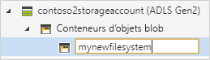
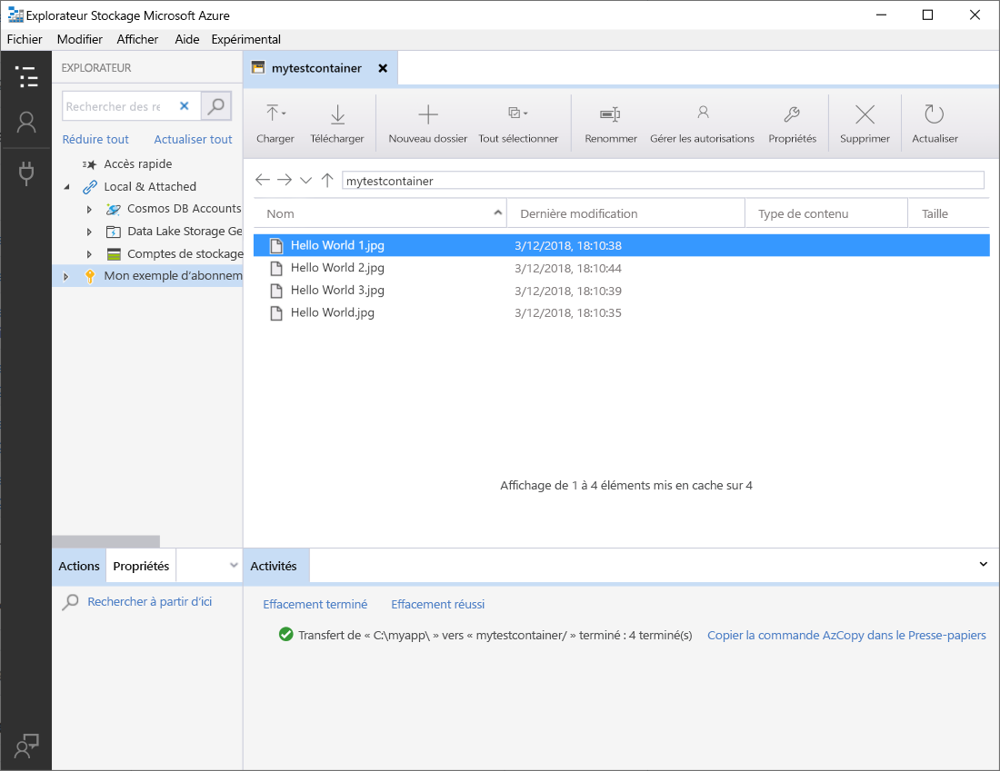

# Utiliser l’Explorateur Stockage Azure avec Azure Data Lake Storage Gen2

Dans le cadre de cet article, vous apprenez à utiliser l’[Explorateur Stockage Azure](https://azure.microsoft.com/features/storage-explorer/) pour créer un répertoire et un blob. Vous apprenez ensuite à télécharger l’objet blob sur votre ordinateur local, et à afficher tous les objets blob dans un répertoire. Vous découvrez également comment créer une capture instantanée d’objet blob, gérer les stratégies d’accès de répertoire et créer une signature d’accès partagé.

## Prérequis

[!INCLUDE [storage-quickstart-prereq-include](../../../includes/storage-quickstart-prereq-include.md)]

Pour exécuter ce guide de démarrage rapide, vous devez installer l’Explorateur Stockage Azure. Pour installer l’Explorateur Stockage Azure pour Windows, Macintosh ou Linux, consultez [Explorateur Stockage Azure](https://azure.microsoft.com/features/storage-explorer/).

## Se connecter à l’Explorateur Stockage

Au premier lancement, la fenêtre **Explorateur Stockage Microsoft Azure - Se connecter** s’affiche. Bien que l’Explorateur Stockage propose plusieurs méthodes de connexion aux comptes de stockage, une seule est actuellement prise en charge pour la gestion des ACL.

|Tâche|Objectif|
|---|---|
|Ajouter un compte Azure | Vous redirige vers votre page de connexion aux organisations afin de vous authentifier sur Azure. Il s’agit actuellement de la seule méthode d’authentification prise en charge si vous souhaitez gérer et définir des ACL. |

Sélectionnez **Ajouter un compte Azure**, puis cliquez sur **Connexion..** . Suivez les instructions de connexion à votre compte Azure qui s’affichent à l’écran.

Une fois que la connexion est établie, l’Explorateur Stockage Azure se charge avec l’onglet **Explorateur** affiché. Cette vue vous donne accès à l’ensemble de vos comptes Stockage Azure, ainsi qu’au stockage local configuré via les comptes de l’[émulateur de stockage Azure](../common/storage-use-emulator.md?toc=%2fazure%2fstorage%2fblobs%2ftoc.json), [Cosmos DB](../../cosmos-db/storage-explorer.md?toc=%2fazure%2fstorage%2fblobs%2ftoc.json) ou les environnements [Azure Stack](/azure-stack/user/azure-stack-storage-connect-se?toc=%2fazure%2fstorage%2fblobs%2ftoc.json).

## Créez un conteneur.

Les objets blob sont toujours chargés dans un répertoire. Cela vous permet d’organiser des groupes d’objets blob comme vous organisez vos fichiers dans des dossiers sur votre ordinateur.

Pour créer un répertoire, développez le compte de stockage créé lors de l’étape précédente. Sélectionnez **Conteneur d’objets blob**, cliquez avec le bouton droit, puis sélectionnez **Créer un conteneur d’objets blob**. Entrez le nom de votre conteneur. Quand vous avez terminé, appuyez sur **Entrée** pour créer le conteneur. Une fois le répertoire d’objets blob créé, il apparaît sous le dossier **Conteneur d’objets blob** correspondant au compte de stockage sélectionné.

## Charger des objets blob dans le répertoire

Stockage Blob prend en charge les objets blob de blocs, d’ajout et de pages. Les fichiers de disque dur virtuel utilisés pour appuyer les machines virtuelles IaaS sont des objets blob de pages. Les objets blob d’ajout sont utilisés pour la journalisation, par exemple, quand vous voulez écrire dans un fichier et continuer à ajouter d’autres informations. La plupart des fichiers stockés dans Stockage Blob sont des objets blob de blocs.

Dans le ruban du répertoire, sélectionnez **Charger**. Ce faisant, vous avez la possibilité de télécharger un dossier ou un fichier.

Choisissez les fichiers ou le dossier à télécharger. Sélectionnez le **type d’objet blob**. Les choix acceptables sont **Ajout**, **Page** ou **Bloc**.

Si vous téléchargez un fichier .vhd or .vhdx, sélectionnez **Charger les fichiers .vhd/.vhdx en tant qu'objets blob de pages (recommandé)** .

Dans le champ **Charger dans le dossier** (facultatif), sélectionnez un nom de dossier dans lequel stocker les fichiers ou de sous-dossiers, sous le répertoire. Si aucun dossier n’est sélectionné, les fichiers sont chargés automatiquement dans le répertoire.

Lorsque vous sélectionnez **OK**, les fichiers sélectionnés sont mis en file d’attente de téléchargement ; ils sont traités un à un. Une fois le téléchargement terminé, les résultats s’affichent dans la fenêtre **Activités**.

## Afficher les objets blob d’un répertoire

Dans l’application **Explorateur Stockage Azure**, sélectionnez un répertoire sous un compte de stockage. Le volet principal affiche une liste des objets blobs hébergés dans le répertoire sélectionné.

## Télécharger des objets blob

Pour télécharger les objets blob à l’aide de l’**Explorateur Stockage Azure**, avec un objet blob sélectionné, sélectionnez **Télécharger** dans le ruban. La boîte de dialogue qui s’ouvre vous permet de saisir un nom de fichier. Sélectionnez **Enregistrer** pour démarrer le téléchargement d’un objet blob sur l’emplacement local.

## Étapes suivantes

Dans ce guide de démarrage rapide, vous avez appris à transférer des fichiers entre un disque local et le stockage Blob Azure à l’aide de l’**Explorateur Stockage Azure**. Pour en savoir plus sur la définition d’ACL sur vos fichiers et répertoires, passez à la procédure correspondante.

> [!div class="nextstepaction"]
> [Comment définir des ACL sur des fichiers et répertoires](data-lake-storage-how-to-set-permissions-storage-explorer.md)
