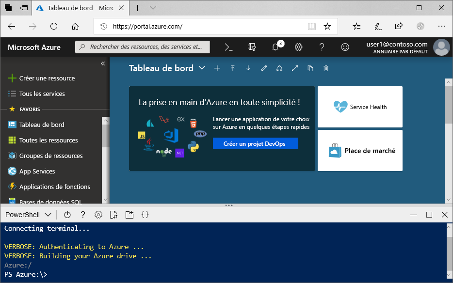

# <a name="create-an-azure-data-lake-storage-gen2-storage-account"></a>Créer un compte de stockage Azure Data Lake Storage Gen2

Azure Data Lake Storage Gen2 [prend en charge un espace de noms hiérarchique](data-lake-storage-introduction.md) qui fournit un conteneur basé sur les répertoires conçu spécifiquement pour fonctionner avec le système de fichiers DFS hadoop (HDFS). L’accès aux données Data Lake Storage Gen2 à partir du HDFS est disponible via le [pilote ABFS](data-lake-storage-abfs-driver.md).

Cet article montre comment créer un compte en utilisant le Portail Azure, Azure PowerShell ou Azure CLI.

## <a name="prerequisites"></a>Prérequis

Si vous n’avez pas d’abonnement Azure, créez un [compte gratuit](https://azure.microsoft.com/free/) avant de commencer. 

|           | Configuration requise |
|-----------|--------------|
|Portail     | Aucun         |
|PowerShell | Cet article requiert le module PowerShell Az.Storage version **0.7** ou ultérieure. Pour connaître votre version actuelle, exécutez la commande `Get-Module -ListAvailable Az.Storage`. Si après avoir exécuté cette commande, aucun résultat n’apparaît, ou si une version antérieure à la version **0.7** s’affiche, vous devez procéder à la mise à niveau de votre module PowerShell. Consultez la section [Mettre à niveau votre module powershell](#upgrade-your-powershell-module) de ce guide.
|Interface de ligne de commande        | Vous pouvez vous connecter à Azure et exécuter des commandes Azure CLI de l’une des deux façons suivantes : <ul><li>Vous pouvez exécuter des commandes CLI à partir du portail Azure, dans Azure Cloud Shell. </li><li>Vous pouvez installer la CLI et exécuter des commandes CLI localement.</li></ul>|

Lorsque vous travaillez sur la ligne de commande, vous avez la possibilité d’exécuter l’interpréteur de commandes Azure Cloud ou d’installer l’interface CLI localement.

### <a name="use-azure-cloud-shell"></a>Utiliser Azure Cloud Shell

Azure Cloud Shell est un interpréteur de commandes Bash gratuit, que vous pouvez exécuter directement dans le portail Azure. L’interface Azure CLI est préinstallée et configurée pour être utilisée avec votre compte. Cliquez sur le bouton **Cloud Shell** du menu situé dans l’angle supérieur droit de la fenêtre du portail Azure :

[](https://portal.azure.com)

Ce bouton lance un interpréteur de commandes interactif que vous pouvez utiliser pour exécuter les étapes de cet article :

[](https://portal.azure.com)

### <a name="install-the-cli-locally"></a>Installer la CLI localement

Vous pouvez également installer et utiliser Azure CLI localement. Pour les besoins de cet article, vous devez utiliser Azure CLI version 2.0.38 ou ultérieure. Exécutez `az --version` pour trouver la version. Si vous devez effectuer une installation ou une mise à niveau, consultez [Installer Azure CLI](/cli/azure/install-azure-cli).

## <a name="create-a-storage-account-with-azure-data-lake-storage-gen2-enabled"></a>Créer un compte de stockage avec Data Lake Storage Gen2 activé

Un compte de stockage Azure contient tous vos objets de données de stockage Azure : objets blob, fichiers, files d’attente, tables et disques. Le compte de stockage fournit pour vos données de stockage Azure un espace de noms unique, accessible de n’importe où dans le monde via HTTP ou HTTPS. Les données dans votre compte de stockage Azure sont durables et hautement disponibles, sécurisées et massivement évolutives.

> [!NOTE]
> Vous devez créer de nouveaux comptes de stockage en tant que type **StorageV2 (usage général V2)** pour tirer parti des fonctionnalités de Data Lake Storage Gen2.  

Pour plus d’informations sur les comptes de stockage, consultez [Vue d’ensemble des comptes de stockage Azure](../common/storage-account-overview.md).

## <a name="create-an-account-using-the-azure-portal"></a>Créer un compte avec le portail Azure

Connectez-vous au [Portail Azure](https://portal.azure.com).

### <a name="create-a-storage-account"></a>Créez un compte de stockage.

Chaque compte de stockage doit appartenir à un groupe de ressources Azure. Un groupe de ressources est un conteneur logique servant à grouper vos services Azure. Lorsque vous créez un compte de stockage, vous avez le choix entre créer un groupe de ressources ou utiliser un groupe de ressources existant. Cet article montre comment créer un groupe de ressources.

Pour créer un compte de stockage à usage général v2 dans le portail Azure, procédez comme suit :

> [!NOTE]
> L’espace de noms hiérarchique est actuellement disponible dans toutes les régions publiques.

1. Choisissez l’abonnement dans lequel vous souhaitez créer le compte de stockage.
2. Dans le Portail Azure, choisissez le bouton **Créer une ressource**, puis choisissez **Compte de stockage**.
3. Sous le champ **Groupe de ressources**, sélectionnez **Créer**. Entrez le nom de votre nouveau groupe de ressources.
   
   Un groupe de ressources est un conteneur logique servant à grouper vos services Azure. Lorsque vous créez un compte de stockage, vous avez le choix entre créer un groupe de ressources ou utiliser un groupe de ressources existant.

4. Ensuite, entrez un nom pour votre compte de stockage. Le nom choisi doit être unique dans tout Azure. Le nom doit aussi contenir entre 3 et 24 caractères, et uniquement des lettres minuscules et des chiffres.
5. Choisissez un emplacement.
6. Assurez-vous que **StorageV2 (usage général v2)** est sélectionné dans la liste déroulante **Type de compte**.
7. Modifiez éventuellement les valeurs de chacun de ces champs : **Performances**, **Réplication**, **Niveau d’accès**. Pour en savoir plus sur ces options, consultez [Présentation du Stockage Azure](https://docs.microsoft.com/azure/storage/common/storage-introduction#azure-storage-services).
8. Sélectionnez l’onglet **Avancé**.
10. Dans la section **Data Lake Storage Gen2**, définissez **Espace de noms hiérarchique** sur **Activé**.
11. Cliquez sur **Vérifier + créer** pour créer le compte de stockage.

Votre compte de stockage est maintenant créé via le portail.

### <a name="clean-up-resources"></a>Supprimer des ressources

Pour supprimer un groupe de ressources dans le portail Azure :

1. Sur le portail Azure, développez le menu de gauche pour ouvrir le menu des services, et sélectionnez **Groupes de ressources** pour afficher la liste de vos groupes de ressources.
2. Recherchez le groupe de ressources à supprimer, puis faites un clic droit sur le bouton **Plus** ( **...** ) se trouvant à droite de la liste.
3. Sélectionnez **Supprimer le groupe de ressources** et confirmez.

## <a name="create-an-account-using-powershell"></a>Créer un compte à l’aide de PowerShell

Commencez par installer la dernière version du module [PowerShellGet](/powershell/scripting/gallery/installing-psget).

Ensuite, mettez à niveau votre module PowerShell, connectez-vous à votre abonnement Azure, et créez un groupe de ressources, puis un compte de stockage.

### <a name="upgrade-your-powershell-module"></a>Mettre à niveau votre module powershell

[!INCLUDE [updated-for-az](../../../includes/updated-for-az.md)]

Pour interagir avec Data Lake Gen2 à l’aide de PowerShell, vous devez installer la version **0.7** ou ultérieure du module Az.Storage.

Commencez par ouvrir une session PowerShell avec des autorisations élevées.

Installer le module Az.Storage

```powershell
Install-Module Az.Storage -Repository PSGallery -AllowClobber -Force
```

### <a name="sign-in-to-your-azure-subscription"></a>Se connecter à votre abonnement Azure

Utilisez la commande `Login-AzAccount` et suivez les instructions à l’écran pour l’authentification.

```powershell
Login-AzAccount
```

### <a name="create-a-resource-group"></a>Créer un groupe de ressources

Pour créer un groupe de ressources avec PowerShell, utilisez la commande [New-AzResourceGroup](/powershell/module/az.resources/new-azresourcegroup) : 

> [!NOTE]
> L’espace de noms hiérarchique est actuellement disponible dans toutes les régions publiques.

```powershell
# put resource group in a variable so you can use the same group name going forward,
# without hardcoding it repeatedly
$resourceGroup = "storage-quickstart-resource-group"
$location = "westus2"
New-AzResourceGroup -Name $resourceGroup -Location $location
```

### <a name="create-a-general-purpose-v2-storage-account"></a>Créer un compte de stockage à usage général v2

Pour créer un compte de stockage universel v2 à partir de PowerShell avec l’option Stockage localement redondant (LRS), utilisez la commande [New-AzStorageAccount](/powershell/module/az.storage/New-azStorageAccount) :

```powershell
$location = "westus2"

New-AzStorageAccount -ResourceGroupName $resourceGroup `
  -Name "storagequickstart" `
  -Location $location `
  -SkuName Standard_LRS `
  -Kind StorageV2 `
  -EnableHierarchicalNamespace $True
```

### <a name="clean-up-resources"></a>Supprimer des ressources

Pour supprimer le groupe de ressources et les ressources associées, y compris le nouveau compte de stockage, utilisez la commande [Remove-AzResourceGroup](/powershell/module/az.resources/remove-azresourcegroup) : 

```powershell
Remove-AzResourceGroup -Name $resourceGroup
```

## <a name="create-an-account-using-azure-cli"></a>Créer un compte à l’aide d’Azure CLI

Pour démarrer Azure Cloud Shell, connectez-vous au [portail Azure](https://portal.azure.com).

Si vous voulez vous connecter à votre installation locale de l’interface CLI, exécutez la commande de connexion :

```cli
az login
```

### <a name="add-the-cli-extension-for-azure-data-lake-gen-2"></a>Ajouter l’extension CLI pour Azure Data Lake Gen 2

Pour interagir avec Data Lake Storage Gen2 via la CLI, vous devez ajouter une extension à votre interpréteur de commandes.

Pour ce faire, entrez la commande ci-après à l’aide de Cloud Shell ou d’un interpréteur de commandes local : `az extension add --name storage-preview`

### <a name="create-a-resource-group"></a>Créer un groupe de ressources

Pour créer un groupe de ressources avec Azure CLI, utilisez la commande [az group create](/cli/azure/group).

```azurecli-interactive
az group create `
    --name storage-quickstart-resource-group `
    --location westus2
```

> [!NOTE]
> > L’espace de noms hiérarchique est actuellement disponible dans toutes les régions publiques.

### <a name="create-a-general-purpose-v2-storage-account"></a>Créer un compte de stockage à usage général v2

Pour créer un compte de stockage à usage général v2 à partir d’Azure CLI avec l’option Stockage localement redondant, utilisez la commande [az storage account create](/cli/azure/storage/account).

```azurecli-interactive
az storage account create `
    --name storagequickstart `
    --resource-group storage-quickstart-resource-group `
    --location westus2 `
    --sku Standard_LRS `
    --kind StorageV2 `
    --enable-hierarchical-namespace true
```

### <a name="clean-up-resources"></a>Supprimer des ressources

Pour supprimer le groupe de ressources et les ressources associées, y compris le nouveau compte de stockage, utilisez la commande [az group delete](/cli/azure/group).

```azurecli-interactive
az group delete --name myResourceGroup
```

## <a name="next-steps"></a>Étapes suivantes

Dans cet article, vous avez créé un compte de stockage avec des fonctions Data Lake Storage Gen2. Pour savoir comment charger et télécharger des objets blob vers/à partir de votre compte de stockage, consultez la rubrique suivante.

* [AzCopy V10](https://docs.microsoft.com/azure/storage/common/storage-use-azcopy-v10?toc=%2fazure%2fstorage%2fblobs%2ftoc.json)
