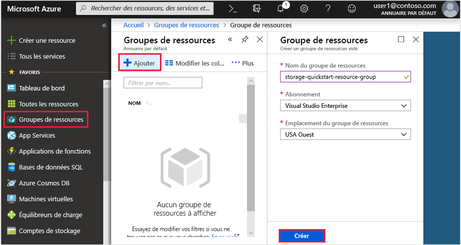
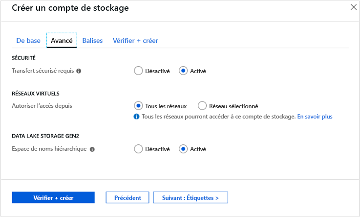

# <a name="quickstart-create-an-azure-data-lake-storage-gen2-storage-account"></a>Démarrage rapide : Créer un compte de stockage Azure Data Lake Storage Gen2

Azure Data Lake Storage Gen2 [prend en charge un service d’espace de noms hiérarchique](data-lake-storage-introduction.md) qui fournit un système de fichiers sur la base de répertoire conçu spécifiquement pour fonctionner avec le système de fichiers DFS hadoop (HDFS). L’accès aux données Data Lake Storage Gen2 à partir du HDFS est disponible via le [pilote ABFS](data-lake-storage-abfs-driver.md).

Ce démarrage rapide montre comment créer un compte en utilisant le [Portail Azure](https://portal.azure.com/), [Azure PowerShell](https://docs.microsoft.com/powershell/azure/overview), ou [Azure CLI](https://docs.microsoft.com/cli/azure?view=azure-cli-latest).

## <a name="prerequisites"></a>Prérequis

Si vous n’avez pas d’abonnement Azure, créez un [compte gratuit](https://azure.microsoft.com/free/) avant de commencer. 

|           | Configuration requise |
|-----------|--------------|
|Portail     | Aucun         |
|PowerShell | Ce démarrage rapide requiert le module PowerShell Az.Storage version **0.7** ou ultérieure. Pour connaître votre version actuelle, exécutez la commande `Get-Module -ListAvailable Az.Storage`. Si après avoir exécuté cette commande, aucun résultat n’apparaît, ou si une version autre que la version **0.7** s’affiche, vous devez procéder à la mise à niveau de votre module powershell. Consultez la section [Mettre à niveau votre module powershell](#upgrade-your-powershell-module) de ce guide.
|Interface de ligne de commande        | Vous pouvez vous connecter à Azure et exécuter des commandes Azure CLI de l’une des deux façons : <ul><li>Vous pouvez exécuter des commandes CLI à partir du portail Azure, dans Azure Cloud Shell. </li><li>Vous pouvez installer la CLI et exécuter des commandes CLI localement.</li></ul>|

Lorsque vous travaillez sur la ligne de commande, vous avez la possibilité d’exécuter l’interpréteur de commandes Azure Cloud ou d’installer l’interface CLI localement.

### <a name="use-azure-cloud-shell"></a>Utiliser Azure Cloud Shell

Azure Cloud Shell est un interpréteur de commandes Bash gratuit, que vous pouvez exécuter directement dans le portail Azure. L’interface Azure CLI est préinstallée et configurée pour être utilisée avec votre compte. Cliquez sur le bouton **Cloud Shell** du menu situé dans l’angle supérieur droit de la fenêtre du portail Azure :

[](https://portal.azure.com)

Ce bouton lance un interpréteur de commandes interactif que vous pouvez utiliser pour exécuter les étapes de ce démarrage rapide :

[](https://portal.azure.com)

### <a name="install-the-cli-locally"></a>Installer la CLI localement

Vous pouvez également installer et utiliser Azure CLI localement. Ce guide de démarrage rapide vous demande d’exécuter Azure CLI version 2.0.38 ou ultérieur. Exécutez `az --version` pour trouver la version. Si vous devez effectuer une installation ou une mise à niveau, consultez [Installer Azure CLI](/cli/azure/install-azure-cli).

## <a name="create-a-storage-account-with-azure-data-lake-storage-gen2-enabled"></a>Créer un compte de stockage avec Data Lake Storage Gen2 activé

Avant de créer un compte, vous devez tout d’abord créer un groupe de ressources qui agit comme conteneur logique pour les comptes de stockage ou les autres ressources Azure que vous créez. Si vous souhaitez supprimer les ressources créées par ce démarrage rapide, vous pouvez simplement supprimer le groupe de ressources. La suppression du groupe de ressources efface également le compte de stockage associé et d’autres ressources liées au groupe de ressources. Pour plus d’informations sur les groupes de ressources Azure, consultez l’article [Présentation d’Azure Resource Manager](../../azure-resource-manager/resource-group-overview.md).

> [!NOTE]
> Vous devez créer de nouveaux comptes de stockage en tant que type **StorageV2 (usage général V2)** pour tirer parti des fonctionnalités de Data Lake Storage Gen2.  

Pour plus d’informations sur les comptes de stockage, consultez [Vue d’ensemble des comptes de stockage Azure](../common/storage-account-overview.md).

Gardez les règles suivantes à l’esprit lorsque vous nommez votre compte de stockage :

- Les noms des comptes de stockage doivent comporter entre 3 et 24 caractères, uniquement des lettres minuscules et des chiffres.
- Le nom de votre compte de stockage doit être unique dans Azure. Deux comptes de stockage ne peuvent avoir le même nom.

## <a name="create-an-account-using-the-azure-portal"></a>Créer un compte avec le portail Azure

Connectez-vous au [portail Azure](https://portal.azure.com).

### <a name="create-a-resource-group"></a>Créer un groupe de ressources

Pour créer un groupe de ressources dans le portail Azure, procédez comme suit :

1. Sur le portail Azure, développez le menu de gauche pour ouvrir le menu des services, et sélectionnez **Groupes de ressources**.
2. Cliquez sur le bouton **Ajouter** pour ajouter un nouveau groupe de ressources.
3. Entrez un nom pour le nouveau groupe de ressources.
4. Sélectionnez l’abonnement dans lequel vous créez le nouveau groupe de ressources.
5. Choisissez l’emplacement du groupe de ressources.
6. Cliquez sur le bouton **Créer**.  

   

### <a name="create-a-general-purpose-v2-storage-account"></a>Créer un compte de stockage à usage général v2

Pour créer un compte de stockage à usage général v2 dans le portail Azure, procédez comme suit :

> [!NOTE]
> L’espace de noms hiérarchique est actuellement disponible dans toutes les régions publiques. Il est actuellement indisponible dans les clouds souverains.

1. Sur le portail Azure, développez le menu de gauche pour ouvrir le menu des services, et sélectionnez **Tous les services**. Faites défiler jusqu’à **Stockage**, puis sélectionnez **Comptes de stockage**. Sur la fenêtre **Comptes de stockage**, sélectionnez **Ajouter**.
2. Sélectionnez votre **abonnement** ainsi que le **groupe de ressources** créé précédemment.
3. Entrez un nom pour votre compte de stockage.
4. Définissez l’**emplacement** à **USA Ouest 2**
5. Ne modifiez pas la valeur par défaut des champs suivants : **Niveau de performance**, **Type de compte**, **Réplication**, **Niveau d’accès**.
6. Choisissez l’abonnement dans lequel vous souhaitez créer le compte de stockage.
7. Sélectionnez **Suivant : Avancé >**
8. Ne modifiez pas la valeur par défaut des champs **SÉCURITÉ** et **RÉSEAUX VIRTUELS**.
9. Dans la section **Data Lake Storage Gen2 (version préliminaire)** définissez l’**espace de noms hiérarchique** sur **Activé**.
10. Cliquez sur **Vérifier + créer** pour créer le compte de stockage.

    

Votre compte de stockage est maintenant créé via le portail.

### <a name="clean-up-resources"></a>Supprimer des ressources

Pour supprimer un groupe de ressources dans le portail Azure :

1. Sur le portail Azure, développez le menu de gauche pour ouvrir le menu des services, et sélectionnez **Groupes de ressources** pour afficher la liste de vos groupes de ressources.
2. Recherchez le groupe de ressources à supprimer, puis faites un clic droit sur le bouton **Plus** (**...**) se trouvant à droite de la liste.
3. Sélectionnez **Supprimer le groupe de ressources** et confirmez.

## <a name="create-an-account-using-powershell"></a>Créer un compte à l’aide de PowerShell

Commencez par installer la dernière version du module [PowerShellGet](https://docs.microsoft.com/powershell/gallery/installing-psget).

Ensuite, mettez à niveau votre module powershell, connectez-vous à votre abonnement Azure, créez un groupe de ressources, puis un compte de stockage.

### <a name="upgrade-your-powershell-module"></a>Mettre à niveau votre module powershell

[!INCLUDE [updated-for-az](../../../includes/updated-for-az.md)]

Pour interagir avec Data Lake Gen2 à l’aide de PowerShell, vous devez installer la version **0.7** ou ultérieure du module Az.Storage.

Commencez par ouvrir une session PowerShell avec des autorisations élevées.

Installer le module Az.Storage

```powershell
Install-Module Az.Storage -Repository PSGallery -RequiredVersion 0.7.0 -AllowPrerelease -AllowClobber -Force
```

> [!NOTE]
> Les modules Azure Powershell Az sont les modules recommandés pour utiliser les services Azure dans Powershell. Pour en savoir plus, consultez [Présentation du nouveau module Azure PowerShell Az](https://docs.microsoft.com/powershell/azure/new-azureps-module-az).

### <a name="log-in-to-your-azure-subscription"></a>Connectez-vous à votre abonnement Azure.

Utilisez la commande `Login-AzAccount` et suivez les instructions à l’écran pour l’authentification.

```powershell
Login-AzAccount
```

### <a name="create-a-resource-group"></a>Créer un groupe de ressources

Pour créer un groupe de ressources avec PowerShell, utilisez la commande [New-AzResourceGroup](/powershell/module/az.resources/new-azresourcegroup) : 

> [!NOTE]
> L’espace de noms hiérarchique est actuellement disponible dans toutes les régions publiques. Il est actuellement indisponible dans les clouds souverains.

```powershell
# put resource group in a variable so you can use the same group name going forward,
# without hardcoding it repeatedly
$resourceGroup = "storage-quickstart-resource-group"
$location = "westus2"
New-AzResourceGroup -Name $resourceGroup -Location $location
```

### <a name="create-a-general-purpose-v2-storage-account"></a>Créer un compte de stockage à usage général v2

Pour créer un compte de stockage universel v2 à partir de PowerShell avec l’option Stockage localement redondant (LRS), utilisez la commande [New-AzStorageAccount](/powershell/module/az.storage/New-azStorageAccount) :

```powershell
$location = "westus2"

New-AzStorageAccount -ResourceGroupName $resourceGroup `
  -Name "storagequickstart" `
  -Location $location `
  -SkuName Standard_LRS `
  -Kind StorageV2 `
  -EnableHierarchicalNamespace $True
```

### <a name="clean-up-resources"></a>Supprimer des ressources

Pour supprimer le groupe de ressources et les ressources associées, y compris le nouveau compte de stockage, utilisez la commande [Remove-AzResourceGroup](/powershell/module/az.resources/remove-azresourcegroup) : 

```powershell
Remove-AzResourceGroup -Name $resourceGroup
```

## <a name="create-an-account-using-azure-cli"></a>Créer un compte à l’aide d’Azure CLI

Pour démarrer Azure Cloud Shell, connectez-vous au [portail Azure](https://portal.azure.com).

Si vous souhaitez vous connecter à votre installation locale de la CLI, exécutez la commande de connexion :

```cli
az login
```

### <a name="add-the-cli-extension-for-azure-data-lake-gen-2"></a>Ajouter l’extension CLI pour Azure Data Lake Gen 2

Pour interagir avec Data Lake Storage Gen2 via la CLI, vous devez ajouter une extension à votre interpréteur de commandes.

Pour ce faire, entrez la commande ci-après à l’aide de Cloud Shell ou d’un interpréteur de commandes local : `az extension add --name storage-preview`

### <a name="create-a-resource-group"></a>Créer un groupe de ressources

Pour créer un groupe de ressources avec Azure CLI, utilisez la commande [az group create](/cli/azure/group#az_group_create).

```azurecli-interactive
az group create `
    --name storage-quickstart-resource-group `
    --location westus2
```

> [!NOTE]
> > L’espace de noms hiérarchique est actuellement disponible dans toutes les régions publiques. Il est actuellement indisponible dans les clouds souverains.

### <a name="create-a-general-purpose-v2-storage-account"></a>Créer un compte de stockage à usage général v2

Pour créer un compte de stockage à usage général v2 à partir d’Azure CLI avec l’option Stockage localement redondant, utilisez la commande [az storage account create](/cli/azure/storage/account).

```azurecli-interactive
az storage account create `
    --name storagequickstart `
    --resource-group storage-quickstart-resource-group `
    --location westus2 `
    --sku Standard_LRS `
    --kind StorageV2 `
    --hierarchical-namespace true
```

### <a name="clean-up-resources"></a>Supprimer des ressources

Pour supprimer le groupe de ressources et les ressources associées, y compris le nouveau compte de stockage, utilisez la commande [az group delete](/cli/azure/group#az_group_delete).

```azurecli-interactive
az group delete --name myResourceGroup
```

## <a name="next-steps"></a>Étapes suivantes

Dans ce guide de démarrage rapide, vous avez créé un compte de stockage avec des fonctions Data Lake Storage Gen2. Pour savoir comment charger et télécharger des objets blob vers/à partir de votre compte de stockage, consultez la rubrique suivante.

* [AzCopy V10](https://docs.microsoft.com/azure/storage/common/storage-use-azcopy-v10?toc=%2fazure%2fstorage%2fblobs%2ftoc.json)
