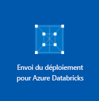

# <a name="quickstart-run-a-spark-job-on-azure-databricks-using-the-azure-portal"></a>Démarrage rapide : Exécuter une tâche Spark sur Azure Databricks avec le portail Azure

Ce démarrage rapide montre comment exécuter un travail Apache Spark à l’aide d’Azure Databricks pour effectuer une analyse des données stockées dans un compte de stockage avec la préversion d’Azure Data Lake Storage Gen2 activée.

Dans le cadre du travail Spark, vous analysez des données d’abonnement à un canal de radio pour obtenir des informations sur l’utilisation gratuite/payante en fonction de données démographiques.

Si vous ne disposez pas d’abonnement Azure, créez un [compte gratuit](https://azure.microsoft.com/free/) avant de commencer.

## <a name="prerequisites"></a>Prérequis

- [Créer un compte de stockage avec Data Lake Storage Gen2 activé](data-lake-storage-quickstart-create-account.md)

## <a name="set-aside-storage-account-configuration"></a>Mettre de côté la configuration du compte de stockage

> [!IMPORTANT]
> Pendant ce didacticiel, vous devez avoir accès au nom et à la clé d’accès de votre compte de stockage. Dans le portail Azure, sélectionnez **Tous les services** et filtrez sur *stockage*. Sélectionnez **Comptes de stockage** et recherchez le compte que vous avez créé pour ce didacticiel.
>
> À partir de la **Vue d’ensemble**, copiez le **nom** du compte de stockage dans un éditeur de texte. Sélectionnez ensuite **Clés d’accès** et copiez la valeur de **key1** dans votre éditeur de texte pour les deux valeurs nécessaires pour les commandes ultérieures.

## <a name="create-an-azure-databricks-workspace"></a>Créer un espace de travail Azure Databricks

Dans cette section, vous créez un espace de travail Azure Databricks en utilisant le portail Azure.

1. Dans le portail Azure, sélectionnez **Créer une ressource** >  **Analytique** > **Azure Databricks**.

    

2. Sous **Service Azure Databricks**, renseignez les valeurs pour créer un espace de travail Databricks.

    

    Renseignez les valeurs suivantes :

    |Propriété  |Description  |
    |---------|---------|
    |**Nom de l’espace de travail**     | Renseignez un nom pour votre espace de travail Databricks.        |
    |**Abonnement**     | Sélectionnez votre abonnement Azure dans la liste déroulante.        |
    |**Groupe de ressources**     | Indiquez si vous souhaitez créer un groupe de ressources Azure ou utiliser un groupe existant. Un groupe de ressources est un conteneur réunissant les ressources associées d’une solution Azure. Pour plus d’informations, consultez [Présentation des groupes de ressources Azure](../../azure-resource-manager/resource-group-overview.md). |
    |**Lieu**     | Sélectionnez **USA Ouest 2**. N’hésitez pas à sélectionner une autre région publique si vous préférez.        |
    |**Niveau tarifaire**     |  Choisissez entre **Standard** ou **Premium**. Pour plus d’informations sur ces niveaux, consultez la [page de tarification Databricks](https://azure.microsoft.com/pricing/details/databricks/).       |

    Sélectionnez **Épingler au tableau de bord**, puis cliquez sur **Créer**.

3. La création de l’espace de travail dure quelques minutes. Lors de la création de l’espace de travail, le portail affiche la vignette **Envoi du déploiement pour Azure Databricks** sur le côté droit. Vous devrez peut-être faire défiler votre tableau de bord vers la droite pour voir la vignette. Il existe également une barre de progression en haut de l’écran. Vous pouvez surveiller la progression de la zone souhaitée.

    

## <a name="create-a-spark-cluster-in-databricks"></a>Créer un cluster Spark dans Databricks

1. Dans le portail Azure, accédez à l’espace de travail Databricks que vous avez créé, puis sélectionnez **Initialiser l’espace de travail**.

2. Vous êtes redirigé vers le portail Azure Databricks. Dans le portail, sélectionnez **Nouveau** > **Cluster**.

    

3. Dans la page **Nouveau cluster**, renseignez les valeurs pour créer un cluster.

    

    Acceptez toutes les valeurs par défaut autres que les suivantes :

    * Entrez un nom pour le cluster.
    * Créez un cluster avec le runtime **5.1 bêta**.
    * Veillez à cocher la case **Arrêter après 120 minutes d’inactivité**. Spécifiez une durée (en minutes) pour arrêter le cluster, si le cluster n’est pas utilisé.

4. Sélectionnez **Créer un cluster**. Une fois que le cluster est en cours d’exécution, vous pouvez y attacher des notebooks et exécuter des travaux Spark.

Pour plus d’informations sur la création de clusters, consultez [Créer un cluster Spark dans Azure Databricks](https://docs.azuredatabricks.net/user-guide/clusters/create.html).

## <a name="create-storage-account-file-system"></a>Créer un système de fichiers de compte de stockage

Dans cette section, vous créez un bloc-notes dans l’espace de travail Azure Databricks, puis exécutez les extraits de code pour configurer le compte de stockage.

1. Dans le [portail Azure](https://portal.azure.com), accédez à l’espace de travail Azure Databricks que vous avez créé, puis sélectionnez **Initialiser l’espace de travail**.

2. Dans le volet gauche, sélectionnez **Espace de travail**. Dans la liste déroulante **Espace de travail**, sélectionnez **Créer** > **Notebook**.

    

3. Dans la boîte de dialogue **Créer un bloc-notes**, entrez un nom pour le bloc-notes. Sélectionnez **Scala** comme langage, puis sélectionnez le cluster Spark que vous avez créé précédemment.

    

    Sélectionnez **Créer**.

4. Connectez l’espace de travail Databricks à votre compte ADLS Gen2. Trois mécanismes sont pris en charge pour effectuer cette opération : montage avec OAuth, accès direct avec OAuth et accès direct avec une clé partagée. 

    Chaque mécanisme est illustré dans un exemple ci-dessous. Quand vous testez les exemples, pensez à remplacer les espaces réservés qui figurent dans l’exemple entre des crochets par vos propres valeurs :

    **Monter avec OAuth**     
        
    ```scala
    %python%
    configs = {"fs.azure.account.auth.type": "OAuth",
        "fs.azure.account.oauth.provider.type": "org.apache.hadoop.fs.azurebfs.oauth2.ClientCredsTokenProvider",
        "fs.azure.account.oauth2.client.id": "<service-client-id>",
        "fs.azure.account.oauth2.client.secret": "<service-credentials>",
        "fs.azure.account.oauth2.client.endpoint": "https://login.microsoftonline.com/<tenant-id>/oauth2/token"}
    
    dbutils.fs.mount(
        source = "abfss://<file-system-name>@<account-name>.dfs.core.windows.net/[<directory-name>]",
        mount_point = "/mnt/<mount-name>",
        extra_configs = configs)
    ```

    **Accès direct avec OAuth**

    ```scala
    spark.conf.set("fs.azure.account.auth.type.<account-name>.dfs.core.windows.net": "OAuth")
    spark.conf.set("fs.azure.account.oauth.provider.type.<account-name>.dfs.core.windows.net", "org.apache.hadoop.fs.azurebfs.oauth2.ClientCredsTokenProvider")
    spark.conf.set("fs.azure.account.oauth2.client.id.<account-name>.dfs.core.windows.net": "<service-client-id>")
    spark.conf.set("fs.azure.account.oauth2.client.secret.<account-name>.dfs.core.windows.net": "<service-credentials>")
    spark.conf.set("fs.azure.account.oauth2.client.endpoint.<account-name>.dfs.core.windows.net": "https://login.microsoftonline.com/<tenant-id>/oauth2/token")

    dbutils.fs.ls("abfss://<file-system-name>@<account-name>.dfs.core.windows.net/")
    ```
        
    **Accès direct avec une clé partagée** 

    ```scala    
    spark.conf.set("fs.azure.account.key.<account-name>.dfs.core.windows.net", "<account-key>")

    dbutils.fs.ls("abfss://<file-system-name>@<account-name>.dfs.core.windows.net/")
    ```

5. Entrez le code dans la première cellule, puis appuyez sur **Maj+Entrée** pour l’exécuter.

Le système de fichiers est créé pour le compte de stockage.

## <a name="ingest-sample-data"></a>Ingérer des exemples de données

Avant de commencer cette section, vous devez effectuer les prérequis suivants :

Entrez le code suivant dans une cellule du bloc-notes :

    %sh wget -P /tmp https://raw.githubusercontent.com/Azure/usql/master/Examples/Samples/Data/json/radiowebsite/small_radio_json.json

Dans la cellule, appuyez sur **Maj+Entrée** pour exécuter le code.

Maintenant, dans une nouvelle cellule en-dessous de celle-ci, entrez le code suivant, en remplaçant les valeurs entre crochets par les mêmes valeurs que celles que vous avez utilisées précédemment :

    dbutils.fs.cp("file:///tmp/small_radio_json.json", "abfss://<file-system>@<account-name>.dfs.core.windows.net/")

Dans la cellule, appuyez sur **Maj+Entrée** pour exécuter le code.

## <a name="run-a-spark-sql-job"></a>Exécuter un travail SQL Spark

Effectuez les tâches suivantes pour exécuter une tâche SQL Spark sur les données.

1. Exécutez une instruction SQL pour créer une table temporaire en utilisant les données de l’exemple de fichier de données JSON, **small_radio_json.json**. Dans l’extrait de code suivant, remplacez les valeurs d’espace réservé par le nom de votre système de fichiers et le nom de votre compte de stockage. À l’aide du bloc-notes que vous avez créé précédemment, collez l’extrait de code dans une nouvelle cellule de code du bloc-notes, puis appuyez sur Maj+Entrée.

    ```sql
    %sql
    DROP TABLE IF EXISTS radio_sample_data;
    CREATE TABLE radio_sample_data
    USING json
    OPTIONS (
     path  "abfss://<file-system-name>@<account-name>.dfs.core.windows.net/<PATH>/small_radio_json.json"
    )
    ```

    Une fois la commande terminée, vous avez toutes les données du fichier JSON sous forme de table dans le cluster Databricks.

    La commande magic `%sql` vous permet d’exécuter du code SQL à partir du notebook, même si celui-ci est d’un autre type. Pour plus d’informations, consultez [Mélange de langages dans un notebook](https://docs.azuredatabricks.net/user-guide/notebooks/index.html#mixing-languages-in-a-notebook).

2. Examinons un instantané des données JSON pour mieux comprendre la requête que vous exécutez. Collez l’extrait de code suivant dans une cellule de code, puis appuyez sur **Maj+Entrée**.

    ```sql
    %sql
    SELECT * from radio_sample_data
    ```

3. Vous voyez une sortie tabulaire, comme celle qui est montrée dans la capture d’écran suivante (seules certaines colonnes apparaissent) :

    

    Parmi d’autres informations, les exemples de données indiquent quel est le sexe des auditeurs d’une chaîne de radio (le nom de la colonne est **gender**), et si leur abonnement est gratuit ou payant (le nom de colonne est **level**).

4. Vous créez maintenant une représentation visuelle de ces données de façon à montrer, pour chaque sexe, le nombre d’utilisateurs avec un abonnement gratuit et avec un abonnement payant. Dans le bas de la sortie tabulaire, cliquez sur l’icône **Graphique à barres**, puis cliquez sur **Options de traçage**.

    

5. Dans **Personnaliser le traçage**, faites un glisser-déplacer des valeurs comme indiqué dans la capture d’écran.

    

    - Définissez **Clés** sur **gender**.
    - Définissez **Regroupements de séries** sur **level**.
    - Définissez **Valeurs** sur **level**.
    - Définissez **Agrégation** sur **COUNT**.

6. Cliquez sur **Appliquer**.

7. La sortie montre la représentation visuelle, comme illustré dans la capture d’écran suivante :

     

## <a name="clean-up-resources"></a>Supprimer des ressources

Lorsque vous avez terminé avec cet article, vous pouvez arrêter le cluster. Dans l’espace de travail Azure Databricks, sélectionnez **Clusters** et recherchez le cluster que vous voulez arrêter. Déplacez le curseur sur les points de suspension dans la colonne **Actions**, puis sélectionnez l’icône **Terminer**.


Si vous n’arrêtez pas le cluster manuellement, il s’arrête automatiquement, à condition d’avoir coché la case **Arrêter après \_\_ minutes d’inactivité** lors de la création du cluster. Si vous définissez cette option, le cluster s’arrête après le délai d’inactivité spécifié.

## <a name="next-steps"></a>Étapes suivantes

Dans cet article, vous avez créé un cluster Spark dans Azure Databricks et exécuté un travail Spark à l’aide des données dans un compte de stockage dans Data Lake Storage Gen2 activé. Vous pouvez également consulter [Sources de données Spark](https://docs.azuredatabricks.net/spark/latest/data-sources/index.html) pour découvrir comment importer des données à partir d’autres sources de données dans Azure Databricks. Passez à l’article suivant pour savoir comment effectuer une opération ETL (extraction, transformation et chargement de données) à l’aide d’Azure Databricks.

> [!div class="nextstepaction"]
>[Extraire, transformer et charger des données à l’aide d’Azure Databricks](../../azure-databricks/databricks-extract-load-sql-data-warehouse.md)
