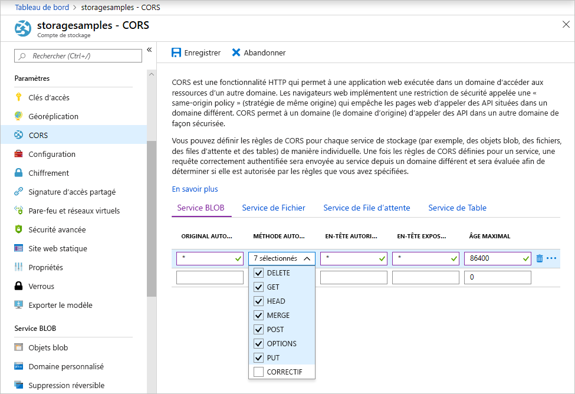

<!-- Customer intent: As a web application developer I want to interface with Azure Blob storage entirely on the client so that I can build a SPA application that is able to upload and delete files on blob storage. -->

# <a name="quickstart-manage-blobs-with-javascript-v12-sdk-in-a-browser"></a>Démarrage rapide : Gérer les objets blob avec le SDK JavaScript v12 dans un navigateur

Le Stockage Blob Azure est optimisé pour stocker de grandes quantités de données non structurées. Les objets blob sont des objets pouvant contenir du texte ou des données binaires, notamment des images, des documents, du contenu multimédia en streaming et des données d’archive. Ce guide de démarrage rapide explique comment gérer les objets blob à l’aide de JavaScript dans un navigateur. Vous allez charger et lister des objets blob, puis créer et supprimer des conteneurs.

[Documentation de référence sur les API](/javascript/api/@azure/storage-blob) | [Code source de la bibliothèque](https://github.com/Azure/azure-sdk-for-js/tree/master/sdk/storage/storage-blob) | [Package (npm)](https://www.npmjs.com/package/@azure/storage-blob) | [Exemples](https://docs.microsoft.com/azure/storage/common/storage-samples-javascript?toc=%2fazure%2fstorage%2fblobs%2ftoc.json#blob-samples)

> [!NOTE]
> Pour une bonne prise en main de la version précédente du kit de développement logiciel (SDK), consultez [Démarrage rapide : Gérer des objets blob avec le SDK JavaScript v10 en Node.js](storage-quickstart-blobs-nodejs-legacy.md).

## <a name="prerequisites"></a>Prérequis

* [Un compte Azure avec un abonnement actif](https://azure.microsoft.com/free/?ref=microsoft.com&utm_source=microsoft.com&utm_medium=docs&utm_campaign=visualstudio)
* Un [compte de Stockage Azure](../common/storage-account-create.md)
* [Node.JS](https://nodejs.org)
* [Microsoft Visual Studio Code](https://code.visualstudio.com)
* Une extension de Visual Studio Code pour le débogage de navigateur, par exemple :
    * [Débogueur pour Microsoft Edge](https://marketplace.visualstudio.com/items?itemName=msjsdiag.debugger-for-edge)
    * [Débogueur pour Chrome](https://marketplace.visualstudio.com/items?itemName=msjsdiag.debugger-for-chrome)
    * [Débogueur pour Firefox](https://marketplace.visualstudio.com/items?itemName=firefox-devtools.vscode-firefox-debug)


[!INCLUDE [storage-multi-protocol-access-preview](../../../includes/storage-multi-protocol-access-preview.md)]

## <a name="object-model"></a>Modèle objet

Le stockage Blob offre trois types de ressources :

* Le compte de stockage
* Un conteneur dans le compte de stockage.
* Un blob dans le conteneur

Le diagramme suivant montre la relation entre ces ressources.


Dans ce guide de démarrage rapide, vous allez utiliser les classes JavaScript suivantes pour interagir avec ces ressources :

* [BlobServiceClient](/javascript/api/@azure/storage-blob/blobserviceclient): La classe `BlobServiceClient` vous permet de manipuler les ressources de stockage Azure et les conteneurs blob.
* [ContainerClient](/javascript/api/@azure/storage-blob/containerclient) : La classe `ContainerClient` vous permet de manipuler des conteneurs de stockage Azure et leurs blobs.
* [BlockBlobClient](/javascript/api/@azure/storage-blob/blockblobclient): La classe `BlockBlobClient` vous permet de manipuler des blobs de stockage Azure.

## <a name="setting-up"></a>Configuration

Cette section vous guide tout au long de la préparation d’un projet à utiliser avec la bibliothèque de client de stockage blob Azure v12 pour JavaScript.

### <a name="create-a-cors-rule"></a>Créer une règle CORS

Avant que votre application web puisse accéder à un stockage Blob à partir du client, vous devez configurer votre compte pour activer le [partage des ressources cross-origin](https://docs.microsoft.com/rest/api/storageservices/cross-origin-resource-sharing--cors--support-for-the-azure-storage-services) (CORS, Cross-Origin Resource Sharing).

Dans le portail Azure, sélectionnez votre compte de stockage. Pour définir une nouvelle règle CORS, accédez à la section **Paramètres**, puis sélectionnez **CORS**. Pour ce démarrage rapide, vous créez une règle CORS ouverte :



Le tableau suivant décrit chaque paramètre CORS et explique les valeurs utilisées pour définir la règle.

|Paramètre  |Valeur  | Description |
|---------|---------|---------|
| **ORIGINES AUTORISÉES** | **\*** | Accepte une liste délimitée par des virgules de domaines définis comme origines acceptables. La configuration de la valeur sur `*` autorise tous les domaines à accéder au compte de stockage. |
| **MÉTHODES AUTORISÉES** | **DELETE**, **GET**, **HEAD**, **MERGE**, **POST**, **OPTIONS** et **PUT** | Répertorie les verbes HTTP autorisés à s’exécuter sur le compte de stockage. Dans le cadre de ce démarrage rapide, sélectionnez toutes les options disponibles. |
| **EN-TÊTES AUTORISÉS** | **\*** | Définit la liste des en-têtes de requête (y compris les en-têtes avec préfixe) autorisés par le compte de stockage. La configuration de la valeur sur `*` permet l’accès à tous les en-têtes. |
| **EN-TÊTES EXPOSÉS** | **\*** | Répertorie les en-têtes de réponse autorisés par le compte. La configuration de la valeur sur `*` permet au compte d’envoyer n’importe quel en-tête. |
| **ÂGE MAXIMAL** | **86400** | La durée maximale de mise en cache de la requête OPTIONS préliminaire par le navigateur, en secondes. La valeur *86400* autorise le cache pendant une journée entière. |

Après avoir renseigné les champs avec les valeurs indiquées dans ce tableau, cliquez sur le bouton **Enregistrer**.

> [!IMPORTANT]
> Assurez-vous que les paramètres que vous utilisez en production exposent la quantité minimale d’accès nécessaire à votre compte de stockage pour conserver un accès sécurisé. Les paramètres CORS décrits ici sont adaptés à un démarrage rapide, car ils définissent une stratégie de sécurité modérée. Toutefois, ces paramètres ne sont pas recommandés dans une situation réelle.

### <a name="create-a-shared-access-signature"></a>Créer une signature d’accès partagé

La signature d’accès partagé (SAS, shared access signature) est utilisée par le code exécuté dans le navigateur pour autoriser les demandes de Stockage Blob Azure. À l’aide de la SAP, le client peut autoriser l’accès aux ressources de stockage sans disposer de la clé d'accès ou de la chaîne de connexion du compte. Pour plus d’informations sur la SAP, consultez [Utiliser des signatures d’accès partagé (SAP)](../common/storage-sas-overview.md).

Pour obtenir l’URL de la signature d’accès partagé du service blob, effectuez les étapes suivantes :

1. Dans le portail Azure, sélectionnez votre compte de stockage.
2. Accédez à la section **Paramètres** , puis sélectionnez **Signature d’accès partagé**.
3. Faites défiler la page vers le bas, puis cliquez sur le bouton **Générer la chaîne de connexion et SAP**.
4. Descendez encore et recherchez le champ **URL de la signature d’accès partagé du service BLOB**.
5. Cliquez sur le bouton **Copier dans le Presse-papiers** situé à l’extrémité droite du champ **URL de la signature d’accès partagé du service BLOB**.
6. Enregistrez l’URL copiée quelque part pour pouvoir les réutiliser dans une prochaine étape.

### <a name="add-the-azure-blob-storage-client-library"></a>Ajouter la bibliothèque cliente Stockage Blob Azure

Sur votre ordinateur local, créez un dossier appelé *azure-blobs-js-browser*, puis ouvrez-le dans Visual Studio Code.

Sélectionnez **Affichage > Terminal** pour ouvrir une fenêtre de console dans Visual Studio Code. Exécutez la commande suivante du Gestionnaire de package Node.js (NPM) dans la fenêtre de terminal pour créer un fichier [package.json](https://docs.npmjs.com/files/package.json).

```console
npm init -y
```

Le SDK Azure est composé de nombreux packages distincts. Vous pouvez choisir les packages dont vous avez besoin en fonction des services que vous avez l’intention d’utiliser. Exécutez la commande `npm` suivante dans la fenêtre de terminal pour installer le package `@azure/storage-blob`.

```console
npm install --save @azure/storage-blob
```

#### <a name="bundle-the-azure-blob-storage-client-library"></a>Créer une offre groupée pour la bibliothèque cliente Stockage Blob Azure

Pour utiliser les bibliothèques du SDK Azure sur un site web, convertissez votre code pour travailler dans le navigateur. Pour ce faire, vous devez utiliser un outil appelé « bundler » (programme d’installation de logiciels indésirables regroupés). Le regroupement prend du code JavaScript écrit à l’aide de conventions [Node.js](https://nodejs.org) et le convertit dans un format compris par les navigateurs. Cet article de démarrage rapide utilise le bundler [Parcel](https://parceljs.org/) (Paquet).

Installez Parcel en exécutant la commande `npm` suivante dans la fenêtre de Terminal :

```console
npm install -g parcel-bundler
```

Dans Visual Studio Code, ouvrez le fichier *package.json*, puis ajoutez un `browserlist` entre les entrées `license` et `dependencies`. Ce `browserlist` cible la dernière version de trois navigateurs populaires. L’ensemble du fichier *package.json* doit maintenant ressembler à ceci :

:::code language="json" source="~/azure-storage-snippets/blobs/quickstarts/JavaScript/V12/azure-blobs-js-browser/package.json" highlight="12-16":::

Enregistrez le fichier *package.json*.

### <a name="import-the-azure-blob-storage-client-library"></a>Importer la bibliothèque cliente Stockage Blob Azure

Pour utiliser les bibliothèques du SDK Azure dans JavaScript, importez le package `@azure/storage-blob`. Dans Visual Studio Code, créez un fichier contenant le code JavaScript suivant.

:::code language="javascript" source="~/azure-storage-snippets/blobs/quickstarts/JavaScript/V12/azure-blobs-js-browser/index.js" id="snippet_ImportLibrary":::

Enregistrez le fichier sous le nom *index.js* dans le répertoire *azure-blobs-js-browser*.

### <a name="implement-the-html-page"></a>Mettre en œuvre la page HTML

Créez un fichier dans Visual Studio Code, puis ajoutez le code HTML suivant.

:::code language="html" source="~/azure-storage-snippets/blobs/quickstarts/JavaScript/V12/azure-blobs-js-browser/index.html":::

Enregistrez le fichier sous le nom *index.html* dans le dossier *azure-blobs-js-browser*.

## <a name="code-examples"></a>Exemples de code

L’exemple de code vous montre comment effectuer les tâches suivantes avec la bibliothèque cliente Stockage Blob Azure pour JavaScript :

* [Déclarer des champs pour les éléments d’interface utilisateur](#declare-fields-for-ui-elements)
* [Ajouter vos informations de compte de stockage](#add-your-storage-account-info)
* [Créer des objets clients](#create-client-objects)
* [Créer et supprimer un conteneur de stockage](#create-and-delete-a-storage-container)
* [Lister des objets blob](#list-blobs)
* [Charger des objets blob](#upload-blobs)
* [Supprimer des objets blob](#delete-blobs)

Vous exécuterez le code après avoir ajouté tous les extraits de code dans le fichier *index.js*.

### <a name="declare-fields-for-ui-elements"></a>Déclarer des champs pour les éléments d’interface utilisateur

Ajoutez le code suivant à la fin du fichier *index.js*.

:::code language="JavaScript" source="~/azure-storage-snippets/blobs/quickstarts/JavaScript/V12/azure-blobs-js-browser/index.js" id="snippet_DeclareVariables":::

Enregistrez le fichier *index.js*.

Ce code déclare des champs pour chaque élément HTML et implémente une fonction `reportStatus` pour afficher la sortie.

Dans les sections suivantes, ajoutez chaque nouveau bloc de code JavaScript après le bloc précédent.

### <a name="add-your-storage-account-info"></a>Ajouter vos informations de compte de stockage

Ajoutez du code pour accéder à votre compte de stockage. Remplacez l’espace réservé par l’URL de la signature d’accès partagé de votre service BLOB que vous avez générée précédemment. Ajoutez le code suivant à la fin du fichier *index.js*.

:::code language="javascript" source="~/azure-storage-snippets/blobs/quickstarts/JavaScript/V12/azure-blobs-js-browser/index.js" id="snippet_StorageAcctInfo":::

Enregistrez le fichier *index.js*.

### <a name="create-client-objects"></a>Créer des objets clients

Créez des objets [BlobServiceClient](/javascript/api/@azure/storage-blob/blobserviceclient) et [ContainerClient](/javascript/api/@azure/storage-blob/containerclient) pour interagir avec le service Stockage Blob Azure. Ajoutez le code suivant à la fin du fichier *index.js*.

:::code language="javascript" source="~/azure-storage-snippets/blobs/quickstarts/JavaScript/V12/azure-blobs-js-browser/index.js" id="snippet_CreateClientObjects":::

Enregistrez le fichier *index.js*.

### <a name="create-and-delete-a-storage-container"></a>Créer et supprimer un conteneur de stockage

Créez et supprimez le conteneur de stockage quand vous cliquez sur le bouton correspondant sur la page web. Ajoutez le code suivant à la fin du fichier *index.js*.

:::code language="javascript" source="~/azure-storage-snippets/blobs/quickstarts/JavaScript/V12/azure-blobs-js-browser/index.js" id="snippet_CreateDeleteContainer":::

Enregistrez le fichier *index.js*.

### <a name="list-blobs"></a>Liste des objets blob

Listez le contenu du conteneur de stockage quand vous cliquez sur le bouton **Répertorier les fichiers**. Ajoutez le code suivant à la fin du fichier *index.js*.

:::code language="javascript" source="~/azure-storage-snippets/blobs/quickstarts/JavaScript/V12/azure-blobs-js-browser/index.js" id="snippet_ListBlobs":::

Enregistrez le fichier *index.js*.

Ce code appelle la fonction [ContainerClient.listBlobsFlat](/javascript/api/@azure/storage-blob/containerclient#listblobsflat-containerlistblobsoptions-), puis utilise un itérateur pour récupérer le nom de chaque [BlobItem](/javascript/api/@azure/storage-blob/blobitem) retourné. Pour chaque `BlobItem`, il met à jour la liste **Fichiers** avec la valeur de la propriété [name](/javascript/api/@azure/storage-blob/blobitem#name).

### <a name="upload-blobs"></a>Charger des objets blob

Chargez des fichiers dans le conteneur de stockage quand vous cliquez sur le bouton **Sélectionner et charger des fichiers**. Ajoutez le code suivant à la fin du fichier *index.js*.

:::code language="javascript" source="~/azure-storage-snippets/blobs/quickstarts/JavaScript/V12/azure-blobs-js-browser/index.js" id="snippet_UploadBlobs":::

Enregistrez le fichier *index.js*.

Ce code connecte le bouton **Sélectionner et charger des fichiers** à l’élément `file-input` masqué. L’événement de bouton `click` déclenche l’événement d’entrée de fichier `click` et affiche le sélecteur de fichiers. Une fois que vous sélectionnez les fichiers et fermé la boîte de dialogue, l’événement `input` se produit et la fonction `uploadFiles` est appelée. Cette fonction crée un objet [BlockBlobClient](/javascript/api/@azure/storage-blob/blockblobclient), puis appelle la fonction [uploadBrowserData](/javascript/api/@azure/storage-blob/blockblobclient#uploadbrowserdata-blob---arraybuffer---arraybufferview--blockblobparalleluploadoptions-) spécifique aux navigateurs pour chaque fichier que vous avez sélectionné. Chaque appel retourne un `Promise`. Chaque `Promise` est ajouté à une liste afin qu’ils puissent tous être attendus ensemble, ce qui entraîne le chargement en parallèle des fichiers.

### <a name="delete-blobs"></a>Suppression d’objets blob

Supprimez des fichiers du conteneur de stockage quand vous cliquez sur le bouton **Supprimer les fichiers sélectionnés**. Ajoutez le code suivant à la fin du fichier *index.js*.

:::code language="javascript" source="~/azure-storage-snippets/blobs/quickstarts/JavaScript/V12/azure-blobs-js-browser/index.js" id="snippet_DeleteBlobs":::

Enregistrez le fichier *index.js*.

Ce code appelle la fonction [ContainerClient.deleteBlob](/javascript/api/@azure/storage-blob/containerclient#deleteblob-string--blobdeleteoptions-) pour supprimer chaque fichier sélectionné dans la liste. Il appelle ensuite la fonction `listFiles` présentée précédemment pour actualiser le contenu de la liste **Fichiers**.

## <a name="run-the-code"></a>Exécuter le code

Pour exécuter le code dans le débogueur Visual Studio Code, configurez le fichier *launch.json* pour votre navigateur.

### <a name="configure-the-debugger"></a>Configurer le débogueur

Pour configurer l’extension du débogueur dans Visual Studio Code :

1. Sélectionnez **Exécuter > Ajouter une configuration**.
2. Sélectionnez **Edge**, **Chrome** ou **Firefox**, en fonction de l’extension que vous avez installée précédemment dans la section [Prérequis](#prerequisites) .

L’ajout d’une nouvelle configuration crée un fichier *launch.json* et l’ouvre dans l’éditeur. Modifiez le fichier *launch.json* afin que `url` ait la valeur `http://localhost:1234/index.html`, comme indiqué ici :

:::code language="json" source="~/azure-storage-snippets/blobs/quickstarts/JavaScript/V12/azure-blobs-js-browser/.vscode/launch.json" highlight="11":::

Après la mise à jour, enregistrez le fichier *launch.json*. Cette configuration indique à Visual Studio Code quel navigateur ouvrir et quelle URL charger.

### <a name="launch-the-web-server"></a>Lancer le serveur web

Pour lancer le serveur web de développement local, sélectionnez **Affichage > Terminal** pour ouvrir une fenêtre de console dans Visual Studio Code, puis entrez la commande suivante.

```console
parcel index.html
```

Le paquet (parcel) regroupe votre code et démarre un serveur de développement local pour votre page à l’adresse `http://localhost:1234/index.html`. Les changements apportés à *index.js* sont automatiquement générés et reflétés sur le serveur de développement chaque fois que vous enregistrez le fichier.

Si vous recevez un message indiquant que **le port configuré 1234 n’a pas pu être utilisé**, vous pouvez changer le port en exécutant la commande `parcel -p <port#> index.html`. Dans le fichier *launch.json*, mettez à jour le port dans le chemin de l’URL à mettre en correspondance.

### <a name="start-debugging"></a>Démarrer le débogage

Exécutez la page dans le débogueur pour vous faire une idée du fonctionnement du stockage d’objets blob. Si des erreurs se produisent, le volet **État** de la page web affiche le message d’erreur reçu.

Pour ouvrir *index.html* dans le navigateur avec le débogueur Visual Studio Code attaché, sélectionnez **Exécuter > Démarrer le débogage** ou appuyez sur F5 dans Visual Studio Code.

### <a name="use-the-web-app"></a>Utiliser l’application web

Dans le [portail Azure](https://portal.azure.com), vous pouvez vérifier les résultats des appels d’API à mesure que vous effectuez les étapes ci-dessous.

#### <a name="step-1---create-a-container"></a>Étape 1 - Créer un conteneur

1. Dans l’application web, sélectionnez **Créer un conteneur**. L’état indique qu’un conteneur a été créé.
2. Pour le vérifier dans le portail Azure, sélectionnez votre compte de stockage. Sous **Service BLOB**, sélectionnez **Conteneurs**. Vérifiez que le nouveau conteneur s’affiche. (Vous devrez peut-être sélectionner **Actualiser**.)

#### <a name="step-2---upload-a-blob-to-the-container"></a>Étape 2 - Charger un objet blob dans le conteneur

1. Sur votre ordinateur local, créez et enregistrez un fichier de test, par exemple *test.txt*.
2. Dans l’application web, cliquez sur **Sélectionner et charger des fichiers**.
3. Accédez à votre fichier de test, puis sélectionnez **Ouvrir**. L’état indique que le fichier a été chargé et que la liste de fichiers a été récupérée.
4. Dans le portail Azure, sélectionnez le nom du conteneur que vous avez créé précédemment. Vérifiez que le fichier de test s’affiche.

#### <a name="step-3---delete-the-blob"></a>Étape 3 - Supprimer l’objet blob

1. Dans l’application web, sous **Fichiers**, sélectionnez le fichier de test.
2. Sélectionnez **Supprimer les fichiers sélectionnés**. L’état indique que le fichier a été supprimé et que le conteneur ne contient aucun fichier.
3. Dans le portail Azure, sélectionnez **Actualiser**. Vérifiez que **Aucun objet blob trouvé** est affiché.

#### <a name="step-4---delete-the-container"></a>Étape 4 - Supprimer le conteneur

1. Dans l’application web, sélectionnez **Supprimer le conteneur**. L’état indique que le conteneur a été supprimé.
2. Dans le portail Azure, sélectionnez le lien **\<account-name\> | Conteneurs** en haut à gauche du volet du portail.
3. Sélectionnez **Actualiser**. Le nouveau conteneur disparaît.
4. Fermez l’application web.

### <a name="clean-up-resources"></a>Nettoyer les ressources

Cliquez sur la console de **terminal** dans Visual Studio Code, puis appuyez sur CTRL+C pour arrêter le serveur web.

Pour nettoyer les ressources créées dans le cadre de ce guide de démarrage rapide, accédez au [portail Azure](https://portal.azure.com), puis supprimez le groupe de ressources que vous avez créé dans la section [Prérequis](#prerequisites).

## <a name="next-steps"></a>Étapes suivantes

Dans ce guide de démarrage rapide, vous avez appris à charger, à lister et à supprimer des blobs avec JavaScript. Vous avez également appris à créer et à supprimer un conteneur de stockage d’objets blob.

Pour obtenir des tutoriels, des exemples, des guides de démarrage rapide et d’autres documentations, visitez :

> [!div class="nextstepaction"]
> [Documentation Azure pour JavaScript](/azure/developer/javascript/)

* Pour plus d’informations, consultez la [bibliothèque cliente Stockage Blob Azure pour JavaScript](https://github.com/Azure/azure-sdk-for-js/blob/master/sdk/storage/storage-blob).
* Pour voir des exemples d’applications de stockage Blob, passez à [Exemples JavaScript de bibliothèques clientes Stockage Blob Azure V12](https://github.com/Azure/azure-sdk-for-js/tree/master/sdk/storage/storage-blob/samples).
