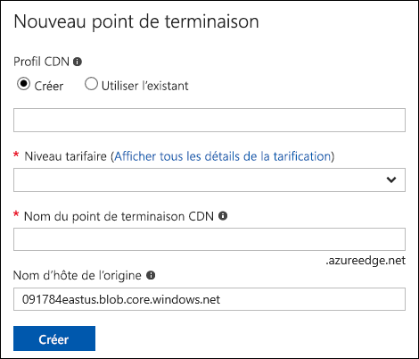

# Intégrer un site web statique avec Azure CDN

Vous pouvez activer [Azure Content Delivery Network (CDN)](../../cdn/cdn-overview.md) pour mettre en cache le contenu d’un [site web statique](storage-blob-static-website.md) hébergé dans un compte de stockage Azure. Vous pouvez utiliser Azure CDN pour configurer le point de terminaison de domaine personnalisé pour votre site web statique, approvisionner des certificats SSL personnalisés et configurer des règles de réécriture personnalisées. La configuration d’Azure CDN entraîne des frais supplémentaires, mais procure une faible latence à votre site web de n’importe où dans le monde. Azure CDN fournit également le chiffrement SSL avec votre propre certificat. 

Pour plus d’informations sur les prix d’Azure CDN, consultez [Tarification Content Delivery Network](https://azure.microsoft.com/pricing/details/cdn/).

## Activer Azure CDN pour votre site web statique

Vous pouvez activer Azure CDN pour votre compte de stockage directement à partir de votre compte de stockage. Si vous souhaitez spécifier des paramètres de configuration avancés pour votre point de terminaison CDN, notamment [l’optimisation du téléchargement des fichiers volumineux](../../cdn/cdn-optimization-overview.md#large-file-download), vous pouvez utiliser à la place [l’extension Azure CDN](../../cdn/cdn-create-new-endpoint.md) pour créer un profil et un point de terminaison CDN.

1. Recherchez votre compte de stockage dans le portail Azure et affichez la vue d’ensemble du compte.

2. Sélectionnez **Azure CDN** dans le menu **Service Blob** pour configurer Azure CDN.

    La page **Azure CDN** s’affiche.

    

3. Dans la section **Profil CDN**, spécifiez un profil CDN existant ou nouveau. 

4. Spécifiez un niveau tarifaire pour le point de terminaison CDN. Pour en savoir plus sur la tarification, voir [Tarification de Content Delivery Network](https://azure.microsoft.com/pricing/details/cdn/). Pour plus d’informations sur les fonctionnalités disponibles avec chaque niveau, voir [Comparer les caractéristiques du produit CDN Azure](../../cdn/cdn-features.md).

5. Dans le champ **Nom du point de terminaison CDN**, spécifiez un nom pour votre point de terminaison CDN. Le point de terminaison CDN doit être unique dans tout Azure.

6. Spécifiez votre point de terminaison de site web statique dans le champ **Nom d’hôte d’origine**. 

   Pour trouver votre point de terminaison de site web statique, accédez aux paramètres **Site web statique** de votre compte de stockage.  Copiez le point de terminaison principal et collez-le dans la configuration CDN.

   > [!IMPORTANT]
   > Veillez à supprimer l’identificateur de protocole (*par exemple,* , HTTPs) et la barre oblique de fin dans l’URL. Par exemple, si le point de terminaison de site web statique est `https://mystorageaccount.z5.web.core.windows.net/`, vous devez spécifier `mystorageaccount.z5.web.core.windows.net` dans le champ **Nom d’hôte de l’origine**.

   L’illustration suivante montre un exemple de configuration de point de terminaison :

   

7. Sélectionnez **Créer**, puis attendez qu’il se propage. Une fois le point de terminaison créé, il s'affiche dans la liste des points de terminaison.

8. Pour vérifier que le point de terminaison CDN est correctement configuré, cliquez dessus pour accéder à ses paramètres. Depuis la vue d’ensemble CDN de votre compte de stockage, recherchez le nom d’hôte du point de terminaison et accédez au point de terminaison, comme illustré dans l’image suivante. Le format de votre point de terminaison CDN est similaire à `https://staticwebsitesamples.azureedge.net`.

    

9. Une fois la propagation du point de terminaison CDN terminée, l’accès au point de terminaison CDN affiche le contenu du fichier index.html que vous avez précédemment chargé sur votre site web statique.

10. Pour passer en revue les paramètres d’origine de votre point de terminaison CDN, accédez à **Origine** dans la section **Paramètres** de votre point de terminaison CDN. Vous verrez que le champ **Type d’origine** a la valeur *Origine personnalisée* et que le champ **Nom d’hôte d’origine** indique le point de terminaison de votre site web statique.

    

## Supprimer le contenu d’Azure CDN

Si vous ne voulez plus mettre en cache un objet dans Azure CDN, vous pouvez procéder comme suit :

* Changez le statut du conteneur de public à privé. Pour plus d’informations, consultez [Gestion de l’accès en lecture anonyme aux conteneurs et aux objets blob](storage-manage-access-to-resources.md).
* Désactivez ou supprimez le point de terminaison CDN à l’aide du portail Azure.
* Modifiez votre service hébergé pour qu’il ne réponde plus aux demandes de l’objet.

Un objet déjà mis en cache dans Azure CDN y reste jusqu’à ce que sa durée de vie expire ou que le point de terminaison soit [purgé](../../cdn/cdn-purge-endpoint.md). Après expiration de la durée de vie, Azure CDN vérifie si le point de terminaison CDN est encore valide et si l’objet est encore accessible de manière anonyme. Si ce n’est pas le cas, l’objet n’est plus mis en cache.

## Étapes suivantes

(Facultatif) Ajouter un domaine personnalisé à votre point de terminaison Azure CDN. Voir le [tutoriel : Ajouter un domaine personnalisé à votre point de terminaison Azure CDN](../../cdn/cdn-map-content-to-custom-domain.md).
