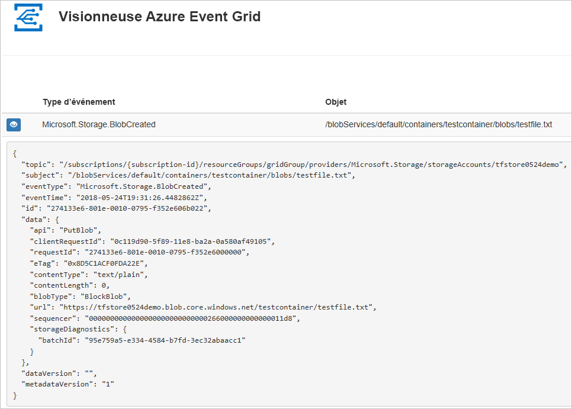

# <a name="quickstart-route-storage-events-to-web-endpoint-with-azure-cli"></a>Démarrage rapide : Router des événements de stockage vers un point de terminaison web avec Azure CLI

Azure Event Grid est un service de gestion d’événements pour le cloud. Dans cet article, vous utilisez Azure CLI pour vous abonner à des événements de stockage Blob et déclencher l’événement pour afficher le résultat.

En règle générale, vous envoyez des événements à un point de terminaison qui traite les données d’événement et entreprend des actions. Toutefois, pour simplifier cet article, vous envoyez les événements à une application web qui collecte et affiche les messages.

En suivant les instructions de cet article, vous voyez que les données d’événement ont été envoyées à l’application web.



[!INCLUDE [quickstarts-free-trial-note.md](../../../includes/quickstarts-free-trial-note.md)]

[!INCLUDE [azure-cli-prepare-your-environment.md](../../../includes/azure-cli-prepare-your-environment.md)]

- Cet article nécessite la version 2.0.70 ou ultérieure d’Azure CLI. Si vous utilisez Azure Cloud Shell, la version la plus récente est déjà installée.

## <a name="create-a-resource-group"></a>Créer un groupe de ressources

Les rubriques Event Grid sont des ressources Azure et doivent être placées dans un groupe de ressources Azure. Un groupe de ressources est une collection logique dans laquelle des ressources Azure sont déployées et gérées.

Créez un groupe de ressources avec la commande [az group create](/cli/azure/group). 

L’exemple suivant crée un groupe de ressources nommé `<resource_group_name>` à l’emplacement *westcentralus*.  Remplacez `<resource_group_name>` par un nom unique pour votre groupe de ressources.

```azurecli-interactive
az group create --name <resource_group_name> --location westcentralus
```

## <a name="create-a-storage-account"></a>Créez un compte de stockage.

Les événements de stockage d’objets blob sont disponibles dans les comptes de stockage v2 à usage général et dans les comptes de stockage d’objets blob. Les comptes de stockage **v2 à usage général** prennent en charge l’ensemble des fonctionnalités contenues dans tous les services de stockage, notamment Objets blob, Fichiers, Files d’attente et Tables. Un **compte de stockage d’objets blob** est un compte de stockage spécialisé pour le stockage des données non structurées en tant qu’objets blob dans Stockage Azure. Les comptes de stockage d’objets blob sont comme vos comptes de stockage à usage général existants et offrent les excellents niveaux de durabilité, disponibilité, évolutivité et performances dont vous bénéficiez aujourd’hui. Ils assurent notamment la cohérence d’API à 100 % pour les objets blob de blocs et d’ajout. Pour plus d’informations, consultez [Vue d’ensemble des comptes de stockage Azure](../common/storage-account-overview.md).

Remplacez `<storage_account_name>` par un nom unique pour votre compte de stockage, et `<resource_group_name>` par le groupe de ressources que vous avez créé précédemment.

```azurecli-interactive
az storage account create \
  --name <storage_account_name> \
  --location westcentralus \
  --resource-group <resource_group_name> \
  --sku Standard_LRS \
  --kind BlobStorage \
  --access-tier Hot
```

## <a name="create-a-message-endpoint"></a>Créer un point de terminaison de message

Avant de nous abonner à la rubrique, nous allons créer le point de terminaison pour le message de l’événement. En règle générale, le point de terminaison entreprend des actions en fonction des données d’événement. Pour simplifier ce guide de démarrage rapide, déployez une [application web prédéfinie](https://github.com/Azure-Samples/azure-event-grid-viewer) qui affiche les messages d’événement. La solution déployée comprend un plan App Service, une offre App Service Web Apps et du code source en provenance de GitHub.

Remplacez `<your-site-name>` par un nom unique pour votre application web. Le nom de l’application web doit être unique, car il fait partie de l’entrée DNS.

```azurecli-interactive
sitename=<your-site-name>

az deployment group create \
  --resource-group <resource_group_name> \
  --template-uri "https://raw.githubusercontent.com/Azure-Samples/azure-event-grid-viewer/master/azuredeploy.json" \
  --parameters siteName=$sitename hostingPlanName=viewerhost
```

Le déploiement peut prendre quelques minutes. Une fois le déploiement réussi, affichez votre application web pour vérifier qu’elle s’exécute. Dans un navigateur web, accédez à : `https://<your-site-name>.azurewebsites.net`

Vous devez voir le site sans messages affichés.

[!INCLUDE [event-grid-register-provider-cli.md](../../../includes/event-grid-register-provider-cli.md)]

## <a name="subscribe-to-your-storage-account"></a>Vous abonner à votre compte de stockage

Vous vous abonnez à une rubrique pour communiquer à Event Grid les événements qui vous intéressent, et où les envoyer. L’exemple suivant permet de s’abonner au compte de stockage créé, et de passer l’URL de votre application web en tant que point de terminaison pour la notification d’événements. Remplacez `<event_subscription_name>` par un nom pour votre abonnement aux événements. Pour `<resource_group_name>` et `<storage_account_name>`, utilisez les valeurs que vous avez créées précédemment.

Le point de terminaison de votre application web doit inclure le suffixe `/api/updates/`.

```azurecli-interactive
storageid=$(az storage account show --name <storage_account_name> --resource-group <resource_group_name> --query id --output tsv)
endpoint=https://$sitename.azurewebsites.net/api/updates

az eventgrid event-subscription create \
  --source-resource-id $storageid \
  --name <event_subscription_name> \
  --endpoint $endpoint
```

Affichez à nouveau votre application web, et notez qu’un événement de validation d’abonnement lui a été envoyé. Sélectionnez l’icône en forme d’œil pour développer les données d’événements. Event Grid envoie l’événement de validation pour que le point de terminaison puisse vérifier qu’il souhaite recevoir des données d’événement. L’application web inclut du code pour valider l’abonnement.


## <a name="trigger-an-event-from-blob-storage"></a>Déclencher un événement à partir du stockage Blob

Nous allons maintenant déclencher un événement pour voir comment Event Grid distribue le message à votre point de terminaison. Nous allons d’abord configurer le nom et la clé pour le compte de stockage, puis créer un conteneur, et enfin créer et charger un fichier. Pour `<storage_account_name>` et `<resource_group_name>`, utilisez à nouveau les valeurs que vous avez créées précédemment.

```azurecli-interactive
export AZURE_STORAGE_ACCOUNT=<storage_account_name>
export AZURE_STORAGE_KEY="$(az storage account keys list --account-name <storage_account_name> --resource-group <resource_group_name> --query "[0].value" --output tsv)"

az storage container create --name testcontainer

touch testfile.txt
az storage blob upload --file testfile.txt --container-name testcontainer --name testfile.txt
```

Vous avez déclenché l’événement, et Event Grid a envoyé le message au point de terminaison configuré lors de l’abonnement. Affichez votre application web pour voir l’événement que vous venez d’envoyer.


```json
[{
  "topic": "/subscriptions/xxxxxxxx-xxxx-xxxx-xxxx-xxxxxxxxxxxx/resourceGroups/myrg/providers/Microsoft.Storage/storageAccounts/myblobstorageaccount",
  "subject": "/blobServices/default/containers/testcontainer/blobs/testfile.txt",
  "eventType": "Microsoft.Storage.BlobCreated",
  "eventTime": "2017-08-16T20:33:51.0595757Z",
  "id": "4d96b1d4-0001-00b3-58ce-16568c064fab",
  "data": {
    "api": "PutBlockList",
    "clientRequestId": "d65ca2e2-a168-4155-b7a4-2c925c18902f",
    "requestId": "4d96b1d4-0001-00b3-58ce-16568c000000",
    "eTag": "0x8D4E4E61AE038AD",
    "contentType": "text/plain",
    "contentLength": 0,
    "blobType": "BlockBlob",
    "url": "https://myblobstorageaccount.blob.core.windows.net/testcontainer/testblob1.txt",
    "sequencer": "00000000000000EB0000000000046199",
    "storageDiagnostics": {
      "batchId": "dffea416-b46e-4613-ac19-0371c0c5e352"
    }
  },
  "dataVersion": "",
  "metadataVersion": "1"
}]

```

## <a name="clean-up-resources"></a>Nettoyer les ressources
Si vous envisagez de continuer à utiliser ce compte de stockage et l’abonnement à un événement, ne supprimez pas les ressources créées dans cet article. Sinon, utilisez la commande suivante pour supprimer les ressources créées avec cet article.

Remplacez `<resource_group_name>` par le nom du groupe de ressources que vous avez créé plus haut.

```azurecli-interactive
az group delete --name <resource_group_name>
```

## <a name="next-steps"></a>Étapes suivantes

Maintenant que vous savez créer des rubriques et des abonnements d’événements, vous pouvez en apprendre davantage sur les événements de stockage Blob et sur ce qu’Event Grid peut vous offrir :

- [Réaction aux événements de stockage Blob](storage-blob-event-overview.md)
- [À propos d’Event Grid](../../event-grid/overview.md)
