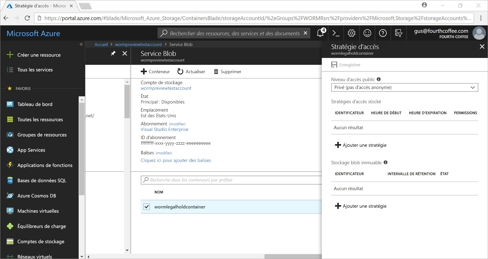
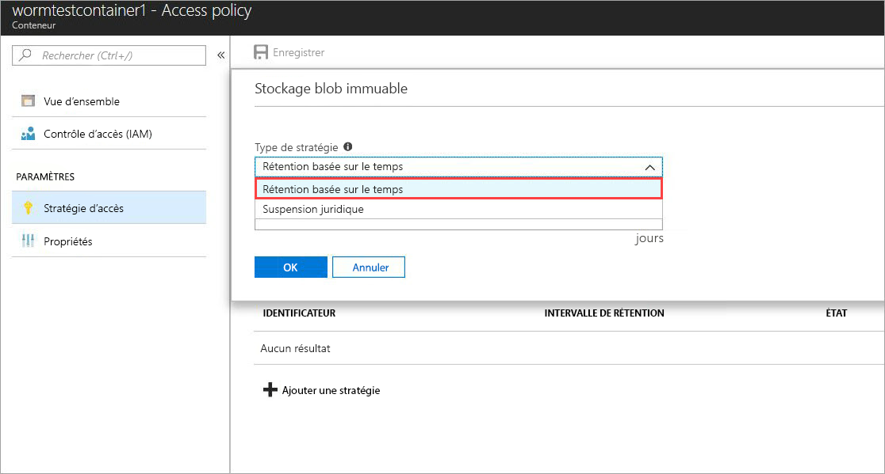
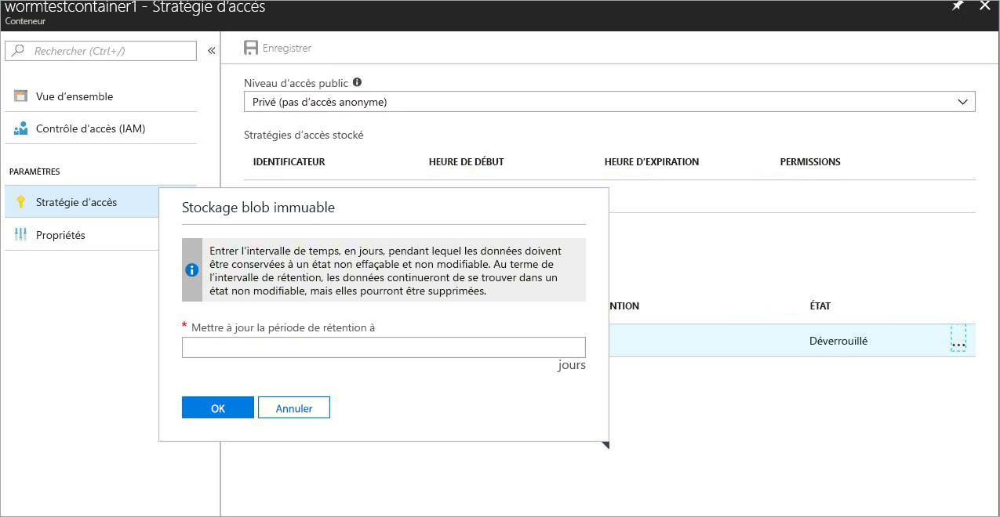
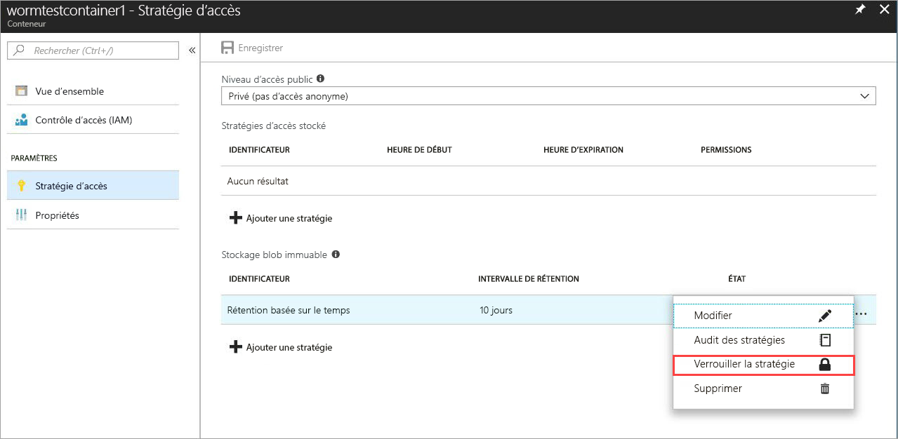
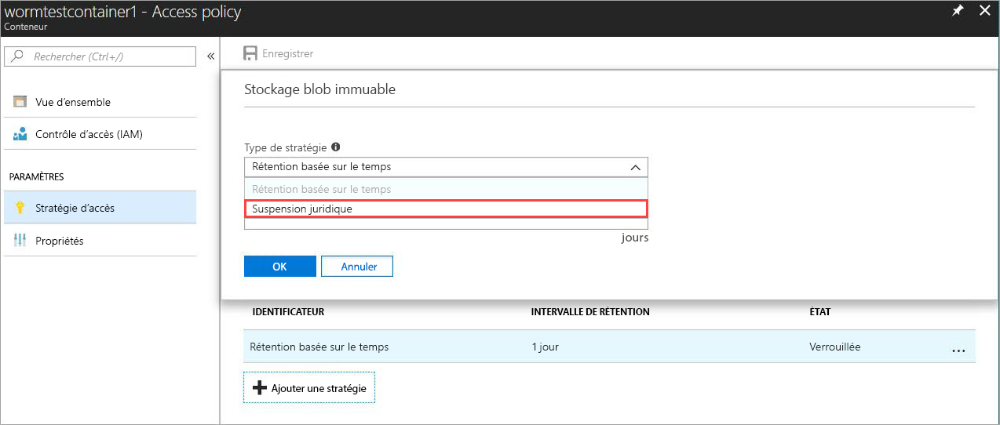
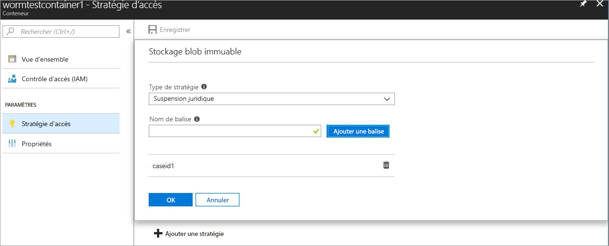

# <a name="store-business-critical-data-in-azure-blob-storage"></a>Stocker des données vitales pour l’entreprise dans le stockage Blob Azure

Le stockage immuable pour le Stockage Blob Azure permet aux utilisateurs de stocker des objets de données critiques pour l’entreprise dans un état WORM (disque optique non réinscriptible). Cet état les rend non effaçables et immuables pour une durée spécifiée par l’utilisateur. Au cours de cette période de conservation, il est possible de créer et de lire des objets blob, mais non de les modifier ou de les supprimer. Le stockage immuable est activé pour les comptes de stockage Blob et comptes de stockage Usage général v2 dans toutes les région Azure.

## <a name="overview"></a>Vue d'ensemble

Le stockage immuable permet aux établissements de santé, aux institutions financières et aux secteurs associés, en particulier les organisations de courtage, de stocker des données en toute sécurité. Il peut également être utilisé dans n’importe quel scénario pour protéger les données vitales contre la modification ou la suppression. 

Les applications typiques incluent :

- **Conformité réglementaire** : Le stockage immuable pour le Stockage Blob Azure permet aux organisations de respecter entre autres les réglementations SEC 17a-4(f), CFTC 1.31(d) et FINRA. Un livre blanc technique de Cohasset Associates qui décrit en détail la manière dont le stockage immuable répond à ces exigences réglementaires est maintenant téléchargeable via le [Portail d’approbation de services Microsoft](https://aka.ms/AzureWormStorage). Le [Centre de confidentialité Azure](https://www.microsoft.com/trustcenter/compliance/compliance-overview) contient des informations détaillées sur nos certifications de conformité.

- **Conservation sécurisée des documents** : avec le stockage immuable pour le Stockage Blob, les données ne sont ni modifiables ni supprimables par les utilisateurs, même s’ils disposent d’un compte avec privilèges administratifs.

- **Conservation légale** : le stockage immuable pour le Stockage Blob Azure permet aux utilisateurs de stocker dans un état de protection inviolable des informations sensibles critiques dans le cadre d’une utilisation professionnelle ou portant sur un litige, pour la durée souhaitée jusqu’à ce que la conservation prenne fin. Cette fonctionnalité n’est pas limitée aux seuls cas d’utilisation légale, mais peut également être considérée comme une conservation basée sur un événement ou un verrou de l’entreprise, lorsqu’il est nécessaire de protéger les données sur la base de déclencheurs d’événements ou d’une stratégie d’entreprise.

L’espace de stockage immuable prend en charge les éléments suivants :

- **[Prise en charge de la stratégie de conservation limitée dans le temps](#time-based-retention)**  : les utilisateurs peuvent définir des stratégies pour stocker les données pendant une période donnée. Lorsqu’une stratégie de conservation limitée dans le temps est définie, des objets Blob peuvent être créés et lus, mais ils ne peuvent pas être modifiés ni supprimés. Après l’expiration de la période de conservation, les tâches peuvent être effacées, mais pas remplacées.

- **[Prise en charge de la stratégie de conservation légale](#legal-holds)**  : si la période de conservation est inconnue, les utilisateurs peuvent définir des stratégies de conservation légale pour stocker les données de telle sorte qu’elles ne soient pas modifiables tant que les stratégies n’ont pas été levées.  Lorsqu’une stratégie de conservation légale est définie, des objets Blob peuvent être créés et lus, mais ils ne peuvent pas être modifiés ni supprimés. Chaque archivage juridique est associé à une balise alphanumérique définie par l’utilisateur (comme pour l’ID d’un cas, un nom d’événement), utilisée comme chaîne d’identificateur (comme pour l’ID d’un cas). 

- **Prise en charge de tous les niveaux d’objets blob** : Les stratégies WORM sont indépendantes du niveau de Stockage Blob Azure et s’appliquent à tous les niveaux (chaud, froid et archive). Les clients peuvent transférer les données au niveau ayant le coût le plus adapté à leurs charges de travail tout en conservant l’immuabilité des données.

- **Configuration au niveau du conteneur** : Les utilisateurs peuvent configurer des stratégies de conservation limitée dans le temps et des balises de conservation légale au niveau du conteneur. Grâce à de simples paramètres au niveau du conteneur, ils ont la possibilité de créer et verrouiller des stratégies de conservation limitée dans le temps, d’étendre les périodes de conservation, de définir et supprimer des archivages juridiques, etc. Ces stratégies s’appliquent à tous les objets blob du conteneur, anciens ou nouveaux.

- **Prise en charge des enregistrements d’audit** : chaque conteneur comprend un journal d’audit de stratégie. Il présente jusqu’à sept commandes pour les stratégies de conservation limitée dans le temps verrouillées, et contient l’ID utilisateur, le type commande, les valeurs d’horodatage et l’intervalle de rétention. En ce qui concerne les stratégies d’archivage juridique, il comporte l’identifiant utilisateur, le type de commande, les timestamps et les balises d’archivage juridique. Ce journal est conservé pendant toute la durée de vie de la stratégie, conformément aux instructions réglementaires SEC 17a-4(f). Le [Journal d’activité Azure](../../azure-monitor/platform/activity-logs-overview.md) est un journal plus complet de toutes les activités du plan de contrôle tandis que les [journaux de diagnostic Azure](../../azure-monitor/platform/diagnostic-logs-overview.md) mémorisent et affichent les opérations du plan de données. Il est de la responsabilité de l’utilisateur de stocker ces journaux d’activité de manière persistante, car ceux-ci peuvent être nécessaires à des fins réglementaires ou autres.

## <a name="how-it-works"></a>Fonctionnement

Le stockage immuable du Stockage Blob Azure prend en charge deux types de stratégies WORM ou immuables : la conservation limitée dans le temps et l’archivage juridique. Lorsqu’une stratégie de conservation limitée dans le temps ou d’archivage juridique est appliquée sur un conteneur, tous les objets blob existants prennent l’état WORM immuable en moins de 30 secondes. Tous les nouveaux objets blob chargés dans ce conteneur auront également cet état. Une fois que tous les blobs sont passés à l’état immuable, la stratégie immuable est confirmée et aucune opération d’écrasement ou de suppression des objets existants et nouveaux n’est autorisée dans le conteneur immuable.

La suppression de conteneurs et de comptes n’est pas non plus autorisée s’il existe des objets blobs protégés par une stratégie immuable. L’opération Supprimer le conteneur échoue s’il existe un ou plusieurs objets blob ayant une stratégie de conservation limitée dans le temps verrouillée ou un archivage juridique. La suppression du compte de stockage échoue s’il s’agit d’un conteneur WORM disposant d’une stratégie de rétention basée sur le temps verrouillée ou d’une conservation juridique. 

### <a name="time-based-retention"></a>Conservation limitée dans le temps

> [!IMPORTANT]
> Une stratégie de rétention limitée dans le temps doit être *verrouillée* pour que l’objet blob ait un état immuable conforme (protégé contre l’écriture et la suppression) conformément entre autres à la réglementation SEC 17a-4(f). Il est recommandé de verrouiller la stratégie au bout d’un délai raisonnable, en général en moins de 24 heures. L’état initial de la stratégie de rétention définie dans le temps est *déverrouillé*, ce qui vous permet de tester la fonctionnalité et d’apporter des modifications à la stratégie avant de la verrouiller. Tant que l’état *déverrouillé* protège l’immuabilité du conteneur, nous conseillons de ne pas utiliser l’état *déverrouillé* pour d’autres raisons que des évaluations de fonctionnalités à court terme. 

Lorsqu’une stratégie de conservation limitée dans le temps est appliquée à un conteneur, tous les objets blob de ce conteneur conserveront l’état immuable pendant la période de conservation *effective*. La durée de rétention effective pour les objets Blob existants est égale à la différence entre le temps de modification de l’objet Blob et l’intervalle de rétention spécifié par l’utilisateur.

Pour les nouveaux objets Blob, la durée de rétention effective est égale à l’intervalle de rétention spécifié par l’utilisateur. Dans la mesure où les utilisateurs peuvent étendre la période de conservation, le stockage immuable utilise la valeur la plus récente de la période de conservation spécifiée par l’utilisateur pour calculer la durée de conservation effective.

> [!TIP]
> **Exemple :** Un utilisateur crée une stratégie de conservation limitée dans le temps avec une période de conservation de cinq ans.
>
> L’objet blob qui se trouve dans ce conteneur, _testblob1_, a été créé un an plus tôt. La période de conservation effective de _testblob1_ est de quatre ans.
>
> Un nouvel objet blob, _testblob2_, est maintenant chargé dans le conteneur. La période de conservation effective de ce nouvel objet blob est de cinq ans.

Une stratégie de rétention limitée dans le temps et déverrouillée est recommandée à des fins de test uniquement et une stratégie doit être verrouillée conformément à la réglementation SEC 17a-4(f) et à d’autres réglementations. Une fois verrouillée, une stratégie de rétention à durée limitée ne peut plus être supprimée ; seul un maximum de cinq prolongations effectives de la période de rétention est autorisé. Pour savoir comment définir et verrouiller des stratégies de rétention légale à durée limitée, voir la section [Bien démarrer](#getting-started).

### <a name="legal-holds"></a>Conservation juridique

En cas de définition d’une stratégie d’archivage juridique, tous les objets blob (anciens et nouveaux) conservent l’état immuable jusqu’à ce qu’elle soit levée. Pour savoir comment définir et lever une stratégie de conservation à des fins juridiques, voir la section [Bien démarrer](#getting-started).

Un conteneur peut avoir à la fois une stratégie d’archivage juridique et une stratégie de conservation limitée dans le temps. Tous les objets blob de ce conteneur conservent l’état immuable jusqu’à ce que toutes les stratégies d’archivage juridique aient été levées, même si leur période de conservation effective est écoulée. À l’inverse, un objet blob demeure dans un état immuable jusqu’à expiration de la période de conservation effective, même si toutes les stratégies d’archivage juridique ont été levées.

Le tableau suivant montre les types d’opérations blob désactivées dans chaque scénario immuable. Pour plus d’informations, voir la documentation [API du service BLOB Azure](https://docs.microsoft.com/rest/api/storageservices/blob-service-rest-api).

|Scénario  |État des objets blob  |Opérations blob non autorisées  |
|---------|---------|---------|
|L’intervalle de rétention effective sur l’objet Blob n’a pas encore expiré et/ou une conservation juridique est définie     |Immuable : non modifiable et non supprimable         | Put Blob<sup>1</sup>, Put Block<sup>1</sup>, Put Block List<sup>1</sup>, Delete Container, Delete Blob, Set Blob Metadata, Put Page, Set Blob Properties, Snapshot Blob, Incremental Copy Blob, Append Block         |
|L’intervalle de rétention effective sur l’objet Blob a expiré     |Non modifiable seulement (suppressions autorisées)         |Put Blob<sup>1</sup>, Put Block<sup>1</sup>, Put Block List<sup>1</sup>, Set Blob Metadata, Put Page, Set Blob Properties, Snapshot Blob, Incremental Copy Blob, Append Block         |
|Stratégies d’archivage juridique levées ; aucune stratégie de conservation limitée dans le temps dans le conteneur     |Mutable         |Aucun         |
|Aucune stratégie WORM créée (conservation limitée dans le temps ou archivage juridique)     |Mutable         |Aucun         |

<sup>1</sup> L’application permet à ces opérations de créer un seul objet blob à la fois. Toutes les opérations d’écrasement ultérieures sur un chemin d’objets blob existant dans un conteneur immuable ne sont pas autorisées.

## <a name="supported-values"></a>Valeurs prises en charge

### <a name="time-based-retention"></a>Rétention limitée dans le temps
- Le nombre maximal par compte de stockage de conteneurs avec stratégies immuables limitées dans le temps verrouillées est fixé à 1 000.
- La période de rétention minimale est de 1 jour. Le maximum est de 146 000 jours (400 ans).
- Pour un conteneur, il est possible de modifier jusqu’à cinq fois la période de rétention définie dans des stratégies immuables verrouillées limitées dans le temps.
- Pour un conteneur, 7 journaux d’activité de stratégie de rétention au maximum sont conservés pour la durée de la stratégie.

### <a name="legal-hold"></a>Conservation légale
- Le nombre maximal par compte de stockage de conteneurs avec paramètre d’archivage juridique est de 1 000.
- Le nombre maximal par conteneur de balises d’archivage juridique est de 10.
- La longueur minimale d’une balise d’archivage légal est de 3 caractères alphanumériques. La longueur maximale est de 23 caractères alphanumériques.
- Pour un conteneur, 10 journaux d’activité de stratégie de rétention légale au maximum sont conservés pour la durée de la stratégie.

## <a name="pricing"></a>Tarifs

L’utilisation de cette fonctionnalité n’entraîne aucun coût supplémentaire. Les données immuables sont facturées au même tarif que les données modifiables classiques. Pour plus d’informations sur les prix du stockage Blob Azure, consultez la [page des tarifs du stockage Azure](https://azure.microsoft.com/pricing/details/storage/blobs/).

## <a name="getting-started"></a>Prise en main
Le stockage immuable est disponible uniquement pour les comptes de stockage Blob et comptes de stockage Usage général v2. Ces comptes doivent être gérés par le biais d’[Azure Resource Manager](https://docs.microsoft.com/azure/azure-resource-manager/resource-group-overview). Pour plus d’informations sur la mise à niveau d’un compte de stockage Usage général V1, consultez [Mettre à niveau un compte de stockage](../common/storage-account-upgrade.md).

Les dernières versions du [Portail Azure](https://portal.azure.com), [d’Azure CLI](https://docs.microsoft.com/cli/azure/install-azure-cli?view=azure-cli-latest) et [d’Azure PowerShell](https://github.com/Azure/azure-powershell/releases) prennent en charge le stockage immuable pour le Stockage Blob Azure. Le [support de la bibliothèque client](#client-libraries) est également fourni.

### <a name="azure-portal"></a>Portail Azure

1. Créez un nouveau conteneur ou sélectionnez un conteneur existant pour stocker des objets Blob qui doivent demeurer dans l’état immuable.
 Le conteneur doit se trouver dans un compte de stockage Blob ou un compte de stockage universel V2.
2. Sélectionnez **Stratégie d’accès** dans les paramètres du conteneur. Ensuite, sélectionnez **+ Ajouter une stratégie** sous **Stockage Blob immuable**.

    

3. Pour activer la conservation limitée dans le temps, sélectionnez **Conservation limitée dans le temps** dans le menu déroulant.

    

4. Entrez la période de rétention en jours (les valeurs acceptées sont comprise entre 1 et 146000 jours).

    

    L’état initial de la stratégie est déverrouillé, ce qui vous permet de tester la fonctionnalité et d’apporter des modifications à la stratégie avant de la verrouiller. Le verrouillage de la stratégie est essentiel pour la conformité à la réglementation SEC 17a-4 notamment.

5. Verrouillez la stratégie. Cliquez avec le bouton droit sur les points de suspension ( **…** ) ; le menu suivant s’affiche avec des actions supplémentaires :

    

6. Sélectionnez **Verrouiller la stratégie** et confirmez le verrouillage. La stratégie est à présent verrouillée, sa suppression n’est plus possible ; seules les extensions de la période de conservation seront autorisées. Les suppressions et les remplacements d’objets blob ne sont pas autorisés. 

    

7. Pour activer l’archivage juridique, sélectionnez **+ Ajouter une stratégie**. Sélectionnez **Archivage juridique** dans le menu déroulant.

    

8. Créez une stratégie d’archivage juridique avec une ou plusieurs balises.

    

9. Pour supprimer une conservation légale, supprimez simplement la balise de conservation légale associée.

### <a name="azure-cli"></a>Azure CLI

La fonctionnalité est incluse dans les groupes de commandes suivants : `az storage container immutability-policy` et `az storage container legal-hold`. Exécutez `-h` sur ces groupes pour afficher les commandes.

### <a name="powershell"></a>PowerShell

Le module Az.Storage prend en charge le stockage immuable.  Pour activer cette fonctionnalité, suivez les étapes ci-dessous :

1. Vérifiez que la dernière version de PowerShellGet est installée : `Install-Module PowerShellGet –Repository PSGallery –Force`.
2. Supprimez les installations précédentes d’Azure PowerShell.
3. Installez Azure PowerShell : `Install-Module Az –Repository PSGallery –AllowClobber`.

La section [Exemple de code PowerShell](#sample-powershell-code) plus loin dans cet article illustre l’utilisation de cette fonctionnalité.

## <a name="client-libraries"></a>Bibliothèques clientes

Les bibliothèques de client suivantes prennent en charge le stockage immuable pour le Stockage Blob Azure :

- [Bibliothèque de client .NET version 7.2.0-preview et versions ultérieures](https://www.nuget.org/packages/Microsoft.Azure.Management.Storage/7.2.0-preview)
- [Bibliothèque de client Node.js version 4.0.0 et versions ultérieures](https://www.npmjs.com/package/azure-arm-storage)
- [Bibliothèque de client Python version 2.0.0 Release Candidate 2 et versions ultérieures](https://pypi.org/project/azure-mgmt-storage/2.0.0rc2/)
- [Bibliothèque cliente Java](https://github.com/Azure/azure-rest-api-specs/tree/master/specification/storage/resource-manager/Microsoft.Storage/preview/2018-03-01-preview)

## <a name="faq"></a>Forum Aux Questions

**Pouvez-vous fournir de la documentation sur la conformité WORM ?**

Oui. Pour documenter la conformité, Microsoft a choisi les services de Cohasset Associates, une importante société d’évaluation indépendante spécialisée dans la gestion des dossiers et la gouvernance de l’information, afin d’évaluer Azure Immutable Blob Storage et sa conformité aux exigences propres au secteur des services financiers. Cohasset a confirmé que Azure Immutable Blob Storage, lorsqu’il est utilisé pour conserver les objets blobs temporels dans un état WORM, répond aux exigences de stockage appropriées décrites par la réglementation Fina 4511, au paragraphe 1.31(c)-(d) de la réglementation CFTC et au paragraphe 17a-4 de la réglementation SEC. Microsoft a opté pour cet ensemble de règles, car elles représentent les recommandations les plus normatives au monde en matière de rétention des enregistrements pour les institutions financières. Le rapport Cohasset est disponible dans le [Centre de gestion de la confidentialité des services Microsoft](https://aka.ms/AzureWormStorage). Pour demander une lettre d’attestation de Microsoft concernant la conformité WORM, veuillez contacter le support Azure.

**Cette fonctionnalité s’applique-t-elle uniquement aux objets blob de blocs, ou aussi aux objets blob de page et d’ajout ?**

Le stockage immuable peut être utilisé avec n’importe quel type d’objet blob, mais nous recommandons de l’utiliser principalement pour les objets blob de blocs. Contrairement aux objets blob de blocs, les objets blob de page et d’ajout doivent être créés hors d’un conteneur WORM, avant d’y être copiés. Une fois la copie faite, il n’est plus possible de faire des *ajouts* à un objet blob d’ajout ni de modifier un objet blob de pages.

**Dois-je créer un compte de stockage pour utiliser cette fonctionnalité ?**

Non. Vous pouvez utiliser le stockage immuable avec tous les comptes de stockage Usage général v2 ou comptes Stockage Blob, qu’ils soient nouveaux ou existants. Cette fonctionnalité est destinée à être utilisée avec des objets blob de blocs dans les comptes GPv2 et Stockage Blob. Les comptes de stockage Usage général v1 ne sont pas pris en charge mais peuvent être facilement mis à niveau vers la version 2. Pour plus d’informations sur la mise à niveau d’un compte de stockage Usage général v1, consultez [Mettre à niveau un compte de stockage](../common/storage-account-upgrade.md).

**Puis-je appliquer à la fois une conservation légale et une stratégie de rétention à durée définie ?**

Oui, un conteneur peut avoir à la fois une conservation légale et une stratégie de rétention limitée dans le temps. Tous les objets blob de ce conteneur conservent l’état immuable jusqu’à ce que toutes les stratégies d’archivage juridique aient été levées, même si leur période de conservation effective est écoulée. À l’inverse, un objet blob demeure dans un état immuable jusqu’à expiration de la période de conservation effective, même si toutes les stratégies d’archivage juridique ont été levées.

**Les stratégies de conservation légale s’appliquent-elles uniquement aux procédures judiciaires ou existe-t-il d’autres scénarios d’utilisation ?**

Non, « conservation légale » est l’expression générale désignant une stratégie de rétention limitée dans le temps. Il n’est pas nécessaire de l’utiliser uniquement dans le cadre de procédures contentieuses. Les stratégies de conservation légale sont utiles pour désactiver le remplacement et les suppressions pour protéger les données WORM importantes de l’entreprise, lorsque la période de conservation est inconnue. Vous pouvez utiliser la période de conservation en tant que stratégie d’entreprise pour protéger vos charges de travail WORM stratégiques ou en tant que stratégie intermédiaire avant qu’un événement personnalisé ne nécessite une stratégie de rétention limitée dans le temps. 

**Puis-je supprimer une stratégie de rétention à durée définie *verrouillée* ou une conservation légale ?**

Seules les stratégies de rétention à durée définie non verrouillées peuvent être supprimées d’un conteneur. Une fois verrouillée, une stratégie de rétention à durée définie ne peut plus être supprimée ; seules les prolongations effectives de la période de conservation sont autorisées. Les balises de conservation légale peuvent être supprimées. Lorsque toutes les balises légales sont supprimées, la conservation légale l’est également.

**Que se passe-t-il si j’essaie de supprimer un conteneur avec une stratégie de rétention basée sur le temps *verrouillée* ou une conservation juridique ?**

L’opération Supprimer le conteneur échoue s’il existe un ou plusieurs objets blob ayant une stratégie de conservation limitée dans le temps verrouillée ou un archivage juridique. L’opération Supprimer le conteneur réussit uniquement s’il n’y a aucun objet blob avec une période de conservation ou avec un archivage juridique. Il est nécessaire de supprimer les objets blob pour pouvoir supprimer le conteneur.

**Que se passe-t-il si j’essaie de supprimer un compte de stockage avec un conteneur WORM disposant d’une stratégie de rétention basée sur le temps *verrouillée* ou d’une conservation juridique ?**

La suppression du compte de stockage échoue s’il s’agit d’un conteneur WORM disposant d’une stratégie de rétention basée sur le temps verrouillée ou d’une conservation juridique. Il est nécessaire de supprimer tous les conteneurs WORM pour pouvoir supprimer le compte de stockage. Pour plus d’informations sur la suppression des conteneurs, voir la question précédente.

**Puis-je déplacer les données sur différents niveaux d’objets blob (chaud, froid, archive) lorsque l’objet blob est dans l’état immuable ?**

Oui, vous pouvez utiliser la commande Set Blob Tier pour déplacer des données sur d’autres niveaux d’objets blob tant en conservant leur état immuable conforme. Le stockage immuable est pris en charge sur les niveaux d’objets blob chaud, froid et archive.

**Que se passe-t-il si je ne paie pas et que mon intervalle de rétention n’a pas expiré ?**

En cas de défaut de paiement, les stratégies de conservation des données normales s’appliquent, comme le stipulent les conditions générales de votre contrat avec Microsoft.

**Proposez-vous une période d’essai ou de grâce pour essayer la fonctionnalité ?**

Oui. Lors de la définition initiale d’une stratégie de conservation limitée dans le temps, celle-ci a pour état *déverrouillé*. Dans cet état, vous pouvez apporter les modifications souhaitées à la période de conservation, par exemple, l’augmenter, la diminuer ou même supprimer la stratégie. Une fois que la stratégie est verrouillée, elle reste verrouillée jusqu’à l’expiration de l’intervalle de rétention. Cette stratégie verrouillée empêche la suppression et la modification de l’intervalle de rétention. Il est vivement recommandé de n’utiliser l’état *déverrouillé* qu’à des fins d’évaluation et de verrouiller la stratégie dans les 24 heures. Ces pratiques permettent de respecter entre autres la réglementation SEC 17a-4(f).

**Puis-je utiliser la suppression réversible en même temps que les stratégies de blob immuable ?**

Oui. [La suppression réversible pour le Stockage Blob Azure](storage-blob-soft-delete.md) s’applique à tous les conteneurs d’un compte de stockage, indépendamment de la conservation légale ou d’une stratégie de rétention limitée dans le temps. Nous recommandons d’activer la suppression réversible pour une protection supplémentaire avant d’appliquer et de confirmer toutes les stratégies WORM immuables. 

**Où se trouve la fonctionnalité disponible ?**

Le stockage immuable est disponible dans les régions Azure publiques, Chine et Administration. Si le stockage immuable n’est pas disponible dans votre région, contactez le support à l’adresse azurestoragefeedback@microsoft.com.

## <a name="sample-powershell-code"></a>Exemple de code PowerShell

[!INCLUDE [updated-for-az](../../../includes/updated-for-az.md)]

L’exemple de script PowerShell suivant est fourni à titre de référence. Il crée un compte de stockage et un conteneur. Ensuite, il montre comment définir et lever des stratégies d’archivage juridique, créer et verrouiller une stratégie de conservation limitée dans le temps (ou stratégie d’immuabilité) et étendre la période de conservation.

Créer et tester le compte de stockage Azure :

```powershell
$ResourceGroup = "<Enter your resource group>”
$StorageAccount = "<Enter your storage account name>"
$container = "<Enter your container name>"
$container2 = "<Enter another container name>”
$location = "<Enter the storage account location>"

# Log in to the Azure Resource Manager account
Login-AzAccount
Register-AzResourceProvider -ProviderNamespace "Microsoft.Storage"

# Create your Azure resource group
New-AzResourceGroup -Name $ResourceGroup -Location $location

# Create your Azure storage account
New-AzStorageAccount -ResourceGroupName $ResourceGroup -StorageAccountName `
    $StorageAccount -SkuName Standard_LRS -Location $location -Kind StorageV2

# Create a new container
New-AzStorageContainer -ResourceGroupName $ResourceGroup `
    -StorageAccountName $StorageAccount -Name $container

# Create Container 2 with a storage account object
$accountObject = Get-AzStorageAccount -ResourceGroupName $ResourceGroup `
    -StorageAccountName $StorageAccount
New-AzStorageContainer -StorageAccount $accountObject -Name $container2

# Get a container
Get-AzStorageContainer -ResourceGroupName $ResourceGroup `
    -StorageAccountName $StorageAccount -Name $container

# Get a container with an account object
$containerObject = Get-AzStorageContainer -StorageAccount $accountObject -Name $container

# List containers
Get-AzStorageContainer -ResourceGroupName $ResourceGroup `
    -StorageAccountName $StorageAccount

# Remove a container (add -Force to dismiss the prompt)
Remove-AzStorageContainer -ResourceGroupName $ResourceGroup `
    -StorageAccountName $StorageAccount -Name $container2

# Remove a container with an account object
Remove-AzStorageContainer -StorageAccount $accountObject -Name $container2

# Remove a container with a container object
$containerObject2 = Get-AzStorageContainer -StorageAccount $accountObject -Name $container2
Remove-AzStorageContainer -InputObject $containerObject2
```

Définir et supprimer des archivages juridiques :

```powershell
# Set a legal hold
Add-AzRmStorageContainerLegalHold -ResourceGroupName $ResourceGroup `
    -StorageAccountName $StorageAccount -Name $container -Tag <tag1>,<tag2>,...

# with an account object
Add-AzRmStorageContainerLegalHold -StorageAccount $accountObject -Name $container -Tag <tag3>

# with a container object
Add-AzRmStorageContainerLegalHold -Container $containerObject -Tag <tag4>,<tag5>,...

# Clear a legal hold
Remove-AzRmStorageContainerLegalHold -ResourceGroupName $ResourceGroup `
    -StorageAccountName $StorageAccount -Name $container -Tag <tag2>

# with an account object
Remove-AzRmStorageContainerLegalHold -StorageAccount $accountObject -Name $container -Tag <tag3>,<tag5>

# with a container object
Remove-AzRmStorageContainerLegalHold -Container $containerObject -Tag <tag4>
```

Créer ou mettre à jour des stratégies d’immuabilité :
```powershell
# with an account name or container name
Set-AzRmStorageContainerImmutabilityPolicy -ResourceGroupName $ResourceGroup `
    -StorageAccountName $StorageAccount -ContainerName $container -ImmutabilityPeriod 10

# with an account object
Set-AzRmStorageContainerImmutabilityPolicy -StorageAccount $accountObject `
    -ContainerName $container -ImmutabilityPeriod 1 -Etag $policy.Etag

# with a container object
$policy = Set-AzRmStorageContainerImmutabilityPolicy -Container `
    $containerObject -ImmutabilityPeriod 7

# with an immutability policy object
Set-AzRmStorageContainerImmutabilityPolicy -ImmutabilityPolicy $policy -ImmutabilityPeriod 5
```

Récupérer des stratégies d’immuabilité :
```powershell
# Get an immutability policy
Get-AzRmStorageContainerImmutabilityPolicy -ResourceGroupName $ResourceGroup `
    -StorageAccountName $StorageAccount -ContainerName $container

# with an account object
Get-AzRmStorageContainerImmutabilityPolicy -StorageAccount $accountObject `
    -ContainerName $container

# with a container object
Get-AzRmStorageContainerImmutabilityPolicy -Container $containerObject
```

Verrouiller des stratégies d’immuabilité (ajouter - Force pour ignorer l’invite) :
```powershell
# with an immutability policy object
$policy = Get-AzRmStorageContainerImmutabilityPolicy -ResourceGroupName `
    $ResourceGroup -StorageAccountName $StorageAccount -ContainerName $container
$policy = Lock-AzRmStorageContainerImmutabilityPolicy -ImmutabilityPolicy $policy -force

# with an account name or container name
$policy = Lock-AzRmStorageContainerImmutabilityPolicy -ResourceGroupName `
    $ResourceGroup -StorageAccountName $StorageAccount -ContainerName $container `
    -Etag $policy.Etag

# with an account object
$policy = Lock-AzRmStorageContainerImmutabilityPolicy -StorageAccount `
    $accountObject -ContainerName $container -Etag $policy.Etag

# with a container object
$policy = Lock-AzRmStorageContainerImmutabilityPolicy -Container `
    $containerObject -Etag $policy.Etag -force
```

Étendre des stratégies d’immuabilité :
```powershell

# with an immutability policy object
$policy = Get-AzRmStorageContainerImmutabilityPolicy -ResourceGroupName `
    $ResourceGroup -StorageAccountName $StorageAccount -ContainerName $container

$policy = Set-AzRmStorageContainerImmutabilityPolicy -ImmutabilityPolicy `
    $policy -ImmutabilityPeriod 11 -ExtendPolicy

# with an account name or container name
$policy = Set-AzRmStorageContainerImmutabilityPolicy -ResourceGroupName `
    $ResourceGroup -StorageAccountName $StorageAccount -ContainerName $container `
    -ImmutabilityPeriod 11 -Etag $policy.Etag -ExtendPolicy

# with an account object
$policy = Set-AzRmStorageContainerImmutabilityPolicy -StorageAccount `
    $accountObject -ContainerName $container -ImmutabilityPeriod 12 -Etag `
    $policy.Etag -ExtendPolicy

# with a container object
$policy = Set-AzRmStorageContainerImmutabilityPolicy -Container `
    $containerObject -ImmutabilityPeriod 13 -Etag $policy.Etag -ExtendPolicy
```

Supprimer une stratégie d’immuabilité déverrouillée (ajouter - Force pour ignorer l’invite) :
```powershell
# with an immutability policy object
$policy = Get-AzRmStorageContainerImmutabilityPolicy -ResourceGroupName `
    $ResourceGroup -StorageAccountName $StorageAccount -ContainerName $container
Remove-AzRmStorageContainerImmutabilityPolicy -ImmutabilityPolicy $policy

# with an account name or container name
Remove-AzRmStorageContainerImmutabilityPolicy -ResourceGroupName `
    $ResourceGroup -StorageAccountName $StorageAccount -ContainerName $container `
    -Etag $policy.Etag

# with an account object
Remove-AzRmStorageContainerImmutabilityPolicy -StorageAccount $accountObject `
    -ContainerName $container -Etag $policy.Etag

# with a container object
Remove-AzRmStorageContainerImmutabilityPolicy -Container $containerObject `
    -Etag $policy.Etag

```
