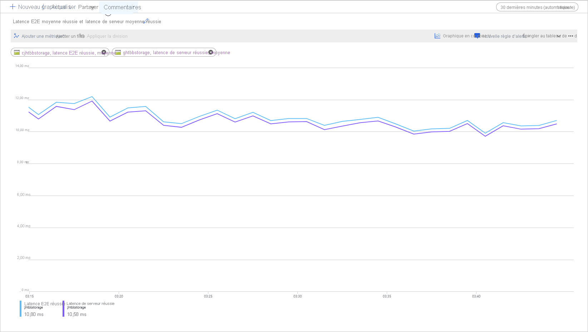

# Latence dans le stockage d’objets blob

La latence, parfois désignée sous le terme « temps de réponse », correspond au temps d’attente d’une application pendant le traitement d’une requête. La latence peut affecter directement les performances d’une application. Une faible latence est souvent primordiale dans les scénarios faisant intervenir des humains, par exemple pour le traitement de transactions par carte de crédit ou le chargement de pages web. Les systèmes qui doivent traiter des événements entrants moyennant des taux élevés, par exemple des événements IoT ou de journalisation de données de télémétrie, nécessitent également une faible latence. Cet article explique en quoi consiste la latence des opérations sur des objets blob de blocs et comment la mesurer. Il explique également comment concevoir des applications présentant une faible latence.

Le stockage Azure offre deux options de performances pour les objets blob de blocs : Premium et standard. Avec les disques SSD hautes performances, les objets blob de blocs Premium offrent une latence plus constante et nettement inférieure à celle des objets standard. Pour plus d’informations, consultez la section **Stockage d’objets blob de blocs de performances Premium** de l’article [Stockage Blob Azure : niveaux d’accès chaud, froid et archive](storage-blob-storage-tiers.md).

## À propos de la latence du stockage Azure

La latence du stockage Azure est liée aux taux de requêtes des opérations de stockage Azure, c’est-à-dire au nombre d’opérations d’entrée/sortie par seconde (IOPS, input/output operations per second).

Pour calculer le taux de requêtes, commencez par déterminer la durée de traitement de chaque requête, puis calculez le nombre de requêtes pouvant être traitées par seconde. Par exemple, supposons que le traitement d’une requête nécessite 50 millisecondes (ms). Une application qui utilise un thread avec une opération de lecture ou d’écriture en suspens doit atteindre un taux de 20 IOPS (1 seconde ou 1 000 ms/50 ms par requête). En théorie, si le nombre de threads est doublé, l’application doit être en mesure d’atteindre un taux de 40 IOPS. Si le nombre d’opérations de lecture ou d’écriture asynchrones en suspens pour chaque thread est doublé, l’application doit être en mesure d’atteindre un taux de 80 IOPS.

Dans la pratique, les taux de requêtes n’évoluent pas toujours de façon aussi linéaire. Ils dépendent de la surcharge imposée au client par la planification des tâches, du changement de contexte, etc. Du côté du service, la latence peut présenter une certaine variabilité de par la pression affectant le système de stockage Azure, les différences entre les médias de stockage utilisés, le bruit des autres charges de travail, les tâches de maintenance et d’autres facteurs. Enfin, la connexion réseau entre le client et le serveur peut affecter la latence du stockage Azure en raison de la congestion, du reroutage ou d’autres perturbations.

La bande passante du stockage Azure, également appelée débit, est liée au taux de requêtes. Elle correspond au taux de requêtes (IOPS) multiplié par la taille des requêtes. Par exemple, pour un taux de 160 requêtes par seconde, chaque paquet de données de 256 Kio entraîne un débit de 40 960 Kio par seconde, soit 40 Mio par seconde.

## Métriques de latence pour les objets blob de blocs

Le stockage Azure fournit deux métriques de latence pour les objets blob de blocs. Ces métriques peuvent être visualisées dans le portail Azure :

- La **latence de bout en bout (E2E, end-to-end)** mesure l’intervalle entre le moment où le stockage Azure reçoit le premier paquet de la requête et celui où il reçoit un accusé de réception du client concernant le dernier paquet de la réponse.

- La **latence serveur** mesure l’intervalle entre le moment où le stockage Azure reçoit le dernier paquet de la requête et celui où il retourne le premier paquet de la réponse.

L’image suivante illustre la **latence E2E moyenne (réussite)** et la **latence serveur moyenne (réussite)** pour un exemple de charge de travail qui appelle l’opération `Get Blob` :

Dans des conditions normales, la latence de bout en bout et la latence serveur présentent peu d’écart, comme le montre l’illustration pour l’exemple de charge de travail.

Si vous consultez ces métriques et constatez que la latence de bout en bout est bien supérieure à la latence serveur, vous devez identifier la source de latence supplémentaire et résoudre le problème.

Si les latences serveur et de bout en bout sont similaires, mais que vous avez besoin d’une latence inférieure, envisagez de migrer vers le stockage d’objets blob de blocs Premium.

## Facteurs affectant la latence

Le principal facteur affectant la latence est la taille des opérations. Le traitement d’opérations de grande envergure prend plus de temps en raison de la quantité de données transférées sur le réseau et traitées par le stockage Azure.

Le schéma suivant montre la durée totale d’opérations de différentes tailles. Pour les petites quantités de données, l’intervalle de latence est principalement lié au traitement de la requête plutôt qu’au transfert de données. L’intervalle de latence ne s’allonge que légèrement à mesure que la taille de l’opération augmente (zone marquée 1 dans le schéma ci-dessous). Quand la taille de l’opération augmente encore, le temps consacré au transfert de données s’accroît. L’intervalle de latence total est alors divisé entre le traitement des requêtes et le transfert de données (zone marquée 2 dans le schéma ci-dessous). Avec des tailles d’opération encore supérieures, l’intervalle de latence est presque entièrement lié au transfert de données. Le traitement des requêtes est alors négligeable (zone marquée 3 dans le schéma ci-dessous).

Les facteurs de configuration du client comme la concurrence et les threads affectent également la latence. Le débit global dépend du nombre de requêtes de stockage en cours à un moment donné et de la façon dont votre application traite les threads. Les ressources du client, notamment l’UC, la mémoire, le stockage local et les interfaces réseau, peuvent également affecter la latence.

Le traitement des requêtes de stockage Azure nécessite des ressources en termes d’UC et de mémoire. Si une machine virtuelle qui manque de puissance ou un processus de perte de contrôle dans le système met le client sous pression, les ressources disponibles pour le traitement des requêtes de stockage Azure sont inférieures. Tout manque ou contention de ressources du client entraîne une augmentation de la latence de bout en bout sans augmentation de la latence serveur, ce qui accroît l’écart entre les deux métriques.

L’interface réseau et le canal réseau entre le client et le stockage Azure sont tout aussi importants. La distance physique peut représenter, à elle seule, un facteur majeur, par exemple si une machine virtuelle cliente se trouve dans une autre région Azure ou en local. D’autres facteurs tels que les tronçons réseau, le routage de l’ISP et les conditions Internet peuvent affecter la latence de stockage globale.

Pour évaluer la latence, commencez par établir les métriques de base pour votre scénario. Elles indiquent la latence de bout en bout et la latence serveur attendues dans le contexte de votre environnement d’application en fonction de certains facteurs comme votre profil de charge de travail, les paramètres de configuration de l’application, les ressources du client et le canal réseau. Quand vous disposez de métriques de base, vous pouvez différencier plus facilement les conditions normales et anormales. Les métriques de base vous permettent également d’observer les effets de la modification de paramètres, notamment concernant la configuration de l’application ou à la taille des machines virtuelles.

## Étapes suivantes

- [Objectifs de performance et d’extensibilité du Stockage Blob](scalability-targets.md)
- [Liste de contrôle des performances et de l’extensibilité pour Stockage Blob](storage-performance-checklist.md)
