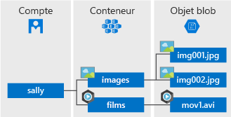

# <a name="quickstart-azure-blob-storage-client-library-v11-for-net"></a>Démarrage rapide : Bibliothèque de client Stockage Blob Azure v11 pour .NET

Familiarisez-vous avec la bibliothèque de client Stockage Blob Azure v11 pour .NET. Le Stockage Blob Azure est la solution de stockage d’objets de Microsoft pour le cloud. Suivez les étapes pour installer le package et essayer l’exemple de code pour les tâches de base. Le stockage Blob est optimisé pour stocker de grandes quantités de données non structurées.

> [!NOTE]
> Ce guide de démarrage rapide utilise une version héritée de la bibliothèque de client Stockage Blob Azure. Pour démarrer avec la dernière version, consultez [Démarrage rapide : Bibliothèque cliente Stockage Blob Azure pour .NET](storage-quickstart-blobs-dotnet.md).

Utilisez la bibliothèque cliente Stockage Blob Azure pour .NET afin de :

* Créez un conteneur.
* Définir des autorisations sur un conteneur
* Créer un objet blob dans le stockage Azure
* Télécharger l’objet blob sur votre ordinateur local
* Lister tous les objets blob d’un conteneur
* Supprimer un conteneur

Ressources supplémentaires :

* [Documentation de référence de l’API](https://docs.microsoft.com/dotnet/api/overview/azure/storage?view=azure-dotnet)
* [Code source de la bibliothèque](https://github.com/Azure/azure-storage-net/tree/master/Blob)
* [Package (NuGet)](https://www.nuget.org/packages/Microsoft.Azure.Storage.Blob/)
* [Exemples](https://azure.microsoft.com/resources/samples/?sort=0&service=storage&platform=dotnet&term=blob)

[!INCLUDE [storage-multi-protocol-access-preview](../../../includes/storage-multi-protocol-access-preview.md)]

## <a name="prerequisites"></a>Prérequis

* Abonnement Azure : [créez-en un gratuitement](https://azure.microsoft.com/free/)
* Compte de stockage Azure : [créez un compte de stockage](https://docs.microsoft.com/azure/storage/common/storage-quickstart-create-account)
* Dernière version du [Kit SDK .NET Core](https://dotnet.microsoft.com/download/dotnet-core) pour votre système d’exploitation. Veillez à disposer du Kit de développement logiciel (SDK), et non du runtime.

## <a name="setting-up"></a>Configuration

Cette section vous guide tout au long de la préparation d’un projet à utiliser avec la bibliothèque cliente Stockage Blob Azure pour .NET.

### <a name="create-the-project"></a>Créer le projet

Commencez par créer une application .NET Core nommée *blob-quickstart*.

1. Dans une fenêtre de console (par exemple cmd, PowerShell ou Bash), utilisez la commande `dotnet new` pour créer une application de console avec le nom *blob-quickstart*. Cette commande crée un projet C# « Hello World » simple avec un seul fichier source : *Program.cs*.

   ```console
   dotnet new console -n blob-quickstart
   ```

2. Passez au dossier *blob-quickstart* nouvellement créé et générez l’application pour vérifier que tout va bien.

   ```console
   cd blob-quickstart
   ```

   ```console
   dotnet build
   ```

La sortie attendue de la build doit ressembler à ceci :

```output
C:\QuickStarts\blob-quickstart> dotnet build
Microsoft (R) Build Engine version 16.0.450+ga8dc7f1d34 for .NET Core
Copyright (C) Microsoft Corporation. All rights reserved.

  Restore completed in 44.31 ms for C:\QuickStarts\blob-quickstart\blob-quickstart.csproj.
  blob-quickstart -> C:\QuickStarts\blob-quickstart\bin\Debug\netcoreapp2.1\blob-quickstart.dll

Build succeeded.
    0 Warning(s)
    0 Error(s)

Time Elapsed 00:00:03.08
```

### <a name="install-the-package"></a>Installer le package

Alors que vous êtes toujours dans le répertoire de l’application, installez le package de la bibliothèque cliente Stockage Blob Azure pour .NET à l’aide de la commande `dotnet add package`.

```console
dotnet add package Microsoft.Azure.Storage.Blob
```

### <a name="set-up-the-app-framework"></a>Configurer le framework d’application

À partir du répertoire de projet :

1. Ouvrez le fichier *Program.cs* dans votre éditeur.
2. Supprimez l'instruction `Console.WriteLine`.
3. Ajoutez des directives `using`.
4. Créez une méthode `ProcessAsync` dans laquelle résidera le code principal pour l’exemple.
5. Appeler la méthode `ProcessAsync` de façon asynchrone à partir de `Main`.

Voici le code :

```csharp
using System;
using System.IO;
using System.Threading.Tasks;
using Microsoft.Azure.Storage;
using Microsoft.Azure.Storage.Blob;

namespace blob_quickstart
{
    class Program
    {
        public static async Task Main()
        {
            Console.WriteLine("Azure Blob Storage - .NET quickstart sample\n");

            await ProcessAsync();

            Console.WriteLine("Press any key to exit the sample application.");
            Console.ReadLine();
        }

        private static async Task ProcessAsync()
        {
        }
    }
}
```

### <a name="copy-your-credentials-from-the-azure-portal"></a>Copier vos informations d’identification depuis le portail Azure

Lorsque l’exemple d’application effectue une requête auprès du stockage Azure, il doit être autorisé. Pour autoriser une demande, ajoutez les informations d’identification de votre compte de stockage à l’application sous la forme d’une chaîne de connexion. Affichez les informations d'identification de votre compte de stockage en suivant ces étapes :

1. Accédez au [portail Azure](https://portal.azure.com).
2. Recherchez votre compte de stockage.
3. Dans la section **Paramètres** de la présentation du compte de stockage, sélectionnez **Clés d’accès**. Vos clés d’accès au compte s’affichent, ainsi que la chaîne de connexion complète de chaque clé.
4. Recherchez la valeur de **Chaîne de connexion** sous **clé1**, puis sélectionnez le bouton **Copier** pour copier la chaîne de connexion. Vous allez ajouter la valeur de chaîne de connexion dans une variable d’environnement à l’étape suivante.

    

### <a name="configure-your-storage-connection-string"></a>Configurer votre chaîne de connexion de stockage

Après avoir copié votre chaîne de connexion, écrivez-la dans une variable d’environnement sur l’ordinateur local exécutant l’application. Pour définir la variable d’environnement, ouvrez une fenêtre de console et suivez les instructions pour votre système d’exploitation. Remplacez `<yourconnectionstring>` par votre chaîne de connexion.

#### <a name="windows"></a>Windows

```cmd
setx AZURE_STORAGE_CONNECTION_STRING "<yourconnectionstring>"
```

Après avoir ajouté la variable d’environnement dans Windows, vous devez démarrer une nouvelle instance de la fenêtre de commande.

#### <a name="linux"></a>Linux

```bash
export AZURE_STORAGE_CONNECTION_STRING="<yourconnectionstring>"
```

#### <a name="macos"></a>MacOS

```bash
export AZURE_STORAGE_CONNECTION_STRING="<yourconnectionstring>"
```

Après avoir ajouté la variable d’environnement, redémarrez tous les programmes en cours d’exécution qui devront la lire. Par exemple, redémarrez votre environnement de développement ou éditeur avant de continuer.

## <a name="object-model"></a>Modèle objet

Le Stockage Blob Azure est optimisé pour stocker de grandes quantités de données non structurées. Les données non structurées sont des données qui n’obéissent pas à un modèle ou une définition de données en particulier, comme des données texte ou binaires. Le stockage Blob offre trois types de ressources :

* Le compte de stockage.
* Un conteneur dans le compte de stockage.
* Un objet blob dans un conteneur.

Le diagramme suivant montre la relation entre ces ressources.



Utilisez les classes .NET suivantes pour interagir avec ces ressources :

* [CloudStorageAccount](/dotnet/api/microsoft.azure.storage.cloudstorageaccount) : La classe `CloudStorageAccount` représente votre compte de stockage Azure. Utilisez cette classe pour autoriser l’accès au Stockage Blob à l’aide des clés d’accès à votre compte.
* [CloudBlobClient](/dotnet/api/microsoft.azure.storage.blob.cloudblobclient) : La classe `CloudBlobClient` fournit un point d’accès au service blob dans votre code.
* [CloudBlobContainer](/dotnet/api/microsoft.azure.storage.blob.cloudblobcontainer) : La classe `CloudBlobContainer` représente un conteneur d'objet blob dans votre code.
* [CloudBlockBlob](/dotnet/api/microsoft.azure.storage.blob.cloudblockblob) : L’objet `CloudBlockBlob` représente un objet blob de blocs dans votre code. Ils sont composés de blocs de données qui peuvent être gérés individuellement.

## <a name="code-examples"></a>Exemples de code

Ces exemples d’extraits de code vous montrent comment effectuer les opérations suivantes avec la bibliothèque cliente Stockage Blob Azure pour .NET :

   * [Authentifier le client](#authenticate-the-client)
   * [Créer un conteneur](#create-a-container)
   * [Définir des autorisations sur un conteneur](#set-permissions-on-a-container)
   * [Charger des objets blob sur un conteneur](#upload-blobs-to-a-container)
   * [Lister les objets blob d’un conteneur](#list-the-blobs-in-a-container)
   * [Télécharger des objets blob](#download-blobs)
   * [Supprimer un conteneur](#delete-a-container)

### <a name="authenticate-the-client"></a>Authentifier le client

Le code ci-dessous vérifie si la variable d’environnement contient une chaîne de connexion à analyser pour créer un objet [CloudStorageAccount](/dotnet/api/microsoft.azure.storage.cloudstorageaccount?view=azure-dotnet) pointant vers le compte de stockage. Pour vérifier si la chaîne de connexion est valide, utilisez la méthode [TryParse](/dotnet/api/microsoft.azure.storage.cloudstorageaccount.tryparse?view=azure-dotnet). Si la méthode `TryParse` réussit, elle initialise la variable `storageAccount` et retourne `true`.

Ajoutez ce code dans la méthode `ProcessAsync` :

```csharp
// Retrieve the connection string for use with the application. The storage 
// connection string is stored in an environment variable on the machine 
// running the application called AZURE_STORAGE_CONNECTION_STRING. If the 
// environment variable is created after the application is launched in a 
// console or with Visual Studio, the shell or application needs to be closed
// and reloaded to take the environment variable into account.
string storageConnectionString = Environment.GetEnvironmentVariable("AZURE_STORAGE_CONNECTION_STRING");

// Check whether the connection string can be parsed.
CloudStorageAccount storageAccount;
if (CloudStorageAccount.TryParse(storageConnectionString, out storageAccount))
{
    // If the connection string is valid, proceed with operations against Blob
    // storage here.
    // ADD OTHER OPERATIONS HERE
}
else
{
    // Otherwise, let the user know that they need to define the environment variable.
    Console.WriteLine(
        "A connection string has not been defined in the system environment variables. " +
        "Add an environment variable named 'AZURE_STORAGE_CONNECTION_STRING' with your storage " +
        "connection string as a value.");
    Console.WriteLine("Press any key to exit the application.");
    Console.ReadLine();
}
```

> [!NOTE]
> Pour effectuer le reste des opérations dans cet article, remplacez `// ADD OTHER OPERATIONS HERE` dans le code ci-dessus par les extraits de code dans les sections suivantes.

### <a name="create-a-container"></a>Créez un conteneur.

Pour créer le conteneur, créez d’abord une instance de l’objet [CloudBlobClient](/dotnet/api/microsoft.azure.storage.blob.cloudblobclient) pointant vers le stockage d’objets blob de votre compte de stockage. Ensuite, créez une instance de l’objet [CloudBlobContainer](/dotnet/api/microsoft.azure.storage.blob.cloudblobcontainer) puis le conteneur.

Dans ce cas, le code appelle la méthode [CreateAsync](/dotnet/api/microsoft.azure.storage.blob.cloudblobcontainer.createasync) pour créer le conteneur. Une valeur GUID est ajoutée au nom du conteneur pour s’assurer qu’il est unique. Dans un environnement de production, il est souvent préférable d’utiliser la méthode [CreateIfNotExistsAsync](/dotnet/api/microsoft.azure.storage.blob.cloudblobcontainer.createifnotexistsasync) pour créer un conteneur uniquement s’il n’existe pas déjà.

> [!IMPORTANT]
> Les noms de conteneurs doivent être en minuscules. Pour plus d’informations sur l’affectation de noms aux conteneurs et objets blob, consultez [Affectation de noms et références aux conteneurs, objets blob et métadonnées](https://docs.microsoft.com/rest/api/storageservices/naming-and-referencing-containers--blobs--and-metadata).

```csharp
// Create the CloudBlobClient that represents the 
// Blob storage endpoint for the storage account.
CloudBlobClient cloudBlobClient = storageAccount.CreateCloudBlobClient();

// Create a container called 'quickstartblobs' and 
// append a GUID value to it to make the name unique.
CloudBlobContainer cloudBlobContainer = 
    cloudBlobClient.GetContainerReference("quickstartblobs" + 
        Guid.NewGuid().ToString());
await cloudBlobContainer.CreateAsync();
```

### <a name="set-permissions-on-a-container"></a>Définir des autorisations sur un conteneur

Définissez des autorisations sur le conteneur afin que tous les objets blob du conteneur soient publics. Si un objet blob est public, n’importe quel client peut y accéder de façon anonyme.

```csharp
// Set the permissions so the blobs are public.
BlobContainerPermissions permissions = new BlobContainerPermissions
{
    PublicAccess = BlobContainerPublicAccessType.Blob
};
await cloudBlobContainer.SetPermissionsAsync(permissions);
```

### <a name="upload-blobs-to-a-container"></a>Charger des objets blob sur un conteneur

L’extrait de code suivant obtient une référence à un objet `CloudBlockBlob` en appelant la méthode [GetBlockBlobReference](/dotnet/api/microsoft.azure.storage.blob.cloudblobcontainer.getblockblobreference) sur le conteneur créé dans la section précédente. Il charge ensuite le fichier local sélectionné sur l’objet blob en appelant la méthode [UploadFromFileAsync](/dotnet/api/microsoft.azure.storage.blob.cloudblockblob.uploadfromfileasync). Cette méthode crée l’objet blob s’il n’existe pas déjà, et le remplace s’il existe.

```csharp
// Create a file in your local MyDocuments folder to upload to a blob.
string localPath = Environment.GetFolderPath(Environment.SpecialFolder.MyDocuments);
string localFileName = "QuickStart_" + Guid.NewGuid().ToString() + ".txt";
string sourceFile = Path.Combine(localPath, localFileName);
// Write text to the file.
File.WriteAllText(sourceFile, "Hello, World!");

Console.WriteLine("Temp file = {0}", sourceFile);
Console.WriteLine("Uploading to Blob storage as blob '{0}'", localFileName);

// Get a reference to the blob address, then upload the file to the blob.
// Use the value of localFileName for the blob name.
CloudBlockBlob cloudBlockBlob = cloudBlobContainer.GetBlockBlobReference(localFileName);
await cloudBlockBlob.UploadFromFileAsync(sourceFile);
```

### <a name="list-the-blobs-in-a-container"></a>Créer la liste des objets blob d’un conteneur

Listez les objets blob du conteneur avec la méthode [ListBlobsSegmentedAsync](/dotnet/api/microsoft.azure.storage.blob.cloudblobcontainer.listblobssegmentedasync). Dans ce cas, un seul objet blob a été ajouté au conteneur. Il n’y a donc qu’un objet blob répertorié.

S’il y a trop d’objets blob à retourner en un seul appel (par défaut, plus de 5 000), la méthode `ListBlobsSegmentedAsync` retourne un segment du jeu de résultats total ainsi qu’un jeton de continuation. Pour récupérer le segment d’objets blob suivant, vous devez fournir le jeton de continuation retourné par l’appel précédent, jusqu’à ce que le jeton soit null. Un jeton de continuation null indique que tous les objets blob ont été récupérés. Le code montre comment utiliser le jeton de continuation, dans l’intérêt des bonnes pratiques.

```csharp
// List the blobs in the container.
Console.WriteLine("List blobs in container.");
BlobContinuationToken blobContinuationToken = null;
do
{
    var results = await cloudBlobContainer.ListBlobsSegmentedAsync(null, blobContinuationToken);
    // Get the value of the continuation token returned by the listing call.
    blobContinuationToken = results.ContinuationToken;
    foreach (IListBlobItem item in results.Results)
    {
        Console.WriteLine(item.Uri);
    }
} while (blobContinuationToken != null); // Loop while the continuation token is not null.

```

### <a name="download-blobs"></a>Télécharger des objets blob

Téléchargez l’objet blob créé précédemment dans votre système de fichiers local avec la méthode [DownloadToFileAsync](/dotnet/api/microsoft.azure.storage.blob.cloudblob.downloadtofileasync). L’exemple de code ajoute le suffixe « _DOWNLOADED » au nom de l’objet blob afin que vous puissiez voir les deux fichiers dans votre système de fichiers local.

```csharp
// Download the blob to a local file, using the reference created earlier.
// Append the string "_DOWNLOADED" before the .txt extension so that you 
// can see both files in MyDocuments.
string destinationFile = sourceFile.Replace(".txt", "_DOWNLOADED.txt");
Console.WriteLine("Downloading blob to {0}", destinationFile);
await cloudBlockBlob.DownloadToFileAsync(destinationFile, FileMode.Create);
```

### <a name="delete-a-container"></a>Supprimer un conteneur

Le code suivant nettoie les ressources créées par l’application en supprimant l’ensemble du conteneur avec la méthode [CloudBlobContainer.DeleteAsync](/dotnet/api/microsoft.azure.storage.blob.cloudblobcontainer.deleteasync). Si vous voulez, vous pouvez aussi supprimer les fichiers locaux.

```csharp
Console.WriteLine("Press the 'Enter' key to delete the example files, " +
    "example container, and exit the application.");
Console.ReadLine();
// Clean up resources. This includes the container and the two temp files.
Console.WriteLine("Deleting the container");
if (cloudBlobContainer != null)
{
    await cloudBlobContainer.DeleteIfExistsAsync();
}
Console.WriteLine("Deleting the source, and downloaded files");
File.Delete(sourceFile);
File.Delete(destinationFile);
```

## <a name="run-the-code"></a>Exécuter le code

Cette application crée un fichier de test dans votre dossier local *MyDocuments* et le charge sur le Stockage Blob. L’exemple liste ensuite les objets blob du conteneur et télécharge le fichier avec un nouveau nom pour que vous puissiez comparer les deux fichiers.

Accédez au répertoire de l’application, puis générez et exécutez l’application.

```console
dotnet build
```

```console
dotnet run
```

La sortie de l’application ressemble à l’exemple suivant :

```output
Azure Blob storage - .NET Quickstart example

Created container 'quickstartblobs33c90d2a-eabd-4236-958b-5cc5949e731f'

Temp file = C:\Users\myusername\Documents\QuickStart_c5e7f24f-a7f8-4926-a9da-96
97c748f4db.txt
Uploading to Blob storage as blob 'QuickStart_c5e7f24f-a7f8-4926-a9da-9697c748f
4db.txt'

Listing blobs in container.
https://storagesamples.blob.core.windows.net/quickstartblobs33c90d2a-eabd-4236-
958b-5cc5949e731f/QuickStart_c5e7f24f-a7f8-4926-a9da-9697c748f4db.txt

Downloading blob to C:\Users\myusername\Documents\QuickStart_c5e7f24f-a7f8-4926
-a9da-9697c748f4db_DOWNLOADED.txt

Press any key to delete the example files and example container.
```

Quand vous appuyez sur la touche **Entrée**,l’application supprime le conteneur de stockage et les fichiers. Avant de les supprimer, consultez les deux fichiers dans votre dossier *MyDocuments*. Vous pouvez les ouvrir et constater qu’ils sont identiques. Copiez l’URL de l’objet blob depuis la fenêtre de console et collez-la dans un navigateur pour afficher son contenu.

Une fois que vous avez vérifié les fichiers, appuyez sur n’importe quelle touche pour terminer la démonstration et supprimer les fichiers de test.

## <a name="next-steps"></a>Étapes suivantes

Dans ce démarrage rapide, vous avez appris à charger, télécharger et répertorier des objets blob avec .NET.

Pour savoir comment créer une application web qui charge une image dans le stockage Blob, consultez :

> [!div class="nextstepaction"]
> [Charger et traiter une image](storage-upload-process-images.md)

* Pour en savoir plus sur .NET Core, consultez [Prise en main de .NET en 10 minutes](https://www.microsoft.com/net/learn/get-started/).
* Pour explorer un exemple d’application que vous pouvez déployer depuis Visual Studio pour Windows, consultez l’[exemple d’application web de la galerie de photos .NET avec le Stockage Blob Azure](https://azure.microsoft.com/resources/samples/storage-blobs-dotnet-webapp/).
