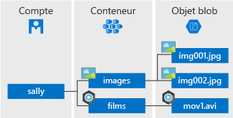

# <a name="quickstart-azure-blob-storage-client-library-v12-for-net"></a>Démarrage rapide : Bibliothèque cliente Stockage Blob Azure v12 pour .NET

Bien démarrer avec la bibliothèque de client Stockage Blob Azure v12 pour .NET. Le stockage Blob Azure est la solution de stockage d’objet de Microsoft pour le cloud. Suivez les étapes pour installer le package et essayer l’exemple de code pour les tâches de base. Le stockage Blob est optimisé pour stocker de grandes quantités de données non structurées.

> [!NOTE]
> Pour une bonne prise en main de la version précédente du kit de développement logiciel (SDK), consultez [Démarrage rapide : Bibliothèque cliente Stockage Blob Azure pour .NET](storage-quickstart-blobs-dotnet-legacy.md).

Utilisez la bibliothèque cliente Stockage Blob Azure v12 pour .NET afin de :

* Créez un conteneur.
* Charger un blob dans le stockage Azure
* Lister tous les objets blob d’un conteneur
* Télécharger l’objet blob sur votre ordinateur local
* Supprimer un conteneur

[Documentation de référence sur l’API](/dotnet/api/azure.storage.blobs) | [Code source de la bibliothèque](https://github.com/Azure/azure-sdk-for-net/tree/master/sdk/storage/Azure.Storage.Blobs) | [Package (NuGet)](https://www.nuget.org/packages/Azure.Storage.Blobs) | [Exemples](https://docs.microsoft.com/azure/storage/common/storage-samples-dotnet?toc=%2fazure%2fstorage%2fblobs%2ftoc.json#blob-samples)

[!INCLUDE [storage-multi-protocol-access-preview](../../../includes/storage-multi-protocol-access-preview.md)]

## <a name="prerequisites"></a>Prérequis

* Abonnement Azure : [créez-en un gratuitement](https://azure.microsoft.com/free/)
* Compte de stockage Azure : [créez un compte de stockage](https://docs.microsoft.com/azure/storage/common/storage-quickstart-create-account)
* Dernière version du [Kit SDK .NET Core](https://dotnet.microsoft.com/download/dotnet-core) pour votre système d’exploitation. Veillez à disposer du Kit de développement logiciel (SDK), et non du runtime.

## <a name="setting-up"></a>Configuration

Cette section vous guide tout au long de la préparation d’un projet à utiliser avec la bibliothèque cliente Stockage Blob Azure v12 pour .NET.

### <a name="create-the-project"></a>Créer le projet

Créez une application .NET Core nommée *BlobQuickstartV12*.

1. Dans une fenêtre de console (par exemple cmd, PowerShell ou Bash), utilisez la commande `dotnet new` pour créer une application de console avec le nom *BlobQuickstartV12*. Cette commande crée un projet C# « Hello World » simple avec un seul fichier source : *Program.cs*.

   ```console
   dotnet new console -n BlobQuickstartV12
   ```

1. Basculez vers le répertoire *BlobQuickstartV12* nouvellement créé.

   ```console
   cd BlobQuickstartV12
   ```

1. Dans le répertoire *BlobQuickstartV12*, créez un autre répertoire appelé *data*. C’est là que les fichiers de données blob seront créés et stockés.

    ```console
    mkdir data
    ```

### <a name="install-the-package"></a>Installer le package

Alors que vous êtes toujours dans le répertoire de l’application, installez le package de la bibliothèque cliente Stockage Blob Azure pour .NET à l’aide de la commande `dotnet add package`.

```console
dotnet add package Azure.Storage.Blobs
```

### <a name="set-up-the-app-framework"></a>Configurer le framework d’application

À partir du répertoire de projet :

1. Ouvrez le fichier *Program.cs* dans votre éditeur.
1. Supprimez l'instruction `Console.WriteLine("Hello World!");`.
1. Ajoutez des directives `using`.
1. Mettez à jour la déclaration de méthode `Main` pour prendre en charge le code asynchrone

Voici le code :

```csharp
using Azure.Storage.Blobs;
using Azure.Storage.Blobs.Models;
using System;
using System.IO;
using System.Threading.Tasks;

namespace BlobQuickstartV12
{
    class Program
    {
        static async Task Main()
        {
        }
    }
}
```

[!INCLUDE [storage-quickstart-credentials-include](../../../includes/storage-quickstart-credentials-include.md)]

## <a name="object-model"></a>Modèle objet

Le Stockage Blob Azure est optimisé pour stocker de grandes quantités de données non structurées. Les données non structurées sont des données qui n’obéissent pas à un modèle ou une définition de données en particulier, comme des données texte ou binaires. Le stockage Blob offre trois types de ressources :

* Le compte de stockage
* Un conteneur dans le compte de stockage.
* Un blob dans le conteneur

Le diagramme suivant montre la relation entre ces ressources.



Utilisez les classes .NET suivantes pour interagir avec ces ressources :

* [BlobServiceClient](/dotnet/api/azure.storage.blobs.blobserviceclient): La classe `BlobServiceClient` vous permet de manipuler les ressources de stockage Azure et les conteneurs blob.
* [BlobContainerClient](/dotnet/api/azure.storage.blobs.blobcontainerclient) : La classe `BlobContainerClient` vous permet de manipuler des conteneurs de stockage Azure et leurs blobs.
* [BlobClient](/dotnet/api/azure.storage.blobs.blobclient) : La classe `BlobClient` vous permet de manipuler des blobs de stockage Azure.
* [BlobDownloadInfo](/dotnet/api/azure.storage.blobs.models.blobdownloadinfo) : La classe `BlobDownloadInfo` représente les propriétés et le contenu renvoyés par le téléchargement d’un objet Blob.

## <a name="code-examples"></a>Exemples de code

Ces exemples d’extraits de code vous montrent comment effectuer les opérations suivantes avec la bibliothèque cliente Stockage Blob Azure pour .NET :

* [Obtenir la chaîne de connexion](#get-the-connection-string)
* [Créer un conteneur](#create-a-container)
* [Charger des objets blob sur un conteneur](#upload-blobs-to-a-container)
* [Lister les objets blob d’un conteneur](#list-the-blobs-in-a-container)
* [Télécharger des objets blob](#download-blobs)
* [Supprimer un conteneur](#delete-a-container)

### <a name="get-the-connection-string"></a>Obtenir la chaîne de connexion

Le code ci-dessous récupère la chaîne de connexion pour le compte de stockage à partir de la variable d’environnement créée dans la section [Configurer votre chaîne de connexion de stockage](#configure-your-storage-connection-string).

Ajoutez ce code dans la méthode `Main` :

```csharp
Console.WriteLine("Azure Blob storage v12 - .NET quickstart sample\n");

// Retrieve the connection string for use with the application. The storage
// connection string is stored in an environment variable on the machine
// running the application called AZURE_STORAGE_CONNECTION_STRING. If the
// environment variable is created after the application is launched in a
// console or with Visual Studio, the shell or application needs to be closed
// and reloaded to take the environment variable into account.
string connectionString = Environment.GetEnvironmentVariable("AZURE_STORAGE_CONNECTION_STRING");
```

### <a name="create-a-container"></a>Créez un conteneur.

Choisissez un nom pour le nouveau conteneur. Le code ci-dessous ajoute une valeur GUID au nom du conteneur pour s’assurer qu’il est unique.

> [!IMPORTANT]
> Les noms de conteneurs doivent être en minuscules. Pour plus d’informations sur l’affectation de noms aux conteneurs et objets blob, consultez [Affectation de noms et références aux conteneurs, objets blob et métadonnées](/rest/api/storageservices/naming-and-referencing-containers--blobs--and-metadata).

Création d’une instance de la classe [BlobServiceClient](/dotnet/api/azure.storage.blobs.blobserviceclient). Ensuite, appelez la méthode [CreateBlobContainerAsync](/dotnet/api/azure.storage.blobs.blobserviceclient.createblobcontainerasync) pour créer le conteneur dans votre compte de stockage.

Ajoutez ce code à la fin de la méthode `Main` :

```csharp
// Create a BlobServiceClient object which will be used to create a container client
BlobServiceClient blobServiceClient = new BlobServiceClient(connectionString);

//Create a unique name for the container
string containerName = "quickstartblobs" + Guid.NewGuid().ToString();

// Create the container and return a container client object
BlobContainerClient containerClient = await blobServiceClient.CreateBlobContainerAsync(containerName);
```

### <a name="upload-blobs-to-a-container"></a>Charger des objets blob sur un conteneur

L’extrait de code suivant :

1. Crée un fichier texte dans le répertoire *data* local.
1. Obtient une référence à un objet [BlobClient](/dotnet/api/azure.storage.blobs.blobclient) en appelant la méthode [GetBlobClient](/dotnet/api/azure.storage.blobs.blobcontainerclient.getblobclient) sur le conteneur à partir de la section [Créer un conteneur](#create-a-container).
1. Charge le fichier texte local dans l’objet Blob en appelant la méthode [UploadAsync](/dotnet/api/azure.storage.blobs.blobclient.uploadasync#Azure_Storage_Blobs_BlobClient_UploadAsync_System_IO_Stream_System_Boolean_System_Threading_CancellationToken_). Cette méthode crée l’objet blob s’il n’existe pas déjà, et le remplace s’il existe.

Ajoutez ce code à la fin de la méthode `Main` :

```csharp
// Create a local file in the ./data/ directory for uploading and downloading
string localPath = "./data/";
string fileName = "quickstart" + Guid.NewGuid().ToString() + ".txt";
string localFilePath = Path.Combine(localPath, fileName);

// Write text to the file
await File.WriteAllTextAsync(localFilePath, "Hello, World!");

// Get a reference to a blob
BlobClient blobClient = containerClient.GetBlobClient(fileName);

Console.WriteLine("Uploading to Blob storage as blob:\n\t {0}\n", blobClient.Uri);

// Open the file and upload its data
using FileStream uploadFileStream = File.OpenRead(localFilePath);
await blobClient.UploadAsync(uploadFileStream, true);
uploadFileStream.Close();
```

### <a name="list-the-blobs-in-a-container"></a>Créer la liste des objets blob d’un conteneur

Répertoriez les objets Blob dans le conteneur en appelant la méthode [GetBlobsAsync](/dotnet/api/azure.storage.blobs.blobcontainerclient.getblobsasync). Dans ce cas, un seul objet blob a été ajouté au conteneur. Il n’y a donc qu’un objet blob répertorié.

Ajoutez ce code à la fin de la méthode `Main` :

```csharp
Console.WriteLine("Listing blobs...");

// List all blobs in the container
await foreach (BlobItem blobItem in containerClient.GetBlobsAsync())
{
    Console.WriteLine("\t" + blobItem.Name);
}
```

### <a name="download-blobs"></a>Télécharger des objets blob

Téléchargez l’objet Blob créé précédemment en appelant la méthode [DownloadAsync](/dotnet/api/azure.storage.blobs.specialized.blobbaseclient.downloadasync). L’exemple de code ajoute le suffixe « DOWNLOADED » au nom de fichier afin que vous puissiez voir les deux fichiers dans votre système de fichiers local.

Ajoutez ce code à la fin de la méthode `Main` :

```csharp
// Download the blob to a local file
// Append the string "DOWNLOAD" before the .txt extension 
// so you can compare the files in the data directory
string downloadFilePath = localFilePath.Replace(".txt", "DOWNLOAD.txt");

Console.WriteLine("\nDownloading blob to\n\t{0}\n", downloadFilePath);

// Download the blob's contents and save it to a file
BlobDownloadInfo download = await blobClient.DownloadAsync();

using FileStream downloadFileStream = File.OpenWrite(downloadFilePath);
await download.Content.CopyToAsync(downloadFileStream);
downloadFileStream.Close();
```

### <a name="delete-a-container"></a>Supprimer un conteneur

Le code suivant nettoie les ressources créées par l’application en supprimant l’ensemble du conteneur avec [DeleteAsync](/dotnet/api/microsoft.azure.storage.blob.cloudblobcontainer.deleteasync). Il supprime également les fichiers locaux créés par l’application.

L’application s’interrompt pour une entrée de l’utilisateur en appelant `Console.ReadLine` avant de supprimer l’objet blob, le conteneur et les fichiers locaux. C’est l’occasion de vérifier que les ressources ont bien été créées avant d’être supprimées.

Ajoutez ce code à la fin de la méthode `Main` :

```csharp
// Clean up
Console.Write("Press any key to begin clean up");
Console.ReadLine();

Console.WriteLine("Deleting blob container...");
await containerClient.DeleteAsync();

Console.WriteLine("Deleting the local source and downloaded files...");
File.Delete(localFilePath);
File.Delete(downloadFilePath);

Console.WriteLine("Done");
```

## <a name="run-the-code"></a>Exécuter le code

Cette application crée un fichier de test dans votre dossier local *data* et le charge sur Stockage Blob. L’exemple liste ensuite les objets blob du conteneur et télécharge le fichier avec un nouveau nom pour que vous puissiez comparer les deux fichiers.

Accédez au répertoire de l’application, puis générez et exécutez l’application.

```console
dotnet build
```

```console
dotnet run
```

La sortie de l’application ressemble à l’exemple suivant :

```output
Azure Blob storage v12 - .NET quickstart sample

Uploading to Blob storage as blob:
         https://mystorageacct.blob.core.windows.net/quickstartblobs60c70d78-8d93-43ae-954d-8322058cfd64/quickstart2fe6c5b4-7918-46cb-96f4-8c4c5cb2fd31.txt

Listing blobs...
        quickstart2fe6c5b4-7918-46cb-96f4-8c4c5cb2fd31.txt

Downloading blob to
        ./data/quickstart2fe6c5b4-7918-46cb-96f4-8c4c5cb2fd31DOWNLOADED.txt

Press any key to begin clean up
Deleting blob container...
Deleting the local source and downloaded files...
Done
```

Avant de commencer le processus de nettoyage, vérifiez la présence des deux fichiers dans votre dossier *data*. Vous pouvez les ouvrir et constater qu’ils sont identiques.

Une fois les fichiers vérifiés, appuyez sur **Entrée** pour supprimer les fichiers de test et terminer la démonstration.

## <a name="next-steps"></a>Étapes suivantes

Dans ce démarrage rapide, vous avez appris à charger, télécharger et répertorier des objets blob avec .NET.

Pour afficher des exemples d’applications de stockage blob, passez à :

> [!div class="nextstepaction"]
> [Exemples .NET du kit de développement logiciel (SDK) du stockage d’objets Blob Azure v12](https://github.com/Azure/azure-sdk-for-net/tree/master/sdk/storage/Azure.Storage.Blobs/samples)

* Pour obtenir des didacticiels, des exemples, des démarrages rapides et d’autres documents, visitez [Azure pour les développeurs .NET et .NET Core](/dotnet/azure/).
* Pour en savoir plus sur .NET Core, consultez [Prise en main de .NET en 10 minutes](https://www.microsoft.com/net/learn/get-started/).
