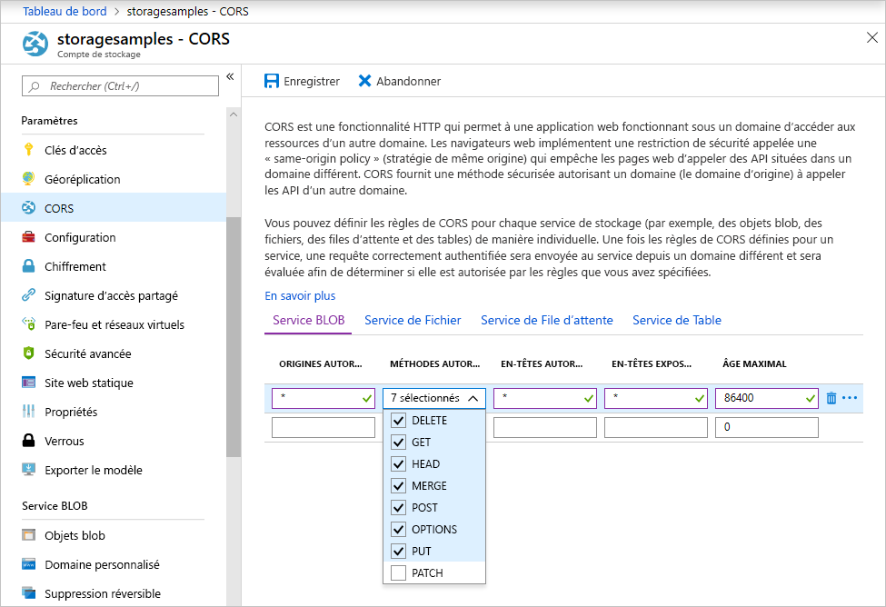

<!-- Customer intent: As a web application developer I want to interface with Azure Blob storage entirely on the client so that I can build a SPA application that is able to upload and delete files on blob storage. -->

# <a name="quickstart-manage-blobs-with-javascript-v10-sdk-in-browser"></a>Démarrage rapide : Gérer les objets blob avec le SDK JavaScript v10 dans le navigateur

Dans ce guide de démarrage rapide, vous découvrez comment gérer des objets blob avec du code JavaScript exécuté entièrement dans le navigateur. Les objets blob sont des objets pouvant contenir de grandes quantités de texte ou de données binaires, notamment des images, des documents, des médias en streaming et des données d’archive. Vous utiliserez des mesures de sécurité nécessaires pour sécuriser l’accès à votre compte de stockage Blob.

> [!NOTE]
> Ce guide de démarrage rapide utilise une version héritée de la bibliothèque de client Stockage Blob Azure. Pour démarrer avec la dernière version, consultez [Démarrage rapide : Gérer les objets blob avec le SDK JavaScript v12 dans un navigateur](quickstart-blobs-javascript-browser.md).

## <a name="prerequisites"></a>Prérequis

- Compte Azure avec un abonnement actif. [Créez un compte gratuitement](https://azure.microsoft.com/free/?ref=microsoft.com&utm_source=microsoft.com&utm_medium=docs&utm_campaign=visualstudio).
- Un compte de stockage Azure. [Créer un compte de stockage](../common/storage-account-create.md).
- Un serveur web local. Cet article utilise [Node.js](https://nodejs.org) pour ouvrir un serveur de base.
- [Visual Studio Code](https://code.visualstudio.com).
- Une extension de VS Code pour le débogage de navigateur, par exemple [Débogueur pour chrome](https://marketplace.visualstudio.com/items?itemName=msjsdiag.debugger-for-chrome) ou [Débogueur pour Microsoft Edge](https://marketplace.visualstudio.com/items?itemName=msjsdiag.debugger-for-edge).

## <a name="setting-up-storage-account-cors-rules"></a>Configuration des règles CORS du compte de stockage

Avant que votre application web puisse accéder à un stockage Blob à partir du client, vous devez configurer votre compte pour activer le [partage de ressources cross-origin](https://docs.microsoft.com/rest/api/storageservices/cross-origin-resource-sharing--cors--support-for-the-azure-storage-services), ou CORS.

Revenez au portail Azure et sélectionnez votre compte de stockage. Pour définir une nouvelle règle CORS, accédez à la section **Paramètres**, puis cliquez sur le lien **CORS**. Ensuite, cliquez sur le bouton **Ajouter** pour ouvrir la fenêtre **Ajouter une règle CORS**. Pour ce démarrage rapide, vous créez une règle CORS ouverte :



Le tableau suivant décrit chaque paramètre CORS et explique les valeurs utilisées pour définir la règle.

|Paramètre  |Value  | Description |
|---------|---------|---------|
| Origines autorisées | * | Accepte une liste délimitée par des virgules de domaines définis comme origines acceptables. La configuration de la valeur sur `*` autorise tous les domaines à accéder au compte de stockage. |
| Méthodes autorisées     | delete, get, head, merge, post, options et put | Répertorie les verbes HTTP autorisés à s’exécuter sur le compte de stockage. Dans le cadre de ce démarrage rapide, sélectionnez toutes les options disponibles. |
| En-têtes autorisés | * | Définit la liste des en-têtes de requête (y compris les en-têtes avec préfixe) autorisés par le compte de stockage. La configuration de la valeur sur `*` permet l’accès à tous les en-têtes. |
| En-têtes exposés | * | Répertorie les en-têtes de réponse autorisés par le compte. La configuration de la valeur sur `*` permet au compte d’envoyer n’importe quel en-tête.  |
| Âge maximal (secondes) | 86400 | La durée maximale de mise en cache de la requête OPTIONS préliminaire par le navigateur. La valeur *86400* autorise le cache pendant une journée entière. |

> [!IMPORTANT]
> Assurez-vous que les paramètres que vous utilisez en production exposent la quantité minimale d’accès nécessaire à votre compte de stockage pour conserver un accès sécurisé. Les paramètres CORS décrits ici sont adaptés à un démarrage rapide, car ils définissent une stratégie de sécurité modérée. Toutefois, ces paramètres ne sont pas recommandés dans une situation réelle.

Vous utilisez ensuite Azure Cloud Shell pour créer un jeton de sécurité.

[!INCLUDE [Open the Azure cloud shell](../../../includes/cloud-shell-try-it.md)]

## <a name="create-a-shared-access-signature"></a>Créer une signature d’accès partagé

La signature d’accès partagé (SAP) est utilisée par le code en cours d’exécution dans le navigateur pour autoriser les requêtes de stockage d’objets BLOB. À l’aide de la SAP, le client peut autoriser l’accès aux ressources de stockage sans disposer de la clé d'accès ou de la chaîne de connexion du compte. Pour plus d’informations sur la SAP, consultez [Utiliser des signatures d’accès partagé (SAP)](../common/storage-sas-overview.md).

Vous pouvez créer une SAS à l’aide de l’interface Azure CLI via Azure Cloud Shell ou avec le portail Azure ou l’Explorateur Stockage Azure. Le tableau suivant décrit les paramètres que vous devez configurer pour les valeurs afin de générer une SAS à l’aide de l’interface CLI.

| Paramètre      |Description  | Espace réservé |
|----------------|-------------|-------------|
| *expiry*       | La date d’expiration du jeton d’accès au format AAAA-MM-JJ. Entrez la date du lendemain pour une utilisation avec ce démarrage rapide. | *FUTURE_DATE* |
| *account-name* | nom du compte de stockage. Utilisez le nom réservé dans une étape antérieure. | *YOUR_STORAGE_ACCOUNT_NAME* |
| *account-key*  | La clé du compte de stockage. Utilisez la clé mise de côté dans une étape antérieure. | *YOUR_STORAGE_ACCOUNT_KEY* |

Utilisez la commande CLI suivante, avec des valeurs réelles pour chaque espace réservé, afin de générer une SAS que vous pouvez utiliser dans votre code JavaScript.

```azurecli-interactive
az storage account generate-sas \
  --permissions racwdl \
  --resource-types sco \
  --services b \
  --expiry FUTURE_DATE \
  --account-name YOUR_STORAGE_ACCOUNT_NAME \
  --account-key YOUR_STORAGE_ACCOUNT_KEY
```

Vous trouverez peut-être la série de valeurs après chaque paramètre un peu difficile à déchiffrer. Ces valeurs de paramètre proviennent de la première lettre de leur autorisation respective. Le tableau suivant explique d’où proviennent les valeurs :

| Paramètre        | Valeur   | Description  |
|------------------|---------|---------|
| *autorisations*    | racwdl  | Cette SAP permet de *lire*, d’*ajouter*, de *créer*, d’*écrire*, de *supprimer* et de *répertorier* les fonctionnalités. |
| *resource-types* | sco     | Les ressources affectées par la SAP sont *service*, *conteneur* et *objet*. |
| *services*       | b       | Le service affecté par la SAP est le service d’*objets BLOB*. |

Maintenant que la SAS est générée, copiez la valeur de retour et enregistrez-la quelque part pour une utilisation dans une prochaine étape. Si vous avez généré votre SAS à l’aide d’une méthode autre que l’interface Azure CLI, vous devrez supprimer le `?` initial, s’il est présent. Ce caractère est un séparateur d’URL qui est déjà fourni dans le modèle d’URL plus loin dans cette rubrique où la SAS est utilisée.

> [!IMPORTANT]
> En production, transférez toujours les jetons SAS à l’aide de TLS. En outre, les jetons SAP doivent être générés sur le serveur et envoyés à la page HTML afin d’être transférés au stockage Blob Azure. Vous pouvez envisager d’utiliser une fonction sans serveur pour générer des jetons SAP. Le portail Azure inclut des modèles de fonction qui offrent la possibilité de générer une SAP avec une fonction JavaScript.

## <a name="implement-the-html-page"></a>Mettre en œuvre la page HTML

Dans cette section, vous allez créer une page web de base et configurer Visual Studio Code pour lancer et déboguer la page. Toutefois, avant de procéder au lancement, vous devez utiliser Node.js pour démarrer un serveur web local et présenter la page lorsque votre navigateur la demande. Ensuite, vous ajouterez du code JavaScript pour appeler diverses API de stockage Blob et afficher les résultats dans la page. Vous pouvez également voir les résultats de ces appels dans le [portail Azure](https://portal.azure.com), [l’Explorateur Stockage Azure](https://azure.microsoft.com/features/storage-explorer) et [l’extension Stockage Azure](https://marketplace.visualstudio.com/items?itemName=ms-azuretools.vscode-azurestorage) pour Visual Studio Code.

### <a name="set-up-the-web-application"></a>Configurer l’application Web

Tout d’abord, créez un dossier nommé *azure-blobs-javascript* et ouvrez-le dans Visual Studio Code. Créez ensuite un fichier dans Visual Studio Code, ajoutez le code HTML suivant, puis enregistrez-le sous le nom *index.html* dans le dossier *azure-blobs-javascript*.

```html
<!DOCTYPE html>
<html>

<body>
    <button id="create-container-button">Create container</button>
    <button id="delete-container-button">Delete container</button>
    <button id="select-button">Select and upload files</button>
    <input type="file" id="file-input" multiple style="display: none;" />
    <button id="list-button">List files</button>
    <button id="delete-button">Delete selected files</button>
    <p><b>Status:</b></p>
    <p id="status" style="height:160px; width: 593px; overflow: scroll;" />
    <p><b>Files:</b></p>
    <select id="file-list" multiple style="height:222px; width: 593px; overflow: scroll;" />
</body>

<!-- You'll add code here later in this quickstart. -->

</html>
```

### <a name="configure-the-debugger"></a>Configurer le débogueur

Pour configurer l’extension du débogueur dans Visual Studio Code, sélectionnez **Déboguer > Ajouter une configuration...** , puis sélectionnez **Chrome** ou **Edge**, selon l’extension que vous avez installée précédemment dans la section Prérequis. Cette action crée un fichier *launch.json* et l’ouvre dans l’éditeur.

Ensuite, modifiez le fichier *launch.json* afin que la valeur `url` inclut `/index.html` comme indiqué :

```json
{
    // Use IntelliSense to learn about possible attributes.
    // Hover to view descriptions of existing attributes.
    // For more information, visit: https://go.microsoft.com/fwlink/?linkid=830387
    "version": "0.2.0",
    "configurations": [
        {
            "type": "chrome",
            "request": "launch",
            "name": "Launch Chrome against localhost",
            "url": "http://localhost:8080/index.html",
            "webRoot": "${workspaceFolder}"
        }
    ]
}
```

Cette configuration indique à Visual Studio Code quel est le navigateur à lancer et quelle est l’URL à charger.

### <a name="launch-the-web-server"></a>Lancer le serveur web

Pour lancer le serveur web Node.js local, sélectionnez **Affichage > Terminal** pour ouvrir une fenêtre de console dans Visual Studio Code, puis entrez la commande suivante.

```console
npx http-server
```

Cette commande installe le package *http-server* et lance le serveur, rendant le dossier actif disponible via les URL par défaut, notamment celle indiquée dans l’étape précédente.

### <a name="start-debugging"></a>Démarrer le débogage

Pour lancer *index.html* dans le navigateur avec le débogueur Visual Studio Code attaché, sélectionnez **Déboguer > Démarrer le débogage** ou appuyez sur F5 dans Visual Studio Code.

L’interface utilisateur affichée ne fait rien pour le moment, mais vous allez ajouter du code JavaScript dans la section suivante pour implémenter chaque fonction indiquée. Vous pouvez ensuite définir des points d’arrêt et interagir avec le débogueur lorsqu’il s’est interrompu sur votre code.

Lorsque vous apportez des modifications à *index.html*, veillez à recharger la page pour voir les modifications dans le navigateur. Dans Visual Studio Code, vous pouvez également sélectionner **Déboguer > Redémarrer le débogage** ou appuyez sur CTRL + MAJ + F5.

### <a name="add-the-blob-storage-client-library"></a>Ajouter la bibliothèque cliente de stockage Blob

Pour activer les appels vers l’API de Stockage Blob, commencez par [télécharger le kit SDK Stockage Azure pour JavaScript – Bibliothèque de client Blob](https://aka.ms/downloadazurestoragejsblob), extrayez le contenu du fichier zip et placez le fichier *azure-storage-blob.js* dans le dossier *azure-blobs-javascript*.

Ensuite, collez le code HTML suivant dans *index.html* après la balise de fermeture `</body>`, en remplaçant le commentaire de l’espace réservé.

```html
<script src="azure-storage-blob.js" charset="utf-8"></script>

<script>
// You'll add code here in the following sections.
</script>
```

Ce code ajoute une référence au fichier de script et fournit un emplacement pour votre propre code JavaScript. Dans le cadre de ce démarrage rapide, nous utilisons le fichier de script *azure-storage-blob.js* afin que vous puissiez l’ouvrir dans VS Code, lire son contenu et définir des points d’arrêt. En production, vous devez utiliser le fichier *azure-storage.blob.min.js* plus compact, également fourni dans le fichier zip.

Vous trouverez plus d’informations sur chaque fonction de stockage Blob dans la [documentation de référence](https://docs.microsoft.com/javascript/api/%40azure/storage-blob/index). Notez que certaines des fonctions dans le SDK sont uniquement disponibles dans Node.js ou uniquement disponibles dans le navigateur.

Le code présent dans *azure-storage.blob.js* exporte une variable globale nommée `azblob`, que vous utiliserez dans votre code JavaScript pour accéder aux API de Stockage Blob.

### <a name="add-the-initial-javascript-code"></a>Ajouter le code JavaScript initial

Ensuite, collez le code suivant dans l’élément `<script>` présenté dans le bloc de code précédent, en remplaçant le commentaire de l’espace réservé.

```javascript
const createContainerButton = document.getElementById("create-container-button");
const deleteContainerButton = document.getElementById("delete-container-button");
const selectButton = document.getElementById("select-button");
const fileInput = document.getElementById("file-input");
const listButton = document.getElementById("list-button");
const deleteButton = document.getElementById("delete-button");
const status = document.getElementById("status");
const fileList = document.getElementById("file-list");

const reportStatus = message => {
    status.innerHTML += `${message}<br/>`;
    status.scrollTop = status.scrollHeight;
}
```

Ce code crée des champs pour chaque élément HTML que le code suivant utilisera, et implémente une fonction `reportStatus` pour afficher la sortie.

Dans les sections suivantes, ajoutez chaque nouveau bloc de code JavaScript après le bloc précédent.

### <a name="add-your-storage-account-info"></a>Ajouter vos informations de compte de stockage

Ensuite, ajoutez du code pour accéder à votre compte de stockage, en remplaçant les espaces réservés par le nom de votre compte et la SAS que vous avez créée dans une étape précédente.

```javascript
const accountName = "<Add your storage account name>";
const sasString = "<Add the SAS you generated earlier>";
const containerName = "testcontainer";
const containerURL = new azblob.ContainerURL(
    `https://${accountName}.blob.core.windows.net/${containerName}?${sasString}`,
    azblob.StorageURL.newPipeline(new azblob.AnonymousCredential));
```

Ce code utilise les informations de votre compte et la SAS pour créer une instance [ContainerURL](https://docs.microsoft.com/javascript/api/@azure/storage-blob/ContainerURL), qui est utile pour créer et manipuler un conteneur de stockage.

### <a name="create-and-delete-a-storage-container"></a>Créer et supprimer un conteneur de stockage

Ensuite, ajoutez du code pour créer et supprimer le conteneur de stockage lorsque vous appuyez sur le bouton correspondant.

```javascript
const createContainer = async () => {
    try {
        reportStatus(`Creating container "${containerName}"...`);
        await containerURL.create(azblob.Aborter.none);
        reportStatus(`Done.`);
    } catch (error) {
        reportStatus(error.body.message);
    }
};

const deleteContainer = async () => {
    try {
        reportStatus(`Deleting container "${containerName}"...`);
        await containerURL.delete(azblob.Aborter.none);
        reportStatus(`Done.`);
    } catch (error) {
        reportStatus(error.body.message);
    }
};

createContainerButton.addEventListener("click", createContainer);
deleteContainerButton.addEventListener("click", deleteContainer);
```

Ce code appelle les fonctions [create](https://docs.microsoft.com/javascript/api/@azure/storage-blob/containerclient#create-containercreateoptions-) et [delete](https://docs.microsoft.com/javascript/api/@azure/storage-blob/containerclient#delete-containerdeletemethodoptions-) de ContainerURL sans utiliser une instance [Aborter](https://docs.microsoft.com/javascript/api/@azure/storage-blob/aborter). Pour simplifier les choses dans ce démarrage rapide, ce code suppose que votre compte de stockage a été créé et qu’il est activé. Dans le code de production, utilisez une instance Aborter pour ajouter une fonctionnalité de délai d’expiration.

### <a name="list-blobs"></a>Liste des objets blob

Ensuite, ajoutez du code pour répertorier le contenu du conteneur de stockage lorsque vous appuyez sur le bouton **Répertorier les fichiers**.

```javascript
const listFiles = async () => {
    fileList.size = 0;
    fileList.innerHTML = "";
    try {
        reportStatus("Retrieving file list...");
        let marker = undefined;
        do {
            const listBlobsResponse = await containerURL.listBlobFlatSegment(
                azblob.Aborter.none, marker);
            marker = listBlobsResponse.nextMarker;
            const items = listBlobsResponse.segment.blobItems;
            for (const blob of items) {
                fileList.size += 1;
                fileList.innerHTML += `<option>${blob.name}</option>`;
            }
        } while (marker);
        if (fileList.size > 0) {
            reportStatus("Done.");
        } else {
            reportStatus("The container does not contain any files.");
        }
    } catch (error) {
        reportStatus(error.body.message);
    }
};

listButton.addEventListener("click", listFiles);
```

Ce code appelle la fonction [ContainerURL.listBlobFlatSegment](https://docs.microsoft.com/javascript/api/@azure/storage-blob/containerclient#listblobsflat-containerlistblobsoptions-) dans une boucle afin de garantir que tous les segments sont récupérés. Pour chaque segment, il effectue une itération sur la liste des éléments blob qu’il contient et met à jour la liste **Fichiers**.

### <a name="upload-blobs"></a>Charger des objets blob

Ensuite, ajoutez du code pour charger des fichiers dans le conteneur de stockage lorsque vous appuyez sur le bouton **Sélectionner et charger des fichiers**.

```javascript
const uploadFiles = async () => {
    try {
        reportStatus("Uploading files...");
        const promises = [];
        for (const file of fileInput.files) {
            const blockBlobURL = azblob.BlockBlobURL.fromContainerURL(containerURL, file.name);
            promises.push(azblob.uploadBrowserDataToBlockBlob(
                azblob.Aborter.none, file, blockBlobURL));
        }
        await Promise.all(promises);
        reportStatus("Done.");
        listFiles();
    } catch (error) {
        reportStatus(error.body.message);
    }
}

selectButton.addEventListener("click", () => fileInput.click());
fileInput.addEventListener("change", uploadFiles);
```

Ce code connecte le bouton **Sélectionner et charger des fichiers** à l’élément `file-input` masqué. De cette façon, l’événement `click` de bouton déclenche l’événement `click` de l’entrée de fichier et affiche le sélecteur de fichiers. Une fois que vous sélectionnez les fichiers et fermé la boîte de dialogue, l’événement `input` se produit et la fonction `uploadFiles` est appelée. Cette fonction appelle la fonction [uploadBrowserDataToBlockBlob](https://docs.microsoft.com/javascript/api/@azure/storage-blob/blockblobclient#uploadbrowserdata-blob---arraybuffer---arraybufferview--blockblobparalleluploadoptions-) de navigateur uniquement pour chaque fichier que vous avez sélectionné. Chaque appel retourne une Promesse qui est ajoutée à une liste afin de toutes les attendre en même temps, entraînant le chargement des fichiers en parallèle.

### <a name="delete-blobs"></a>Suppression d’objets blob

Ensuite, ajoutez du code pour supprimer des fichiers du conteneur de stockage lorsque vous appuyez sur le bouton **Supprimer les fichiers sélectionnés**.

```javascript
const deleteFiles = async () => {
    try {
        if (fileList.selectedOptions.length > 0) {
            reportStatus("Deleting files...");
            for (const option of fileList.selectedOptions) {
                const blobURL = azblob.BlobURL.fromContainerURL(containerURL, option.text);
                await blobURL.delete(azblob.Aborter.none);
            }
            reportStatus("Done.");
            listFiles();
        } else {
            reportStatus("No files selected.");
        }
    } catch (error) {
        reportStatus(error.body.message);
    }
};

deleteButton.addEventListener("click", deleteFiles);
```

Ce code appelle la fonction [BlobURL.delete](https://docs.microsoft.com/javascript/api/@azure/storage-blob/BlobURL#delete-aborter--iblobdeleteoptions-) pour supprimer chaque fichier sélectionné dans la liste. Il appelle ensuite la fonction `listFiles` présentée précédemment pour actualiser le contenu de la liste **Fichiers**.

### <a name="run-and-test-the-web-application"></a>Exécuter et tester l’application web

À ce stade, vous pouvez lancer la page et vous faire une idée sur la manière dont le stockage Blob fonctionne. Si des erreurs se produisent (par exemple, lorsque vous tentez de répertorier les fichiers avant d’avoir créé le conteneur), le volet **État** affiche le message d’erreur reçu. Vous pouvez également définir des points d’arrêt dans le code JavaScript pour examiner les valeurs retournées par les API de stockage.

## <a name="clean-up-resources"></a>Nettoyer les ressources

Pour nettoyer les ressources créées durant ce démarrage rapide, accédez au [portail Azure](https://portal.azure.com) et supprimez le groupe de ressources que vous avez créé dans la section Prérequis.

## <a name="next-steps"></a>Étapes suivantes

Dans ce démarrage rapide, vous avez créé un site web simple qui accède au stockage Blob à partir de code JavaScript basé sur navigateur. Pour savoir comment vous pouvez héberger un site web dans le stockage Blob, passez au tutoriel suivant :

> [!div class="nextstepaction"]
> [Héberger un site web statique dans le stockage Blob](https://docs.microsoft.com/azure/storage/blobs/storage-blob-static-website-host)
