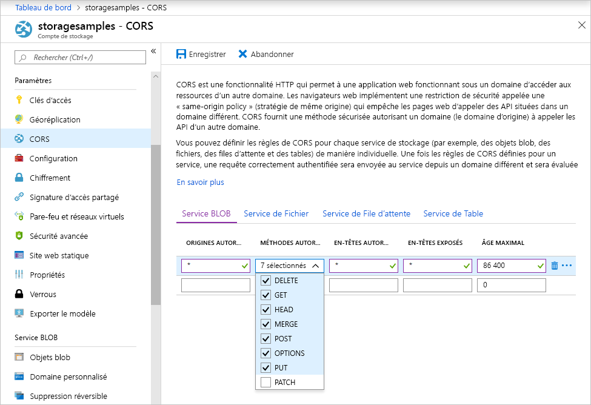

<!-- Customer intent: As a web application developer I want to interface with Azure Blob storage entirely on the client so that I can build a SPA application that is able to upload and delete files on blob storage. -->

# <a name="quickstart-upload-list-and-delete-blobs-using-javascripthtml-in-the-browser"></a>Démarrage rapide : Charger, lister et supprimer des objets blob à l’aide de JavaScript/HTML dans le navigateur

Ce guide de démarrage rapide explique comment gérer des objets blob à partir d’un code s’exécutant entièrement dans le navigateur. L’approche utilisée ici montre comment utiliser des mesures de sécurité requises pour sécuriser l’accès à votre compte de stockage Blob. Pour suivre ce guide de démarrage rapide, vous devez disposer d’un [abonnement Azure](https://azure.microsoft.com/free/?WT.mc_id=A261C142F).

## <a name="prerequisites"></a>Prérequis

[!INCLUDE [storage-quickstart-prereq-include](../../../includes/storage-quickstart-prereq-include.md)]

## <a name="setting-up-storage-account-cors-rules"></a>Configuration des règles CORS du compte de stockage 
Avant que votre application Web puisse accéder à un stockage d’objets BLOB à partir du client, le compte doit être configuré pour activer le [partage des ressources cross-origin](https://docs.microsoft.com/rest/api/storageservices/cross-origin-resource-sharing--cors--support-for-the-azure-storage-services), ou CORS. 

Revenez au portail Azure et sélectionnez votre compte de stockage. Pour définir une nouvelle règle CORS, revenez à la section **Paramètres**, puis cliquez sur le lien **CORS**. Ensuite, cliquez sur le bouton **Ajouter** pour ouvrir la fenêtre **Ajouter une règle CORS**. Pour ce démarrage rapide, vous créez une règle CORS ouverte :



Le tableau suivant décrit chaque paramètre CORS et explique les valeurs utilisées pour définir la règle.

|Paramètre  |Valeur  | Description |
|---------|---------|---------|
| Origines autorisées | * | Accepte une liste délimitée par des virgules de domaines définis comme origines acceptables. La configuration de la valeur sur `*` autorise tous les domaines à accéder au compte de stockage. |
| Verbes autorisés     | delete, get, head, merge, post, options et put | Répertorie les verbes HTTP autorisés à s’exécuter sur le compte de stockage. Dans le cadre de ce démarrage rapide, sélectionnez toutes les options disponibles. |
| En-têtes autorisés | * | Définit la liste des en-têtes de requête (y compris les en-têtes avec préfixe) autorisés par le compte de stockage. La configuration de la valeur sur `*` permet l’accès à tous les en-têtes. |
| En-têtes exposés | * | Répertorie les en-têtes de réponse autorisés par le compte. La configuration de la valeur sur `*` permet au compte d’envoyer n’importe quel en-tête.  |
| Âge maximal (secondes) | 86400 | La durée maximale de mise en cache de la requête OPTIONS préliminaire par le navigateur. La valeur *86400* autorise le cache pendant une journée entière. |

> [!IMPORTANT]
> Assurez-vous que les paramètres que vous utilisez en production exposent la quantité minimale d’accès nécessaire à votre compte de stockage afin de conserver un accès sécurisé. Les paramètres CORS décrits ici sont adaptés à un démarrage rapide, car ils définissent une stratégie de sécurité modérée. Toutefois, ces paramètres ne sont pas recommandés dans une situation réelle.

Vous utilisez ensuite Azure Cloud Shell pour créer un jeton de sécurité.

[!INCLUDE [Open the Azure cloud shell](../../../includes/cloud-shell-try-it.md)]

## <a name="create-a-shared-access-signature"></a>Créer une signature d’accès partagé
La signature d’accès partagé (SAP) est utilisée par le code en cours d’exécution dans le navigateur pour autoriser les requêtes de stockage d’objets BLOB. À l’aide de la SAP, le client peut autoriser l’accès aux ressources de stockage sans disposer de la clé d'accès ou de la chaîne de connexion du compte. Pour plus d’informations sur la SAP, consultez [Utiliser des signatures d’accès partagé (SAP)](../common/storage-sas-overview.md).

Vous pouvez créer une SAP à l’aide de l’interface de ligne de commande Azure via Azure Cloud Shell ou de l’Explorateur Stockage Azure. Le tableau suivant décrit les paramètres que vous devez configurer pour les valeurs afin de générer une SAP à l’aide de l’interface de ligne de commande.

| Paramètre      |Description  | Placeholder |
|----------------|-------------|-------------|
| *expiry*       | La date d’expiration du jeton d’accès au format AAAA-MM-JJ. Entrez la date du lendemain pour une utilisation avec ce démarrage rapide. | *FUTURE_DATE* |
| *account-name* | nom du compte de stockage. Utilisez le nom réservé dans une étape antérieure. | *YOUR_STORAGE_ACCOUNT_NAME* |
| *account-key*  | La clé du compte de stockage. Utilisez la clé mise de côté dans une étape antérieure. | *YOUR_STORAGE_ACCOUNT_KEY* |

Le script suivant a utilisé l’interface de ligne de commande Azure pour créer une SAP que vous pouvez transférer à un service d’objets BLOB JavaScript.

> [!NOTE]
> Pour obtenir de meilleurs résultats, supprimez les espaces superflus entre les paramètres avant de coller la commande dans Azure Cloud Shell.

```bash
az storage account generate-sas
                    --permissions racwdl
                    --resource-types sco
                    --services b
                    --expiry FUTURE_DATE
                    --account-name YOUR_STORAGE_ACCOUNT_NAME
                    --account-key YOUR_STORAGE_ACCOUNT_KEY
```
Vous trouverez peut-être la série de valeurs après chaque paramètre un peu difficile à déchiffrer. Ces valeurs de paramètre proviennent de la première lettre de leur autorisation respective. Le tableau suivant explique d’où proviennent les valeurs : 

| Paramètre        | Valeur   | Description  |
|------------------|---------|---------|
| *autorisations*    | racwdl  | Cette SAP permet de *lire*, d’*ajouter*, de *créer*, d’*écrire*, de *supprimer* et de *répertorier* les fonctionnalités. |
| *resource-types* | sco     | Les ressources affectées par la SAP sont *service*, *conteneur* et *objet*. |
| *services*       | b       | Le service affecté par la SAP est le service d’*objets BLOB*. |

Maintenant que la SAP est générée, copiez dans votre éditeur de texte la valeur renvoyée dans la console. Vous utiliserez cette valeur dans une prochaine étape.

> [!IMPORTANT]
> En production, transférez toujours les jetons SAP à l’aide de SSL. En outre, les jetons SAP doivent être générés sur le serveur et envoyés à la page HTML afin d’être transférés au stockage Blob Azure. Vous pouvez envisager d’utiliser une fonction sans serveur pour générer des jetons SAP. Le portail Azure inclut des modèles de fonction qui offrent la possibilité de générer une SAP avec une fonction JavaScript.

## <a name="implement-the-html-page"></a>Mettre en œuvre la page HTML

### <a name="set-up-the-web-application"></a>Configurer l’application Web
Les bibliothèques de client JavaScript de stockage Azure ne fonctionnent pas directement depuis le système de fichiers et doivent être pris en charge à partir d’un serveur Web. Par conséquent, les étapes suivantes décrivent en détail comment utiliser un serveur web local simple avec Node.js.

> [!NOTE]
> Cette section vous montre comment créer un serveur Web local. Vous devez pour cela avoir installé Node.js sur votre ordinateur. Si vous ne souhaitez pas installer Node.js, vous pouvez alors utiliser tout autre moyen permettant d’exécuter un serveur Web local.

Tout d’abord, créez un dossier pour votre projet et nommez-le *azure-blobs-javascript*. Ensuite, ouvrez une invite de commandes dans le dossier *azure-blobs-javascript* et préparez l’application pour installer le module du serveur Web en saisissant la commande suivante :

```bash
npm init -y
```
L’exécution d’*init* ajoute les fichiers nécessaires à l’installation d’un module de serveur Web. Pour installer le module, entrez la commande suivante :

```bash
npm i http-server
```
Modifiez ensuite le fichier *package.json* et remplacez la définition *scripts* existante par l’extrait de code suivant :

```javascript
"scripts": {
    "start": "http-server"
}
```
Enfin, dans votre invite de commandes, entrez `npm start` pour démarrer le serveur Web :

```bash
npm start
```

### <a name="get-the-blob-storage-client-library"></a>Obtenir la bibliothèque du client de stockage Blob
[Téléchargez les bibliothèques client JavaScript](https://aka.ms/downloadazurestoragejs), procédez à l’extraction des contenus du fichier zip et placez les fichiers de script issus du dossier *offre groupée* dans un dossier nommé *scripts*.

### <a name="add-the-client-script-reference-to-the-page"></a>Ajouter la référence de script client à la page
Créez une page HTML à la racine du dossier *azure-blobs-javascript* et nommez-la *index.html*. Une fois la page créée, ajoutez la balise suivante à la page.

```html
<!DOCTYPE html>
<html>
    <body>
        <button id="create-button">Create Container</button>

        <input type="file" id="fileinput" />
        <button id="upload-button">Upload</button>

        <button id="list-button">List</button>
        
        <button id="delete-button">Delete</button>
    </body>
    <script src="scripts/azure-storage.blob.min.js" charset="utf-8"></script>
    <script>
        // Blob-related code goes here
    </script>
</html>
```
Cette balise ajoute les éléments suivants à la page :

- une référence à *scripts/azure-storage.blob.js*
- des boutons permettant de créer un conteneur, de télécharger, de répertorier et de supprimer des objets BLOB
- un élément *ENTRÉE* utilisé pour télécharger un fichier
- un espace réservé pour le code spécifique au stockage

### <a name="create-an-instance-of-blobservice"></a>Créer une instance de service Blob 
[BlobService](https://azure.github.io/azure-storage-node/BlobService.html) fournit une interface pour le stockage Blob Azure. Pour créer une instance du service, vous devez fournir le nom du compte de stockage et la SAP générée au cours d’une étape précédente.

```javascript
const account = {
    name: YOUR_STORAGE_ACCOUNT_NAME,
    sas:  YOUR_SAS
};

const blobUri = 'https://' + account.name + '.blob.core.windows.net';
const blobService = AzureStorage.Blob.createBlobServiceWithSas(blobUri, account.sas);
```

### <a name="create-a-blob-container"></a>Création d’un conteneur d’objets blob
Une fois le service BLOB créé, vous pouvez désormais créer un conteneur pour stocker un objet blob téléchargé. La méthode [createContainerIfNotExists](https://azure.github.io/azure-storage-node/BlobService.html#createContainerIfNotExists__anchor) crée un conteneur et ne renvoie pas d’erreur si le conteneur existe déjà.

```javascript
document.getElementById('create-button').addEventListener('click', () => {

    blobService.createContainerIfNotExists('mycontainer',  (error, container) => {
        if (error) {
            // Handle create container error
        } else {
            console.log(container.name);
        }
    });

});
```

### <a name="upload-a-blob"></a>Charger un objet blob
Pour télécharger un objet blob depuis un formulaire HTML, vous devez obtenir une référence au fichier sélectionné à partir d’un élément *INPUT*. Le fichier sélectionné est disponible via le tableau `files` lorsque le *type* de l’élément est défini sur *fichier*.

À partir du script, vous pouvez faire référence à l’élément HTML et transmettre le fichier sélectionné au service BLOB.

```javascript
document.getElementById('upload-button').addEventListener('click', () => {

    const file = document.getElementById('fileinput').files[0];

    blobService.createBlockBlobFromBrowserFile('mycontainer', 
                                                file.name, 
                                                file, 
                                                (error, result) => {
                                                    if(error) {
                                                        // Handle blob error
                                                    } else {
                                                        console.log('Upload is successful');
                                                    }
                                                });

});
```

La méthode [createBlockBlobFromBrowserFile](https://azure.github.io/azure-storage-node/BlobService.html#createBlockBlobFromBrowserFile__anchor) utilise le fichier du navigateur directement pour télécharger sur un conteneur d’objets blob.

### <a name="list-blobs"></a>Liste des objets blob
Après avoir téléchargé un fichier sur le conteneur d’objets blob, vous accédez à la liste des objets blob dans le conteneur à l’aide de la méthode [listBlobsSegmented](https://azure.github.io/azure-storage-node/BlobService.html#listBlobsSegmented__anchor).

```javascript
document.getElementById('list-button').addEventListener('click', () => {

    blobService.listBlobsSegmented('mycontainer', null, (error, results) => {
        if (error) {
            // Handle list blobs error
        } else {
            results.entries.forEach(blob => {
                console.log(blob.name);
            });
        }
    });
    
});
```

La méthode *listBlobsSegmented* renvoie une collection d’objets blob. Par défaut, la collection contient 5 000 objets blob, mais vous pouvez modifier cette valeur en fonction de vos besoins. [L’exemple de sauvegarde consécutive](https://github.com/Azure/azure-storage-node/blob/master/examples/samples/continuationsample.js#L132) montre comment travailler avec un grand nombre d’objets blob et de quelle manière la bibliothèque de client prend en charge la pagination. 


### <a name="delete-blobs"></a>Suppression d’objets blob
Vous pouvez supprimer l’objet blob que vous avez téléchargé en appelant [deleteBlobIfExists](https://azure.github.io/azure-storage-node/BlobService.html#deleteBlobIfExists__anchor).

```javascript
document.getElementById('delete-button').addEventListener('click', () => {

    var blobName = YOUR_BLOB_NAME;
    blobService.deleteBlobIfExists('mycontainer', blobName, (error, result) => {
        if (error) {
            // Handle delete blob error
        } else {
            console.log('Blob deleted successfully');
        }
    });
    
});
```
> [!WARNING]
> Pour que cet exemple de code fonctionne, vous devez fournir une valeur de chaîne pour *blobName*.

## <a name="clean-up-resources"></a>Supprimer des ressources
Pour supprimer les ressources créées au cours de ce démarrage rapide, revenez au [portail Azure](https://portal.azure.com) et sélectionnez votre compte de stockage. Une fois sélectionné, vous pouvez supprimer le compte de stockage en accédant à **Vue d’ensemble > Supprimer le compte de stockage**.

## <a name="next-steps"></a>Étapes suivantes
Explorez les exemples pour savoir comment télécharger des objets BLOB et suivre la progression lors du téléchargement des fichiers.

> [!div class="nextstepaction"]
> [Bibliothèques clientes de stockage d’objets BLOB](https://github.com/Azure/azure-storage-node/tree/master/browser)
