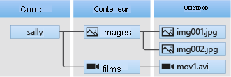

# <a name="quickstart-manage-blobs-with-javascript-v12-sdk-in-nodejs"></a>Démarrage rapide : Gérer des objets blob avec le SDK JavaScript v12 en Node.js

Dans ce guide de démarrage rapide, vous découvrez comment gérer des objets blob avec Node.js. Les objets blob sont des objets pouvant contenir de grandes quantités de texte ou de données binaires, notamment des images, des documents, des médias en streaming et des données d’archive. Vous allez charger, télécharger et lister des objets blob, et vous allez créer et supprimer des conteneurs.

Ressources supplémentaires :

* [Documentation de référence de l’API](/javascript/api/@azure/storage-blob)
* [Code source de la bibliothèque](https://github.com/Azure/azure-sdk-for-js/tree/master/sdk/storage/storage-blob)
* [Package (Gestionnaire de package Node)](https://www.npmjs.com/package/@azure/storage-blob)
* [Exemples](https://docs.microsoft.com/azure/storage/common/storage-samples-javascript?toc=%2fazure%2fstorage%2fblobs%2ftoc.json#blob-samples)

## <a name="prerequisites"></a>Prérequis

- Compte Azure avec un abonnement actif. [Créez un compte gratuitement](https://azure.microsoft.com/free/?ref=microsoft.com&utm_source=microsoft.com&utm_medium=docs&utm_campaign=visualstudio).
- Un compte de stockage Azure. [Créer un compte de stockage](../common/storage-account-create.md).
- [Node.js](https://nodejs.org/en/download/).

> [!NOTE]
> Pour une bonne prise en main de la version précédente du kit de développement logiciel (SDK), consultez [Démarrage rapide : Gérer des objets blob avec le SDK JavaScript v10 en Node.js](storage-quickstart-blobs-nodejs-legacy.md).

[!INCLUDE [storage-multi-protocol-access-preview](../../../includes/storage-multi-protocol-access-preview.md)]

## <a name="setting-up"></a>Configuration

Cette section vous guide tout au long de la préparation d’un projet à utiliser avec la bibliothèque de client de stockage blob Azure v12 pour JavaScript.

### <a name="create-the-project"></a>Créer le projet

Créez une application JavaScript nommée *blob-quickstart-v12*.

1. Dans une fenêtre de console (telle que cmd, PowerShell ou Bash), créez un nouveau répertoire pour le projet.

    ```console
    mkdir blob-quickstart-v12
    ```

1. Basculez vers le répertoire *blob-quickstart-v12* nouvellement créé.

    ```console
    cd blob-quickstart-v12
    ```

1. Créez un nouveau fichier texte appelé *package.json*. Ce fichier définit le projet Node.js. Enregistrez ce fichier dans le répertoire *blob-quickstart-v12*. Voici le contenu du fichier :

    ```json
    {
        "name": "blob-quickstart-v12",
        "version": "1.0.0",
        "description": "Use the @azure/storage-blob SDK version 12 to interact with Azure Blob storage",
        "main": "blob-quickstart-v12.js",
        "scripts": {
            "start": "node blob-quickstart-v12.js"
        },
        "author": "Your Name",
        "license": "MIT",
        "dependencies": {
            "@azure/storage-blob": "^12.0.0",
            "@types/dotenv": "^4.0.3",
            "dotenv": "^6.0.0"
        }
    }
    ```

    Vous pouvez placer votre propre nom dans pour le champ `author`, si vous le souhaitez.

### <a name="install-the-package"></a>Installer le package

Alors que vous êtes toujours dans le répertoire *blob-quickstart-v12*, installez la bibliothèque de client du stockage blob Azure pour le package JavaScript à l’aide de la commande `npm install`. Cette commande lit le fichier *package.json* et installe la bibliothèque de client de stockage blob Azure v12 pour le package JavaScript et toutes les bibliothèques dont elle dépend.

```console
npm install
```

### <a name="set-up-the-app-framework"></a>Configurer le framework d’application

À partir du répertoire de projet :

1. Ouvrez un nouveau fichier texte dans votre éditeur de code
1. Ajouter des appels `require` pour charger des modules Azure et Node.js
1. Créer la structure du programme, y compris la gestion des exceptions de base

    Voici le code :

    ```javascript
    const { BlobServiceClient } = require('@azure/storage-blob');
    const uuidv1 = require('uuid/v1');

    async function main() {
        console.log('Azure Blob storage v12 - JavaScript quickstart sample');
        // Quick start code goes here
    }

    main().then(() => console.log('Done')).catch((ex) => console.log(ex.message));
    ```

1. Enregistrez le nouveau fichier sous *blob-quickstart-v12.js* dans le répertoire *blob-quickstart-v12*.

[!INCLUDE [storage-quickstart-credentials-include](../../../includes/storage-quickstart-credentials-include.md)]

## <a name="object-model"></a>Modèle objet

Le Stockage Blob Azure est optimisé pour stocker de grandes quantités de données non structurées. Les données non structurées sont des données qui n’obéissent pas à un modèle ou une définition de données en particulier, comme des données texte ou binaires. Le stockage Blob offre trois types de ressources :

* Le compte de stockage
* Un conteneur dans le compte de stockage.
* Un blob dans le conteneur

Le diagramme suivant montre la relation entre ces ressources.



Utilisez les classes JavaScript suivantes pour interagir avec ces ressources :

* [BlobServiceClient](/javascript/api/@azure/storage-blob/blobserviceclient): La classe `BlobServiceClient` vous permet de manipuler les ressources de stockage Azure et les conteneurs blob.
* [ContainerClient](/javascript/api/@azure/storage-blob/containerclient) : La classe `ContainerClient` vous permet de manipuler des conteneurs de stockage Azure et leurs blobs.
* [BlobClient](/javascript/api/@azure/storage-blob/blobclient) : La classe `BlobClient` vous permet de manipuler des blobs de stockage Azure.

## <a name="code-examples"></a>Exemples de code

Ces exemples d’extraits montrent comment effectuer les opérations suivantes avec la bibliothèque de client de stockage blob Azure pour JavaScript :

* [Obtenir la chaîne de connexion](#get-the-connection-string)
* [Créer un conteneur](#create-a-container)
* [Charger des objets blob sur un conteneur](#upload-blobs-to-a-container)
* [Lister les objets blob d’un conteneur](#list-the-blobs-in-a-container)
* [Télécharger des objets blob](#download-blobs)
* [Supprimer un conteneur](#delete-a-container)

### <a name="get-the-connection-string"></a>Obtenir la chaîne de connexion

Le code ci-dessous récupère la chaîne de connexion pour le compte de stockage à partir de la variable d’environnement créée dans la section [Configurer votre chaîne de connexion de stockage](#configure-your-storage-connection-string).

Ajoutez ce code dans la fonction `main` :

```javascript
// Retrieve the connection string for use with the application. The storage
// connection string is stored in an environment variable on the machine
// running the application called AZURE_STORAGE_CONNECTION_STRING. If the
// environment variable is created after the application is launched in a
// console or with Visual Studio, the shell or application needs to be closed
// and reloaded to take the environment variable into account.
const AZURE_STORAGE_CONNECTION_STRING = process.env.AZURE_STORAGE_CONNECTION_STRING;
```

### <a name="create-a-container"></a>Créez un conteneur.

Choisissez un nom pour le nouveau conteneur. Le code ci-dessous ajoute une valeur UUID au nom du conteneur pour s’assurer qu’il est unique.

> [!IMPORTANT]
> Les noms de conteneurs doivent être en minuscules. Pour plus d’informations sur l’affectation de noms aux conteneurs et objets blob, consultez [Affectation de noms et références aux conteneurs, objets blob et métadonnées](/rest/api/storageservices/naming-and-referencing-containers--blobs--and-metadata).

Créez une instance de la classe [BlobServiceClient](/javascript/api/@azure/storage-blob/blobserviceclient) en appelant la méthode [fromConnectionString](/javascript/api/@azure/storage-blob/blobserviceclient#fromconnectionstring-string--storagepipelineoptions-). Ensuite, appelez la méthode [getContainerClient](/javascript/api/@azure/storage-blob/blobserviceclient#getcontainerclient-string-) pour obtenir une référence à un conteneur. Ensuite, appelez la méthode [créer](/javascript/api/@azure/storage-blob/containerclient#create-containercreateoptions-) pour effectivement créer le conteneur dans votre compte de stockage.

Ajoutez ce code à la fin de la fonction `main` :

```javascript
// Create the BlobServiceClient object which will be used to create a container client
const blobServiceClient = BlobServiceClient.fromConnectionString(AZURE_STORAGE_CONNECTION_STRING);

// Create a unique name for the container
const containerName = 'quickstart' + uuidv1();

console.log('\nCreating container...');
console.log('\t', containerName);

// Get a reference to a container
const containerClient = blobServiceClient.getContainerClient(containerName);

// Create the container
const createContainerResponse = await containerClient.create();
console.log("Container was created successfully. requestId: ", createContainerResponse.requestId);
```

### <a name="upload-blobs-to-a-container"></a>Charger des objets blob sur un conteneur

L’extrait de code suivant :

1. Crée une chaîne de texte à charger dans un blob.
1. Obtient une référence à un objet [BlockBlobClient](/javascript/api/@azure/storage-blob/blockblobclient) en appelant la méthode [getBlockBlobClient](/javascript/api/@azure/storage-blob/containerclient#getblockblobclient-string-) sur le [ContainerClient](/javascript/api/@azure/storage-blob/containerclient) dans la section [Créer un conteneur](#create-a-container).
1. Charge le fichier texte local dans l’objet Blob en appelant la méthode [upload_blob](/javascript/api/@azure/storage-blob/blockblobclient#upload-httprequestbody--number--blockblobuploadoptions-).

Ajoutez ce code à la fin de la fonction `main` :

```javascript
// Create a unique name for the blob
const blobName = 'quickstart' + uuidv1() + '.txt';

// Get a block blob client
const blockBlobClient = containerClient.getBlockBlobClient(blobName);

console.log('\nUploading to Azure storage as blob:\n\t', blobName);

// Upload data to the blob
const data = 'Hello, World!';
const uploadBlobResponse = await blockBlobClient.upload(data, data.length);
console.log("Blob was uploaded successfully. requestId: ", uploadBlobResponse.requestId);
```

### <a name="list-the-blobs-in-a-container"></a>Créer la liste des objets blob d’un conteneur

Répertoriez les blobs dans le conteneur en appelant la méthode [listBlobsFlat](/javascript/api/@azure/storage-blob/containerclient#listblobsflat-containerlistblobsoptions-). Dans ce cas, un seul objet blob a été ajouté au conteneur. Il n’y a donc qu’un objet blob répertorié.

Ajoutez ce code à la fin de la fonction `main` :

```javascript
console.log('\nListing blobs...');

// List the blob(s) in the container.
for await (const blob of containerClient.listBlobsFlat()) {
    console.log('\t', blob.name);
}
```

### <a name="download-blobs"></a>Télécharger des objets blob

Téléchargez le blob créé précédemment en appelant la méthode [télécharger](/javascript/api/@azure/storage-blob/blockblobclient#download-undefined---number--undefined---number--blobdownloadoptions-). L’exemple de code comprend une fonction helper appelée `streamToString`, qui est utilisée pour lire un flux lisible Node.js dans une chaîne.

Ajoutez ce code à la fin de la fonction `main` :

```javascript
// Get blob content from position 0 to the end
// In Node.js, get downloaded data by accessing downloadBlockBlobResponse.readableStreamBody
// In browsers, get downloaded data by accessing downloadBlockBlobResponse.blobBody
const downloadBlockBlobResponse = await blockBlobClient.download(0);
console.log('\nDownloaded blob content...');
console.log('\t', await streamToString(downloadBlockBlobResponse.readableStreamBody));
```

Ajoutez cette fonction d’assistance *après* la fonction `main` :

```javascript
// A helper function used to read a Node.js readable stream into a string
async function streamToString(readableStream) {
  return new Promise((resolve, reject) => {
    const chunks = [];
    readableStream.on("data", (data) => {
      chunks.push(data.toString());
    });
    readableStream.on("end", () => {
      resolve(chunks.join(""));
    });
    readableStream.on("error", reject);
  });
}
```

### <a name="delete-a-container"></a>Supprimer un conteneur

Le code suivant nettoie les ressources créées par l’application en supprimant le conteneur tout entier à l’aide de la méthode [supprimer](/javascript/api/@azure/storage-blob/containerclient#delete-containerdeletemethodoptions-). Si vous voulez, vous pouvez aussi supprimer les fichiers locaux.

Ajoutez ce code à la fin de la fonction `main` :

```javascript
console.log('\nDeleting container...');

// Delete container
const deleteContainerResponse = await containerClient.delete();
console.log("Container was deleted successfully. requestId: ", deleteContainerResponse.requestId);
```

## <a name="run-the-code"></a>Exécuter le code

Cette application crée une chaîne de texte et la charge dans le stockage blob. L’exemple répertorie ensuite le ou les blobs dans le conteneur, télécharge le blob et affiche les données téléchargées.

À partir de l’invite de console, accédez au répertoire contenant le fichier *blob-quickstart-v12.py*, puis exécutez la commande `node` suivante pour exécuter l’application.

```console
node blob-quickstart-v12.js
```

La sortie de l’application ressemble à l’exemple suivant :

```output
Azure Blob storage v12 - JavaScript quickstart sample

Creating container...
         quickstart4a0780c0-fb72-11e9-b7b9-b387d3c488da

Uploading to Azure Storage as blob:
         quickstart4a3128d0-fb72-11e9-b7b9-b387d3c488da.txt

Listing blobs...
         quickstart4a3128d0-fb72-11e9-b7b9-b387d3c488da.txt

Downloaded blob content...
         Hello, World!

Deleting container...
Done
```

Parcourez le code dans le débogueur et vérifiez votre [portail Azure](https://portal.azure.com) tout au long du processus. Vérifiez que le conteneur est en cours d’exécution. Vous pouvez ouvrir le blob à l’intérieur du conteneur et afficher le contenu.

## <a name="next-steps"></a>Étapes suivantes

Dans ce démarrage rapide, vous avez appris à charger, télécharger et répertorier des blobs avec JavaScript.

Pour obtenir des tutoriels, des exemples, des guides de démarrage rapide et d’autres documentations, visitez :

> [!div class="nextstepaction"]
> [Documentation Azure pour JavaScript](/azure/developer/javascript/)

* Pour plus d’informations, consultez la [bibliothèque cliente Stockage Blob Azure pour JavaScript](https://github.com/Azure/azure-sdk-for-js/blob/master/sdk/storage/storage-blob).
* Pour voir des exemples d’applications de stockage Blob, passez à [Exemples JavaScript de bibliothèques clientes Stockage Blob Azure V12](https://github.com/Azure/azure-sdk-for-js/tree/master/sdk/storage/storage-blob/samples).
