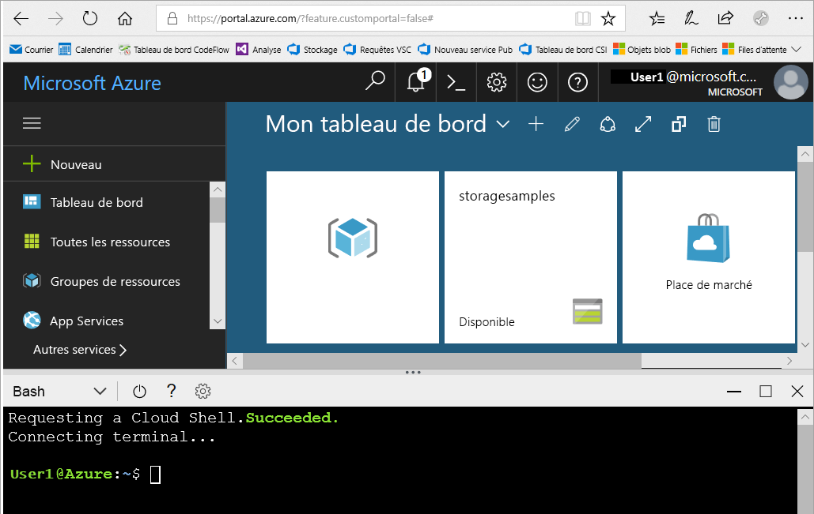

# <a name="create-an-azure-storage-account"></a>Création d'un compte Azure Storage

Un compte de stockage Azure contient tous vos objets de données de stockage Azure : objets blob, fichiers, files d’attente, tables et disques. Le compte de stockage fournit pour vos données de stockage Azure un espace de noms unique, accessible de n’importe où dans le monde via HTTP ou HTTPS. Les données dans votre compte de stockage Azure sont durables et hautement disponibles, sécurisées et massivement évolutives.

Dans cet article sur les procédures, vous apprenez à créer un compte de stockage à l’aide du [Portail Azure](https://portal.azure.com/), d’[Azure PowerShell](https://docs.microsoft.com/powershell/azure/overview), de l’[interface Azure CLI](https://docs.microsoft.com/cli/azure?view=azure-cli-latest) ou d’un [modèle Azure Resource Manager](../../azure-resource-manager/management/overview.md).  

[!INCLUDE [updated-for-az](../../../includes/updated-for-az.md)]

## <a name="prerequisites"></a>Prérequis

Si vous n’avez pas d’abonnement Azure, créez un [compte gratuit](https://azure.microsoft.com/free/) avant de commencer.

# <a name="portal"></a>[Portail](#tab/azure-portal)

Aucun.

# <a name="powershell"></a>[PowerShell](#tab/azure-powershell)

Pour créer un compte de stockage Azure avec PowerShell, vérifiez que vous avez installé le module Azure PowerShell Az version 0.7 ou ultérieure. Pour plus d'informations, consultez [Présentation du module Azure PowerShell Az](/powershell/azure/new-azureps-module-az).

Pour connaître votre version actuelle, exécutez la commande suivante :

```powershell
Get-InstalledModule -Name "Az"
```

Pour installer ou mettre à niveau Azure PowerShell, consultez [Installer le module Azure PowerShell](/powershell/azure/install-Az-ps).

# <a name="azure-cli"></a>[Azure CLI](#tab/azure-cli)

Vous pouvez vous connecter à Azure et exécuter des commandes Azure CLI de l’une des deux façons suivantes :

- Vous pouvez exécuter des commandes CLI à partir du Portail Azure, dans Azure Cloud Shell.
- Vous pouvez installer l’interface CLI et exécuter des commandes CLI localement.

### <a name="use-azure-cloud-shell"></a>Utiliser Azure Cloud Shell

Azure Cloud Shell est un interpréteur de commandes Bash gratuit, que vous pouvez exécuter directement dans le portail Azure. L’interface Azure CLI est préinstallée et configurée pour être utilisée avec votre compte. Cliquez sur le bouton **Cloud Shell** du menu situé dans la section supérieure droite de la fenêtre du Portail Azure :

[](https://portal.azure.com)

Ce bouton lance un interpréteur de commandes interactif que vous pouvez utiliser pour exécuter les étapes décrites dans cet article de procédure :

[](https://portal.azure.com)

### <a name="install-the-cli-locally"></a>Installer la CLI localement

Vous pouvez également installer et utiliser Azure CLI localement. Pour les besoins de cet article de procédure, vous devez utiliser Azure CLI version 2.0.4 ou ultérieure. Exécutez `az --version` pour trouver la version. Si vous devez effectuer une installation ou une mise à niveau, consultez [Installer Azure CLI](/cli/azure/install-azure-cli). 

# <a name="template"></a>[Modèle](#tab/template)

Aucun.

---

## <a name="sign-in-to-azure"></a>Connexion à Azure

# <a name="portal"></a>[Portail](#tab/azure-portal)

Connectez-vous au [portail Azure](https://portal.azure.com).

# <a name="powershell"></a>[PowerShell](#tab/azure-powershell)

Connectez-vous à votre abonnement Azure avec la commande `Connect-AzAccount` et suivez les instructions à l’écran pour l’authentification.

```powershell
Connect-AzAccount
```

# <a name="azure-cli"></a>[Azure CLI](#tab/azure-cli)

Pour lancer Azure Cloud Shell, connectez-vous au [Portail Azure](https://portal.azure.com).

Pour vous connecter à votre installation locale de l’interface CLI, exécutez la commande [az login](/cli/azure/reference-index#az-login) :

```azurecli-interactive
az login
```

# <a name="template"></a>[Modèle](#tab/template)

N/A

---

## <a name="create-a-storage-account"></a>Créez un compte de stockage.

Vous êtes maintenant prêt à créer un compte de stockage.

Chaque compte de stockage doit appartenir à un groupe de ressources Azure. Un groupe de ressources est un conteneur logique servant à grouper vos services Azure. Lorsque vous créez un compte de stockage, vous avez le choix entre créer un groupe de ressources ou utiliser un groupe de ressources existant. Cet article montre comment créer un groupe de ressources.

Un compte de stockage **v2 à usage général** fournit un accès à tous les services de Stockage Azure : objets blob, fichiers, files d’attente, tables et disques. Les étapes décrites ici créent un compte de stockage v2 universel, mais les étapes de création d’un autre type de compte de stockage sont similaires.

# <a name="portal"></a>[Portail](#tab/azure-portal)

[!INCLUDE [storage-create-account-portal-include](../../../includes/storage-create-account-portal-include.md)]

# <a name="powershell"></a>[PowerShell](#tab/azure-powershell)

Tout d’abord, créez un groupe de ressources avec PowerShell au moyen de la commande [New-AzResourceGroup](/powershell/module/az.resources/new-azresourcegroup) :

```powershell
# put resource group in a variable so you can use the same group name going forward,
# without hard-coding it repeatedly
$resourceGroup = "storage-resource-group"
$location = "westus"
New-AzResourceGroup -Name $resourceGroup -Location $location
```

Si vous ne savez pas quelle région spécifier pour le paramètre `-Location`, vous pouvez récupérer la liste des régions prises en charge pour votre abonnement avec la commande [Get-AzLocation](/powershell/module/az.resources/get-azlocation) :

```powershell
Get-AzLocation | select Location
```

Ensuite, créez un compte de stockage universel v2 avec l’option Stockage géo-redondant avec accès en lecture (RA-GRS) en utilisant la commande [New-AzStorageAccount](/powershell/module/az.storage/New-azStorageAccount). N’oubliez pas que le nom du compte de stockage doit être unique dans Azure. Par conséquent, remplacez la valeur d’espace réservé entre crochets par votre propre valeur unique :

```powershell
New-AzStorageAccount -ResourceGroupName $resourceGroup `
  -Name <account-name> `
  -Location $location `
  -SkuName Standard_RAGRS `
  -Kind StorageV2
```

> [!IMPORTANT]
> Si vous envisagez d’utiliser [Azure Data Lake Storage](https://azure.microsoft.com/services/storage/data-lake-storage/), incluez `-EnableHierarchicalNamespace $True` dans cette liste de paramètres.

Pour créer un compte de stockage universel v2 avec une option de réplication différente, remplacez la valeur souhaitée pour le paramètre **SkuName** dans le tableau ci-dessous.

|Option de réplication  |Paramètre SkuName  |
|---------|---------|
|Stockage localement redondant (LRS)     |Standard_LRS         |
|Stockage redondant interzone (ZRS)     |Standard_ZRS         |
|Stockage géo-redondant (GRS)     |Standard_GRS         |
|Stockage géo-redondant avec accès en lecture (RA-GRS)     |Standard_RAGRS         |
|Stockage géoredondant interzone (GZRS)    |Standard_GZRS         |
|Stockage géo-redondant interzone avec accès en lecture (RA-GRS)    |Standard_RAGZRS         |

# <a name="azure-cli"></a>[Azure CLI](#tab/azure-cli)

Tout d’abord, créez un groupe de ressources avec Azure CLI par le biais de la commande [az group create](/cli/azure/group#az_group_create).

```azurecli-interactive
az group create \
    --name storage-resource-group \
    --location westus
```

Si vous ne savez pas quelle région spécifier pour le paramètre `--location`, vous pouvez récupérer la liste des régions prises en charge pour votre abonnement avec la commande [az account list-locations](/cli/azure/account#az_account_list).

```azurecli-interactive
az account list-locations \
    --query "[].{Region:name}" \
    --out table
```

Ensuite, créez un compte de stockage universel v2 avec l’option Stockage géo-redondant avec accès en lecture en utilisant la commande [az storage account create](/cli/azure/storage/account#az_storage_account_create). N’oubliez pas que le nom du compte de stockage doit être unique dans Azure. Par conséquent, remplacez la valeur d’espace réservé entre crochets par votre propre valeur unique :

```azurecli-interactive
az storage account create \
    --name <account-name> \
    --resource-group storage-resource-group \
    --location westus \
    --sku Standard_RAGRS \
    --kind StorageV2
```

> [!IMPORTANT]
> Si vous envisagez d’utiliser [Azure Data Lake Storage](https://azure.microsoft.com/services/storage/data-lake-storage/), incluez `--enable-hierarchical-namespace true` dans cette liste de paramètres. 

Pour créer un compte de stockage universel v2 avec une option de réplication différente, remplacez la valeur souhaitée pour le paramètre **sku** dans le tableau ci-dessous.

|Option de réplication  |Paramètre sku  |
|---------|---------|
|Stockage localement redondant (LRS)     |Standard_LRS         |
|Stockage redondant interzone (ZRS)     |Standard_ZRS         |
|Stockage géo-redondant (GRS)     |Standard_GRS         |
|Stockage géo-redondant avec accès en lecture (RA-GRS)     |Standard_RAGRS         |
|Stockage géoredondant interzone (GZRS)    |Standard_GZRS         |
|Stockage géo-redondant interzone avec accès en lecture (RA-GRS)    |Standard_RAGZRS         |

# <a name="template"></a>[Modèle](#tab/template)

Vous pouvez utiliser Azure PowerShell ou Azure CLI pour déployer un modèle Resource Manager afin de créer un compte de stockage. Le modèle utilisé dans cet article de procédure est issu des [Modèles de démarrage rapide Azure Resource Manager](https://azure.microsoft.com/resources/templates/101-storage-account-create/). Pour exécuter les scripts, sélectionnez **Essayer** pour ouvrir Azure Cloud Shell. Pour coller le script, cliquez avec le bouton droit dans l’interpréteur de commandes, puis sélectionnez **Coller**.

```azurepowershell-interactive
$resourceGroupName = Read-Host -Prompt "Enter the Resource Group name"
$location = Read-Host -Prompt "Enter the location (i.e. centralus)"

New-AzResourceGroup -Name $resourceGroupName -Location "$location"
New-AzResourceGroupDeployment -ResourceGroupName $resourceGroupName -TemplateUri "https://raw.githubusercontent.com/Azure/azure-quickstart-templates/master/101-storage-account-create/azuredeploy.json"
```

```azurecli-interactive
echo "Enter the Resource Group name:" &&
read resourceGroupName &&
echo "Enter the location (i.e. centralus):" &&
read location &&
az group create --name $resourceGroupName --location "$location" &&
az group deployment create --resource-group $resourceGroupName --template-file "https://raw.githubusercontent.com/Azure/azure-quickstart-templates/master/101-storage-account-create/azuredeploy.json"
```

> [!NOTE]
> Ce modèle n’est utilisé qu’à titre d’exemple. De nombreux paramètres de compte de stockage ne sont pas configurés dans le cadre de ce modèle. Par exemple, si vous souhaitez utiliser [Azure Data Lake Storage](https://azure.microsoft.com/services/storage/data-lake-storage/), vous devez modifier ce modèle en affectant à la propriété `isHnsEnabledad` de l’objet `StorageAccountPropertiesCreateParameters` la valeur `true`. 

Pour savoir comment modifier ce modèle ou en créer de nouveaux, consultez :

- [Documentation Azure Resource Manager](/azure/azure-resource-manager/).
- [Référence de modèle de compte de stockage](/azure/templates/microsoft.storage/allversions).
- [Exemples supplémentaires de modèles de compte de stockage](https://azure.microsoft.com/resources/templates/?resourceType=Microsoft.Storage).

---

Pour plus d’informations sur les options de réplication disponibles, consultez [Options de réplication de stockage](storage-redundancy.md).

## <a name="delete-a-storage-account"></a>Suppression d'un compte de stockage

La suppression d’un compte de stockage supprime l’intégralité du compte, notamment toutes les données qu’il contient, et ne peut pas être annulée.

# <a name="portal"></a>[Portail](#tab/azure-portal)

1. Accédez au compte de stockage dans le [portail Azure](https://portal.azure.com).
1. Cliquez sur **Supprimer**.

# <a name="powershell"></a>[PowerShell](#tab/azure-powershell)

Pour supprimer le compte de stockage, utilisez la commande [Remove-AzStorageAccount](/powershell/module/az.storage/remove-azstorageaccount) :

```powershell
Remove-AzStorageAccount -Name <storage-account> -ResourceGroupName <resource-group>
```

# <a name="azure-cli"></a>[Azure CLI](#tab/azure-cli)

Pour supprimer le compte de stockage, utilisez la commande [az storage account delete](/cli/azure/storage/account#az-storage-account-delete) :

```azurecli-interactive
az storage account delete --name <storage-account> --resource-group <resource-group>
```

# <a name="template"></a>[Modèle](#tab/template)

Pour supprimer le compte de stockage, utilisez Azure PowerShell ou Azure CLI.

```azurepowershell-interactive
$storageResourceGroupName = Read-Host -Prompt "Enter the resource group name"
$storageAccountName = Read-Host -Prompt "Enter the storage account name"
Remove-AzStorageAccount -Name $storageAccountName -ResourceGroupName $storageResourceGroupName
```

```azurecli-interactive
echo "Enter the resource group name:" &&
read resourceGroupName &&
echo "Enter the storage account name:" &&
read storageAccountName &&
az storage account delete --name storageAccountName --resource-group resourceGroupName
```

---

Vous pouvez également supprimer le groupe de ressources, ce qui supprime le compte de stockage et toutes les autres ressources de ce groupe. Pour plus d’informations sur la suppression d’un groupe de ressources, consultez [Supprimer un groupe de ressources et des ressources](../../azure-resource-manager/management/delete-resource-group.md).

> [!WARNING]
> Il n’est pas possible de restaurer un compte de stockage supprimé ou son contenu avant la suppression. Veillez à sauvegarder tout ce que vous souhaitez conserver avant de supprimer le compte. Ceci vaut également pour toutes les ressources du compte : dès que vous supprimez un objet blob, une table, une file d’attente ou un fichier, la suppression est irréversible.
>
> Si vous essayez de supprimer un compte de stockage associé à une machine virtuelle Azure, vous pouvez obtenir une erreur indiquant que le compte de stockage est toujours en cours d’utilisation. Pour obtenir de l’aide sur la résolution de cette erreur, consultez [Résoudre les erreurs liées à la suppression de compte de stockage](../common/storage-resource-manager-cannot-delete-storage-account-container-vhd.md).

## <a name="next-steps"></a>Étapes suivantes

Dans cet article de procédure, vous avez créé un compte de stockage standard à usage général v2. Pour savoir comment charger et télécharger des objets blob vers/à partir de votre compte de stockage, passez au guide de démarrage rapide du stockage Blob.

# <a name="portal"></a>[Portail](#tab/azure-portal)

> [!div class="nextstepaction"]
> [Utiliser des objets blob avec le portail Azure](../blobs/storage-quickstart-blobs-portal.md)

# <a name="powershell"></a>[PowerShell](#tab/azure-powershell)

> [!div class="nextstepaction"]
> [Utiliser des objets blob avec PowerShell](../blobs/storage-quickstart-blobs-powershell.md)

# <a name="azure-cli"></a>[Azure CLI](#tab/azure-cli)

> [!div class="nextstepaction"]
> [Utiliser des objets blob avec l’interface Azure CLI](../blobs/storage-quickstart-blobs-cli.md)

# <a name="template"></a>[Modèle](#tab/template)

> [!div class="nextstepaction"]
> [Utiliser des objets blob avec le portail Azure](../blobs/storage-quickstart-blobs-portal.md)

---
